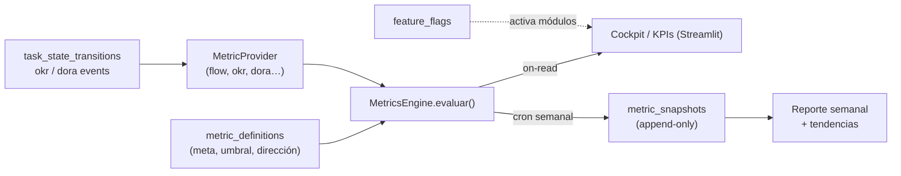
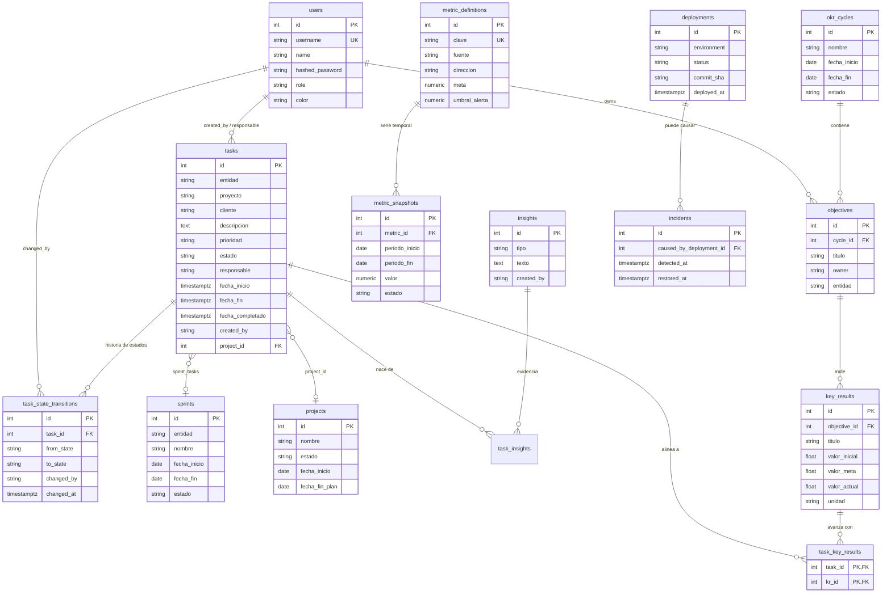
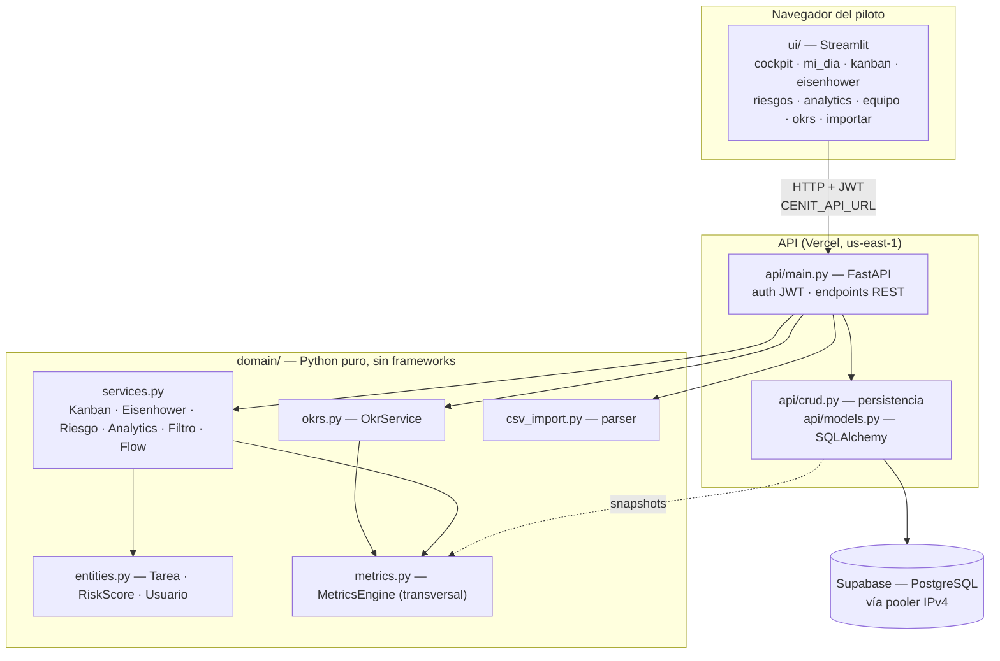

# Arquitectura Definitiva de Cenit

> Documento de referencia técnica generado por un panel de expertos (Arquitecto de Software, Head of Product, QA/Testing Lead, Estratega GTM B2B LatAm). 12 metodologías analizadas a fondo + un sistema propio que las unifica, mapeadas al stack real del repo: **FastAPI + Streamlit + SQLAlchemy (100% Python)**, desplegado en Vercel + Supabase.

## Tabla de contenidos

- [Resumen ejecutivo](#resumen-ejecutivo)

**Parte 1 — Análisis por metodología**
- [01. SCRUM](#01-scrum)
- [02. KANBAN](#02-kanban)
- [03. Lean](#03-lean)
- [04. Extreme Programming (XP)](#04-extreme-programming-xp)
- [05. SAFe (Scaled Agile Framework)](#05-safe-scaled-agile-framework)
- [06. WATERFALL](#06-waterfall)
- [07. DORA](#07-dora)
- [08. SPACE — Framework de Productividad de Desarrolladores](#08-space-framework-de-productividad-de-desarrolladores)
- [09. OKRs](#09-okrs)
- [10. KPIs](#10-kpis)
- [11. PMBOK/PMI](#11-pmbok-pmi)
- [12. Design Thinking](#12-design-thinking)
- [13. Cenit Flow System](#13-cenit-flow-system)

**Parte 2 — Entregables transversales**
- [a) Arquitectura de software unificada — Metrics Engine y módulos por feature flag](#a-arquitectura-de-software-unificada-metrics-engine-y-m-dulos-por-feature-flag)
- [b) Diagrama ER completo](#b-diagrama-er-completo)
- [c) Diagrama de arquitectura de capas](#c-diagrama-de-arquitectura-de-capas)
- [d) Matriz de priorización RICE](#d-matriz-de-priorizaci-n-rice)
- [e) Roadmap por fases (MVP → V2 → V3 → V4)](#e-roadmap-por-fases-mvp-v2-v3-v4)
- [f) Recomendación final — núcleo vs. modo avanzado](#f-recomendaci-n-final-n-cleo-vs-modo-avanzado)
- [g) Glosario de términos (modo aprendizaje)](#g-glosario-de-t-rminos-modo-aprendizaje)
- [h) Matriz de riesgos técnicos](#h-matriz-de-riesgos-t-cnicos)
- [i) Consideraciones de localización LatAm](#i-consideraciones-de-localizaci-n-latam)
- [j) Plan de datos semilla para demos](#j-plan-de-datos-semilla-para-demos)
- [k) Supuestos y preguntas abiertas](#k-supuestos-y-preguntas-abiertas)
- [Cierre — las 3 decisiones más importantes](#cierre--las-3-decisiones-más-importantes)

---

## Resumen ejecutivo

Cenit es un **cockpit de inteligencia operacional para líderes de equipos técnicos en LatAm**: observa el flujo real de trabajo, detecta qué está en riesgo o estancado y le dice al líder qué decidir hoy — no compite por tener más tableros que Jira o Linear. Este documento analiza a fondo 12 metodologías (Scrum, Kanban, Lean, XP, SAFe, Waterfall, DORA, SPACE, OKRs, KPIs, PMBOK, Design Thinking) más un sistema propio que las unifica, y las traduce al stack real y ya desplegado: FastAPI + Streamlit + SQLAlchemy, 100% Python, con API en Vercel y datos en Supabase.

La conclusión central es que Cenit **no debe ser una suite de doce metodologías, sino un núcleo de 4-5 capacidades con todo lo demás detrás de una señal de demanda**. La priorización RICE lo confirma cuantitativamente: Kanban (8.1) dobla al segundo lugar porque no es una feature nueva sino completar lo que ya existe; KPIs (4.0) y Scrum (3.7) le siguen; SAFe (0.1) y Design Thinking (0.3) son sobre-ingeniería en esta etapa. El hilo conductor de la arquitectura es que **una métrica es un dato, no un módulo**: un Metrics Engine con snapshots inmutables evita duplicar lógica entre KPIs, DORA, OKR y SPACE, y `task_state_transitions` es la fuente histórica de la que beben flujo, aging y Lean.

El MVP ya está vivo (cockpit, flujo, riesgos, OKRs, importar CSV, 59 tests, deploy reproducible). El camino: validar con pilotos que vuelven cada semana, cobrar, y solo entonces expandir. La disciplina que atraviesa todo el documento es negativa — **el valor no está en cuánto se construye, sino en cuánto se posterga hasta tener evidencia**.

---

# Parte 1 — Análisis por metodología

# (Sección generada por el panel de expertos — Arquitectura, Producto, QA y GTM)

## 01. SCRUM

### 1. Principio central y origen

Scrum resuelve un problema muy concreto: la imposibilidad de planificar con precisión trabajo complejo y cambiante a largo plazo. Su respuesta es el **empirismo iterativo**: en lugar de un plan detallado de 12 meses, el equipo se compromete a entregar un incremento funcional cada ciclo corto (el *sprint*, típicamente 1-4 semanas), inspecciona el resultado y adapta el plan siguiente con datos reales.

El origen es doble. La semilla intelectual es el paper de Takeuchi y Nonaka, *"The New New Product Development Game"* (Harvard Business Review, 1986), que observó en fabricantes japoneses (Honda, Canon, Fuji-Xerox) que los equipos multidisciplinarios que avanzaban "como en un scrum de rugby" —todos juntos, pasando el balón— superaban al modelo secuencial tipo relevos. Jeff Sutherland y Ken Schwaber formalizaron el marco para software en 1995 (OOPSLA), y desde 2010 lo mantienen en la *Scrum Guide* (última revisión relevante: 2020, que simplificó roles y eliminó jerga prescriptiva).

**Errores de gestión que previene:**

- **El síndrome del plan perfecto (Big Design Up Front):** presupuestos y fechas comprometidos sobre estimaciones hechas cuando menos se sabe del problema. Scrum obliga a re-estimar cada 2 semanas con evidencia.
- **Invisibilidad del progreso:** en gestión tradicional el "90% completado" puede durar meses. El incremento entregable por sprint hace el progreso binario y verificable — algo que resuena directamente con la mentalidad QA: *no está hecho hasta que pasa la Definition of Done*.
- **Sobrecarga y cambio de prioridades diario:** el *sprint backlog* congelado protege al equipo del "esto es para ya" constante — el dolor número uno que reportan los equipos LatAm de 10-50 personas que hoy sufren en Jira con backlogs de 800 issues sin dueño.
- **Falta de dueño de prioridades:** el rol de Product Owner concentra la responsabilidad de ordenar el backlog, evitando el comité difuso donde todo es prioridad "Urgente" (un antipatrón que Cenit ya observa en su propio campo `prioridad`, donde tiende a inflarse hacia Urgente/Alta).

Para Cenit el ángulo estratégico es claro: los equipos objetivo *ya dicen que hacen Scrum* (es el vocabulario dominante en LatAm — las ofertas de trabajo piden "experiencia en metodologías ágiles/Scrum"), pero lo hacen mal o a medias. Cenit no debe venderse como "herramienta Scrum" (ahí Jira es incumbente imbatible), sino ofrecer un **Scrum ligero y honesto**: sprints, velocity y burndown sin la burocracia de configuración de Jira.

### 2. Métricas y fórmulas exactas

Equipo ficticio: **Equipo Cóndor**, 5 personas (Ana, Bruno, Carla, David, Elena), sprints de 2 semanas (10 días hábiles).

| Métrica | Fórmula | Unidad |
|---|---|---|
| Velocity del sprint | `V_s = Σ story_points de historias COMPLETADAS en el sprint` | pts |
| Velocity promedio | `V̄ = (Σ V_s últimos n sprints) / n` (n=3 recomendado) | pts |
| Capacidad del sprint | `C = Σ (días_disponibles_persona × factor_foco)` | días-persona |
| Burndown ideal (día d) | `Ideal(d) = P_total × (1 − d/D)` con D = días del sprint | pts |
| Desviación burndown | `Δ(d) = Real(d) − Ideal(d)` (positivo = atraso) | pts |
| Sprint Goal Success Rate | `SGSR = sprints_con_meta_cumplida / sprints_totales × 100` | % |
| Say/Do Ratio (predictibilidad) | `SD = pts_completados / pts_comprometidos × 100` | % |
| Scope churn | `Churn = pts_agregados_mid_sprint / pts_comprometidos × 100` | % |
| Carryover | `CO = pts_no_terminados / pts_comprometidos × 100` | % |
| Focus factor | `FF = V_s / C` | pts/día-persona |

**Cálculo paso a paso — Sprint 7 del Equipo Cóndor:**

1. **Compromiso:** en planning toman 8 historias: 5+3+3+2+2+8+1+3 = **27 pts comprometidos**.
2. **Capacidad:** 5 personas × 10 días = 50 días; Elena toma 2 días de vacaciones → 48; factor de foco 0.7 (reuniones, soporte) → `C = 48 × 0.7 = 33.6 días-persona`.
3. **Resultado al día 10:** completan las historias de 5, 3, 3, 2, 8 y 1 = **22 pts completados**. La de 2 pts queda "En Proceso" y la de 3 pts ni se inició.
4. **Velocity:** `V_7 = 22 pts` (las incompletas valen **0** — regla estricta, no se cuenta parcial).
5. **Say/Do:** `22 / 27 × 100 = 81.5 %` — sano; el umbral de alerta típico es < 80 % sostenido.
6. **Carryover:** `(2+3) / 27 × 100 = 18.5 %`.
7. **Mid-sprint entró un bug urgente de 2 pts** (completado, incluido en los 22): `Churn = 2 / 27 × 100 = 7.4 %` — aceptable; > 20 % indica que el PO no protege el sprint.
8. **Velocity promedio** con V_5=19, V_6=24, V_7=22: `V̄ = (19+24+22)/3 = 21.7 pts` → en planning del sprint 8, comprometer 20-23 pts, no 30.
9. **Burndown día 5:** `Ideal(5) = 27 × (1 − 5/10) = 13.5 pts` restantes. Real: quedan 18 pts → `Δ = +4.5 pts` → alerta amarilla en UI de Cenit.
10. **Focus factor:** `FF = 22 / 33.6 = 0.65 pts/día-persona` — insumo para la capacidad del sprint 8: `33.6 × 0.65 ≈ 22 pts`, consistente con V̄.

Regla de producto (voz Head of Product): Cenit debe mostrar velocity **solo como rango** (`V̄ ± desviación estándar`, aquí 21.7 ± 2.5) y nunca como número comparable entre equipos — el abuso de velocity como KPI de gerencia es la forma más rápida de que el equipo infle puntos y la métrica muera.

### 3. Modelo de datos

Extiende `users` y `tasks` existentes. La decisión clave (voz Arquitecto): **no** poner `sprint_id` directo en `tasks` sino usar tabla puente `sprint_tasks` — una tarea puede pasar por varios sprints (carryover) y necesitamos el histórico de compromiso para calcular Say/Do y churn. Los snapshots de burndown se materializan a diario para no reconstruirlos desde el event log.

```sql
-- Requiere: users(id), tasks(id) ya existentes (api/models.py)

CREATE TABLE sprints (
    id              SERIAL PRIMARY KEY,
    nombre          VARCHAR(80)  NOT NULL,               -- "Sprint 7"
    objetivo        TEXT,                                 -- Sprint Goal
    entidad         VARCHAR(50)  NOT NULL,                -- mismo eje multi-equipo que tasks.entidad
    fecha_inicio    DATE         NOT NULL,
    fecha_fin       DATE         NOT NULL,
    estado          VARCHAR(20)  NOT NULL DEFAULT 'planificado',
                    -- planificado | activo | cerrado | cancelado
    capacidad_dias  NUMERIC(6,1),                         -- C calculada en planning
    factor_foco     NUMERIC(3,2) DEFAULT 0.70,
    goal_cumplido   BOOLEAN,                              -- se fija en la review
    created_by      INTEGER REFERENCES users(id),
    created_at      TIMESTAMPTZ DEFAULT now(),
    CHECK (fecha_fin > fecha_inicio),
    CONSTRAINT uq_sprint_nombre_entidad UNIQUE (entidad, nombre)
);
-- Solo un sprint activo por entidad/equipo:
CREATE UNIQUE INDEX uq_sprint_activo ON sprints(entidad) WHERE estado = 'activo';

-- Extensión mínima de tasks: puntos de historia (propiedad de la tarea, no del sprint)
ALTER TABLE tasks ADD COLUMN IF NOT EXISTS story_points SMALLINT
    CHECK (story_points IN (1,2,3,5,8,13,21));            -- Fibonacci

CREATE TABLE sprint_tasks (
    id             SERIAL PRIMARY KEY,
    sprint_id      INTEGER NOT NULL REFERENCES sprints(id) ON DELETE CASCADE,
    task_id        INTEGER NOT NULL REFERENCES tasks(id)   ON DELETE CASCADE,
    committed      BOOLEAN NOT NULL DEFAULT TRUE,          -- FALSE = entró mid-sprint (churn)
    points_snapshot SMALLINT,                              -- pts al momento del compromiso
    added_at       TIMESTAMPTZ DEFAULT now(),
    removed_at     TIMESTAMPTZ,                            -- descoped
    completed_in_sprint BOOLEAN NOT NULL DEFAULT FALSE,    -- se fija al cerrar el sprint
    CONSTRAINT uq_sprint_task UNIQUE (sprint_id, task_id)
);

-- Snapshot diario para burndown (job nocturno o al cerrar el día)
CREATE TABLE sprint_burndown_snapshots (
    id              SERIAL PRIMARY KEY,
    sprint_id       INTEGER NOT NULL REFERENCES sprints(id) ON DELETE CASCADE,
    fecha           DATE    NOT NULL,
    puntos_restantes NUMERIC(6,1) NOT NULL,
    puntos_totales   NUMERIC(6,1) NOT NULL,               -- puede crecer por churn
    tareas_restantes SMALLINT NOT NULL,
    CONSTRAINT uq_burndown_dia UNIQUE (sprint_id, fecha)
);

-- Retrospectivas: el artefacto que Jira nunca integró bien
CREATE TABLE retro_items (
    id          SERIAL PRIMARY KEY,
    sprint_id   INTEGER NOT NULL REFERENCES sprints(id) ON DELETE CASCADE,
    categoria   VARCHAR(20) NOT NULL CHECK (categoria IN ('bien','mejorar','accion')),
    descripcion TEXT NOT NULL,
    autor_id    INTEGER REFERENCES users(id),
    -- una acción de retro puede convertirse en tarea real → trazabilidad:
    task_id     INTEGER REFERENCES tasks(id),
    resuelto    BOOLEAN DEFAULT FALSE,
    created_at  TIMESTAMPTZ DEFAULT now()
);

-- Impedimentos levantados en la daily (conecta con la vista de riesgos de Cenit)
CREATE TABLE impediments (
    id           SERIAL PRIMARY KEY,
    sprint_id    INTEGER REFERENCES sprints(id) ON DELETE SET NULL,
    task_id      INTEGER REFERENCES tasks(id)   ON DELETE SET NULL,
    descripcion  TEXT NOT NULL,
    reportado_por INTEGER REFERENCES users(id),
    estado       VARCHAR(20) DEFAULT 'abierto',  -- abierto | resuelto
    created_at   TIMESTAMPTZ DEFAULT now(),
    resuelto_at  TIMESTAMPTZ
);
```

Notas de diseño: `points_snapshot` en la tabla puente congela la estimación al momento del compromiso (si el equipo re-estima mid-sprint, el Say/Do se calcula contra el snapshot, no contra el valor vivo). `entidad` en `sprints` reutiliza el eje de segmentación existente de `tasks.entidad` en lugar de inventar una tabla `teams` prematura.

### 4. Casos de uso del domain layer

Nuevo servicio `SprintService` en `domain/services.py` (o `domain/sprint_service.py`), operando sobre dicts como los servicios existentes, más dataclasses de reporte en `domain/entities.py`:

```python
from dataclasses import dataclass
from datetime import date

@dataclass
class VelocityReport:
    sprint_id: int
    puntos_comprometidos: int
    puntos_completados: int
    say_do_ratio: float          # 0-100
    churn_pct: float             # 0-100
    carryover_pct: float         # 0-100
    velocity_promedio_3: float | None

@dataclass
class BurndownPoint:
    fecha: date
    restante_real: float
    restante_ideal: float


class SprintService:

    def planificar_sprint(
        self, sprint: dict, tareas_candidatas: list[dict],
        velocity_promedio: float | None
    ) -> dict:
        """Valida el compromiso de planning.
        # sumar story_points de tareas_candidatas (rechazar tareas sin puntos)
        # si velocity_promedio y suma > velocity_promedio * 1.2:
        #     retornar {"ok": False, "warning": "sobre-compromiso", ...}
        # retornar {"ok": True, "puntos": suma, "tareas": ids}
        """

    def calcular_velocity(
        self, sprint: dict, sprint_tasks: list[dict],
        historial_velocity: list[int]
    ) -> VelocityReport:
        """# comprometidos = sum(points_snapshot where committed)
        # completados  = sum(points_snapshot where completed_in_sprint)
        # churn = sum(points where not committed) / comprometidos * 100
        # carryover = (comprometidos - completados_comprometidos) / comprometidos * 100
        # velocity_promedio_3 = mean(historial_velocity[-3:]) si hay >=1
        """

    def calcular_burndown(
        self, sprint: dict, snapshots: list[dict]
    ) -> list[BurndownPoint]:
        """# D = dias habiles entre fecha_inicio y fecha_fin
        # ideal(d) = puntos_totales_iniciales * (1 - d/D)
        # emparejar cada snapshot real con su ideal por fecha
        """

    def cerrar_sprint(
        self, sprint: dict, sprint_tasks: list[dict], tareas: list[dict]
    ) -> dict:
        """# para cada sprint_task: completed_in_sprint = (tarea.estado == 'Completado'
        #     and tarea.fecha_completado <= sprint.fecha_fin)
        # tareas no completadas -> candidatas a carryover (NO mover automatico:
        #     devolver lista para que el PO decida en la UI)
        # marcar sprint.estado = 'cerrado'; retornar VelocityReport
        """

    def desviacion_burndown_hoy(
        self, burndown: list[BurndownPoint]
    ) -> float:
        """# ultimo punto: real - ideal; >0 atraso, alimenta alerta en Mi Dia"""

    def say_do_historico(self, reports: list[VelocityReport]) -> float:
        """# mean(r.say_do_ratio) — metrica de predictibilidad del equipo"""
```

Regla de arquitectura respetada: el dominio no toca SQLAlchemy ni FastAPI; recibe dicts/listas y devuelve dataclasses puras. Eso mantiene los servicios 100 % testeables con pytest sin base de datos, igual que `KanbanService` y `AnalyticsService` hoy.

### 5. Diseño de API REST

Consistente con el estilo existente (`/api/tasks`, `/api/analytics/...`), routers nuevos en `api/`:

| Método | Ruta | Propósito |
|---|---|---|
| POST | `/api/sprints` | Crear sprint |
| GET | `/api/sprints?entidad=X&estado=activo` | Listar/filtrar |
| PATCH | `/api/sprints/{id}` | Editar objetivo/fechas; cambiar estado |
| POST | `/api/sprints/{id}/tasks` | Comprometer/agregar tareas |
| DELETE | `/api/sprints/{id}/tasks/{task_id}` | Descope (marca `removed_at`) |
| POST | `/api/sprints/{id}/close` | Cierre: calcula velocity, propone carryover |
| GET | `/api/sprints/{id}/burndown` | Serie real vs ideal |
| GET | `/api/analytics/velocity?entidad=X&n=6` | Histórico de velocity y Say/Do |
| POST | `/api/sprints/{id}/retro` | Agregar ítems de retro |
| POST | `/api/impediments` | Reportar impedimento |

```json
// POST /api/sprints
{
  "nombre": "Sprint 8",
  "objetivo": "Cerrar onboarding de piloto Javeriana",
  "entidad": "Desarrollo",
  "fecha_inicio": "2026-07-06",
  "fecha_fin": "2026-07-17",
  "factor_foco": 0.7
}

// POST /api/sprints/8/tasks
{ "task_ids": [341, 342, 350], "committed": true }

// Respuesta GET /api/sprints/8/burndown
{
  "sprint_id": 8,
  "puntos_totales": 27,
  "serie": [
    { "fecha": "2026-07-06", "restante_real": 27.0, "restante_ideal": 27.0 },
    { "fecha": "2026-07-10", "restante_real": 18.0, "restante_ideal": 13.5 }
  ],
  "desviacion_actual": 4.5,
  "alerta": "atraso"
}

// Respuesta POST /api/sprints/8/close
{
  "velocity": 22,
  "say_do_ratio": 81.5,
  "churn_pct": 7.4,
  "carryover_sugerido": [ { "task_id": 342, "story_points": 2 } ]
}
```

Todos los endpoints bajo el mismo JWT existente; `POST /close` restringido a `role in ("admin",)` o al creador del sprint.

### 6. Vista o componente de UI

Nueva vista `ui/views/sprint.py`, registrada en la navegación de `ui/app.py` entre "Kanban" y "Analytics".

**Zona superior (cabecera del sprint activo):** nombre + objetivo del sprint en texto destacado, `st.progress` con días transcurridos, y 4 `st.metric`: puntos comprometidos, completados, Say/Do del sprint anterior, días restantes. Si no hay sprint activo, un empty-state con botón "Planificar sprint" que abre un `st.dialog` (nombre, fechas con `st.date_input`, objetivo, factor de foco).

**Pestañas (`st.tabs`):**

1. **Tablero del sprint** — reutiliza el Kanban existente (`KanbanService.agrupar_por_estado`) pero filtrado a las tareas del sprint. Cada tarjeta muestra su badge de story points; tareas sin puntos muestran "?" en ámbar (empujando a estimar). Un `st.multiselect` de tareas del backlog general permite "traer al sprint" (marca churn automáticamente si el sprint ya está activo, con un `st.warning` explícito: "Esto cuenta como cambio de alcance").
2. **Burndown** — gráfico Plotly de línea: ideal (punteada gris) vs real (color de entidad), banda de alerta cuando `Δ > 15 %` del total. Debajo, tabla plegable de churn/descoped.
3. **Retro** — tres columnas (`st.columns(3)`): "Qué salió bien / Qué mejorar / Acciones", cada una con `st.text_input` + lista de ítems con autor. Botón "Convertir en tarea" en cada acción (crea el task y enlaza `retro_items.task_id`).
4. **Historial** — gráfico de barras de velocity de los últimos 6 sprints con línea de promedio móvil, y tabla de Say/Do y carryover por sprint.

**Botón de cierre:** "Cerrar sprint" abre diálogo con el resumen calculado por `/close`, checkbox "¿Se cumplió el Sprint Goal?", y lista de tareas incompletas con radio por tarea: *mover al siguiente sprint / devolver al backlog*. Nada se mueve sin decisión explícita del usuario.

Además, la vista **Mi Día** existente gana una línea contextual: "Sprint 8 · día 5 de 10 · vas 4.5 pts por detrás del plan".

### 7. Estrategia de testing E2E

**Pytest de dominio (rápidos, sin DB)** — en `tests/test_sprint_service.py`:

- `calcular_velocity`: caso feliz (ejemplo numérico de la sección 2 como fixture: debe dar 22 pts, 81.5 %, 7.4 %); sprint sin tareas (velocity 0, sin división por cero); todas incompletas (Say/Do 0); tarea agregada mid-sprint completada (cuenta en velocity, cuenta en churn, NO en comprometidos).
- `calcular_burndown`: ideal lineal correcto con días hábiles (excluye fin de semana); churn que sube `puntos_totales` a mitad de sprint; snapshot faltante un día (interpolación o hueco, comportamiento definido).
- `cerrar_sprint`: tarea completada *después* de `fecha_fin` no cuenta; idempotencia (cerrar dos veces no duplica); carryover propuesto correcto.
- `planificar_sprint`: warning de sobre-compromiso a > 120 % del promedio; rechazo de tareas sin `story_points`.

**Playwright para Python (E2E sobre Streamlit + API real)** — en `tests/e2e/test_sprint_flow.py`, usando `page.get_by_role`/`get_by_test_id` (Streamlit expone `data-testid` como `stMetric`, `stTab`):

1. **Ciclo de vida completo (el test crítico):** login → crear sprint → comprometer 3 tareas con puntos → verificar métrica "comprometidos" en cabecera → completar una tarea desde el tablero → verificar que el burndown baja → cerrar sprint → assert velocity mostrada == puntos de la tarea completada → assert diálogo de carryover lista las 2 incompletas.
2. **Protección del alcance:** con sprint activo, agregar tarea del backlog → assert aparece el warning de churn y el historial la marca como no comprometida.
3. **Unicidad de sprint activo:** intentar activar un segundo sprint de la misma entidad → assert error visible (esto valida el índice parcial `uq_sprint_activo` de punta a punta).
4. **Permisos:** usuario `member` no ve el botón "Cerrar sprint" (o recibe 403 reflejado en UI).
5. **Retro → tarea:** crear ítem de acción, convertirlo en tarea, verificar que aparece en el Kanban general.

Consejo del QA Lead: los tests E2E de Streamlit deben esperar el rerun (`page.wait_for_selector` sobre el spinner `[data-testid="stStatusWidget"]` desapareciendo) — es la fuente número uno de flakiness. Sembrar datos vía API (`request_context.post("/api/sprints", ...)`), no vía UI, para que cada test tarde segundos y no minutos; la UI solo se usa para el flujo bajo prueba.

### 8. Integraciones externas

| Integración | Para qué | Prioridad |
|---|---|---|
| **Slack (webhooks entrantes)** | Recordatorio de daily con resumen del burndown; alerta cuando `Δ > umbral`; resumen automático al cerrar sprint. Es la integración con mejor ratio esfuerzo/valor percibido en ventas B2B LatAm. | Alta |
| **Google Calendar API** | Crear eventos recurrentes de las ceremonias (planning, review, retro, daily) al crear el sprint; leer vacaciones/feriados para calcular `capacidad_dias` real (feriados colombianos/mexicanos importan y Jira los ignora). | Media |
| **GitHub / GitLab API** | Vincular PRs/commits a tareas (`Cenit-341` en el mensaje de commit) para que "Completado" tenga evidencia; base futura para DORA (sección 07). | Media |
| **WhatsApp Business API** | En LatAm la daily async y las alertas viven en WhatsApp, no en Slack, en equipos de 10-20 personas. Diferenciador regional real, pero costo/complejidad de la API de Meta lo pospone. | Baja (post-PMF) |
| Typeform / formularios | Encuestas de retro anónimas. Innecesario: la retro nativa de la sección 6 lo cubre. | No |

### 9. Conflictos o solapamientos

| Metodología | Tipo de conflicto | Resolución en Cenit |
|---|---|---|
| **Kanban** | El más fuerte: compiten por el mismo tablero y la misma pregunta ("¿qué hago ahora?"). Flujo continuo + WIP limits vs iteraciones con compromiso. | No duplicar tableros: el tablero de sprint **es** el Kanban existente con filtro `sprint_id`. El usuario elige "modo flujo" o "modo sprint" por entidad/equipo, no ambos. Velocity y throughput no se muestran juntos en la misma vista. |
| **Lean** | Conceptual: Lean critica el inventario (backlog gigante) y el batch (el sprint es un batch). | Compatible: el warning de sobre-compromiso y el límite de churn son ideas Lean dentro de Scrum. |
| **XP** | Complementario, no conflictivo: XP define prácticas de ingeniería (TDD, pairing) dentro del contenedor Scrum. | La Definition of Done puede referenciar prácticas XP (tests pasando) vía integración GitHub. |
| **SAFe** | SAFe absorbe Scrum en jerarquías (PI Planning = macro-sprints). | Fuera de alcance: el ICP de Cenit (10-50 personas) no necesita SAFe; no reservar espacio de datos para ARTs. |
| **Waterfall** | Antagonista directo en filosofía. | Coexisten por proyecto: un cliente puede llevar proyectos por fases y otros por sprints; `sprints.entidad` lo permite. |
| **DORA / SPACE** | Compiten por espacio en Analytics: velocity (Scrum) vs deployment frequency (DORA) vs satisfacción (SPACE) pueden saturar el dashboard. | Analytics con pestañas por marco; velocity nunca al lado de métricas individuales (SPACE prohíbe rankear personas, y velocity por persona es un antipatrón). |
| **OKRs / KPIs** | El Sprint Goal compite con el OKR trimestral por ser "el objetivo". | Jerarquía explícita: OKR (trimestre) → Sprint Goal (2 semanas) como key result parcial. Campo futuro `sprints.okr_id`. |
| **PMBOK/PMI** | Choque de vocabulario (fases, EDT vs backlog, sprints). | No mezclar léxico en la misma vista; PMBOK queda en reporting ejecutivo. |
| **Design Thinking** | Sin conflicto de datos; convive aguas arriba (descubrimiento antes del backlog). | Ninguna acción. |

La decisión de producto más importante de todo Cenit está aquí: **Scrum y Kanban comparten el 90 % del modelo de datos (tasks) y el tablero**. Resolverlo con un toggle por equipo — y no con dos módulos — es lo que evita convertirse en el Jira que los usuarios huyen.

### 10. Antipatrones conocidos

- **Jira — el sprint como formulario infinito:** digitalizó Scrum tan configurablemente (schemes, workflows, pantallas, permisos) que planificar un sprint exige un Jira-admin. Resultado: equipos de 10 personas con procesos de 200. Lección para Cenit: crear un sprint debe tomar < 60 segundos y 4 campos.
- **Jira — carryover automático silencioso:** al cerrar sprint mueve incompletas al siguiente sin fricción, normalizando el arrastre eterno (Say/Do del 50 % que nadie ve). Cenit obliga la decisión explícita por tarea en el diálogo de cierre.
- **Jira — velocity como arma gerencial:** exponer velocity comparable entre equipos en dashboards ejecutivos llevó a inflación de puntos en toda la industria. Cenit: velocity por equipo, como rango, sin vista comparativa.
- **Trello — Scrum inexistente, delegado a Power-Ups:** sin sprints nativos, la gente hace columnas "Sprint 12" o listas espejo; el burndown depende de plugins de terceros que se rompen. Lección: si se ofrece Scrum, las métricas deben ser nativas, no un plugin.
- **Asana — sprints simulados con secciones/proyectos:** sin noción de compromiso ni snapshot, es imposible saber qué se prometió al inicio; el burndown de Asana usa conteo de tareas, no puntos. Por eso `sprint_tasks.points_snapshot` existe en nuestro esquema.
- **Todos — la retro huérfana:** ninguna de las tres integra la retrospectiva; vive en Miro/Notion y las acciones nunca vuelven al backlog. `retro_items.task_id` es la respuesta directa: acción de retro → tarea trazable.
- **Estado "Completado" sin Definition of Done:** las herramientas dejan arrastrar a Done sin verificación. Con el ADN QA del fundador, Cenit puede diferenciar: checklist de DoD ligero por tarea antes de aceptar el estado.

### 11. Caso real

**Linear** es la referencia correcta (y de donde viene la voz de producto del panel). Linear no implementó "Scrum" — implementó **Cycles**: iteraciones automáticas de 1-2 semanas que empiezan y terminan solas, con carryover que exige atención (las tareas incompletas se marcan visiblemente), velocity calculada sin configurar nada, y cero campos obligatorios. Qué aprender:

1. **Opinionated > configurable:** Linear decidió cómo se hace un ciclo y eliminó el 90 % de las decisiones que Jira delega al admin. Su NPS entre desarrolladores destrozó a Jira precisamente por eso.
2. **Las métricas emergen del uso, no de la disciplina:** el burnup de Linear se llena solo porque el estado de las issues ya se actualiza; no hay "hora de actualizar Jira".
3. **El calendario manda:** los cycles arrancan automáticamente cada lunes; nadie "olvida cerrar el sprint". Cenit puede replicarlo con un job que cierre y abra sprints según `fecha_fin` (con el diálogo de carryover pendiente para el PO al entrar).
4. **Límite del modelo:** Linear cobra en USD y su soporte/onboarding no habla el idioma del CTO de una software factory de Medellín o Guadalajara. Ese hueco —precio LatAm, español, WhatsApp/Slack, y riesgos+Eisenhower que Linear no tiene— es exactamente el posicionamiento de Cenit: *"los cycles de Linear con la matriz de Eisenhower y gestión de riesgos, a precio LatAm"*.

Mención local: equipos como los de Platzi y Kavak popularizaron en la región el discurso de iteraciones cortas sin ceremonia pesada; el vocabulario "sprint" ya está vendido en el mercado objetivo — Cenit no tiene que evangelizar, solo simplificar.

### 12. Costo de implementación

**Medio. Estimación: 3 sprints de 2 semanas (6 semanas) para 1-2 desarrolladores.**

| Sprint | Entregable | Detalle |
|---|---|---|
| S1 | Núcleo de datos + API | Migración SQL (sprints, sprint_tasks, story_points), CRUD FastAPI, `SprintService.planificar/cerrar`, pytest de dominio completo. ~35 h |
| S2 | UI + burndown | Vista `ui/views/sprint.py` (cabecera, tablero filtrado, cierre con carryover), snapshots diarios, gráfico burndown, historial de velocity. ~40 h |
| S3 | Pulido + E2E + retro | Retro con conversión a tarea, impedimentos, alertas en Mi Día, suite Playwright (5 flujos), webhook Slack básico, docs. ~35 h |

Riesgo de estimación: el drag-and-drop y los reruns de Streamlit suelen inflar S2 (+20 %). Recomendación: lanzar S1+S2 a un piloto y condicionar S3 a que el piloto realmente use sprints dos ciclos seguidos.

### 13. Cuándo NO construir esto todavía

Señales claras de sobre-ingeniería:

- **Hoy mismo, probablemente.** Cenit está en validación con pilotos y su diferenciador declarado es Eisenhower + riesgos + analytics sobre un Kanban simple. Construir Scrum completo antes de que ≥ 2 pilotos lo pidan explícitamente es competir con Jira en su terreno con recursos de 1-2 personas.
- **Si los pilotos no estiman:** velocity y burndown sin story points disciplinados son ruido. Test barato antes de escribir una línea: agregar solo la columna `tasks.story_points` y un filtro manual "Sprint" por texto; si en 4 semanas los pilotos llenan puntos en > 60 % de las tareas, hay demanda real.
- **Si el equipo usuario tiene < 4 personas:** el overhead de ceremonia supera el beneficio; Kanban + Mi Día ya lo resuelven.
- **Antes de que el Kanban existente esté estable:** el sprint depende del tablero; construir encima de una base que aún cambia duplica retrabajo.
- **La retro, el snapshot diario y Google Calendar son fase 2 en cualquier escenario** — el MVP de Scrum es: sprint + compromiso + velocity + cierre honesto. Nada más.

Regla de decisión: construir la sección S1 (datos + API) solo cuando exista **un piloto pagando o con carta de intención** cuyo proceso interno ya sea Scrum y cuyo dolor sea "Jira nos queda grande". Ese es el trigger; antes de eso, Cenit gana más terminando analytics y riesgos.

---

# (Sección 02) Kanban

## 02. KANBAN

### 1. Principio central y origen

Kanban (看板, "tarjeta visual" o "señal") nace en Toyota en los años 40-50, dentro del Toyota Production System diseñado por Taiichi Ohno. El problema que resolvía era físico y brutal: la sobreproducción. Las fábricas producían piezas "por si acaso", acumulando inventario que ocultaba defectos, congelaba capital y retrasaba la detección de problemas. La tarjeta kanban era una señal de demanda: la estación aguas abajo "tiraba" (pull) trabajo de la estación aguas arriba solo cuando tenía capacidad real. Nada se producía sin una señal de demanda.

En 2004-2007, David J. Anderson adaptó el método al trabajo de conocimiento (Microsoft, luego Corbis) y lo formalizó en su libro *Kanban: Successful Evolutionary Change for Your Technology Business* (2010). El Kanban para software se sostiene sobre seis prácticas:

1. **Visualizar el flujo de trabajo** — el tablero de columnas que todo el mundo asocia con la palabra.
2. **Limitar el trabajo en curso (WIP limits)** — la práctica que casi nadie implementa y que es el corazón real del método.
3. **Gestionar el flujo** — medir lead time, cycle time y throughput, y actuar sobre ellos.
4. **Hacer las políticas explícitas** — qué significa "Done", cuándo una tarjeta puede moverse.
5. **Implementar bucles de retroalimentación** — cadencias de revisión (replenishment, delivery review).
6. **Mejorar colaborativamente, evolucionar experimentalmente** — kaizen aplicado al proceso.

El error de gestión que previene es doble. Primero, la **ilusión de productividad por ocupación**: un equipo con 40 tareas "En Proceso" para 5 personas no está siendo productivo, está haciendo multitasking destructivo (cada cambio de contexto cuesta ~20-40% de capacidad cognitiva según los estudios de Gerald Weinberg). Segundo, la **invisibilidad del cuello de botella**: sin visualización ni límites, el trabajo se acumula silenciosamente en una etapa (típicamente QA o code review) y nadie lo nota hasta que la fecha de entrega explota. La Ley de Little — que veremos en métricas — convierte esto en matemática: más WIP con el mismo throughput significa, inevitablemente, más tiempo de entrega.

Para Cenit esto es estratégico: Kanban ya es el **núcleo del producto** (la vista `ui/views/kanban.py` existe y `KanbanService.agrupar_por_estado` ya agrupa por los cuatro estados `No Iniciado | En Proceso | Pausado | Completado`). Lo que falta no es el tablero — es la disciplina que lo convierte en método: límites WIP, políticas explícitas y métricas de flujo. Ahí está el diferencial vendible frente a Trello ("tablero sin método") y la simplicidad vendible frente a Jira ("método enterrado en configuración"). Para un CTO de un equipo de 15 personas en Bogotá o CDMX, el pitch es: *"Trello te muestra las tarjetas; Cenit te dice cuándo tu equipo está saturado y cuánto va a tardar lo que entra hoy."*

### 2. Métricas y fórmulas exactas

Las cuatro métricas canónicas de Kanban, con sus fórmulas:

| Métrica | Fórmula | Unidad | Qué responde |
|---|---|---|---|
| **Lead Time** | `fecha_completado − fecha_creacion` (o `fecha_inicio` según política) | días | ¿Cuánto tarda algo desde que se pide hasta que se entrega? |
| **Cycle Time** | `fecha_completado − fecha_primer_movimiento_a_En_Proceso` | días | ¿Cuánto tarda desde que se empieza a trabajar? |
| **Throughput** | `COUNT(tareas completadas) / periodo` | tareas/semana | ¿Cuánto entrega el equipo por unidad de tiempo? |
| **WIP** | `COUNT(tareas en estados activos)` en un instante | tareas | ¿Cuánto hay abierto ahora mismo? |
| **Ley de Little** | `Lead Time promedio = WIP promedio / Throughput promedio` | — | Relación estructural entre las tres anteriores |
| **Flow Efficiency** | `tiempo_activo / lead_time × 100` | % | ¿Qué porcentaje del tiempo la tarea estuvo realmente trabajándose (vs. esperando/pausada)? |
| **Aging WIP** | `hoy − fecha_entrada_al_estado_actual` por tarea abierta | días | ¿Qué tarjetas están estancadas? |

**Ejemplo numérico paso a paso — equipo ficticio de 5 personas** (Ana, Bruno, Carla, Diego, Elena), ventana de observación: 4 semanas (20 días hábiles).

Datos observados:
- Tareas completadas en las 4 semanas: 24 → **Throughput = 24 / 4 = 6 tareas/semana**.
- WIP medido cada lunes (tareas en `En Proceso` + `Pausado`): 14, 16, 15, 15 → **WIP promedio = (14+16+15+15)/4 = 15 tareas**.
- **Ley de Little**: Lead Time esperado = 15 / 6 = **2.5 semanas = 12.5 días naturales de calendario laboral (~17.5 días naturales)**. Es decir: cualquier tarea que entra hoy al sistema, en promedio, saldrá en dos semanas y media — *sin importar quién la haga ni cuán "prioritaria" se declare*, mientras el WIP siga en 15.
- Verificación empírica con lead times reales de las 24 tareas completadas (días): `[3, 5, 2, 18, 7, 4, 6, 21, 3, 8, 5, 12, 4, 6, 9, 15, 2, 7, 5, 11, 6, 30, 4, 8]`.
  - Suma = 201 → **Lead Time promedio = 201/24 = 8.4 días** (consistente con Little si contamos días hábiles y el WIP incluye tareas pausadas que inflan la cola).
  - Ordenados: `[2,2,3,3,4,4,4,5,5,5,5,6,6,6,7,7,8,8,9,11,12,15,18,21,30]`… con 24 valores, **percentil 85 = valor en posición ⌈24×0.85⌉ = posición 21 = 15 días**. Este P85 es la cifra comprometible con un cliente: *"el 85% de las tareas se entregan en 15 días o menos"*. Nunca prometas con el promedio: la distribución de lead time es asimétrica (cola larga a la derecha, ese outlier de 30 días).
- **Flow Efficiency** de la tarea de 18 días: estuvo 4 días en `En Proceso` activo y 14 días entre `Pausado` y esperas → 4/18 = **22%**. Valores típicos de la industria: 5-15%. Si Cenit muestra este número, será la primera vez que el cliente lo ve, y duele — eso vende.
- **Experimento de WIP limit**: si el equipo baja el WIP de 15 a 10 (límite de 2 tareas activas por persona) y el throughput se mantiene en 6/semana, Little predice Lead Time = 10/6 = **1.67 semanas (−33%)**. En la práctica el throughput suele *subir* al reducir multitasking, mejorando aún más la cifra.

El modelo `Task` actual ya calcula `lead_time_days` (`fecha_completado − fecha_inicio`), pero **no puede calcular cycle time, flow efficiency ni aging** porque no persiste las transiciones de estado. Ese es el vacío de datos número uno a cerrar.

### 3. Modelo de datos

Tres piezas: (a) historial de transiciones (la tabla más importante — sin ella no hay métricas de flujo), (b) configuración de columnas y límites WIP, (c) snapshot diario opcional para el CFD (Cumulative Flow Diagram). Todo extiende `users` y `tasks` existentes:

```sql
-- 1. Historial de transiciones de estado: fuente de verdad para cycle time,
--    flow efficiency, aging y CFD. Se inserta una fila en cada cambio de estado.
CREATE TABLE task_state_transitions (
    id              SERIAL PRIMARY KEY,
    task_id         INTEGER NOT NULL REFERENCES tasks(id) ON DELETE CASCADE,
    from_state      VARCHAR(30),                 -- NULL en la creación de la tarea
    to_state        VARCHAR(30) NOT NULL,        -- 'No Iniciado' | 'En Proceso' | 'Pausado' | 'Completado'
    transitioned_at TIMESTAMPTZ NOT NULL DEFAULT now(),
    changed_by      INTEGER REFERENCES users(id) ON DELETE SET NULL,
    wip_at_moment   INTEGER,                     -- WIP total del tablero al momento del cambio (para correlaciones)
    CONSTRAINT chk_states_differ CHECK (from_state IS DISTINCT FROM to_state)
);
CREATE INDEX idx_tst_task ON task_state_transitions(task_id, transitioned_at);
CREATE INDEX idx_tst_when ON task_state_transitions(transitioned_at);

-- 2. Configuración de columnas del tablero: límites WIP y políticas explícitas
--    (práctica 2 y 4 de Anderson). Una fila por estado.
CREATE TABLE kanban_columns (
    id               SERIAL PRIMARY KEY,
    estado           VARCHAR(30) NOT NULL UNIQUE, -- mapea 1:1 a tasks.estado
    posicion         SMALLINT NOT NULL,           -- orden visual en el tablero
    wip_limit        INTEGER,                     -- NULL = sin límite (columnas No Iniciado / Completado)
    wip_limit_scope  VARCHAR(10) NOT NULL DEFAULT 'board',  -- 'board' | 'person'
    policy_text      TEXT,                        -- "Definition of Done" / criterio de entrada explícito
    is_active_state  BOOLEAN NOT NULL DEFAULT FALSE, -- cuenta para WIP y flow efficiency
    created_at       TIMESTAMPTZ NOT NULL DEFAULT now(),
    updated_at       TIMESTAMPTZ
);
INSERT INTO kanban_columns (estado, posicion, wip_limit, is_active_state, policy_text) VALUES
    ('No Iniciado', 1, NULL, FALSE, 'Backlog priorizado. Entra al tablero solo con descripción y responsable.'),
    ('En Proceso',  2, 10,   TRUE,  'Máximo 2 por persona. Debe tener fecha_inicio.'),
    ('Pausado',     3, 5,    FALSE, 'Requiere comentario con motivo del bloqueo.'),
    ('Completado',  4, NULL, FALSE, 'Verificado por alguien distinto al responsable.');

-- 3. Eventos de violación de WIP: auditoría de cuándo y quién sobrepasó el límite
--    (Cenit alerta pero no bloquea — decisión de producto: fricción suave).
CREATE TABLE wip_violations (
    id           SERIAL PRIMARY KEY,
    column_id    INTEGER NOT NULL REFERENCES kanban_columns(id) ON DELETE CASCADE,
    task_id      INTEGER NOT NULL REFERENCES tasks(id) ON DELETE CASCADE,
    user_id      INTEGER REFERENCES users(id) ON DELETE SET NULL,
    wip_limit    INTEGER NOT NULL,
    wip_actual   INTEGER NOT NULL,
    occurred_at  TIMESTAMPTZ NOT NULL DEFAULT now(),
    acknowledged BOOLEAN NOT NULL DEFAULT FALSE
);

-- 4. Snapshot diario para el Cumulative Flow Diagram (cron 23:59).
--    Alternativa: reconstruir desde task_state_transitions; el snapshot
--    simplifica el query del CFD a un SELECT plano.
CREATE TABLE flow_snapshots (
    id            SERIAL PRIMARY KEY,
    snapshot_date DATE NOT NULL,
    estado        VARCHAR(30) NOT NULL,
    entidad       VARCHAR(50),                    -- permite CFD filtrado por entidad/equipo
    task_count    INTEGER NOT NULL,
    UNIQUE (snapshot_date, estado, entidad)
);
CREATE INDEX idx_fs_date ON flow_snapshots(snapshot_date);
```

Nota de migración: al desplegar, poblar `task_state_transitions` retroactivamente con una fila sintética por tarea usando `created_at` (→ `No Iniciado`), `fecha_inicio` (→ `En Proceso`) y `fecha_completado` (→ `Completado`) para no arrancar con métricas vacías.

### 4. Casos de uso del domain layer

Extienden `KanbanService` en `domain/services.py` (o mejor: nuevo módulo `domain/flow_metrics.py` que mantiene `services.py` legible). Entidades de retorno como dataclasses en `domain/entities.py`:

```python
from dataclasses import dataclass
from datetime import date, datetime

@dataclass(frozen=True)
class FlowMetricsReport:
    periodo_dias: int
    throughput_semanal: float
    wip_promedio: float
    lead_time_promedio: float
    lead_time_p50: float
    lead_time_p85: float          # cifra comprometible con clientes
    cycle_time_promedio: float
    flow_efficiency_pct: float
    little_lead_time_estimado: float  # WIP / throughput — contraste con el real

@dataclass(frozen=True)
class WipStatus:
    estado: str
    wip_limit: int | None
    ocupacion_actual: int
    excedido: bool
    tareas_por_persona: dict[str, int]

@dataclass(frozen=True)
class AgingTask:
    task_id: int
    descripcion: str
    estado: str
    dias_en_estado: float
    percentil_vs_historico: float  # 0-100: qué tan atípica es esta permanencia


def calcular_metricas_de_flujo(
    transiciones: list[dict], tareas: list[dict],
    desde: date, hasta: date, entidad: str | None = None,
) -> FlowMetricsReport:
    """
    completadas = tareas con transición a 'Completado' en [desde, hasta]
    lead_times  = [t_completado - t_creacion por tarea]  -> promedio, p50, p85
    cycle_times = [t_completado - primera transición a 'En Proceso']
    throughput  = len(completadas) / semanas del periodo
    wip_prom    = promedio de reconstruir WIP diario desde transiciones
    flow_eff    = sum(tiempo en estados activos) / sum(lead_time) * 100
    little      = wip_prom / throughput
    """

def verificar_wip(
    tareas: list[dict], columnas: list[dict],
) -> list[WipStatus]:
    """
    Para cada columna con wip_limit no nulo:
      ocupacion = count(tareas en ese estado)
      si scope == 'person': agrupar por responsable, límite aplica por persona
      excedido = ocupacion > wip_limit (o alguna persona > límite)
    Se invoca ANTES de mover una tarjeta (dry-run) y DESPUÉS (registrar violación).
    """

def detectar_tareas_estancadas(
    tareas: list[dict], transiciones: list[dict],
    umbral_percentil: float = 85.0,
) -> list[AgingTask]:
    """
    Para cada tarea abierta: dias_en_estado = now - última transición.
    Comparar contra distribución histórica de permanencia en ese estado.
    Devolver las que superan el percentil umbral, ordenadas desc.
    Esta lista alimenta la vista Riesgos (sinergia con RiesgoService).
    """

def construir_cfd(
    snapshots: list[dict], desde: date, hasta: date, entidad: str | None = None,
) -> dict[str, list[tuple[date, int]]]:
    """
    { estado: [(fecha, count acumulado), ...] } listo para area chart apilado.
    Bandas que se ensanchan = cuello de botella en ese estado.
    """

def simular_reduccion_wip(
    reporte: FlowMetricsReport, nuevo_wip: int,
) -> float:
    """
    Ley de Little inversa: lead_time_proyectado = nuevo_wip / throughput_semanal.
    Widget "¿qué pasaría si...?" — argumento de venta del WIP limit.
    """
```

Diseño clave: las funciones reciben datos como `list[dict]` (mismo contrato que los servicios existentes que operan sobre `TaskOut` serializado) y no tocan la base de datos — la capa `api/crud.py` les inyecta los datos. Eso las hace testeables con pytest puro, sin fixtures de DB.

### 5. Diseño de API REST

Consistentes con los prefijos existentes (`/api/tasks`, `/api/analytics/...`):

| Método | Ruta | Propósito |
|---|---|---|
| `PATCH` | `/api/tasks/{id}/move` | Mover tarjeta con validación WIP (reemplaza el update genérico de estado) |
| `GET` | `/api/kanban/columns` | Columnas, límites y políticas |
| `PUT` | `/api/kanban/columns/{estado}` | Editar límite WIP / política (solo admin) |
| `GET` | `/api/kanban/wip-status` | Ocupación actual vs. límites |
| `GET` | `/api/analytics/flow?desde=&hasta=&entidad=` | FlowMetricsReport |
| `GET` | `/api/analytics/cfd?desde=&hasta=` | Series para el diagrama de flujo acumulado |
| `GET` | `/api/analytics/aging` | Tareas estancadas |

`PATCH /api/tasks/42/move` — request:

```json
{
  "to_estado": "En Proceso",
  "force": false
}
```

Respuesta `200` (movimiento válido) o `409 Conflict` si viola WIP y `force=false`:

```json
{
  "detail": "WIP limit excedido",
  "estado": "En Proceso",
  "wip_limit": 10,
  "wip_actual": 10,
  "sugerencia": "Completa o pausa una tarea antes de iniciar otra. Reintenta con force=true para registrar la excepción.",
  "tareas_mas_antiguas": [{"id": 17, "descripcion": "Migrar reportes", "dias_en_estado": 12.4}]
}
```

Con `force=true` el movimiento procede y se inserta en `wip_violations` — el sistema persuade, no bloquea (decisión de producto: en LatAm un tool que "no deja trabajar" se abandona en la semana 1; uno que registra excepciones da al lead la conversación de retro).

`GET /api/analytics/flow?desde=2026-06-01&hasta=2026-06-28` — respuesta:

```json
{
  "periodo_dias": 28,
  "throughput_semanal": 6.0,
  "wip_promedio": 15.0,
  "lead_time_promedio": 8.4,
  "lead_time_p50": 6.0,
  "lead_time_p85": 15.0,
  "cycle_time_promedio": 5.1,
  "flow_efficiency_pct": 34.2,
  "little_lead_time_estimado": 12.5
}
```

### 6. Vista o componente de UI

Evolución de `ui/views/kanban.py` (no una vista nueva — el tablero ya existe; se le añade el método):

**Cabecera del tablero**: fila de `st.metric` con Throughput semanal, Lead Time P85 y Flow Efficiency, cada una con delta vs. periodo anterior (`st.metric(delta=...)` verde/rojo). A la derecha, un selector `st.selectbox` de entidad (reutilizando `FiltroService`).

**Columnas**: 4 columnas con `st.columns(4)`. Cada encabezado de columna muestra `En Proceso — 8/10` con el contador de ocupación sobre límite; si ocupación ≥ límite, el encabezado se pinta ámbar (límite alcanzado) o rojo (excedido) usando markdown con color inline. Debajo del título, un `st.caption` con la política explícita de la columna (tooltip permanente de "qué significa estar aquí").

**Tarjetas**: cada tarjeta (`st.container(border=True)`) muestra descripción, responsable con su chip de color (columna `users.color` ya existente), prioridad, y — novedad — un **badge de aging**: "⏱ 12d en esta columna" que aparece solo cuando la tarea supera el P85 histórico de permanencia. Es la señal visual más accionable del tablero: el ojo va directo a lo estancado.

**Interacción de movimiento**: Streamlit no tiene drag & drop nativo confiable, así que cada tarjeta tiene un `st.selectbox` compacto o botones ‹ › para mover de estado. Al mover, la UI llama a `PATCH /api/tasks/{id}/move`; si responde 409, se muestra `st.warning` con el mensaje del límite y un botón "Mover de todas formas" (que reintenta con `force=true`) más la lista de "tareas más antiguas que podrías cerrar primero". Este micro-momento — el sistema sugiriendo terminar antes de empezar — ES el producto.

**Pestaña secundaria "Flujo"** (`st.tabs(["Tablero", "Flujo"])`): CFD como area chart apilado (Plotly, colores de `ESTADO_COLORS`), histograma de lead time con líneas verticales en P50/P85, y el widget de simulación: un `st.slider` de WIP objetivo que recalcula en vivo el lead time proyectado por Little ("si bajas el WIP a 10, entregarías en ~12 días en vez de 17").

**Panel admin** (visible solo si `role == "admin"`): editar límites WIP por columna y el texto de políticas, con `st.number_input` y `st.text_area`.

### 7. Estrategia de testing E2E

**Pytest de dominio** (`tests/test_flow_metrics.py`) — puro, sin DB, la parte donde el perfil QA del fundador brilla:

- `test_little_law_consistency`: con transiciones sintéticas donde WIP y throughput son constantes, `little_lead_time_estimado ≈ lead_time_promedio` (tolerancia 10%).
- `test_percentil_85_con_cola_larga`: dataset del ejemplo de la sección 2, asserts exactos de P50=6 y P85=15.
- `test_wip_por_persona_vs_por_tablero`: mismo dataset, ambos scopes, resultados distintos verificados.
- `test_flow_efficiency_tarea_pausada`: tarea con 4 días activos y 14 pausados → 22.2%.
- `test_aging_ignora_completadas` y `test_cfd_bandas_monotonicamente_acumuladas`.
- Casos borde: cero tareas completadas (throughput 0, Little no divide por cero), tareas sin transiciones migradas, timezone-aware vs naive datetimes (bug clásico ya presente en `Task.eisenhower`).

**Playwright para Python** (`tests/e2e/test_kanban_flow.py`), contra el Docker Compose completo (db+api+ui):

1. **Flujo feliz de movimiento**: login → tablero → mover tarjeta de `No Iniciado` a `En Proceso` → assert de que la tarjeta aparece en la nueva columna y el contador `n/10` incrementa.
2. **Bloqueo suave por WIP**: seed con 10 tareas en `En Proceso` → intentar mover la 11ª → assert del `st.warning` con el texto del límite → click en "Mover de todas formas" → assert de que se movió y (vía API) de que existe la fila en `wip_violations`.
3. **Aging badge**: seed con una tarea cuya transición a `En Proceso` es de hace 20 días → assert de que el badge "⏱" es visible en esa tarjeta y no en las recientes.
4. **Métricas reaccionan al flujo**: completar 3 tareas vía UI → ir a pestaña Flujo → assert de que throughput y el CFD reflejan los nuevos datos (tolerancia: Streamlit rerun, usar `expect(...).to_contain_text` con timeout).
5. **Permisos**: usuario `member` no ve el panel de edición de límites; `admin` sí, edita el límite de 10→8 y el encabezado de columna se actualiza.

Nota técnica Playwright+Streamlit: usar `data-testid` no es posible directamente; anclar selectores en `st.container(border=True)` + texto, y esperar el estado "Running..." del spinner de Streamlit antes de los asserts (helper `wait_for_streamlit_idle(page)` reutilizable en todos los E2E del proyecto).

### 8. Integraciones externas

| Integración | Para qué | Prioridad |
|---|---|---|
| **GitHub / GitLab (webhooks + REST)** | Mover tarjetas automáticamente: PR abierto → `En Proceso`, PR merged → `Completado`. Elimina la queja #1 de todo tablero: "está desactualizado". Además, cada transición automática alimenta `task_state_transitions` con timestamps honestos (no cuando alguien se acordó de mover la tarjeta). | Alta — es la integración que hace las métricas creíbles |
| **Slack (Incoming Webhooks / Bot API)** | Alertas de flujo: "⚠️ En Proceso lleva 3 días al límite WIP", "⏱ Tarea #42 lleva 12 días estancada". Kanban vive de la respuesta rápida a señales; si la señal solo vive en Cenit, se ve tarde. Digest semanal de métricas al canal del equipo. | Alta — en LatAm el equipo vive en Slack/WhatsApp; Slack primero por API |
| **Google Calendar** | Solo lectura: mostrar capacidad real (vacaciones, feriados colombianos/mexicanos) para contextualizar caídas de throughput. | Media |
| **CSV/Excel export** | Los gerentes en LatAm siguen reportando en Excel. Export de flow metrics = adopción por el jefe del jefe. | Media, esfuerzo trivial |

No se necesita Typeform ni herramientas de encuesta para Kanban (eso pertenece a SPACE/Design Thinking).

### 9. Conflictos o solapamientos

| Metodología | Tipo de conflicto | Resolución en Cenit |
|---|---|---|
| **Scrum** | El clásico: sprint (lote de tiempo, push) vs. flujo continuo (pull). Compiten por la vista central y por la métrica reina (velocity vs. throughput). | No forzar la elección: ofrecer "Scrumban" — tablero Kanban con WIP limits dentro de un contenedor de sprint opcional. Si el equipo activa sprints, el tablero se filtra por sprint; las métricas de flujo se calculan igual. La dupla del piloto decide con datos cuál cadencia le sirve. |
| **Lean** | Solapamiento casi total, no conflicto: Kanban ES la herramienta operativa de Lean (pull, waste, kaizen). | Kanban implementa; Lean da el vocabulario. La sección Lean del producto no necesita UI propia de flujo — referencia las métricas de Kanban. Riesgo: duplicar "waste" y "tareas estancadas" como conceptos separados; unificar en aging. |
| **DORA** | Compiten por "lead time": DORA lo mide de commit a deploy; Kanban de solicitud a entrega. Mismo nombre, definiciones distintas → confusión garantizada en la UI. | Nombrar explícitamente: "Lead Time (flujo)" vs. "Lead Time for Changes (DORA)". Glosario compartido en el producto. |
| **Eisenhower (core actual de Cenit)** | Eisenhower prioriza qué entra; Kanban regula cuánto entra. Compiten por la atención del usuario en el momento de decidir qué hacer. | Sinergia deliberada: el replenishment del tablero (qué tarjeta pasa de backlog a `En Proceso` cuando se libera un slot WIP) se ordena por cuadrante Eisenhower. Q1 primero. Es el diferencial único de Cenit — nadie más une ambas. |
| **KPIs / OKRs** | Riesgo de que throughput se convierta en KPI-target ("suban el throughput a 8/semana") — Goodhart: la gente partirá tareas en pedacitos para inflar el conteo. | Las métricas de flujo se presentan como diagnóstico del sistema, nunca como target individual. No permitir throughput por persona en dashboards de gerencia (sí agregado por equipo). |
| **SAFe / PMBOK / Waterfall** | Compiten por el modelo mental del gerente tradicional que quiere Gantt y fases. | Fuera del scope del piloto; si un cliente enterprise lo pide, el CFD es el puente ("esto es su avance por fases, pero honesto"). |
| **XP, SPACE, Design Thinking** | Sin conflicto de datos ni de UI relevante; XP convive (Kanban no dicta prácticas de ingeniería). | N/A. |

### 10. Antipatrones conocidos

- **Trello: el tablero sin método.** Trello digitalizó la *visualización* (práctica 1) e ignoró las otras cinco. Sin WIP limits nativos (solo vía power-ups de pago de terceros), sin métricas de flujo, sin políticas. Resultado: millones de "tableros cementerio" con 200 tarjetas que nadie mira. Lección para Cenit: el tablero es commodity; el método es el producto.
- **Jira: WIP limits cosméticos.** Jira sí tiene límites de columna… que solo pintan el encabezado de amarillo. No hay fricción, ni sugerencia, ni registro de la excepción. Nadie los nota y nadie los respeta. Además, su Control Chart es tan confuso (¿qué es cada punto?, ¿por qué la escala logarítmica por defecto?) que los equipos no lo usan. Lección: la violación de WIP necesita un momento de conversación (el 409 con sugerencia de Cenit), y las métricas necesitan una frase interpretativa junto al gráfico, no solo el gráfico.
- **Jira: columnas ≠ flujo de valor.** Jira permite mapear estados de workflow arbitrarios a columnas, y los admins crean workflows de 14 estados que nadie entiende. El lead time se vuelve incalculable porque nadie sabe qué estados "cuentan". Lección: Cenit mantiene 4 estados fijos con `is_active_state` explícito — la simplicidad es una feature, resistir la tentación de columnas custom hasta que un cliente pagante lo exija.
- **Asana: estados como metadato invisible.** Asana trató por años el estado como un campo más entre veinte, no como la posición física de la tarjeta. El "board view" llegó tarde y desconectado de reglas de flujo. Se pierde la propiedad esencial del kanban físico: *la posición ES la información*.
- **Todos: lead time desde el timestamp equivocado.** Medir desde `created_at` cuando el backlog acumula tarjetas durante meses produce lead times de 200 días que nadie cree, y la métrica muere por descrédito. Lección: Cenit debe medir cycle time desde la primera transición a `En Proceso` (por eso `task_state_transitions` es innegociable) y dejar el lead time completo como métrica secundaria con su definición visible.
- **Todos: promedios en vez de percentiles.** Prometer con el promedio de una distribución de cola larga garantiza incumplir el 30-40% de las veces. P85 o nada.

### 11. Caso real

**Microsoft XIT (2004-2005), el caso fundacional documentado por David Anderson**: un equipo de mantenimiento de aplicaciones internas con el peor cumplimiento de SLA de su división (lead time promedio de 155 días, moral por el suelo). Anderson y Dragos Dumitriu no cambiaron a las personas ni añadieron proceso: limitaron el WIP, eliminaron las estimaciones por tarea (que consumían ~33% de la capacidad y no mejoraban las promesas) y priorizaron con una cadencia simple de replenishment. En 9 meses: lead time de 155 → 22 días (−86%) y productividad +155%, con el mismo equipo. Es el experimento controlado más citado de que el problema suele ser el sistema (exceso de WIP y costo de transacción), no la gente.

Como herramienta, el referente moderno es **Linear**: no implementa Kanban ortodoxo, pero entendió la lección de flujo mejor que nadie — estados pocos y opinados (no configurables al infinito), cycle time visible sin configuración, movimiento de tarjetas automatizado desde Git (branch → In Progress, merge → Done), y cero fricción para mover trabajo. Qué aprender de su enfoque para Cenit: (1) *opinionated defaults* — Cenit debe traer WIP limits sugeridos de fábrica (2/persona) en vez de pedir configuración; (2) la automatización desde Git es lo que mantiene el tablero vivo; (3) la métrica se muestra donde se trabaja (badge de aging en la tarjeta), no escondida en una sección de reportes que nadie visita.

### 12. Costo de implementación

**Medio. Estimación: 3 sprints de 2 semanas para 1-2 desarrolladores** (asumiendo el tablero visual básico ya existente):

| Sprint | Entregable | Detalle |
|---|---|---|
| **Sprint 1** | Fundación de datos | Migración SQL (4 tablas), backfill sintético de transiciones desde fechas existentes, hook en `crud.py` para insertar transición en cada cambio de estado, endpoint `PATCH /move` con validación WIP y 409, pytest de dominio de `verificar_wip`. ~70% backend. |
| **Sprint 2** | Métricas y UI de flujo | `domain/flow_metrics.py` completo con pytest, endpoints `/api/analytics/flow`, `/aging`, `/cfd`, cron de snapshots, cabecera de métricas y badges de aging en el tablero, pestaña "Flujo" con CFD e histograma. |
| **Sprint 3** | Método y pulido | Panel admin de límites/políticas, flujo de violación con `force` y registro, simulador de Little, suite Playwright E2E (5 flujos), export CSV, documentación de glosario en la UI. |

Riesgo de cronograma: la pestaña "Flujo" con Plotly puede comerse días en detalles visuales — timeboxear. La integración GitHub (sección 8) NO está incluida: es un sprint adicional propio y debe esperar validación del piloto.

Costo recurrente bajo: las tablas de transiciones crecen linealmente (~1-3 filas por tarea por semana en un equipo de 5 — irrelevante para PostgreSQL durante años).

### 13. Cuándo NO construir esto todavía

Matiz importante: el **tablero** ya existe y es correcto para la etapa actual. Lo que esta sección propone — transiciones, WIP limits, métricas de flujo — tiene prerrequisitos de datos y de comportamiento:

- **Menos de ~2-3 equipos piloto usando el tablero a diario durante 4+ semanas.** Las métricas de flujo con 10 tareas completadas son ruido estadístico; un P85 calculado sobre 8 muestras oscilará salvajemente y desacreditará el producto. Señal de sobre-ingeniería: construir el CFD antes de tener 30 días de datos reales de un cliente que no seas tú mismo.
- **Si el piloto aún no mueve tarjetas consistentemente.** Si los usuarios actualizan el estado una vez por semana en lote, `task_state_transitions` registrará basura y todo lo construido encima mentirá. Primero resolver el hábito (o la automatización vía Git) — después medir.
- **El panel de configuración de columnas es prematuro hasta tener 3+ clientes pagantes** que pidan límites distintos. Para el piloto, límites hardcodeados con valores por defecto opinados (2/persona) entregan el 90% del valor con 10% del esfuerzo.
- **Las `wip_violations` y el scope `person` vs `board` pueden esperar al sprint 3 o más allá** — la validación simple por tablero cubre la conversación de venta.
- **Nunca antes que**: estabilidad del CRUD actual, auth confiable y el flujo Eisenhower→Kanban (replenishment priorizado), que es el diferencial de Cenit y cuesta menos que todo lo anterior.

Regla práctica para el fundador: construir el Sprint 1 (transiciones + WIP con límite fijo) ya — es barato y los datos históricos no se pueden recuperar retroactivamente (cada semana sin registrar transiciones es una semana de métricas perdidas para siempre). Diferir Sprints 2-3 hasta que exista un piloto activo mirando el tablero cada mañana.

---

# (Sección generada por el panel de expertos — Arquitectura, Producto, QA y GTM)

## 03. Lean

### 1. Principio central y origen

Lean nace en la manufactura japonesa de posguerra, concretamente en el **Toyota Production System (TPS)** desarrollado por Taiichi Ohno y Shigeo Shingo entre las décadas de 1950 y 1970. El término "Lean" lo acuñan John Krafcik (1988) y luego Womack y Jones en *The Machine That Changed the World* (1990). Su traslado al software lo formalizan Mary y Tom Poppendieck en *Lean Software Development: An Agile Toolkit* (2003), que traduce los principios de fábrica a los siete principios del software lean: eliminar desperdicio, amplificar el aprendizaje, decidir lo más tarde posible, entregar lo más rápido posible, empoderar al equipo, construir integridad y optimizar el todo.

El principio central es simple de enunciar y difícil de practicar: **maximizar el valor entregado al cliente eliminando sistemáticamente el desperdicio (muda) del flujo de trabajo**. Desperdicio es todo aquello que consume recursos sin agregar valor percibido por el cliente. En software, los siete desperdicios clásicos se mapean así:

| Desperdicio TPS | Equivalente en software | Cómo se ve en Cenit hoy |
|---|---|---|
| Sobreproducción | Features que nadie usa | Tareas completadas de proyectos sin cliente activo |
| Inventario | Trabajo parcialmente hecho (WIP) | Tareas "En Proceso" o "Pausado" durante semanas |
| Sobre-procesamiento | Burocracia, re-aprobaciones | Comentarios interminables sin decisión |
| Transporte | Handoffs entre personas/áreas | Tarea que rebota entre `responsable`s |
| Movimiento | Cambio de contexto (task switching) | Un responsable con 12 tareas activas simultáneas |
| Espera | Bloqueos, colas | Tiempo en "Pausado" o esperando revisión |
| Defectos | Bugs, retrabajos | Tareas reabiertas después de "Completado" |

El error de gestión que Lean previene es el más común en equipos pequeños de LatAm que migran de Trello/Jira: **confundir estar ocupado con generar valor**. Un tablero lleno de tarjetas "En Proceso" da sensación de productividad, pero si el 80% del lead time de cada tarea es espera (cola, bloqueo, pausa), el equipo está optimizando utilización de personas en lugar de flujo de valor. Lean invierte la pregunta: no "¿está todo el mundo ocupado?" sino "¿cuánto tarda una unidad de valor en llegar al cliente y cuánto de ese tiempo fue trabajo real?".

Para Cenit esto es estratégico: el modelo `Task` ya captura `fecha_inicio`, `fecha_completado` y `lead_time_days`, pero **no distingue tiempo activo de tiempo de espera**. Esa distinción —flow efficiency— es exactamente el dato que un CTO de un equipo de 15 personas en Bogotá no puede sacar de Trello sin plugins de pago, y es un diferenciador vendible en demos piloto.

### 2. Métricas y fórmulas exactas

Las cuatro métricas Lean núcleo, con su cálculo aplicado a un equipo ficticio de 5 personas (Ana, Beto, Carla, David, Elena) durante un mes:

**a) Lead Time (ya parcialmente en Cenit)**

```
lead_time = fecha_completado - fecha_inicio   (en días)
```

**b) Tiempo activo vs. tiempo de espera (requiere historial de transiciones)**

```
tiempo_activo  = Σ duración de intervalos en estado "En Proceso"
tiempo_espera  = Σ duración en "Pausado" + colas ("No Iniciado" tras fecha_inicio)
```

**c) Flow Efficiency (eficiencia de flujo) — la métrica Lean por excelencia**

```
flow_efficiency = tiempo_activo / lead_time × 100
```

**d) Ley de Little (valida la consistencia del sistema)**

```
WIP_promedio = throughput × lead_time_promedio
⇒ lead_time_promedio = WIP_promedio / throughput
```

**e) Tasa de desperdicio por retrabajo**

```
tasa_retrabajo = tareas_reabiertas / tareas_completadas × 100
```

**Ejemplo numérico paso a paso.** El equipo completó 20 tareas en junio. Tomemos una tarea representativa de Carla:

1. Creada el 2 de junio, `fecha_inicio` 2 de junio, pasa a "En Proceso" el 6 de junio (4 días en cola).
2. Trabaja 3 días, pasa a "Pausado" el 9 de junio esperando respuesta del cliente (5 días pausada).
3. Retoma el 14 de junio, trabaja 2 días, `fecha_completado` 16 de junio.

- Lead time = 16 − 2 = **14 días**.
- Tiempo activo = 3 + 2 = **5 días**.
- Tiempo de espera = 4 (cola) + 5 (pausa) = **9 días**.
- Flow efficiency = 5 / 14 × 100 = **35.7%**.

Un 35% es de hecho bueno; la media de la industria está entre 15% y 40%. Si el promedio del equipo diera 12%, el mensaje accionable es: "el problema no es que la gente trabaje lento, es que las tareas esperan; ataquen los bloqueos".

**Ley de Little sobre el equipo completo:** en junio hubo en promedio 18 tareas en WIP (No Iniciado con fecha_inicio + En Proceso + Pausado) y el throughput fue 20 tareas / 4.3 semanas ≈ 4.65 tareas/semana.

```
lead_time_esperado = 18 / 4.65 ≈ 3.9 semanas ≈ 27 días
```

Si el lead time medido promedia 14 días pero Little predice 27, hay tareas zombis infladas en el WIP que nunca se completan — otra forma de inventario/desperdicio que la métrica delata. Con 5 personas y 18 tareas en WIP, cada persona carga 3.6 tareas simultáneas: el multitasking (desperdicio de "movimiento") es el primer kaizen candidato: bajar a WIP ≤ 2 por persona reduciría el lead time esperado a 10/4.65 ≈ 2.2 semanas sin contratar a nadie.

**Retrabajo:** de las 20 completadas, 3 fueron reabiertas (pasaron de Completado a otro estado). Tasa = 3/20 = **15%**. Objetivo kaizen trimestral: < 8%.

### 3. Modelo de datos

Lo esencial que falta en el esquema actual es el **historial de transiciones de estado** (para descomponer lead time en activo/espera), el **registro de desperdicio/bloqueos** y los **experimentos kaizen (PDCA)**. Todo extiende `tasks` y `users` existentes:

```sql
-- Historial de transiciones: la base de toda métrica Lean.
-- Se puebla desde crud.update_task cada vez que cambia tasks.estado.
CREATE TABLE task_state_transitions (
    id            SERIAL PRIMARY KEY,
    task_id       INTEGER NOT NULL REFERENCES tasks(id) ON DELETE CASCADE,
    from_estado   VARCHAR(30),                -- NULL en la creación
    to_estado     VARCHAR(30) NOT NULL,       -- No Iniciado | En Proceso | Pausado | Completado
    changed_by    INTEGER REFERENCES users(id) ON DELETE SET NULL,
    changed_at    TIMESTAMPTZ NOT NULL DEFAULT now(),
    duration_prev_seconds BIGINT              -- segundos que la tarea pasó en from_estado
);
CREATE INDEX idx_tst_task ON task_state_transitions(task_id, changed_at);

-- Registro de bloqueos/desperdicio con taxonomía Lean (7 mudas de software).
CREATE TABLE waste_events (
    id            SERIAL PRIMARY KEY,
    task_id       INTEGER NOT NULL REFERENCES tasks(id) ON DELETE CASCADE,
    waste_type    VARCHAR(30) NOT NULL CHECK (waste_type IN
                  ('espera','handoff','retrabajo','multitasking',
                   'sobreproceso','defecto','trabajo_parcial')),
    descripcion   TEXT,
    reported_by   INTEGER REFERENCES users(id) ON DELETE SET NULL,
    started_at    TIMESTAMPTZ NOT NULL DEFAULT now(),
    resolved_at   TIMESTAMPTZ,                -- NULL = bloqueo activo
    created_at    TIMESTAMPTZ NOT NULL DEFAULT now()
);
CREATE INDEX idx_waste_open ON waste_events(task_id) WHERE resolved_at IS NULL;

-- Experimentos de mejora continua (ciclo PDCA / kaizen).
CREATE TABLE kaizen_experiments (
    id             SERIAL PRIMARY KEY,
    titulo         VARCHAR(140) NOT NULL,
    hipotesis      TEXT NOT NULL,             -- "Si limitamos WIP a 2, el lead time baja 30%"
    metrica_objetivo VARCHAR(50) NOT NULL,    -- flow_efficiency | lead_time | tasa_retrabajo | wip
    valor_baseline NUMERIC(10,2),
    valor_meta     NUMERIC(10,2),
    valor_resultado NUMERIC(10,2),
    estado         VARCHAR(20) NOT NULL DEFAULT 'plan'
                   CHECK (estado IN ('plan','do','check','act','descartado')),
    owner_id       INTEGER REFERENCES users(id) ON DELETE SET NULL,
    fecha_inicio   TIMESTAMPTZ,
    fecha_revision TIMESTAMPTZ,
    aprendizaje    TEXT,
    created_at     TIMESTAMPTZ NOT NULL DEFAULT now()
);

-- Snapshot diario de WIP para Ley de Little y CFD (job programado o cálculo lazy).
CREATE TABLE wip_snapshots (
    id            SERIAL PRIMARY KEY,
    snapshot_date DATE NOT NULL,
    entidad       VARCHAR(50),                -- espeja tasks.entidad para filtrar
    estado        VARCHAR(30) NOT NULL,
    task_count    INTEGER NOT NULL,
    UNIQUE (snapshot_date, entidad, estado)
);
```

Decisión de arquitectura deliberada: `task_state_transitions` se alimenta como efecto secundario dentro de `crud.py` (una función `registrar_transicion`) y no con triggers de base de datos, para que funcione idéntico en SQLite (tests) y PostgreSQL (Supabase). `duration_prev_seconds` se denormaliza al escribir para que las agregaciones de flow efficiency sean un `SUM ... GROUP BY` barato en lugar de window functions sobre pares de filas.

### 4. Casos de uso del domain layer

Nuevo servicio `LeanService` en `domain/services.py` (o `domain/lean.py` si crece), operando sobre dicts serializados igual que los servicios existentes, más dataclasses en `domain/entities.py`:

```python
from dataclasses import dataclass
from datetime import date

@dataclass
class FlowReport:
    task_id: int
    lead_time_days: float
    active_days: float
    wait_days: float
    flow_efficiency_pct: float   # active / lead * 100

@dataclass
class TeamFlowSummary:
    periodo: str                 # "2026-06"
    avg_flow_efficiency: float
    avg_lead_time: float
    throughput: int
    wip_promedio: float
    lead_time_little_days: float # WIP / throughput (Ley de Little)
    tareas_zombi: list[int]      # WIP sin transición en >14 días

class LeanService:
    ESTADOS_ACTIVOS = {"En Proceso"}
    ESTADOS_ESPERA = {"Pausado", "No Iniciado"}

    def calcular_flow_efficiency(
        self, task_id: int, transiciones: list[dict]
    ) -> FlowReport:
        # 1. ordenar transiciones por changed_at
        # 2. active = sum(duration_prev_seconds donde from_estado in ESTADOS_ACTIVOS)
        # 3. wait   = sum(duration_prev_seconds donde from_estado in ESTADOS_ESPERA)
        # 4. lead   = active + wait (o fecha_completado - fecha_inicio si existe)
        # 5. efficiency = active / lead * 100 si lead > 0, else 0.0
        ...

    def resumen_flujo_equipo(
        self, tareas: list[dict], transiciones: list[dict],
        snapshots: list[dict], periodo: str,
    ) -> TeamFlowSummary:
        # 1. throughput = count(fecha_completado en periodo)
        # 2. wip_promedio = mean(task_count de snapshots del periodo, estados != Completado)
        # 3. lead_time_little = wip_promedio / (throughput / semanas_periodo) * 7
        # 4. zombis = tareas WIP cuya última transición > 14 días atrás
        ...

    def detectar_desperdicio(
        self, tareas: list[dict], waste_events: list[dict]
    ) -> dict[str, list[dict]]:
        # Agrupa por waste_type; añade detecciones automáticas:
        # - multitasking: responsable con >3 tareas "En Proceso"
        # - trabajo_parcial: "Pausado" > 7 días sin waste_event asociado
        # - retrabajo: transición Completado -> otro estado
        ...

    def tasa_retrabajo(self, transiciones: list[dict], periodo: str) -> float:
        # reabiertas = count(from_estado == "Completado")
        # completadas = count(to_estado == "Completado")
        # return reabiertas / completadas * 100 (0.0 si no hay completadas)
        ...

    def evaluar_kaizen(self, experimento: dict, valor_actual: float) -> dict:
        # Compara valor_actual vs valor_meta y baseline; sugiere transición
        # PDCA: 'check' -> 'act' si meta alcanzada, o 'descartado' + aprendizaje.
        ...
```

Todo es lógica pura sin I/O: recibe listas de dicts y devuelve dataclasses/dicts, testeable con pytest sin base de datos, consistente con `KanbanService` y `AnalyticsService` existentes.

### 5. Diseño de API REST

Endpoints FastAPI en `api/`, consistentes con el estilo `/api/tasks` y `/api/analytics/...` existente:

| Método | Ruta | Propósito |
|---|---|---|
| GET | `/api/tasks/{task_id}/transitions` | Historial de estados de una tarea |
| GET | `/api/analytics/lean/flow-efficiency?periodo=2026-06&entidad=` | Resumen de flujo del equipo |
| GET | `/api/analytics/lean/waste?periodo=2026-06` | Pareto de desperdicio por tipo |
| POST | `/api/tasks/{task_id}/waste` | Reportar bloqueo/desperdicio |
| PATCH | `/api/waste/{id}/resolve` | Resolver un bloqueo |
| GET / POST | `/api/kaizen` | Listar / crear experimentos |
| PATCH | `/api/kaizen/{id}` | Avanzar ciclo PDCA |

Ejemplo — `GET /api/analytics/lean/flow-efficiency?periodo=2026-06`:

```json
{
  "periodo": "2026-06",
  "avg_flow_efficiency": 35.7,
  "avg_lead_time": 14.0,
  "throughput": 20,
  "wip_promedio": 18.0,
  "lead_time_little_days": 27.1,
  "tareas_zombi": [104, 87, 92],
  "por_responsable": [
    {"responsable": "Carla", "flow_efficiency": 41.2, "wip_actual": 2},
    {"responsable": "Beto", "flow_efficiency": 19.5, "wip_actual": 5}
  ]
}
```

Ejemplo — `POST /api/tasks/104/waste`:

```json
{
  "waste_type": "espera",
  "descripcion": "Bloqueada esperando credenciales del cliente Uniandes"
}
```

Ejemplo — `POST /api/kaizen`:

```json
{
  "titulo": "Limitar WIP a 2 tareas por persona",
  "hipotesis": "Si nadie tiene más de 2 tareas En Proceso, el lead time promedio baja de 14 a 10 días en 4 semanas",
  "metrica_objetivo": "lead_time",
  "valor_baseline": 14.0,
  "valor_meta": 10.0
}
```

### 6. Vista o componente de UI

Nueva vista `ui/views/lean_flujo.py` ("Flujo"), registrada en la navegación de `ui/app.py` junto a Kanban y Analytics. Wireframe textual, de arriba hacia abajo:

1. **Fila de KPIs (4 `st.metric` en `st.columns(4)`):** Flow Efficiency del mes (con delta vs mes anterior), Lead Time promedio, Throughput, WIP actual. Si Little predice un lead time >1.5× el medido, un `st.warning` señala tareas zombi con enlace-filtro.
2. **Gráfico de flujo acumulado (CFD)** con Plotly (`st.plotly_chart`): áreas apiladas por estado a lo largo de 90 días desde `wip_snapshots`. Es la visualización Lean canónica: bandas que se ensanchan = cuellos de botella visibles de un vistazo.
3. **Pareto de desperdicio:** barras horizontales por `waste_type` (horas acumuladas), con expander por tipo listando las tareas afectadas. Selector de periodo (`st.selectbox` mes).
4. **Panel de bloqueos activos:** tabla `st.dataframe` de `waste_events` sin resolver, ordenada por antigüedad, con botón "Resolver" por fila (patrón ya usado en `equipo.py`). Un bloqueo >3 días se pinta rojo.
5. **Tablero Kaizen (PDCA):** cuatro columnas Plan / Do / Check / Act con tarjetas de experimentos (título, métrica, baseline→meta, sparkline del valor actual). Botón `st.button` para avanzar de fase; formulario `st.form` en un `st.expander` para crear experimento nuevo.

Interacción clave de bajo costo: en el Kanban existente, al mover una tarea a "Pausado", un `st.popover` pregunta el motivo (waste_type) — así el registro de desperdicio se captura en el flujo natural sin ceremonia extra. Esa fricción mínima es lo que Trello nunca resolvió.

### 7. Estrategia de testing E2E

**Unitarios pytest (`tests/test_lean_service.py`)** sobre `LeanService` puro:

- `calcular_flow_efficiency`: caso feliz (activo 5d, espera 9d → 35.7%), tarea sin transiciones (0.0, sin división por cero), tarea solo activa (100%), transiciones desordenadas.
- Ley de Little: throughput 0 no revienta; WIP 0 → lead esperado 0.
- `detectar_desperdicio`: responsable con 4 tareas activas dispara `multitasking`; "Pausado" 8 días dispara `trabajo_parcial`; reapertura dispara `retrabajo`.
- `tasa_retrabajo`: 3 reaperturas / 20 completadas = 15.0; 0 completadas → 0.0.
- `evaluar_kaizen`: meta alcanzada sugiere `act`, no alcanzada tras `fecha_revision` sugiere `descartado`.
- Test de integración crud: actualizar `tasks.estado` vía API inserta fila en `task_state_transitions` con `duration_prev_seconds` correcto (con `freezegun` para controlar el reloj).

**E2E Playwright para Python (`tests/e2e/test_lean_flow.py`)** contra el stack Docker Compose completo:

1. **Flujo de vida de transiciones:** login → crear tarea → moverla No Iniciado → En Proceso → Pausado (capturando motivo en el popover) → Completado; abrir vista Flujo y verificar que el lead time y la flow efficiency renderizados coinciden con lo esperado (`expect(page.get_by_test_id("flow-efficiency")).to_contain_text(...)`).
2. **Bloqueo activo:** reportar waste en una tarea, verificar que aparece en el panel de bloqueos; resolverlo y verificar que desaparece y suma al Pareto.
3. **Ciclo PDCA completo:** crear experimento kaizen, avanzarlo Plan→Do→Check→Act, verificar persistencia tras recargar página (Streamlit rerun es traicionero con el estado — este test caza regresiones de `st.session_state`).
4. **Consistencia multi-vista:** completar tarea en Kanban y verificar que Analytics y Flujo muestran el mismo throughput (test de integridad entre vistas, barato y de alto valor).

Nota QA: los reruns de Streamlit hacen frágiles los selectores CSS; estandarizar `key=` en widgets y localizar por texto/rol. Sembrar datos vía API REST (no UI) en los fixtures para que los E2E sean rápidos y determinísticos.

### 8. Integraciones externas

- **GitHub/GitLab API (la más valiosa):** enlazar PRs a tareas permite medir espera real en "code review" — típicamente el mayor desperdicio oculto de un equipo dev. Un webhook `pull_request` que registre `waste_events` de tipo `espera` cuando un PR lleva >24h sin review convierte a Cenit en detector automático de muda.
- **Slack API (webhooks entrantes):** alertas de bloqueos >3 días y digest semanal de flow efficiency al canal del equipo. Para el GTM en LatAm es la integración que los pilotos piden primero; el valor Lean es acortar el desperdicio de "espera" haciendo visible el bloqueo donde el equipo ya conversa.
- **Google Calendar (opcional, fase posterior):** estimar capacidad real descontando reuniones, refinando el denominador de tiempo activo. Costo/beneficio dudoso en etapa piloto; documentado como "no ahora".
- **No se necesita** Typeform ni herramientas de encuesta: el desperdicio se captura en el flujo de trabajo, no con formularios — instrumentar, no preguntar.

### 9. Conflictos o solapamientos

| Metodología | Solapamiento | Resolución en Cenit |
|---|---|---|
| **Kanban** | El mayor: Kanban ES la aplicación de Lean al trabajo del conocimiento; comparten WIP, lead time, CFD | No duplicar: el tablero vive en la vista Kanban (con límites WIP); la vista Flujo es la capa analítica/kaizen. Una sola fuente: `task_state_transitions` |
| **DORA** | Lead time DORA (commit→producción) vs Lean (inicio→completado) | Nombrarlas distinto en UI ("Lead time de tarea" vs "Lead time de cambio") y glosario compartido; comparten pipeline de datos de GitHub |
| **Scrum** | Velocity/sprint compite por atención con flow efficiency/throughput | Coexisten: throughput continuo no requiere sprints; si el equipo usa Scrum, la retro consume el Pareto de desperdicio como insumo |
| **KPIs / SPACE** | Los KPIs de eficiencia y la "E" de SPACE (Efficiency & Flow) son literalmente estas métricas | Las métricas Lean se exponen como fuente para el módulo KPIs, no se recalculan aparte |
| **XP** | Ambos atacan defectos (retrabajo); XP con prácticas, Lean con medición | La tasa de retrabajo Lean es el termómetro; XP el tratamiento |
| **OKRs** | Los experimentos kaizen se parecen a key results trimestrales | Kaizen = mejoras de proceso del equipo; OKR = resultados de negocio. Un KR puede apuntar a una métrica Lean |
| **SAFe / PMBOK / Waterfall** | Filosóficamente opuestos (batch grande, planificación pesada = desperdicio según Lean) | Sin conflicto de UI en Cenit: no son el segmento objetivo (equipos de 10-50) |
| **Design Thinking** | Comparte espíritu de "aprender rápido" con kaizen | Sin colisión de datos ni de vistas |

Riesgo real de producto: sobrecargar la navegación con 12 vistas metodológicas. Decisión recomendada: Lean no es una "metodología" más en el menú sino **la capa de métricas de flujo que alimenta a Kanban, Analytics y KPIs**.

### 10. Antipatrones conocidos

- **Jira:** enterró las métricas de flujo bajo capas de configuración (Control Chart casi indescifrable, sin flow efficiency nativa) y convirtió el "proceso" en workflows de 12 estados con aprobaciones — sobre-procesamiento puro, lo contrario de Lean. Lección: la métrica debe ser visible por defecto, no un reporte que hay que saber buscar, y el workflow debe tener los 4 estados que ya tiene Cenit.
- **Trello:** el extremo opuesto — cero historial de transiciones nativo, sin límites WIP reales (solo con power-ups de pago), sin lead time. Digitalizó la pizarra pero no el sistema de mejora: un tablero Trello de 2 años es un cementerio de tarjetas (inventario/desperdicio invisible). Lección: capturar transiciones desde el día uno; el dato que no guardas hoy es la métrica que no puedes vender mañana.
- **Asana:** métricas orientadas a "% de tareas completadas a tiempo" — mide cumplimiento de fechas, no flujo, incentivando inflar estimaciones (desperdicio de sobreproducción de buffer). Lección: medir el sistema (flujo), no a las personas (cumplimiento), o el dato se corrompe por el efecto Goodhart.
- **Antipatrón transversal:** los tres registran quién bloqueó pero no *por qué* ni *cuánto costó* el bloqueo. Sin taxonomía de desperdicio no hay kaizen posible, solo culpa. `waste_events` con tipología existe exactamente para eso.

### 11. Caso real

**Toyota es el origen, pero el caso aplicable a Cenit es Spotify en sus años tempranos y, como herramienta, ActionableAgile (hoy parte de 55 Degrees, integrada a Jira) junto con el enfoque de Linear.** El más instructivo para un SaaS pequeño es **Linear**: no vende "Lean" como etiqueta, pero implementó sus principios — límites de WIP suaves, ciclos cortos con "cooldowns", detección automática de issues estancados (su feature *Triage* y las alertas de issues sin actividad son, en vocabulario Lean, detección de trabajo parcial y espera), e *Insights* con lead/cycle time visible sin configuración. Qué aprender de su enfoque: (1) las métricas aparecen donde el usuario ya trabaja, no en un módulo aparte que nadie abre; (2) opiniones fuertes con defaults — Linear no deja configurar 12 estados, igual que Cenit no debería; (3) el lenguaje de producto evita jerga metodológica: nadie ve la palabra "muda", ven "esta tarea lleva 8 días sin movimiento". Para el GTM de Cenit en LatAm la traducción es directa: en la demo al CTO no se vende "Lean", se muestra el Pareto de bloqueos de SU equipo tras 2 semanas de piloto — ese momento "ajá" es el que cierra la venta.

### 12. Costo de implementación

**Medio: 3 sprints de 2 semanas para 1-2 desarrolladores.**

| Sprint | Alcance | Entregable |
|---|---|---|
| 1 | `task_state_transitions` + hook en `crud.py` + backfill aproximado desde `created_at`/`fecha_completado` + `LeanService.calcular_flow_efficiency` con pytest | El dato empieza a acumularse (crítico: cuanto antes, más historia para las demos) |
| 2 | Endpoints `/api/analytics/lean/*`, `waste_events` + popover de motivo en Kanban, vista Flujo con KPIs y CFD | Vista demostrable a pilotos |
| 3 | Tablero kaizen + `wip_snapshots` + Pareto de desperdicio + E2E Playwright + alerta Slack básica | Ciclo de mejora completo |

El sprint 1 es el de mayor ROI y menor riesgo: es solo persistencia y lógica pura. El 3 es recortable (kaizen puede esperar). Riesgo de estimación: el backfill de datos históricos sin transiciones reales da eficiencias ficticias — marcar métricas pre-implementación como "estimadas" en la UI.

### 13. Cuándo NO construir esto todavía

Señales de que sería sobre-ingeniería en la etapa actual de Cenit:

- **Menos de 3 equipos piloto activos usando el Kanban a diario.** Flow efficiency con 15 tareas/mes de datos es ruido estadístico; primero retención del tablero básico, luego analítica de flujo.
- **Si el propio equipo de Cenit (1-2 personas) es el único usuario:** con 2 personas no hay handoffs ni colas significativas; las métricas Lean brillan a partir de ~5 personas con trabajo interdependiente.
- **El tablero kaizen (sprint 3) es prematuro hasta que algún piloto pregunte "¿y ahora qué hago con estos datos?"** — construir el ciclo de mejora antes de que exista el hábito de mirar la métrica es sobreproducción (irónicamente, desperdicio Lean).
- **La excepción que SÍ vale la pena ya:** la tabla `task_state_transitions` y su hook en `crud.py` (3-4 días de trabajo). Es infraestructura de datos, no feature: si no se captura hoy, cuando los pilotos crezcan no habrá historia que mostrar. Guardar el dato ≠ construir la vista.

Regla de decisión práctica: construir sprint 1 ahora, sprint 2 cuando haya 3+ pilotos activos, sprint 3 cuando un cliente lo pida con nombre y apellido.

---

# 04 — Extreme Programming (XP)

## 04. Extreme Programming (XP)

### 1. Principio central y origen

Extreme Programming nace en 1996, cuando Kent Beck lidera el proyecto Chrysler Comprehensive Compensation (C3), un sistema de nómina que llevaba años atascado con métodos tradicionales. Beck, junto a Ward Cunningham y Ron Jeffries, formalizó lo aprendido en *Extreme Programming Explained* (1999). La tesis es simple y radical: si una práctica de ingeniería es buena, llevémosla al extremo. Si revisar código es bueno, programemos en pareja todo el tiempo. Si probar es bueno, escribamos las pruebas antes que el código (TDD). Si integrar es bueno, integremos varias veces al día (CI). Si las entregas cortas reducen riesgo, entreguemos en iteraciones de 1-2 semanas con software funcionando.

XP resuelve un problema distinto al de Scrum o Kanban: mientras aquellas son metodologías de **gestión de flujo de trabajo**, XP es una metodología de **calidad técnica del software**. El error de gestión que previene es el más caro de todos en una startup: acumular deuda técnica invisible hasta que el costo de cambio se dispara y cada feature nueva rompe dos existentes. Beck lo llamaba "aplanar la curva de costo de cambio": con pruebas automatizadas, refactorización continua y diseño simple (YAGNI — *You Aren't Gonna Need It*), cambiar el software en el mes 24 cuesta casi lo mismo que en el mes 2.

Los cinco valores de XP (comunicación, simplicidad, retroalimentación, coraje, respeto) se materializan en 12 prácticas originales, de las cuales las más digitalizables en un tablero como Cenit son:

| Práctica XP | ¿Digitalizable en Cenit? | Cómo |
|---|---|---|
| Test-Driven Development (TDD) | Sí | Rastrear cobertura y estado rojo/verde por tarea |
| Pair Programming | Sí | Campo de "pareja" en la tarea + rotación sugerida |
| Integración Continua | Sí | Ingesta de eventos de CI (GitHub Actions) ligados a tareas |
| Refactorización continua | Parcial | Etiquetar tareas de refactor y medir su ratio |
| Historias de usuario + Planning Game | Sí | Estimación en puntos, velocidad, iteraciones |
| Cliente en sitio | Parcial | Feedback del cliente piloto ligado a historias |
| Semana de 40 horas (ritmo sostenible) | Sí | Alertas de sobrecarga por responsable |
| Diseño simple / YAGNI | No directamente | Es cultura, no dato |
| Propiedad colectiva del código | Parcial | Diversidad de responsables por área |
| Metáfora del sistema | No | Documento, no dato estructurado |
| Estándares de código | Parcial | Vía linters en CI, no en el tablero |
| Releases pequeños | Sí | Frecuencia de despliegue (solapa con DORA) |

Para Cenit, cuyo fundador viene de QA/testing E2E, XP tiene una resonancia estratégica única entre las 12 metodologías: es la única que pone el **testing como práctica central de gestión**, no como fase posterior. El diferenciador narrativo de Cenit frente a Jira ("un tablero que entiende de calidad, no solo de fechas") sale directamente de aquí, y de hecho el `risk_score` existente en `api/models.py` ya usa cobertura de pruebas (`test_base` por proyecto ajustada por estado) como insumo — XP es la formalización natural de esa semilla.

### 2. Métricas y fórmulas exactas

XP clásico es deliberadamente parco en métricas ("la única medida de progreso es software funcionando"), pero las prácticas generan métricas operativas concretas. Definimos las cinco medibles en Cenit, con un equipo ficticio de 5 personas: **Ana, Bruno, Carla, David y Elena**, trabajando en iteraciones de 2 semanas.

**a) Velocidad de iteración (Velocity)**

```
velocity = Σ story_points de historias COMPLETADAS en la iteración
```

Iteración 7 del equipo: se comprometieron 8 historias por 34 puntos. Completaron: H-101 (5 pts), H-102 (3), H-104 (8), H-105 (2), H-107 (5), H-108 (3) = **26 puntos**. H-103 (5 pts) y H-106 (3 pts) quedaron "En Proceso" → cuentan 0 (regla XP: no hay crédito parcial).

**b) Índice de compromiso (Commitment Ratio)**

```
commitment_ratio = velocity_real / puntos_comprometidos
```

= 26 / 34 = **0.76**. Umbral sano: 0.85-1.0. Un 0.76 sostenido indica sobre-compromiso en el Planning Game; el sistema debe sugerir comprometer `velocity_promedio_ultimas_3` (si las últimas 3 fueron 26, 28 y 24 → sugerir 26, no 34).

**c) Ratio de TDD (test-first ratio)**

```
tdd_ratio = tareas_con_test_escrito_antes / tareas_de_desarrollo_completadas
```

De las 6 historias completadas, en 4 se marcó "test primero" (checkbox en la tarea, verificable contra CI: el commit del test precede al commit de la implementación). tdd_ratio = 4/6 = **0.67**. Meta XP estricta: ≥ 0.9.

**d) Cobertura de pareja (Pairing Coverage)**

```
pairing_coverage = horas_en_pareja / horas_totales_de_desarrollo
```

Semana del equipo: 5 personas × 30 h de desarrollo efectivo = 150 h. Sesiones de pareja registradas: Ana+Bruno 12 h, Carla+David 10 h, Elena+Ana 6 h = 28 sesiones-hora × 2 personas = 56 h-persona en pareja. pairing_coverage = 56/150 = **0.37**. XP canónico apunta a >0.8; para un equipo LatAm pragmático, 0.3-0.5 ya es diferencial.

**e) Ritmo sostenible (Sustainable Pace Index)**

```
spi_persona = horas_registradas_semana / 40
```

Semana 26: Ana 42 h (1.05), Bruno 39 h (0.98), Carla 51 h (**1.28** → alerta roja, dos semanas seguidas >1.15 dispara aviso), David 40 h (1.0), Elena 37 h (0.93). SPI del equipo = promedio = **1.05**. Regla XP: nadie sostiene >1.1 dos semanas seguidas; Carla debe descargar tareas (el sistema cruza con la matriz Eisenhower: sus Q3 son candidatas a delegar).

**f) Salud de integración continua**

```
ci_health = builds_verdes / builds_totales (ventana 14 días)
mttr_build = promedio(minutos entre build rojo y siguiente verde)
```

Últimos 14 días: 58 builds, 51 verdes → ci_health = **0.88**. Tres roturas con recuperaciones de 22, 95 y 41 min → mttr_build = **52.7 min**. Regla XP: build roto se arregla antes de seguir con features; mttr > 60 min es señal de que la regla no se cumple.

### 3. Modelo de datos

Extiende `users` y `tasks` existentes. Las historias XP se modelan **sobre** `tasks` (una tarea puede promoverse a historia con puntos), no como tabla paralela, para no bifurcar el Kanban.

```sql
-- Iteraciones XP (1-2 semanas, con compromiso explícito)
CREATE TABLE xp_iterations (
    id              SERIAL PRIMARY KEY,
    nombre          VARCHAR(60) NOT NULL,              -- "Iteración 7"
    fecha_inicio    DATE NOT NULL,
    fecha_fin       DATE NOT NULL,
    puntos_comprometidos INTEGER NOT NULL DEFAULT 0,
    objetivo        TEXT,                              -- metáfora / meta de la iteración
    estado          VARCHAR(20) NOT NULL DEFAULT 'planificada'
                    CHECK (estado IN ('planificada','activa','cerrada')),
    created_at      TIMESTAMPTZ NOT NULL DEFAULT now(),
    CHECK (fecha_fin > fecha_inicio)
);

-- Extensión XP de la tarea: puntos, TDD, iteración
CREATE TABLE xp_task_ext (
    task_id         INTEGER PRIMARY KEY REFERENCES tasks(id) ON DELETE CASCADE,
    iteration_id    INTEGER REFERENCES xp_iterations(id) ON DELETE SET NULL,
    story_points    INTEGER CHECK (story_points IN (1,2,3,5,8,13)), -- Fibonacci
    es_refactor     BOOLEAN NOT NULL DEFAULT FALSE,
    test_first      BOOLEAN NOT NULL DEFAULT FALSE,    -- declarado por el dev
    test_first_verificado BOOLEAN,                      -- verificado contra commits CI
    criterios_aceptacion TEXT,                          -- formato Given/When/Then
    cliente_feedback TEXT,                              -- práctica "cliente en sitio"
    updated_at      TIMESTAMPTZ DEFAULT now()
);

-- Sesiones de pair programming
CREATE TABLE xp_pairing_sessions (
    id              SERIAL PRIMARY KEY,
    task_id         INTEGER REFERENCES tasks(id) ON DELETE SET NULL,
    driver_id       INTEGER NOT NULL REFERENCES users(id),
    navigator_id    INTEGER NOT NULL REFERENCES users(id),
    inicio          TIMESTAMPTZ NOT NULL,
    fin             TIMESTAMPTZ,
    notas           TEXT,
    CHECK (driver_id <> navigator_id)
);

-- Eventos de CI (ingesta desde GitHub Actions vía webhook)
CREATE TABLE xp_ci_builds (
    id              SERIAL PRIMARY KEY,
    task_id         INTEGER REFERENCES tasks(id) ON DELETE SET NULL, -- linkeo por rama/convención
    repo            VARCHAR(140) NOT NULL,
    commit_sha      VARCHAR(40) NOT NULL,
    branch          VARCHAR(140),
    estado          VARCHAR(20) NOT NULL CHECK (estado IN ('verde','rojo','cancelado')),
    tests_total     INTEGER,
    tests_fallidos  INTEGER,
    cobertura_pct   NUMERIC(5,2),                       -- alimenta el risk_score existente
    ejecutado_en    TIMESTAMPTZ NOT NULL DEFAULT now(),
    UNIQUE (repo, commit_sha)
);

-- Registro semanal de horas para ritmo sostenible
CREATE TABLE xp_weekly_load (
    id              SERIAL PRIMARY KEY,
    user_id         INTEGER NOT NULL REFERENCES users(id) ON DELETE CASCADE,
    semana_inicio   DATE NOT NULL,                      -- lunes de la semana
    horas           NUMERIC(4,1) NOT NULL CHECK (horas >= 0 AND horas <= 100),
    UNIQUE (user_id, semana_inicio)
);

CREATE INDEX ix_xp_ext_iteration ON xp_task_ext(iteration_id);
CREATE INDEX ix_pairing_driver ON xp_pairing_sessions(driver_id, inicio);
CREATE INDEX ix_ci_builds_fecha ON xp_ci_builds(ejecutado_en);
```

Nota de diseño: `xp_task_ext` como tabla 1:1 (y no columnas nuevas en `tasks`) mantiene el core agnóstico de metodología — el mismo patrón servirá para Scrum (sprints) y evita una migración destructiva de `tasks`. `xp_iterations` podría compartirse con Scrum renombrada a `sprints` genérica; ver punto 9.

### 4. Casos de uso del domain layer

Nuevo módulo `domain/xp_service.py`, mismo estilo que `KanbanService`/`AnalyticsService` (opera sobre dicts serializados).

```python
from dataclasses import dataclass
from datetime import date

@dataclass
class VelocityReport:
    iteration_id: int
    puntos_comprometidos: int
    puntos_completados: int
    commitment_ratio: float
    velocidad_sugerida_proxima: int  # media móvil últimas 3 iteraciones

@dataclass
class PairingStats:
    cobertura: float                 # 0-1
    matriz_rotacion: dict[tuple[str, str], float]  # (dev_a, dev_b) -> horas
    parejas_sugeridas: list[tuple[str, str]]       # menos horas juntos primero

@dataclass
class SustainablePaceAlert:
    username: str
    spi: float
    semanas_consecutivas_sobre_umbral: int
    tareas_q3_delegables: list[dict]  # cruce con EisenhowerService

class XPService:
    def calcular_velocidad(self, iteration: dict, tareas: list[dict]) -> VelocityReport:
        # completadas = [t for t in tareas si t.estado == "Completado"
        #                and t.xp.iteration_id == iteration.id]
        # puntos = sum(t.xp.story_points); ratio = puntos / comprometidos
        # sugerida = round(mean(ultimas_3_velocidades)) — pesimista si ratio < 0.85
        ...

    def tdd_ratio(self, tareas: list[dict], builds: list[dict]) -> float:
        # dev_done = tareas completadas no-refactor con story_points
        # verificadas = las que tienen test_first_verificado True
        #   (verificacion: primer build con tests nuevos en rama precede
        #    al build que agrega la implementacion)
        # return len(verificadas) / len(dev_done) if dev_done else 0.0
        ...

    def stats_pairing(self, sesiones: list[dict], carga: list[dict]) -> PairingStats:
        # horas_pareja = sum(2 * duracion(s) for s in sesiones)
        # cobertura = horas_pareja / sum(horas de xp_weekly_load)
        # matriz: acumular horas por par ordenado alfabeticamente
        # sugerencias: pares con 0 o minimas horas juntos (rotacion XP)
        ...

    def alertas_ritmo(self, carga: list[dict], tareas: list[dict],
                      umbral: float = 1.15, semanas: int = 2) -> list[SustainablePaceAlert]:
        # por usuario: spi = horas / 40 por semana
        # si spi > umbral durante `semanas` consecutivas -> alerta
        # tareas_q3 = EisenhowerService().agrupar_en_cuadrantes(sus_tareas)["Q3"]
        ...

    def ci_health(self, builds: list[dict], ventana_dias: int = 14) -> dict:
        # verdes/total; mttr = mean(delta entre rojo y siguiente verde por repo/rama)
        # return {"ci_health": ..., "mttr_min": ..., "builds": total}
        ...

    def cerrar_iteracion(self, iteration_id: int, tareas: list[dict]) -> VelocityReport:
        # marca estado='cerrada'; historias no completadas -> iteration_id = NULL
        # (vuelven al backlog: XP no arrastra automaticamente)
        # devuelve VelocityReport para la retro
        ...
```

Regla de dependencia (clean architecture): `XPService` no importa SQLAlchemy ni FastAPI; recibe dicts/listas ya cargados por `api/crud.py`, exactamente como los servicios existentes. La verificación `test_first_verificado` la calcula un job del lado API (que sí ve `xp_ci_builds`) y la persiste; el dominio solo la consume.

### 5. Diseño de API REST

Consistentes con `/api/tasks` y `/api/analytics/...` existentes; todos bajo auth JWT.

| Método | Ruta | Propósito |
|---|---|---|
| POST | `/api/xp/iterations` | Crear iteración con compromiso |
| GET | `/api/xp/iterations?estado=activa` | Listar iteraciones |
| POST | `/api/xp/iterations/{id}/close` | Cerrar iteración y devolver VelocityReport |
| PUT | `/api/tasks/{task_id}/xp` | Upsert extensión XP de una tarea |
| POST | `/api/xp/pairing` | Registrar sesión de pareja (start/stop) |
| GET | `/api/analytics/xp/velocity` | Serie de velocidad + sugerencia |
| GET | `/api/analytics/xp/pairing` | Cobertura y matriz de rotación |
| GET | `/api/analytics/xp/sustainable-pace` | Alertas SPI |
| POST | `/api/webhooks/ci/github` | Ingesta de builds (firma HMAC, sin JWT) |

Ejemplos de payload:

```json
POST /api/xp/iterations
{
  "nombre": "Iteración 8",
  "fecha_inicio": "2026-07-06",
  "fecha_fin": "2026-07-17",
  "puntos_comprometidos": 26,
  "objetivo": "Estabilizar Wallet para el piloto de Uniandes"
}
```

```json
PUT /api/tasks/142/xp
{
  "iteration_id": 8,
  "story_points": 5,
  "test_first": true,
  "es_refactor": false,
  "criterios_aceptacion": "Dado un usuario con rol member, cuando crea una tarea sin fecha_fin, entonces la API responde 201 y eisenhower=Q2"
}
```

```json
POST /api/webhooks/ci/github
{
  "repo": "teczonic/wallet",
  "commit_sha": "a1b2c3d",
  "branch": "task-142-login-fix",
  "estado": "verde",
  "tests_total": 214,
  "tests_fallidos": 0,
  "cobertura_pct": 78.4
}
```

```json
GET /api/analytics/xp/velocity  →  200
{
  "iteraciones": [
    {"nombre": "It. 5", "comprometidos": 30, "completados": 26},
    {"nombre": "It. 6", "comprometidos": 28, "completados": 28},
    {"nombre": "It. 7", "comprometidos": 34, "completados": 26}
  ],
  "commitment_ratio_actual": 0.76,
  "velocidad_sugerida": 26,
  "tdd_ratio": 0.67
}
```

El linkeo build→tarea usa convención de nombre de rama (`task-{id}-*`), el mismo truco que Linear y Shortcut usan con éxito; cero fricción para el dev.

### 6. Vista o componente de UI

Nueva vista `ui/views/xp.py` ("Ingeniería XP"), registrada en la navegación de `ui/app.py` junto a `kanban` y `analytics`. Wireframe en cuatro bandas verticales:

1. **Cabecera de iteración activa** — `st.selectbox` de iteración + tres `st.metric` en columnas: "Velocidad (pts)" con delta vs. iteración anterior, "Compromiso 26/34" con delta en rojo si ratio < 0.85, "Días restantes". A la derecha, botón `st.button("Cerrar iteración")` que dispara el POST de cierre y muestra el VelocityReport en un `st.dialog` (resumen para la retro: completadas, devueltas al backlog, ratio).

2. **Semáforo de prácticas** — cuatro tarjetas horizontales (`st.columns(4)`) con gauge simple (verde/ámbar/rojo por umbral): TDD ratio 0.67 🟡, Pairing 0.37 🟡, CI health 0.88 🟢, Ritmo sostenible 1.05 🟡. Cada tarjeta es expandible (`st.expander`) con el detalle: en TDD, la lista de tareas completadas sin test-first; en CI, los últimos builds rojos con link al commit; en ritmo, la tabla por persona con Carla resaltada en rojo y un botón "Ver sus Q3 delegables" que navega a la vista Eisenhower prefiltrada por responsable.

3. **Planning Game** — tabla editable (`st.data_editor`) con las tareas del backlog: columna `story_points` como selectbox Fibonacci, checkbox `incluir en iteración`, y una barra de progreso "Comprometido: 24 / sugerido 26" que cambia a rojo al pasarse de la velocidad sugerida — esta fricción visual ES el Planning Game digitalizado: el sistema no impide sobre-comprometerse, pero lo hace incómodo.

4. **Pairing** — matriz de calor NxN (Plotly heatmap, ya usado en analytics) con horas por pareja, y un widget "iniciar sesión de pareja": dos selectbox (driver/navigator), selectbox de tarea, botón Start/Stop que llama a `/api/xp/pairing`. Debajo, sugerencia textual: "Bruno y Elena llevan 0 h juntos este mes — buena rotación para la tarea #158".

### 7. Estrategia de testing E2E

Perfecto encaje con el perfil del fundador. **Playwright para Python** sobre la UI Streamlit (Streamlit renderiza con `data-testid`, apuntar a esos selectores y a roles ARIA):

Flujos críticos E2E:

1. **Ciclo completo de iteración**: login admin → crear iteración con 26 pts comprometidos → estimar 3 tareas en el Planning Game (5+8+13) → verificar que la barra de compromiso pasa a rojo al superar 26 → quitar la de 13 → cerrar iteración → asertar que el diálogo de cierre muestra ratio correcto y que la tarea incompleta volvió al backlog (aparece sin iteración en el Kanban).
2. **Test-first y semáforo**: marcar `test_first` en una tarea → simular webhook CI (POST directo con `httpx` dentro del test, patrón API-seeding) con commit de tests → completar la tarea en el Kanban → verificar que el TDD ratio del semáforo se recalcula en la vista XP tras `st.rerun`.
3. **Alerta de ritmo sostenible**: sembrar vía API dos semanas de 50 h para un usuario → abrir vista XP → asertar tarjeta roja con su nombre → click en "Ver sus Q3 delegables" → verificar navegación a Eisenhower con filtro de responsable aplicado.
4. **Sesión de pairing**: iniciar sesión driver/navigator → asertar que no permite driver==navigator (validación UI) → detener → verificar que la celda de la matriz de calor incrementa.
5. **Regresión de permisos**: usuario `member` no ve el botón "Cerrar iteración" (solo `admin`).

Unitarios pytest del dominio (`tests/test_xp_service.py`), sin DB ni API, dicts puros:

- `calcular_velocidad`: historias parciales cuentan 0; iteración vacía → ratio 0 sin ZeroDivisionError; sugerencia = media móvil de 3, con menos de 3 iteraciones usa las disponibles.
- `tdd_ratio`: excluye refactors y tareas sin puntos; denominador 0 → 0.0.
- `alertas_ritmo`: exactamente 2 semanas consecutivas dispara, 1 no; semanas no consecutivas resetean el contador (caso borde clave).
- `stats_pairing`: pares simétricos (A,B)==(B,A); sugerencias ordenadas por menos horas.
- `ci_health`: builds cancelados excluidos del denominador; mttr con rojo sin verde posterior (build aún roto) no cuenta ni revienta.
- Property-based (hypothesis, opcional): `0 <= commitment_ratio` y `velocity <= puntos_totales_asignados` para cualquier lista de tareas.

Contract tests de API (`tests/test_api_xp.py` con `TestClient`): webhook rechaza firma HMAC inválida (403); `PUT /api/tasks/{id}/xp` con `story_points=4` (no Fibonacci) → 422.

### 8. Integraciones externas

| Integración | Práctica XP que habilita | Prioridad |
|---|---|---|
| **GitHub Actions / GitLab CI (webhooks)** | Integración continua: builds, tests, cobertura por commit → `xp_ci_builds`. Sin esto, TDD ratio y CI health son autodeclarados (poco creíbles). | Imprescindible |
| **GitHub API (commits/PRs)** | Verificar test-first (orden de commits), propiedad colectiva (diversidad de autores por área), linkeo rama→tarea | Alta |
| **Slack** | Alertas accionables: build rojo >30 min, ritmo insostenible, recordatorio de rotación de parejas. En LatAm B2B, Slack/Teams es donde vive el equipo; una alerta ahí vale más que un dashboard que nadie abre. | Alta |
| **Google Calendar** | Bloques de pairing agendados; el evento con 2 invitados + tarea en la descripción crea la sesión automáticamente | Media |
| **Codecov / SonarCloud** | Cobertura histórica más fiable que la reportada por CI crudo; alimenta el `risk_score` existente reemplazando la tabla estática `test_base` de `models.py` | Media |
| **Typeform** | Encuesta corta al cliente piloto por iteración ("cliente en sitio" asíncrono): satisfacción por historia entregada | Baja |

Nota GTM: la integración con GitHub es también la cuña de venta al CTO — "conecta tu repo y en 10 minutos ves si tu equipo realmente hace TDD" es una demo que ningún Jira básico da sin plugins de terceros.

### 9. Conflictos o solapamientos

| Metodología | Tipo de conflicto | Resolución |
|---|---|---|
| **Scrum** | Máximo solapamiento: iteración≈sprint, Planning Game≈sprint planning, velocity idéntica. Riesgo de dos tablas y dos vistas para lo mismo. | Una sola tabla `iterations`/`sprints` compartida con campo `metodologia`. La vista Scrum enfatiza ceremonias/roles; la XP enfatiza prácticas de ingeniería. Nunca activas ambas por defecto. |
| **DORA** | "Releases pequeños" y CI health solapan con deployment frequency y change failure rate; ambas quieren el webhook de CI. | Una sola tabla de ingesta (`xp_ci_builds` generalizable a `ci_events`) que alimenta ambos dashboards. DORA mide resultados de entrega; XP mide prácticas que los producen — presentarlos como causa→efecto es diferenciador, no conflicto. |
| **Kanban (vista existente)** | XP añade metadatos (puntos, iteración) a tarjetas que Kanban quiere simples; riesgo de saturar la tarjeta. | Los badges XP en la tarjeta Kanban solo aparecen si hay iteración activa. El estado sigue siendo el del Kanban existente. |
| **SPACE** | Ritmo sostenible y pairing rozan la dimensión Wellbeing/Collaboration de SPACE. | XP aporta los datos crudos (horas, sesiones); SPACE los agregaría después. No construir SPACE encima hasta que XP genere datos reales. |
| **Lean** | YAGNI y eliminación de desperdicio son primos filosóficos; sin conflicto de datos. | Compatible; sin acción. |
| **Waterfall / PMBOK** | Conflicto frontal de filosofía (fases vs. iteraciones, cambio barato vs. control de cambios). | Excluyentes por workspace: si un equipo activa Waterfall/PMBOK, ocultar el módulo XP. |
| **OKRs/KPIs** | Riesgo de atención: convertir tdd_ratio en KPI individual lo corrompe (Goodhart). | Las métricas XP se muestran solo a nivel de equipo, jamás en ranking individual; documentarlo como decisión de producto. |
| **Eisenhower/Riesgos (core Cenit)** | No compite: se refuerzan. Las alertas de ritmo consumen Q3 de Eisenhower; la cobertura real de CI mejora el `risk_score`. | Integración explícita (ya diseñada en puntos 4 y 8). |

Regla de producto general: Cenit debe tratar las metodologías como **módulos activables por workspace**, y XP+Scrum comparten esqueleto de datos.

### 10. Antipatrones conocidos

- **Jira: XP reducido a story points sin prácticas.** Jira digitalizó velocity y sprints (lo compartido con Scrum) y omitió TDD, pairing y CI health durante años; el resultado fue la industria entera midiendo puntos sin medir calidad. Cuando llegó (Jira + Bitbucket Pipelines), la vista de builds vive en otra pestaña desconectada de la conversación de planificación. Lección: si Cenit muestra velocity, debe mostrarla al lado del semáforo de prácticas, nunca sola.
- **Jira: puntos como moneda de rendimiento.** Managers comparando velocity entre equipos y personas — anti-XP puro y destructor de estimaciones honestas (inflación de puntos). Cenit: sin ranking por puntos, sin velocity por persona.
- **Trello: cero soporte y falsa neutralidad.** Trello nunca modeló iteraciones ni estimación; los equipos lo parchean con power-ups de terceros (Scrum for Trello, plugins de puntos en el título de la tarjeta como "(5) Login"), datos que se pierden y no agregan. Lección: los metadatos XP deben ser campos de primera clase consultables, no texto en títulos.
- **Asana: horas en vez de puntos y sin noción de compromiso.** Asana empujó estimación en horas (falsa precisión que XP rechaza) y no tiene concepto de "compromiso de iteración" contra el cual medir ratio. Lección: Fibonacci constrained en el schema (`CHECK story_points IN (...)`) y compromiso como dato explícito de la iteración.
- **Todos: pairing invisible.** Ninguna de las tres grandes modela pair programming; a lo sumo permiten dos asignados sin semántica. Consecuencia: la práctica más distintiva de XP no deja rastro digital y muere. Es un vacío de mercado real para Cenit — con la advertencia de no convertirlo en vigilancia (ver punto 13).
- **Antipatrón de digitalización inverso**: convertir XP en burocracia de formularios (registrar cada sesión de pareja manualmente mata la práctica). Mitigación: captura pasiva donde sea posible (Calendar, co-autoría de commits `Co-authored-by`) y registro manual de un click.

### 11. Caso real

**Pivotal Labs** (luego Pivotal, hoy parte de VMware Tanzu Labs) es el caso canónico de XP industrializado y rentable: durante más de 20 años operó consultorías donde **todo** el desarrollo era en pareja, TDD estricto y despliegue continuo, y facturaba precisamente por enseñar eso a enterprises. Tres decisiones suyas son directamente aprovechables por Cenit:

1. **Construyeron su propia herramienta, Pivotal Tracker**, porque Jira no expresaba XP. Tracker introdujo la **velocidad automática con media móvil**: el usuario no elige cuánto comprometer, el sistema calcula la velocidad de las últimas iteraciones y "llena" la iteración siguiente automáticamente, moviendo la línea de corte del backlog. Eso elimina la negociación política del compromiso — exactamente el `velocidad_sugerida` del punto 4, y la feature más elogiada de Tracker en sus 15+ años de vida (fue descontinuado en 2025, dejando huérfana a una base de usuarios fiel: una oportunidad de mercado literal para Cenit, hay equipos buscando reemplazo *hoy*).
2. **Rotación diaria de parejas gestionada con una app propia (Pairist)**: la rotación era un dato del sistema, no una hoja de cálculo. Valida la matriz de calor del punto 6.
3. **Ritmo sostenible como política dura**: oficinas que cerraban a las 6 pm. La versión digital es la alerta SPI — Pivotal demostró que el ritmo sostenible es compatible con negocio B2B de alto margen.

Lección agregada: Tracker ganaba porque **opinaba** (workflow fijo, puntos fijos, velocity no editable) en lugar de ser infinitamente configurable como Jira. Para un producto de 1-2 desarrolladores, ser opinionated no es solo diferenciación: es la única forma de mantener el scope construible.

### 12. Costo de implementación

**Medio: 4 sprints de 2 semanas** para 1-2 desarrolladores, entregable por fases con valor en cada corte.

| Sprint | Alcance | Entregable |
|---|---|---|
| 1 | Migración SQL (`xp_iterations`, `xp_task_ext`), CRUD + endpoints de iteraciones y extensión de tarea, `XPService.calcular_velocidad` + unitarios | Planning Game mínimo: estimar, comprometer, cerrar iteración con reporte |
| 2 | Vista `ui/views/xp.py` (bandas 1 y 3), badges XP en tarjetas Kanban, E2E flujo 1 | Iteraciones usables end-to-end por el cliente piloto |
| 3 | Webhook CI + HMAC, `xp_ci_builds`, ci_health y tdd_ratio, semáforo de prácticas (banda 2), conexión cobertura→`risk_score` | Semáforo con datos reales de GitHub Actions |
| 4 | Pairing (tabla, endpoints, matriz de calor), `xp_weekly_load` + alertas SPI con cruce Eisenhower, alertas Slack, E2E flujos 2-5 | Módulo XP completo |

Riesgo de desvío: la verificación automática de test-first contra el orden de commits (sprint 3) es la pieza más incierta (+0.5 a 1 sprint si el linkeo rama→tarea resulta frágil); versión 1 aceptable: checkbox autodeclarado + cobertura de CI como proxy. Los sprints 1-2 son de bajo riesgo (CRUD + Streamlit, patrones ya existentes en el repo).

### 13. Cuándo NO construir esto todavía

- **Hoy, en la etapa actual de Cenit, los sprints 3-4 son prematuros.** Con clientes piloto validando el core (Kanban + Eisenhower + riesgos), añadir semáforos de prácticas de ingeniería antes de confirmar que los pilotos retienen es clásica sobre-ingeniería de founder técnico: construir para el usuario que uno mismo es, no para el que paga. Señal concreta de "todavía no": ningún piloto ha preguntado por estimación, velocity o CI en las entrevistas.
- **Umbral de activación razonable**: construir el sprint 1-2 (iteraciones + puntos) cuando ≥2 pilotos pidan planificación por iteraciones o comparen a Cenit con Jira/Tracker por esa carencia; construir 3-4 (CI, pairing, SPI) solo cuando exista un equipo cliente con CI real en GitHub/GitLab dispuesto a conectar el webhook — sin esa integración viva, el semáforo muestra ceros y daña la percepción del producto.
- **Anti-señal de equipo**: XP instrumentado tiene sentido para equipos de 3+ devs; los pilotos de 10-50 personas suelen tener squads de ese tamaño, pero si los primeros clientes son equipos mixtos (soporte/comercial, como sugieren las entidades actuales en `tasks.proyecto`), el módulo XP no les aplica y el esfuerzo va mejor a analytics genéricos.
- **Riesgo reputacional del pairing/SPI**: registrar horas y sesiones de pareja sin cultura previa se lee como vigilancia, no como cuidado. No lanzar SPI ni pairing hasta tener un cliente campeón que lo pida explícitamente y aceptando la regla "solo agregados de equipo, nunca individuos".
- **Qué sí hacer ya, gratis**: usar la filosofía XP internamente en el desarrollo de Cenit mismo (TDD sobre `domain/`, CI ya existente, iteraciones de 2 semanas del fundador). Eso genera el caso de estudio y los datos de prueba del módulo antes de escribir una línea de él.

---

# 05. SAFe

## 05. SAFe (Scaled Agile Framework)

### 1. Principio central y origen

SAFe (Scaled Agile Framework) nace en 2011 de la mano de Dean Leffingwell, consultor con trayectoria en Rational Software y Rally, como respuesta a un problema muy concreto: **la agilidad de equipo (Scrum, XP, Kanban) no escala por sí sola cuando hay 5, 10 o 50 equipos trabajando sobre el mismo producto o portafolio**. Su industria de origen es el software empresarial de gran escala — banca, aeroespacial, telecomunicaciones, gobierno — donde ya existían jerarquías de portafolio, programas y proyectos heredadas del mundo PMBOK, y donde "hacer Scrum" en cada equipo producía islas ágiles que no se sincronizaban entre sí.

El principio central de SAFe es la **alineación mediante cadencia sincronizada**: todos los equipos de un Agile Release Train (ART, típicamente 50-125 personas) planifican juntos en un evento llamado PI Planning (Program Increment Planning, cada 8-12 semanas), se comprometen a objetivos de negocio medibles (PI Objectives), visualizan sus dependencias cruzadas en un Program Board, y priorizan el backlog de programa con una fórmula económica explícita: **WSJF (Weighted Shortest Job First)**, derivada del trabajo de Don Reinertsen sobre costo de retraso (Cost of Delay).

El error de gestión que previene es doble:

1. **Optimización local sin alineación global**: equipos individualmente "veloces" que entregan piezas que no encajan, se bloquean mutuamente por dependencias no visibilizadas, o construyen lo equivocado porque nadie priorizó a nivel de programa.
2. **Priorización por opinión o por jerarquía** (HiPPO — Highest Paid Person's Opinion): WSJF obliga a cuantificar valor, urgencia y reducción de riesgo relativos antes de decidir qué se construye primero.

Para Cenit hay una lectura honesta que el panel debe hacer desde el inicio: **SAFe es el framework menos alineado con el segmento objetivo de Cenit** (equipos de 10-50 personas). SAFe está diseñado para organizaciones donde el ART es la unidad mínima (~50 personas) y existen múltiples ARTs. Sin embargo, hay **tres piezas de SAFe que sí son extraíbles y valiosas para equipos pequeños**, y son las que esta sección propone digitalizar de forma quirúrgica:

- **WSJF** como método de priorización económica (complementa la Matriz de Eisenhower que Cenit ya tiene: Eisenhower responde "¿qué atiendo hoy?", WSJF responde "¿qué construyo primero este trimestre?").
- **PI Objectives con valor de negocio planificado vs. real**, que produce la métrica de *predictability* — un dato que un CTO comprador de Cenit puede mostrar a su gerencia.
- **El Program Board de dependencias**, que en un equipo de 10-50 personas se traduce en "qué tarea bloquea a qué tarea entre áreas" (Desarrollo bloquea a Operaciones, Soporte espera a Wallet — exactamente las entidades/proyectos que ya existen en la columna `proyecto` de `tasks`).

La postura del panel: **no construir "SAFe" como marca en Cenit** (espantaría al segmento: un tech lead de un equipo de 15 personas que huye de Jira huye precisamente de esto), sino ofrecer un módulo de **"Planificación por Incrementos"** con WSJF y dependencias, sin la liturgia (sin ARTs, sin RTEs, sin Solution Trains).

### 2. Métricas y fórmulas exactas

Las tres métricas núcleo de SAFe digitalizables en Cenit:

**a) WSJF (Weighted Shortest Job First)**

```
WSJF = Cost of Delay / Job Size
Cost of Delay (CoD) = Valor de Negocio + Criticidad Temporal + Reducción de Riesgo / Habilitación de Oportunidad
```

Cada componente se estima en escala Fibonacci modificada (1, 2, 3, 5, 8, 13, 20) de forma **relativa**: el ítem más pequeño del lote recibe 1 en cada dimensión, el resto se compara contra él.

**Ejemplo numérico — equipo ficticio de 5 personas** (Andrés tech lead, Beatriz backend, Camilo frontend, Diana QA, Esteban soporte/ops) que debe priorizar 4 features para el próximo incremento de 10 semanas:

| Feature | Valor Negocio (VN) | Criticidad Temporal (CT) | Riesgo/Oportunidad (RR) | CoD = VN+CT+RR | Job Size (JS) | WSJF = CoD/JS |
|---|---|---|---|---|---|---|
| F1: Portal de autoconsulta clientes | 8 | 3 | 5 | 16 | 8 | **2.00** |
| F2: Migrar generador de certificados | 5 | 13 | 8 | 26 | 13 | **2.00** |
| F3: Integración pasarela de pagos | 13 | 8 | 3 | 24 | 5 | **4.80** |
| F4: Refactor módulo de reportes | 2 | 1 | 5 | 8 | 3 | **2.67** |

Cálculo paso a paso de F3: VN=13 (el más alto: desbloquea cobros recurrentes), CT=8 (el cliente ancla lo pidió para este trimestre), RR=3 (riesgo técnico moderado). CoD = 13+8+3 = **24**. Job Size = 5 (Beatriz y Camilo estiman ~3 semanas de dos personas, el segundo trabajo más pequeño del lote). WSJF = 24/5 = **4.80** → F3 se construye primero, pese a que F2 tiene el CoD más alto (26): su tamaño 13 lo hunde. Orden final: F3 (4.80) → F4 (2.67) → F1 y F2 empatados (2.00; desempate por CoD absoluto: F2 primero).

**b) PI Predictability (predictibilidad del incremento)**

```
Predictability % = (Σ Valor de Negocio REAL logrado / Σ Valor de Negocio PLANIFICADO comprometido) × 100
```

Cada PI Objective recibe del "negocio" (en Cenit: el rol `admin`) un valor planificado 1-10 al inicio del PI, y un valor real 0-10 al cierre. Los objetivos *stretch* (no comprometidos) suman al numerador pero no al denominador.

Ejemplo con el mismo equipo, PI de 10 semanas con 4 objetivos comprometidos y 1 stretch:

| Objetivo | Tipo | Valor plan. | Valor real |
|---|---|---|---|
| O1: Pasarela de pagos operando con 2 clientes | Comprometido | 10 | 9 |
| O2: Reportes refactorizados sin regresiones | Comprometido | 6 | 6 |
| O3: Portal autoconsulta en beta | Comprometido | 8 | 4 |
| O4: Reducir tickets de soporte 20% | Comprometido | 7 | 8 |
| O5: PoC firma digital (stretch) | Stretch | 5 | 0 |

Denominador (solo comprometidos): 10+6+8 = 24... paso a paso: 10+6 = 16; 16+8 = 24; 24+7 = **31**. Numerador (todo lo logrado): 9+6+4+8+0 = **27**. Predictability = 27/31 × 100 = **87.1%**. El rango saludable SAFe es 80-100%: este equipo es confiable para comprometerse; por debajo de 80% sobre-promete, y sostenido en 100% probablemente sub-promete.

**c) Load vs. Capacity (carga del incremento)**

```
Capacity = Σ (días hábiles disponibles por persona en el PI) × factor de foco
Load % = Σ Job Size comprometido convertido a días / Capacity × 100
```

Ejemplo: PI de 10 semanas = 50 días hábiles × 5 personas = 250 días-persona. Restas: vacaciones de Camilo (5 días), soporte de Esteban (50% de su tiempo = 25 días), overhead reuniones (factor de foco 0.8). Capacity = (250 − 5 − 25) × 0.8 = 220 × 0.8 = **176 días**. Si el lote comprometido (F3+F4+F1) suma en estimación 160 días → Load = 160/176 = **90.9%**, ligeramente sobrecargado; SAFe recomienda planificar a ≤80% para absorber imprevistos — señal de que F1 debería recortarse o pasar a stretch.

### 3. Modelo de datos

Extiende `users` y `tasks` existentes. Diseño deliberadamente sin tabla de ARTs: en el segmento de Cenit el "tren" es la organización entera; si algún día se necesita, se agrega `train_id` a `program_increments`.

```sql
-- Incremento de Programa (ciclo de planificación de 8-12 semanas)
CREATE TABLE program_increments (
    id              SERIAL PRIMARY KEY,
    nombre          VARCHAR(80)  NOT NULL,              -- ej: "PI 2026-Q3"
    entidad         VARCHAR(50)  NOT NULL,              -- alineado con tasks.entidad
    fecha_inicio    DATE         NOT NULL,
    fecha_fin       DATE         NOT NULL,
    estado          VARCHAR(20)  NOT NULL DEFAULT 'planificacion',
                    -- planificacion | en_ejecucion | cerrado
    capacity_dias   NUMERIC(6,1),                       -- capacidad calculada (días-persona)
    created_by      INTEGER REFERENCES users(id),
    created_at      TIMESTAMPTZ DEFAULT now(),
    CONSTRAINT pi_fechas_validas CHECK (fecha_fin > fecha_inicio)
);

-- Feature: unidad de valor priorizable con WSJF; agrupa tareas existentes
CREATE TABLE features (
    id                  SERIAL PRIMARY KEY,
    pi_id               INTEGER REFERENCES program_increments(id) ON DELETE SET NULL,
    titulo              VARCHAR(200) NOT NULL,
    descripcion         TEXT,
    -- Componentes WSJF (escala Fibonacci 1,2,3,5,8,13,20)
    valor_negocio       SMALLINT CHECK (valor_negocio      IN (1,2,3,5,8,13,20)),
    criticidad_temporal SMALLINT CHECK (criticidad_temporal IN (1,2,3,5,8,13,20)),
    riesgo_oportunidad  SMALLINT CHECK (riesgo_oportunidad IN (1,2,3,5,8,13,20)),
    job_size            SMALLINT CHECK (job_size           IN (1,2,3,5,8,13,20)),
    wsjf                NUMERIC(6,2) GENERATED ALWAYS AS (
                            CASE WHEN job_size IS NULL OR job_size = 0 THEN NULL
                                 ELSE (COALESCE(valor_negocio,0)
                                     + COALESCE(criticidad_temporal,0)
                                     + COALESCE(riesgo_oportunidad,0))::numeric / job_size
                            END) STORED,
    estado              VARCHAR(20) NOT NULL DEFAULT 'backlog',
                        -- backlog | comprometida | stretch | hecha | descartada
    responsable_id      INTEGER REFERENCES users(id),
    created_at          TIMESTAMPTZ DEFAULT now(),
    updated_at          TIMESTAMPTZ
);

-- Vínculo N:1 de tareas existentes a features (no rompe el flujo actual de tasks)
ALTER TABLE tasks ADD COLUMN feature_id INTEGER REFERENCES features(id) ON DELETE SET NULL;
CREATE INDEX idx_tasks_feature ON tasks(feature_id);

-- Objetivos del PI con valor planificado vs. real (base de predictability)
CREATE TABLE pi_objectives (
    id               SERIAL PRIMARY KEY,
    pi_id            INTEGER NOT NULL REFERENCES program_increments(id) ON DELETE CASCADE,
    descripcion      TEXT NOT NULL,
    es_stretch       BOOLEAN NOT NULL DEFAULT FALSE,
    valor_planificado SMALLINT NOT NULL CHECK (valor_planificado BETWEEN 1 AND 10),
    valor_real       SMALLINT CHECK (valor_real BETWEEN 0 AND 10),  -- NULL hasta el cierre
    feature_id       INTEGER REFERENCES features(id) ON DELETE SET NULL,
    created_at       TIMESTAMPTZ DEFAULT now()
);

-- Dependencias entre tareas (Program Board); dirigidas: bloqueante -> bloqueada
CREATE TABLE task_dependencies (
    id               SERIAL PRIMARY KEY,
    tarea_bloqueante INTEGER NOT NULL REFERENCES tasks(id) ON DELETE CASCADE,
    tarea_bloqueada  INTEGER NOT NULL REFERENCES tasks(id) ON DELETE CASCADE,
    tipo             VARCHAR(20) NOT NULL DEFAULT 'bloquea',  -- bloquea | relacionada
    resuelta         BOOLEAN NOT NULL DEFAULT FALSE,
    creada_por       INTEGER REFERENCES users(id),
    created_at       TIMESTAMPTZ DEFAULT now(),
    CONSTRAINT no_self_dependency CHECK (tarea_bloqueante <> tarea_bloqueada),
    CONSTRAINT dependencia_unica  UNIQUE (tarea_bloqueante, tarea_bloqueada)
);
```

Decisiones de diseño: (1) `wsjf` es columna generada — imposible que se desincronice de sus componentes; (2) `feature_id` en `tasks` es nullable — el 100% del producto actual sigue funcionando sin features; (3) `task_dependencies` es reutilizable por Kanban (bloqueos en columna) y por Waterfall (predecesoras), amortizando el costo entre tres secciones de este documento.

### 4. Casos de uso del domain layer

Nuevo servicio en `domain/services.py` (o `domain/safe_service.py`), siguiendo el estilo existente de operar sobre dicts serializados:

```python
from dataclasses import dataclass
from datetime import date
from typing import Optional

FIBONACCI_SAFE: tuple[int, ...] = (1, 2, 3, 5, 8, 13, 20)

@dataclass
class WsjfResult:
    feature_id: int
    cost_of_delay: int
    job_size: int
    wsjf: float
    ranking: int

@dataclass
class PredictabilityReport:
    pi_id: int
    valor_planificado_total: int      # solo objetivos comprometidos
    valor_real_total: int             # incluye stretch logrados
    predictability_pct: float         # 0-150+ (stretch puede superarlo)
    en_rango_saludable: bool          # 80 <= pct <= 100
    objetivos: list[dict]

@dataclass
class CapacityReport:
    pi_id: int
    capacity_dias: float
    load_dias: float
    load_pct: float
    sobrecargado: bool                # load_pct > 80


class IncrementoService:
    """Casos de uso de Planificación por Incrementos (SAFe destilado)."""

    def calcular_wsjf(self, features: list[dict]) -> list[WsjfResult]:
        # 1. validar que cada componente pertenece a FIBONACCI_SAFE
        # 2. cod = valor_negocio + criticidad_temporal + riesgo_oportunidad
        # 3. wsjf = cod / job_size  (job_size == 0 -> ValueError)
        # 4. ordenar desc por wsjf; desempate: mayor cod primero
        # 5. asignar ranking 1..n y devolver
        ...

    def calcular_predictability(
        self, pi: dict, objetivos: list[dict]
    ) -> PredictabilityReport:
        # 1. comprometidos = [o for o in objetivos if not o["es_stretch"]]
        # 2. plan_total = sum(o["valor_planificado"] for o in comprometidos)
        # 3. real_total = sum(o["valor_real"] or 0 for o in objetivos)  # stretch suma
        # 4. pct = real_total / plan_total * 100  (plan_total == 0 -> 0.0, no crash)
        # 5. en_rango_saludable = 80 <= pct <= 100
        ...

    def calcular_capacity(
        self,
        pi: dict,
        miembros: list[dict],              # users activos
        dias_no_disponibles: dict[int, int],  # user_id -> días fuera
        factor_foco: float = 0.8,
        dias_por_punto: float = 1.5,       # calibrable con histórico
    ) -> CapacityReport:
        # 1. dias_habiles = habiles_entre(pi["fecha_inicio"], pi["fecha_fin"])
        # 2. capacity = sum(max(dias_habiles - fuera.get(u), 0)) * factor_foco
        # 3. load = sum(job_size de features comprometidas) * dias_por_punto
        # 4. load_pct = load / capacity * 100; sobrecargado = pct > 80
        ...

    def detectar_dependencias_circulares(
        self, dependencias: list[dict]
    ) -> list[list[int]]:
        # DFS sobre el grafo dirigido (tarea_bloqueante -> tarea_bloqueada);
        # devuelve ciclos como listas de task_ids para alertar en UI.
        ...

    def dependencias_criticas(
        self, dependencias: list[dict], tareas: list[dict], hoy: date
    ) -> list[dict]:
        # cruce con RiesgoService: una dependencia es crítica si la tarea
        # bloqueada tiene fecha_fin <= hoy+7 y la bloqueante no está Completada.
        # Ordenar por risk_score de la bloqueada (reutiliza tasks.risk_score).
        ...

    def progreso_feature(self, feature: dict, tareas: list[dict]) -> dict:
        # pct = tareas Completadas con ese feature_id / total tareas del feature;
        # sugiere estado 'hecha' cuando pct == 100.
        ...
```

Nótese la integración con lo existente: `dependencias_criticas` reutiliza el `risk_score` que ya calcula `api/models.py`, y `progreso_feature` se apoya en los estados actuales de `tasks` sin modificarlos.

### 5. Diseño de API REST

Consistente con los prefijos existentes (`/api/tasks`, `/api/analytics/...`). Router nuevo `api/routers/incrementos.py`:

| Método | Ruta | Propósito |
|---|---|---|
| POST | `/api/pis` | Crear PI |
| GET | `/api/pis?entidad=&estado=` | Listar PIs |
| PATCH | `/api/pis/{pi_id}` | Cambiar estado / cerrar PI |
| POST | `/api/features` | Crear feature con componentes WSJF |
| GET | `/api/features?pi_id=&ordenar=wsjf` | Backlog priorizado |
| PATCH | `/api/features/{id}` | Re-estimar / comprometer / stretch |
| POST | `/api/tasks/{task_id}/feature` | Vincular tarea existente a feature |
| POST | `/api/pis/{pi_id}/objectives` | Crear PI Objective |
| PATCH | `/api/objectives/{id}` | Asignar `valor_real` al cierre |
| POST | `/api/dependencies` | Declarar dependencia entre tareas |
| GET | `/api/dependencies?pi_id=&solo_criticas=true` | Program Board / alertas |
| GET | `/api/analytics/wsjf-ranking?pi_id=` | Ranking WSJF calculado |
| GET | `/api/analytics/predictability?pi_id=` | Reporte de predictibilidad |
| GET | `/api/analytics/capacity?pi_id=` | Load vs. capacity |

Payloads de ejemplo:

```json
POST /api/features
{
  "pi_id": 3,
  "titulo": "Integración pasarela de pagos",
  "descripcion": "Cobros recurrentes para clientes ancla",
  "valor_negocio": 13,
  "criticidad_temporal": 8,
  "riesgo_oportunidad": 3,
  "job_size": 5,
  "estado": "backlog",
  "responsable_id": 2
}
```

```json
GET /api/analytics/predictability?pi_id=3   → 200
{
  "pi_id": 3,
  "nombre": "PI 2026-Q3",
  "valor_planificado_total": 31,
  "valor_real_total": 27,
  "predictability_pct": 87.1,
  "en_rango_saludable": true,
  "objetivos": [
    {"id": 11, "descripcion": "Pasarela operando con 2 clientes",
     "es_stretch": false, "valor_planificado": 10, "valor_real": 9}
  ]
}
```

```json
POST /api/dependencies
{
  "tarea_bloqueante": 142,
  "tarea_bloqueada": 187,
  "tipo": "bloquea"
}
→ 409 si crea ciclo: {"detail": "Dependencia circular: 142 → 187 → 142"}
```

Validaciones de dominio en el endpoint: componentes WSJF restringidos a la escala Fibonacci (422 si no), detección de ciclos antes de insertar dependencia (409), y `valor_real` solo asignable cuando el PI está `en_ejecucion` o `cerrado`.

### 6. Vista o componente de UI

**`ui/views/incrementos.py`** — una sola vista con tres pestañas (`st.tabs`), etiquetada en la navegación como **"Planificación"** (nunca "SAFe"):

**Pestaña 1 — Priorización WSJF.** Arriba, `st.selectbox` para elegir el PI activo. Cuerpo: `st.data_editor` con las features del backlog; columnas editables Valor Negocio, Criticidad, Riesgo y Tamaño como `SelectboxColumn` limitadas a (1,2,3,5,8,13,20); columnas calculadas CoD y WSJF (solo lectura, con barra de progreso `ProgressColumn` para lectura rápida). Al editar cualquier celda la tabla se reordena por WSJF. A la derecha de cada fila, botón "Comprometer" que la pasa al PI. Un `st.expander` "¿Cómo estimo?" explica la estimación relativa en tres frases — crítico para el usuario LatAm que nunca vio WSJF. Debajo, `st.metric` triple: capacidad del PI, carga comprometida, % de carga (rojo si >80%).

**Pestaña 2 — Tablero de dependencias.** Grafo ligero renderizado con `st.graphviz_chart`: nodos = tareas con dependencias (coloreados por el mismo `ESTADO_COLORS` de `KanbanService`), aristas = bloqueos; aristas rojas si la dependencia es crítica (bloqueada vence en ≤7 días). Panel lateral: formulario para declarar dependencia (dos `st.selectbox` de tareas + botón), y lista de dependencias críticas ordenadas por `risk_score` con botón "Marcar resuelta". Si `detectar_dependencias_circulares` encuentra ciclos, `st.error` con la cadena del ciclo.

**Pestaña 3 — Objetivos y predictibilidad.** Lista de PI Objectives como tarjetas: descripción, chip "Comprometido"/"Stretch", `st.slider` 1-10 de valor planificado (bloqueado tras iniciar el PI, solo `admin` edita), y al cerrar el PI un segundo slider de valor real. Header: gauge de predictability del PI actual y `st.line_chart` histórico de predictability por PI — el gráfico que el tech lead pega en su reporte trimestral. Interacción de cierre: botón "Cerrar PI" exige que todo objetivo comprometido tenga `valor_real` asignado.

### 7. Estrategia de testing E2E

**Pytest (dominio, `tests/test_incremento_service.py`)** — donde vive el grueso del valor de QA:

- `test_wsjf_ordena_por_ratio_no_por_cod`: reproduce exactamente la tabla del punto 2 (F3 gana con CoD menor que F2).
- `test_wsjf_desempata_por_cod`: F1 y F2 con WSJF 2.00 → F2 primero.
- `test_wsjf_job_size_cero_lanza_error` y `test_componente_fuera_de_fibonacci_rechazado`.
- `test_predictability_stretch_suma_solo_al_numerador`: caso del 87.1%.
- `test_predictability_sin_objetivos_devuelve_cero_sin_dividir_por_cero`.
- `test_capacity_descuenta_vacaciones_y_factor_foco`: caso de los 176 días.
- `test_deteccion_ciclo_simple` (A→B→A), `test_deteccion_ciclo_largo` (A→B→C→A) y `test_grafo_aciclico_no_reporta`.
- `test_dependencia_critica_requiere_vencimiento_proximo_y_bloqueante_incompleta`.

**Playwright para Python (`tests/e2e/test_incrementos_e2e.py`)** — flujos críticos, usando `page.get_by_role`/`get_by_test_id` sobre la app Streamlit levantada por Docker Compose:

1. **Flujo de priorización completo**: login → Planificación → crear feature → asignar los 4 componentes → verificar que la columna WSJF muestra el valor esperado y la fila salta a la posición correcta del ranking (asserts sobre el orden del `data_editor`).
2. **Flujo de compromiso con sobrecarga**: comprometer features hasta superar 80% de carga → assert de que la métrica de carga se pinta en rojo y aparece la advertencia.
3. **Flujo de dependencia circular**: declarar A bloquea B, luego B bloquea A → assert del `st.error` con el mensaje de ciclo y de que la API devolvió 409 (interceptando con `page.expect_response`).
4. **Flujo de cierre de PI**: intentar cerrar con un objetivo sin `valor_real` → bloqueado; asignar valores → cerrar → assert del gauge de predictability con el porcentaje calculado.
5. **Regresión de integración**: vincular una tarea existente del Kanban a una feature y verificar que la tarea sigue apareciendo y moviéndose en `ui/views/kanban.py` (la extensión no rompe el core).

Dado el perfil del fundador (QA/E2E), estos tests son además el mejor artefacto de venta técnica: demuestran en CI que el módulo nuevo no degrada el producto base.

### 8. Integraciones externas

| Integración | Para qué | Prioridad |
|---|---|---|
| **Google Calendar API** | Crear los eventos de cadencia del PI (planning al inicio, review/cierre al final) al crear el PI; el valor de SAFe está en el ritual sincronizado, y el ritual vive en el calendario del equipo | Alta |
| **Slack (webhooks entrantes)** | Alertas de dependencias críticas ("La tarea #142 de Beatriz bloquea a #187 que vence el viernes") y recordatorio de scoring de objetivos al cierre del PI | Alta |
| **GitHub API (issues/milestones)** | Mapear features a milestones y tareas a issues para que el progreso de feature se calcule solo desde el trabajo real del repo; opcionalmente leer PRs mergeados como señal de avance | Media |
| **Typeform / Google Forms** | Encuesta de confidence vote post-planning (ritual SAFe de "fist of five"); nice-to-have, se puede hacer nativo en Streamlit con menos fricción | Baja |

Explícitamente **no** se necesita integración con herramientas de portafolio (Jira Align, Targetprocess): ese es justo el territorio enterprise que Cenit no debe pisar.

### 9. Conflictos o solapamientos

SAFe es, por naturaleza, un meta-framework que engulle a los demás — el riesgo de canibalización de UI/datos/atención es el más alto de las 12 metodologías:

| Metodología | Conflicto | Resolución en Cenit |
|---|---|---|
| **Scrum** | SAFe contiene Scrum (los sprints serían las iteraciones del PI); dos jerarquías de planificación compiten | El PI se define como contenedor opcional de sprints: `sprints.pi_id` nullable; si no usas PIs, Scrum funciona igual |
| **Kanban** | El Program Board compite visualmente con el tablero Kanban | Nunca duplicar tarjetas: la pestaña de dependencias muestra un grafo, no columnas; la tarjeta Kanban gana un badge de bloqueo que enlaza a Planificación |
| **OKRs** | PI Objectives y OKRs son casi la misma entidad (objetivo + medición) con vocabulario distinto — el solapamiento más peligroso del producto | Una sola tabla subyacente de objetivos con `marco` (`okr` \| `pi`); la UI elige el vocabulario. Jamás dos vistas de "objetivos" separadas |
| **Eisenhower (core actual)** | WSJF y Eisenhower son ambos priorizadores; el usuario preguntará cuál manda | Separar horizontes en el copy: Eisenhower prioriza *tareas de hoy*, WSJF prioriza *features del trimestre*. No aplicar WSJF a tareas individuales |
| **Lean** | WSJF *es* economía Lean (Reinertsen); la sección Lean querrá CoD también | WSJF vive una sola vez, en features; la vista Lean lo referencia |
| **Waterfall / PMBOK** | `task_dependencies` es exactamente la tabla de predecesoras de un Gantt | Compartir la tabla deliberadamente: una inversión, tres metodologías servidas |
| **DORA / KPIs** | Predictability compite por espacio en Analytics | Un solo dashboard de Analytics con secciones; predictability es una tarjeta más, no una vista propia |
| **XP, SPACE, Design Thinking** | Sin conflicto estructural relevante | N/A |

Regla de producto transversal: **Cenit ofrece "modos", no "frameworks apilados"**. Si el equipo activa Planificación por Incrementos, la vista aparece; si no, ni un píxel de SAFe contamina el Kanban.

### 10. Antipatrones conocidos

- **Jira (+ Jira Align): digitalizar la burocracia completa.** Jira Align modela ARTs, Solution Trains, Portfolio Epics, Lean Budgets… y el resultado es que configurar la herramienta exige un consultor SPC certificado. El antipatrón: convertir cada caja del "Big Picture" de SAFe en una entidad de base de datos. Lección para Cenit: modelar solo las 4 entidades que producen métricas (PI, feature, objetivo, dependencia) y ni una más.
- **Jira: jerarquías rígidas de issue types.** Epic→Story sin flexibilidad obligó a plugins (Advanced Roadmaps) para representar features de programa, generando dos fuentes de verdad. Cenit lo evita con `feature_id` nullable sobre la tabla `tasks` existente: una jerarquía de exactamente un nivel, opcional.
- **Trello: ignorar dependencias por completo.** Trello nunca tuvo dependencias nativas (solo power-ups de terceros), así que los equipos las simulaban con checklists y enlaces manuales que se pudrían. Lección: si se ofrecen dependencias, deben ser de primera clase (FK real, detección de ciclos, alertas) o no ofrecerse.
- **Asana: dependencias sin semántica de riesgo.** Asana marca "waiting on" pero no responde la pregunta útil: *¿cuáles de estos bloqueos van a explotar esta semana?* Cenit cruza dependencias con `risk_score` y `fecha_fin` — el bloqueo se vuelve accionable, no decorativo.
- **Todos: WSJF como campo numérico libre.** Cuando la herramienta permite escribir "7" o "42" en valor de negocio, la estimación relativa muere y vuelve el HiPPO con decimales. Cenit fuerza la escala Fibonacci con CHECK constraints y selectboxes cerrados.
- **Antipatrón organizacional que la herramienta puede inducir: "SAFe cargo cult".** Si Cenit vendiera el módulo como "SAFe certificado", invitaría a equipos de 8 personas a montar PI Plannings de 2 días. El naming ("Planificación") y el onboarding deben empujar el uso destilado.

### 11. Caso real

El caso más instructivo no es un adoptante enterprise de SAFe sino una herramienta: **Targetprocess (hoy Apptio Targetprocess, adquirida por IBM)**. Fue la primera plataforma en digitalizar SAFe bien, y lo que hizo distinto fue: (1) **el modelo de datos era un grafo flexible, no una jerarquía cableada** — cualquier entidad podía relacionarse con cualquier otra, y las "vistas SAFe" (Program Board, WSJF ranking) eran solo lentes sobre ese grafo; (2) **el Program Board era interactivo de verdad**: arrastrar una feature entre iteraciones re-dibujaba las líneas de dependencia al instante, convirtiendo el planning de un ejercicio de post-its fotografiados en un artefacto vivo; (3) **soportaba SAFe sin exigirlo** — el mismo producto servía a un equipo Scrum plano.

La lección transferible a Cenit es exactamente la tercera: las entidades de esta sección (`features`, `task_dependencies`, `pi_objectives`) deben diseñarse como **capacidades componibles sobre `tasks`**, no como un "modo SAFe" monolítico. Contraejemplo del mismo mercado: VersionOne (hoy Digital.ai) se casó tanto con la nomenclatura SAFe que quedó ilegible para equipos pequeños y cedió todo ese segmento a Linear y ClickUp. En LatAm, además, casi ningún equipo de 10-50 personas declara "hacemos SAFe", pero muchos CTOs sí preguntan "¿puedo ver qué bloquea a qué y si vamos a cumplir el trimestre?" — esa es la feature; el framework es irrelevante para el pitch.

### 12. Costo de implementación

**Costo: MEDIO-ALTO** para el estándar de Cenit — **5-6 sprints de 2 semanas** con 1-2 desarrolladores:

| Sprint | Entregable | Detalle |
|---|---|---|
| 1 | Modelo de datos + dominio WSJF | Migraciones (4 tablas + `ALTER tasks`), `IncrementoService.calcular_wsjf`, pytest completo |
| 2 | API de PIs y features | Routers, schemas Pydantic, validaciones Fibonacci, CRUD probado |
| 3 | UI pestaña WSJF | `data_editor` con recálculo, capacity/load, comprometer features |
| 4 | Dependencias | Tabla + detección de ciclos + grafo graphviz + badge en Kanban |
| 5 | Objetivos y predictability | CRUD objetivos, cierre de PI, gauge + histórico en Analytics |
| 6 | E2E + integraciones mínimas | Suite Playwright completa, webhook Slack de dependencias críticas, pulido |

Riesgo de cronograma: el grafo de dependencias en Streamlit (sprint 4) es la pieza con más incertidumbre de UX — `st.graphviz_chart` es estático; si se exige interactividad tipo Targetprocess habría que evaluar un componente custom (`streamlit-agraph`), lo que puede añadir un sprint. Recomendación del panel: **entregable por fases** — sprints 1-3 (solo WSJF) ya son un módulo vendible por sí mismo; dependencias y predictability pueden esperar señal de demanda.

### 13. Cuándo NO construir esto todavía

**Ahora mismo es prematuro construir la mayor parte de esta sección.** Señales concretas de sobre-ingeniería:

- **Etapa actual (pilotos B2B, pre-ingresos, equipo de 1-2):** Cenit compite contra Trello/Jira por simplicidad. Un módulo de PIs con objetivos y capacity planning es exactamente el tipo de superficie que hace que un piloto de 12 personas diga "esto es otro Jira" y abandone en el onboarding. Ningún cliente piloto del segmento 10-50 ha operado jamás un PI Planning.
- **Umbral de activación:** construir WSJF (solo sprints 1-3) cuando **≥3 clientes pagantes pidan priorización de mediano plazo** con sus propias palabras ("no sé qué hacer primero el próximo trimestre"). Construir dependencias cuando ≥3 pidan bloqueos entre tareas. Construir PI Objectives/predictability solo con clientes de 40+ personas con un CTO que reporte a gerencia — probablemente año 2+.
- **Qué sí rescatar hoy (costo casi cero):** la tabla `task_dependencies` es la única pieza candidata a adelantarse, porque sirve simultáneamente a Kanban (bloqueos), Waterfall (predecesoras) y riesgos (bloqueos críticos por `risk_score`) — pero incluso esa debe esperar a que el core actual (Mi Día, Kanban, Eisenhower, Riesgos) esté validado y retenga usuarios.
- **Señal inequívoca de que llegó el momento:** un cliente quiere pasar de 30 a 80 usuarios y pregunta cómo coordina Cenit varios equipos. Ese día, esta sección es el plano. Antes de ese día, es un documento de arquitectura — y debe quedarse así.

En una frase: SAFe en Cenit no es núcleo; es un **módulo de expansión de cuenta** (expansion revenue) para cuando los clientes pequeños de hoy crezcan, y su versión mínima viable se llama WSJF, no SAFe.

---

# 06. Waterfall

## 06. WATERFALL

### 1. Principio central y origen

Waterfall (cascada) es el modelo de ciclo de vida secuencial por fases: **Requisitos → Diseño → Implementación → Verificación → Mantenimiento**, donde cada fase produce entregables formales que deben aprobarse (*phase gate* o *sign-off*) antes de iniciar la siguiente. Su principio central es que **el costo de corregir un error crece exponencialmente cuanto más tarde se detecta**, por lo tanto conviene invertir fuertemente en especificación y diseño antes de escribir una sola línea de código.

El origen habitual se atribuye al artículo de **Winston Royce (1970), "Managing the Development of Large Software Systems"**, escrito desde su experiencia en proyectos aeroespaciales (TRW, programas de defensa de EE.UU.). La ironía histórica —que todo panel serio debe señalar— es que Royce presentó el diagrama en cascada pura como un modelo **defectuoso** ("invita al riesgo y al fracaso") y propuso iteraciones de retroalimentación entre fases; pero el Departamento de Defensa de EE.UU. lo codificó literalmente en el estándar **DOD-STD-2167 (1985)**, y de ahí se propagó a toda la industria como dogma durante dos décadas.

**Qué error de gestión previene**: el "arrancar a codificar sin saber qué se construye". Waterfall obliga a responder por escrito, antes de gastar presupuesto de construcción: qué se entrega, cuándo, con qué criterios de aceptación, y quién firma la aprobación. En contextos con **requisitos estables, contratos de alcance fijo y alto costo de cambio** (hardware, regulación, integraciones con terceros que exigen fechas), sigue siendo el modelo correcto.

**Relevancia real para Cenit**: los clientes piloto B2B en LatAm (universidades, entidades como las que ya aparecen en el campo `cliente` de `tasks`: Uniandes, Javeriana, UPB…) contratan **proyectos de alcance cerrado con fecha de entrega comprometida**. Aunque el equipo interno trabaje con Kanban, el compromiso hacia el cliente es waterfall: hitos, entregables, actas de aceptación. Cenit puede diferenciarse de Trello/Linear precisamente ofreciendo esta **capa de "compromiso contractual por fases" sobre un flujo Kanban interno**: por fuera cascada (lo que el cliente firmó), por dentro flujo continuo (cómo el equipo ejecuta). Ese es el ángulo de producto: no digitalizar waterfall como religión, sino como **vista de compromiso y desviación contra plan**.

### 2. Métricas y fórmulas exactas

Waterfall se controla con **gestión de valor ganado (EVM, Earned Value Management)** y desviación contra línea base. Las fórmulas canónicas:

| Métrica | Fórmula | Interpretación |
|---|---|---|
| PV (Planned Value) | Σ costo planificado del trabajo programado a la fecha | Cuánto deberíamos haber avanzado |
| EV (Earned Value) | Σ costo planificado del trabajo realmente completado | Cuánto avanzamos en términos del plan |
| AC (Actual Cost) | Σ costo real incurrido | Cuánto gastamos |
| SV (Schedule Variance) | `SV = EV − PV` | <0: atrasados |
| CV (Cost Variance) | `CV = EV − AC` | <0: sobrecosto |
| SPI (Schedule Performance Index) | `SPI = EV / PV` | <1: atrasados |
| CPI (Cost Performance Index) | `CPI = EV / AC` | <1: ineficientes en costo |
| EAC (Estimate At Completion) | `EAC = BAC / CPI` | Proyección de costo final |
| ETC (Estimate To Complete) | `ETC = EAC − AC` | Lo que falta por gastar |
| % avance de fase | `EV_fase / BAC_fase` | Avance ponderado, no "conteo de tareas" |
| Deslizamiento de hito | `fecha_real − fecha_baseline` (días) | Slippage por hito |

**Ejemplo numérico paso a paso — equipo ficticio de 5 personas** (proyecto "Integración Wallet-Universidad X", 12 semanas, presupuesto BAC = 300 horas-persona valoradas a costo interno de USD 20/h → **BAC = USD 6.000**):

Plan por fases (línea base):

| Fase | Horas plan | Costo plan | Semanas |
|---|---|---|---|
| Requisitos | 40 h | $800 | 1–2 |
| Diseño | 60 h | $1.200 | 3–4 |
| Implementación | 140 h | $2.800 | 5–9 |
| Verificación | 40 h | $800 | 10–11 |
| Despliegue | 20 h | $400 | 12 |

Corte de control al **final de la semana 6**:

1. **PV**: lo programado a semana 6 = Requisitos (100%) + Diseño (100%) + Implementación (2 de 5 semanas = 40%) = 800 + 1.200 + 0,40 × 2.800 = **PV = $3.120**.
2. **EV**: lo realmente completado = Requisitos aprobados (100% → $800), Diseño aprobado (100% → $1.200), Implementación con 12 de 35 tareas ponderadas terminadas (34,3% → 0,343 × 2.800 = $960). **EV = $2.960**.
3. **AC**: horas reales registradas = 168 h × $20 = **AC = $3.360** (el diseño tomó 72 h en vez de 60).
4. **SV = 2.960 − 3.120 = −$160** → levemente atrasados (≈ 0,5 día de trabajo del equipo).
5. **CV = 2.960 − 3.360 = −$400** → sobrecosto.
6. **SPI = 2.960 / 3.120 = 0,949** → al ritmo actual, las 6 semanas restantes se convierten en 6 / 0,949 ≈ **6,3 semanas** (2 días de deslizamiento proyectado).
7. **CPI = 2.960 / 3.360 = 0,881**.
8. **EAC = 6.000 / 0,881 = $6.810** → sobrecosto proyectado de $810 (≈ 40 horas-persona extra). Con 5 personas, es 1 día adicional de todo el equipo: manejable si se detecta en semana 6, catastrófico si se descubre en semana 11. Esa detección temprana es exactamente el valor de la vista.

Nota del panel: para un equipo de 5 en LatAm no recomendamos capturar "costo" en dinero (fricción cultural y de datos); usamos **horas-persona como moneda** y el CPI/SPI salen igual de útiles. El esquema de datos abajo lo refleja (`horas_plan`, `horas_reales`).

### 3. Modelo de datos

Extiende `users` y `tasks` existentes. La clave de diseño: **no tocar `tasks`** salvo dos FKs opcionales; todo lo waterfall vive en tablas nuevas, de modo que un equipo que no use el módulo no paga nada. La línea base se guarda **inmutable y versionada** (baseline v1, v2…): sin baseline congelada no hay SV/SPI honestos.

```sql
-- Proyecto formal con ciclo de vida en cascada.
-- Complementa el String tasks.proyecto (texto libre) con una entidad real.
CREATE TABLE waterfall_projects (
    id              SERIAL PRIMARY KEY,
    nombre          VARCHAR(120) NOT NULL,
    entidad         VARCHAR(50)  NOT NULL,           -- misma semántica que tasks.entidad
    cliente         VARCHAR(100),                    -- misma semántica que tasks.cliente
    descripcion     TEXT,
    estado          VARCHAR(20)  NOT NULL DEFAULT 'planificacion'
        CHECK (estado IN ('planificacion','en_ejecucion','pausado','cerrado','cancelado')),
    bac_horas       NUMERIC(8,1),                    -- Budget At Completion en horas-persona
    fecha_inicio_plan DATE,
    fecha_fin_plan    DATE,
    fecha_fin_real    DATE,
    owner_id        INTEGER REFERENCES users(id) ON DELETE SET NULL,
    created_by      INTEGER REFERENCES users(id) ON DELETE SET NULL,
    created_at      TIMESTAMPTZ DEFAULT now(),
    updated_at      TIMESTAMPTZ
);

-- Fases secuenciales del proyecto (Requisitos, Diseño, ...). Orden estricto.
CREATE TABLE waterfall_phases (
    id              SERIAL PRIMARY KEY,
    project_id      INTEGER NOT NULL REFERENCES waterfall_projects(id) ON DELETE CASCADE,
    nombre          VARCHAR(80) NOT NULL,            -- 'Requisitos','Diseño','Implementación','Verificación','Despliegue'
    orden           SMALLINT NOT NULL,               -- 1..N, define la secuencia
    estado          VARCHAR(20) NOT NULL DEFAULT 'pendiente'
        CHECK (estado IN ('pendiente','activa','en_revision','aprobada','rechazada')),
    horas_plan      NUMERIC(8,1) NOT NULL DEFAULT 0, -- presupuesto de la fase (PV base)
    fecha_inicio_plan DATE,
    fecha_fin_plan    DATE,
    fecha_inicio_real DATE,
    fecha_fin_real    DATE,
    criterios_salida TEXT,                           -- exit criteria del gate, texto markdown
    UNIQUE (project_id, orden)
);

-- Gate de aprobación de fase: quién firma, cuándo, veredicto. Auditable.
CREATE TABLE waterfall_gate_reviews (
    id              SERIAL PRIMARY KEY,
    phase_id        INTEGER NOT NULL REFERENCES waterfall_phases(id) ON DELETE CASCADE,
    revisor_id      INTEGER NOT NULL REFERENCES users(id) ON DELETE RESTRICT,
    veredicto       VARCHAR(20) NOT NULL
        CHECK (veredicto IN ('aprobado','aprobado_con_condiciones','rechazado')),
    comentarios     TEXT,
    firmado_at      TIMESTAMPTZ NOT NULL DEFAULT now()
);

-- Hitos contractuales con fecha comprometida (lo que el cliente firmó).
CREATE TABLE waterfall_milestones (
    id              SERIAL PRIMARY KEY,
    project_id      INTEGER NOT NULL REFERENCES waterfall_projects(id) ON DELETE CASCADE,
    phase_id        INTEGER REFERENCES waterfall_phases(id) ON DELETE SET NULL,
    nombre          VARCHAR(120) NOT NULL,
    fecha_plan      DATE NOT NULL,                   -- de la baseline vigente
    fecha_real      DATE,
    es_contractual  BOOLEAN NOT NULL DEFAULT FALSE,  -- si el cliente lo firmó
    entregable      TEXT                             -- descripción del deliverable
);

-- Línea base versionada e inmutable: snapshot del plan al momento de congelar.
CREATE TABLE waterfall_baselines (
    id              SERIAL PRIMARY KEY,
    project_id      INTEGER NOT NULL REFERENCES waterfall_projects(id) ON DELETE CASCADE,
    version         SMALLINT NOT NULL,               -- 1,2,3... re-baseline requiere justificación
    motivo          TEXT,                            -- obligatorio desde v2 (change request)
    aprobada_por    INTEGER REFERENCES users(id) ON DELETE SET NULL,
    snapshot        JSONB NOT NULL,                  -- fases+hitos+horas_plan congelados
    created_at      TIMESTAMPTZ DEFAULT now(),
    UNIQUE (project_id, version)
);

-- Registro de horas reales por tarea y usuario (alimenta AC).
CREATE TABLE waterfall_time_entries (
    id              SERIAL PRIMARY KEY,
    task_id         INTEGER NOT NULL REFERENCES tasks(id) ON DELETE CASCADE,
    user_id         INTEGER NOT NULL REFERENCES users(id) ON DELETE CASCADE,
    fecha           DATE NOT NULL DEFAULT CURRENT_DATE,
    horas           NUMERIC(5,2) NOT NULL CHECK (horas > 0 AND horas <= 24),
    nota            VARCHAR(200)
);

-- Vínculo tasks -> fase (opcional; una task puede seguir viviendo solo en Kanban).
ALTER TABLE tasks
    ADD COLUMN phase_id INTEGER REFERENCES waterfall_phases(id) ON DELETE SET NULL,
    ADD COLUMN horas_plan NUMERIC(6,1);              -- peso de la task en el EV de su fase

CREATE INDEX idx_tasks_phase        ON tasks(phase_id);
CREATE INDEX idx_phases_project     ON waterfall_phases(project_id);
CREATE INDEX idx_milestones_project ON waterfall_milestones(project_id);
CREATE INDEX idx_time_task          ON waterfall_time_entries(task_id);
```

Decisiones de diseño defendidas por el panel:

- **EV emerge de `tasks`**: `EV_fase = Σ horas_plan de tasks con estado='Completado'`. No inventamos un tracker paralelo; el Kanban existente sigue siendo la fuente de verdad de ejecución.
- **`snapshot JSONB` en baselines**: comparar plan vigente vs. congelado sin joins arqueológicos; es lectura, no transaccional.
- **`waterfall_time_entries` es opcional por diseño**: sin ella, SPI funciona igual (solo horas plan); CPI queda deshabilitado. Eso permite lanzar el módulo en dos etapas.

### 4. Casos de uso del domain layer

Nuevo servicio `WaterfallService` en `domain/services.py` (o `domain/waterfall.py`), operando sobre dicts como los servicios existentes, más dataclasses de reporte en `domain/entities.py`:

```python
from dataclasses import dataclass
from datetime import date
from typing import Optional

@dataclass
class EvmReport:
    project_id: int
    fecha_corte: date
    pv_horas: float
    ev_horas: float
    ac_horas: Optional[float]   # None si no hay time entries
    sv: float
    spi: float
    cv: Optional[float]
    cpi: Optional[float]
    eac_horas: Optional[float]
    dias_deslizamiento_proyectado: int
    avance_por_fase: dict[str, float]   # {"Diseño": 1.0, "Implementación": 0.34}

@dataclass
class GateResult:
    phase_id: int
    puede_avanzar: bool
    bloqueos: list[str]         # criterios de salida no cumplidos


def calcular_evm(project: dict, phases: list[dict], tareas: list[dict],
                 time_entries: list[dict], fecha_corte: date) -> EvmReport:
    # PV: interpolación lineal de horas_plan de cada fase según fecha_corte
    #   pv_fase = horas_plan * clamp((corte - inicio_plan) / (fin_plan - inicio_plan), 0, 1)
    # EV: sum(t["horas_plan"] for t in tareas de la fase if t["estado"] == "Completado")
    #   fallback si tasks sin horas_plan: EV = horas_plan_fase * (completadas / total)
    # AC: sum(e["horas"] for e in time_entries if e["fecha"] <= fecha_corte) o None
    # SV = EV - PV; SPI = EV / PV (guard PV==0 -> 1.0)
    # CPI/EAC solo si AC no es None; EAC = bac / cpi
    # deslizamiento = dias_restantes_plan * (1/spi - 1), redondeado
    ...

def evaluar_gate(phase: dict, tareas_fase: list[dict],
                 gate_reviews: list[dict]) -> GateResult:
    # bloqueos: tareas no Completadas, criterios_salida sin marcar,
    #           falta veredicto 'aprobado' de un revisor con role='admin'
    # puede_avanzar = not bloqueos
    ...

def avanzar_fase(phases: list[dict], phase_id: int) -> list[dict]:
    # Precondición: evaluar_gate(...).puede_avanzar
    # Marca fase actual 'aprobada' con fecha_fin_real=hoy,
    # activa la fase con orden inmediatamente siguiente (fecha_inicio_real=hoy).
    # Regla dura: nunca dos fases 'activa' en el mismo proyecto.
    ...

def congelar_baseline(project: dict, phases: list[dict],
                      milestones: list[dict], motivo: str,
                      aprobada_por: int) -> dict:
    # Construye snapshot JSONB {fases: [...], hitos: [...], bac_horas}
    # version = max(existentes) + 1; motivo obligatorio si version > 1
    ...

def deslizamiento_hitos(milestones: list[dict], baseline: dict,
                        hoy: date) -> list[dict]:
    # Por hito: dias_slip = (fecha_real or hoy) - fecha_plan_baseline
    # estado semáforo: verde <=0, ámbar 1-5, rojo >5 días
    ...
```

Todas las funciones son puras (reciben dicts, devuelven dataclasses/dicts), consistentes con `KanbanService`/`AnalyticsService`, y por tanto testeables sin base de datos — punto en el que el QA Lead del panel no negocia.

### 5. Diseño de API REST

Consistente con el estilo existente (`/api/tasks`, `/api/analytics/...`), prefijo `/api/waterfall`:

| Método | Ruta | Descripción |
|---|---|---|
| POST | `/api/waterfall/projects` | Crear proyecto con fases |
| GET | `/api/waterfall/projects` | Listar (filtro `?entidad=&estado=`) |
| GET | `/api/waterfall/projects/{id}` | Detalle con fases e hitos |
| POST | `/api/waterfall/projects/{id}/baseline` | Congelar línea base |
| POST | `/api/waterfall/phases/{id}/gate-review` | Firmar gate |
| POST | `/api/waterfall/phases/{id}/advance` | Avanzar de fase (valida gate) |
| GET | `/api/waterfall/projects/{id}/evm?fecha_corte=` | Reporte EVM |
| GET | `/api/waterfall/projects/{id}/milestones/slippage` | Semáforo de hitos |
| POST | `/api/waterfall/time-entries` | Registrar horas |

Ejemplos de payloads:

```json
POST /api/waterfall/projects
{
  "nombre": "Integración Wallet - Universidad X",
  "entidad": "Wallet",
  "cliente": "uniandes",
  "bac_horas": 300,
  "fecha_inicio_plan": "2026-07-13",
  "fecha_fin_plan": "2026-10-02",
  "owner_id": 1,
  "fases": [
    {"nombre": "Requisitos", "orden": 1, "horas_plan": 40,
     "fecha_inicio_plan": "2026-07-13", "fecha_fin_plan": "2026-07-24",
     "criterios_salida": "- [ ] Documento de alcance firmado\n- [ ] Casos de aceptación listados"},
    {"nombre": "Diseño", "orden": 2, "horas_plan": 60,
     "fecha_inicio_plan": "2026-07-27", "fecha_fin_plan": "2026-08-07"},
    {"nombre": "Implementación", "orden": 3, "horas_plan": 140,
     "fecha_inicio_plan": "2026-08-10", "fecha_fin_plan": "2026-09-11"}
  ]
}
```

```json
POST /api/waterfall/phases/2/gate-review
{
  "veredicto": "aprobado_con_condiciones",
  "comentarios": "Diseño aprobado; el diagrama de la integración SIIGO se entrega junto con la fase 3."
}
```

```json
GET /api/waterfall/projects/1/evm?fecha_corte=2026-08-21
→ 200
{
  "project_id": 1,
  "fecha_corte": "2026-08-21",
  "pv_horas": 156.0,
  "ev_horas": 148.0,
  "ac_horas": 168.0,
  "sv": -8.0,
  "spi": 0.949,
  "cpi": 0.881,
  "eac_horas": 340.5,
  "dias_deslizamiento_proyectado": 2,
  "avance_por_fase": {"Requisitos": 1.0, "Diseño": 1.0, "Implementación": 0.343}
}
```

El endpoint `advance` devuelve `409 Conflict` con la lista de `bloqueos` si el gate no está cumplido — el error es parte del contrato, no una excepción genérica. Autenticación: mismo JWT existente; firmar un gate exige `role='admin'` (o el `owner_id` del proyecto).

### 6. Vista o componente de UI

Nueva vista `ui/views/proyectos.py` ("Proyectos" en la navegación de `ui/app.py`), en tres niveles:

**Nivel 1 — Lista de proyectos**: tabla con nombre, cliente, fase activa (badge de color), SPI como semáforo (🟢 ≥0,95 / 🟡 0,85–0,95 / 🔴 <0,85), próximo hito y días al hito. Un `st.selectbox` o clic lleva al detalle.

**Nivel 2 — Detalle del proyecto (la vista estrella)**:
- **Cabecera de fases**: franja horizontal de "chevrons" (Requisitos ▸ Diseño ▸ Implementación ▸ Verificación ▸ Despliegue) renderizada con HTML/CSS en `st.markdown(unsafe_allow_html=True)`, reutilizando la paleta de `ESTADO_COLORS`: fase aprobada en verde, activa en azul, pendientes en gris. Es el mapa mental instantáneo del "dónde estamos".
- **Fila de métricas**: cuatro `st.metric` — SPI (con delta vs. corte anterior), CPI (o "sin registro de horas"), deslizamiento proyectado en días, % avance global.
- **Gráfico de curva S**: `st.line_chart`/Plotly con PV acumulado (línea punteada, del baseline) vs. EV acumulado (línea sólida) vs. AC (si existe). Es el gráfico que un CTO cliente entiende en 5 segundos.
- **Gantt liviano de hitos**: `plotly.express.timeline` con fecha_plan (barra gris del baseline) y fecha_real/proyección (barra de color) por hito; hitos contractuales marcados con 📌.
- **Tareas de la fase activa**: el mismo componente de tarjetas del Kanban existente, filtrado por `phase_id`, con la columna extra `horas_plan`. Aquí se ve la fusión Kanban-dentro-de-Waterfall.

**Nivel 3 — Gate de fase**: `st.expander` "Cerrar fase" con checklist de `criterios_salida` (checkboxes), lista de tareas incompletas bloqueantes, `st.text_area` de comentarios y botones "Aprobar y avanzar" / "Rechazar". Si hay bloqueos, el botón aparece deshabilitado con la lista en `st.error`. Congelar baseline: botón en la cabecera que abre un `st.dialog` exigiendo `motivo` cuando ya existe una versión previa.

Interacción clave de producto (voz Head of Product): la vista **nunca pide doble captura**. Las tareas se mueven en el Kanban de siempre; esta vista solo agrega el plan y lee la ejecución.

### 7. Estrategia de testing E2E

**Unitarios pytest (`tests/test_waterfall_service.py`)** — dominio puro, sin DB:

- `calcular_evm`: caso del ejemplo numérico de la sección 2 como fixture dorada (assert SPI == 0.949 ± 0.001); PV con fecha_corte anterior al inicio (PV=0, SPI=1.0 por guard); proyecto sin time_entries (CPI/EAC = None); fase sin tareas con fallback proporcional; división por cero en PV=0 y AC=0.
- `evaluar_gate`: gate con tareas pendientes → bloqueado; criterios sin marcar → bloqueado; todo cumplido sin firma admin → bloqueado; camino feliz.
- `avanzar_fase`: invariante "solo una fase activa"; intento de saltar de orden 1 a 3 → error; avance de la última fase cierra el proyecto.
- `congelar_baseline`: v1 sin motivo OK, v2 sin motivo → error; snapshot contiene todas las fases.
- `deslizamiento_hitos`: hito sin fecha_real usa `hoy`; umbrales del semáforo en los bordes exactos (0, 1, 5, 6 días).

**E2E Playwright para Python (`tests/e2e/test_waterfall_flow.py`)** — flujos críticos contra Streamlit + API en Docker Compose:

1. **Ciclo de vida completo** (el flujo de humo): login admin → crear proyecto con 3 fases → congelar baseline v1 → verificar que el chevron "Requisitos" está activo → crear 2 tareas ligadas a la fase desde el Kanban → completarlas → abrir gate, marcar criterios, aprobar → assert de que el chevron avanza a "Diseño". Streamlit re-renderiza todo el DOM, así que los selectores deben anclarse a `data-testid` de los contenedores de Streamlit más texto (`page.get_by_text("Diseño").locator(...)`) y usar `expect(...).to_be_visible()` con auto-wait, nunca sleeps.
2. **Gate bloqueado**: intentar avanzar con una tarea "En Proceso" → assert del `st.error` con la tarea listada y botón deshabilitado. Es el test que protege la regla de negocio más importante del módulo.
3. **Consistencia UI↔API**: leer el SPI del `st.metric` y compararlo con `GET /api/waterfall/projects/{id}/evm` vía `page.request` (APIRequestContext de Playwright) — detecta desincronización entre dominio y presentación, el bug más frecuente en apps Streamlit.
4. **Re-baseline**: cambiar fechas, congelar v2 con motivo, verificar que la curva S muestra la línea base v2 y que el histórico v1 sigue consultable.
5. **Permisos**: usuario `role='member'` no ve el botón de firmar gate; el POST directo al endpoint devuelve 403.

Estos E2E corren en el job de CI existente de GitHub Actions con un servicio Postgres efímero, etiquetados `@pytest.mark.e2e` para poder excluirlos del ciclo rápido local.

### 8. Integraciones externas

| Integración | Para qué | Prioridad |
|---|---|---|
| **Google Calendar API** | Publicar hitos y gates como eventos en el calendario del equipo y del cliente; el deslizamiento de un hito reprograma el evento. Es la integración de mayor valor percibido para el sponsor no técnico. | Alta |
| **Slack (webhooks entrantes)** | Notificar aprobación/rechazo de gates, SPI cayendo bajo 0,9 y hitos en rojo al canal del proyecto. Barata (un POST) y visible. | Alta |
| **GitHub API (milestones + releases)** | Mapear `waterfall_milestones` ↔ GitHub Milestones y marcar la fase de Despliegue contra un release/tag real: el gate de "Verificación" puede exigir que el CI esté en verde. | Media |
| **Generación de PDF (WeasyPrint, local)** | Acta de cierre de fase firmada digitalmente (gate review + checklist) exportable a PDF para el cliente. En B2B LatAm el "acta de entrega" es un artefacto contractual real. No es API de terceros pero es el entregable que cierra ventas. | Media |
| **SIIGO / facturación** (ya hay MCP de SIIGO en el entorno del fundador) | Hito contractual aprobado → disparar factura del hito. Conecta el módulo con caja: los contratos de alcance fijo en Colombia se facturan por hitos. | Baja (post-validación) |

Typeform/encuestas no aplica aquí (pertenece a Design Thinking/SPACE). GitLab solo si un piloto lo exige.

### 9. Conflictos o solapamientos

| Metodología | Tipo de conflicto | Resolución en Cenit |
|---|---|---|
| **Scrum** | Frontal, filosófico y de UI: sprints iterativos vs. fases secuenciales; ambos quieren "ser el plan". Un proyecto no puede tener a la vez baseline de fases y compromiso de sprint como fuente de verdad. | Regla de producto: por proyecto se elige **modo de ejecución** (Scrum o Kanban) y el modo waterfall es una **capa de compromiso externo opcional** encima. Nunca mostrar sprint burndown y curva S en la misma pantalla como si fueran lo mismo. |
| **Kanban** | Solapamiento operativo: las tareas de una fase viven en el tablero Kanban. Riesgo de doble estado (estado Kanban vs. estado de fase). | Ya resuelto en el modelo: `tasks.estado` es la única verdad de ejecución; la fase solo agrega `phase_id` y `horas_plan`. El gate lee estados, no los duplica. |
| **PMBOK/PMI** | Solapamiento casi total de datos: EVM, baselines, hitos y gates SON vocabulario PMBOK. Riesgo de construir dos módulos para lo mismo. | Compartir tablas: la sección PMBOK debe reutilizar `waterfall_baselines`, `waterfall_milestones` y el reporte EVM; PMBOK aporta encima riesgo/stakeholders, no otro plan. Decisión de arquitectura explícita: **un solo módulo de "plan y compromiso"**. |
| **SAFe** | Compite por el concepto de "planificación en cadencia grande" (PI Planning ≈ fases). | Para el segmento de Cenit (10–50 personas) SAFe es no-objetivo; si algún día existe, consume las mismas tablas de milestones. |
| **Lean / XP** | Filosófico: Lean llama "inventario/desperdicio" al gran diseño anticipado; XP propone lo opuesto (diseño emergente). | No hay conflicto de datos, solo de narrativa. La UI no debe moralizar: Cenit presenta waterfall como "modo compromiso contractual", no como método de desarrollo recomendado. |
| **OKRs / KPIs** | Atención del usuario: SPI/CPI compiten con KPIs por espacio en dashboards. | SPI/CPI viven dentro de la vista del proyecto; el dashboard global de KPIs puede *suscribirse* a "proyectos en rojo" como un KPI más. |
| **DORA / SPACE** | Mínimo: DORA mide entrega continua, ortogonal a fases. Único roce: la fase "Despliegue" como evento vs. deployment frequency como flujo. | Ninguna acción; son lentes distintos sobre datos distintos. |
| **Design Thinking** | Ninguno real: opera antes (descubrimiento) de que exista un plan. | La fase "Requisitos" puede enlazar artefactos de descubrimiento. |

El conflicto que más importa gestionar es **Scrum vs. Waterfall en la narrativa de ventas**: el CTO comprador dirá "nosotros somos ágiles". El pitch correcto (voz GTM): *"tu equipo sigue en Kanban; Cenit te da la vista de cascada que tu cliente/gerencia te exige, sin que el equipo cambie nada"*.

### 10. Antipatrones conocidos

1. **Jira — el Gantt como cosmético (Advanced Roadmaps)**: Jira añadió planes tipo Gantt desconectados de la ejecución real: las fechas del plan no se recalculan honestamente contra el trabajo del board, y no existe baseline inmutable de serie — el plan se edita y el pasado desaparece. Resultado: gráficos que siempre se ven bien porque se redibujan. Lección para Cenit: **baseline congelada o no hay métrica**; la desviación es el producto.
2. **Jira/Confluence — el gate como burocracia sin datos**: los workflows de aprobación de Jira permiten transiciones con campos obligatorios, pero el aprobador no ve *evidencia* (tests, tareas incompletas) en el momento de firmar; firma a ciegas y el gate degenera en trámite. Cenit muestra los bloqueos calculados en la misma pantalla del gate.
3. **Trello — negación total**: Trello nunca ofreció fases, hitos ni fechas comprometidas; los equipos simulaban fases con columnas ("Fase 1", "Fase 2") destruyendo el flujo Kanban en el proceso. Antipatrón de columna-como-fase: dos semánticas en un solo eje. Cenit lo evita separando `estado` (flujo) de `phase_id` (plan).
4. **Asana — el modo Timeline que promete cascada y entrega dibujo**: dependencias entre tareas y Gantt visual, pero sin EVM, sin costo/esfuerzo planificado vs. real y sin gates: sirve para *comunicar* un plan, no para *controlarlo*. Muchos equipos LatAm lo usan y luego mantienen el control real en Excel — ese Excel es exactamente el hueco de mercado de este módulo.
5. **MS Project (el antipatrón fundacional)**: tanta potencia de planificación que el plan se vuelve un artefacto de una sola persona (el PM), divorciado de lo que el equipo ejecuta. La lección estructural: **el plan debe leer la ejecución automáticamente** (EV desde `tasks.estado`), jamás pedir que alguien "actualice el porcentaje de avance" a mano — el % avance manual es la mentira más antigua de la gestión de proyectos.
6. **Todos — re-baseline silencioso**: permitir cambiar fechas del plan sin versión ni motivo. Por eso `waterfall_baselines.motivo` es obligatorio desde v2: la fricción es intencional.

### 11. Caso real

**Basecamp con Hill Charts + la práctica de Thoughtworks en contratos fixed-bid** ofrecen las dos mitades de la lección; el caso más transferible es **Basecamp (37signals)**. Basecamp rechaza Scrum y Gantt, pero su metodología Shape Up es, en esencia, una cascada corta y honesta: *shaping* (requisitos+diseño) → *betting* (gate de aprobación con presupuesto fijo de 6 semanas) → *building* (implementación con alcance recortable) → *cool-down*. Lo que hicieron bien y Cenit debe copiar:

- **El gate es de apetito, no de estimación**: se aprueba "cuánto vale la pena gastar" (presupuesto fijo) y el alcance se ajusta dentro — esto invierte el fracaso clásico de waterfall (alcance fijo, tiempo elástico) y encaja con contratos B2B por hitos.
- **Hill Charts**: visualización de avance en dos mitades ("descubriendo el problema" / "ejecutando lo conocido") actualizada con un clic sobre el trabajo real, no con % manual. Es la prueba de que se puede reportar avance contra plan sin el teatro del "90% completo durante 3 meses".
- **Escribir antes de construir**: el *pitch* de shaping es el documento de requisitos reducido a su mínimo útil (problema, apetito, solución, riesgos, no-goals) — la fase de Requisitos de Cenit debería plantillar exactamente eso en `criterios_salida`, no un SRS de 40 páginas.

Complemento del mundo clásico: **NASA/JPL y su sistema de gate reviews (SRR, PDR, CDR)** demuestran la versión correcta de gates pesados cuando el costo de error es real: cada review tiene criterios de salida públicos y evidencia adjunta. Cenit toma de ahí una sola cosa: el gate con checklist explícito y firma auditable — y deja el resto.

### 12. Costo de implementación

**Costo: MEDIO. Estimado: 3 sprints de 2 semanas (1–2 devs), 3,5 con integraciones.**

| Sprint | Alcance | Detalle |
|---|---|---|
| **Sprint 1** | Datos + dominio | Migración SQL (7 tablas + ALTER tasks), dataclasses, `calcular_evm`, `evaluar_gate`, `avanzar_fase`, `congelar_baseline` con suite pytest completa (~25 tests). Es el sprint barato porque es dominio puro. |
| **Sprint 2** | API + UI núcleo | 9 endpoints FastAPI con auth y 409 de gate; vista `proyectos.py` niveles 1 y 2 (lista, chevrons, métricas, curva S con Plotly). |
| **Sprint 3** | Gate UI + baseline + E2E | Flujo de cierre de fase, dialog de baseline, Gantt de hitos, 5 flujos Playwright, ajuste CI. Pulido de UX en Streamlit (los reruns complican formularios multi-paso; presupuestar aquí es realista, no pesimista). |
| **Sprint 3,5 (opcional)** | Integraciones | Slack webhook + Google Calendar + PDF de acta. |

Riesgo de estimación: `waterfall_time_entries` (captura de horas) parece pequeña pero arrastra UX diaria (¿dónde registra horas la gente sin odiarlo?). Recomendación firme del panel: **lanzar Fase A sin AC/CPI** (solo SPI y deslizamiento, que no requieren captura de horas) y decidir la Fase B con feedback de pilotos. Eso mantiene el compromiso en 3 sprints.

### 13. Cuándo NO construir esto todavía

**No construir si se cumple cualquiera de estas señales:**

1. **Ningún piloto ha pedido reporte contra plan**. Si los 2–3 pilotos actuales usan Cenit para el día a día (Mi Día, Kanban, Eisenhower) y nadie ha preguntado "¿cómo le muestro el avance a mi cliente/gerente?", este módulo es solución buscando problema. La señal de compra correcta: un piloto exportando datos de Cenit a Excel/PowerPoint para armar un informe de hitos — ese Excel es el ticket de entrada.
2. **Antes de que el Kanban y Analytics estén estables**. El EV se calcula desde `tasks.estado` y `horas_plan`; si el flujo básico de tareas aún cambia de esquema cada semana, la baseline congelada se vuelve deuda de migración. Waterfall es una capa *derivada*: se construye sobre cimientos quietos.
3. **Con un solo desarrollador y pista de menos de 6 meses**. Tres sprints de un módulo que no toca la retención diaria es demasiado costo de oportunidad frente a onboarding, estabilidad y la propuesta core (Kanban+Eisenhower+riesgos). Este es un módulo de **expansión/upsell** (plan de pago para líderes que reportan hacia arriba), no de adquisición.
4. **Si el ICP validado resulta ser equipos de producto continuo** (SaaS propio, sin clientes de proyecto): ahí DORA/OKRs ganan la prioridad y waterfall puede no construirse nunca.

**Momento correcto**: cuando existan ≥3 clientes pagando o a punto de pagar cuyo negocio sea **servicios/proyectos con contratos por hitos** (agencias, software factories, consultoras — abundantes en el mercado LatAm objetivo) y al menos uno condicione la compra a "reporte de avance para mi cliente final". En ese momento este módulo pasa de sobre-ingeniería a diferenciador que ni Trello ni Linear ofrecen y que en Jira cuesta un plugin enterprise.

---

# (Seccion 07 de 12 — Panel de expertos Cenit)

## 07. DORA

### 1. Principio central y origen

DORA (DevOps Research and Assessment) nace del programa de investigacion iniciado en 2014 por Nicole Forsgren, Jez Humble y Gene Kim, materializado en los reportes anuales *State of DevOps* y en el libro *Accelerate* (2018). Google adquirio DORA en 2018 y hoy mantiene la investigacion como parte de Google Cloud. La tesis central, validada con datos de mas de 30.000 profesionales a lo largo de una decada: **el rendimiento en entrega de software es medible con cuatro metricas, y ese rendimiento predice resultados de negocio** (rentabilidad, cuota de mercado, satisfaccion del equipo).

El problema que resuelve es concreto: antes de DORA, los equipos median su "productividad" con proxies toxicos — lineas de codigo, horas trabajadas, story points completados, numero de commits. DORA reencuadra la pregunta: no importa cuanto *produces*, importa **con que velocidad y estabilidad entregas valor a produccion**. Las cuatro metricas capturan dos tensiones que la industria creia opuestas y que la investigacion demostro correlacionadas: *throughput* (frecuencia de despliegue, lead time de cambios) y *estabilidad* (tasa de fallo de cambios, tiempo de restauracion). Los equipos de elite son rapidos **y** estables a la vez; no existe el trade-off que los gerentes tradicionales asumian.

El error de gestion que previene es doble. Primero, el **teatro de la productividad**: premiar actividad visible (tickets movidos, horas registradas) en vez de resultados entregados. Segundo, la **falsa dicotomia velocidad-calidad**: gerentes que frenan despliegues "para reducir riesgo" y logran exactamente lo contrario, porque lotes grandes de cambios son mas riesgosos que lotes pequenos y frecuentes. Para el fundador de Cenit — con perfil QA — este es terreno natural: DORA es, en esencia, la formalizacion estadistica de que la calidad continua y la entrega continua son la misma disciplina.

Para Cenit, DORA es ademas un diferenciador comercial en LatAm: Jira lo ofrece solo via marketplace (plugins de pago como LinearB o Sleuth), Trello y Asana no lo ofrecen en absoluto. Un tablero que combine gestion de tareas con metricas DORA nativas habla directamente al CTO de un equipo de 10-50 personas que quiere demostrar madurez de ingenieria a su junta o a sus clientes enterprise, sin pagar 15-25 USD/dev/mes por una herramienta adicional.

### 2. Metricas y formulas exactas

Las cuatro metricas canonicas (mas la quinta anadida en 2021, confiabilidad, que omitimos por requerir SLOs operacionales que Cenit no captura):

| Metrica | Formula | Elite (reporte 2023) | Media | Baja |
|---|---|---|---|---|
| **Deployment Frequency (DF)** | despliegues exitosos a produccion / periodo | on-demand (varios/dia) | 1/semana a 1/mes | < 1/mes |
| **Lead Time for Changes (LTC)** | mediana(fecha_despliegue − fecha_primer_commit) por cambio | < 1 dia | 1 semana a 1 mes | > 1 mes |
| **Change Failure Rate (CFR)** | despliegues que causan fallo en prod / despliegues totales × 100 | 0–15% | 16–30% | > 30% |
| **Mean Time to Restore (MTTR)** | media(fin_incidente − inicio_incidente) | < 1 hora | 1 dia a 1 semana | > 1 semana |

Nota metodologica importante (voz QA): LTC usa **mediana**, no media, porque la distribucion de lead times tiene cola larga y un solo hotfix de 3 meses distorsionaria el promedio. MTTR historicamente usa media, aunque el reporte 2023 tambien migro a "failed deployment recovery time" con mediana; para Cenit calcularemos ambas y mostraremos la mediana por defecto.

**Ejemplo numerico — equipo ficticio "Nebular" (5 personas: 3 devs, 1 QA, 1 tech lead), periodo: junio 2026 (30 dias, 21 dias habiles).**

Datos crudos del mes:

- Despliegues a produccion: dias 2, 5, 9, 12, 16, 19, 23, 26, 30 → **9 despliegues**.
- De esos 9, los despliegues del dia 12 y del dia 26 causaron incidentes en produccion → **2 fallos**.
- Lead times por despliegue (dias desde primer commit del cambio hasta despliegue): 1.5, 2.0, 3.5, 2.5, 4.0, 1.0, 6.5, 2.0, 3.0.
- Incidentes: el del dia 12 se detecto a las 10:15 y se restauro a las 14:45 (rollback); el del dia 26 se detecto a las 16:00 y se restauro al dia siguiente a las 9:30.

Calculo paso a paso:

1. **DF** = 9 despliegues / 30 dias = **0.30 despliegues/dia** ≈ 2.1/semana. Clasificacion DORA: entre "1/dia" y "1/semana" → banda **alta** (no elite, porque no es on-demand diario).
2. **LTC**: ordenamos lead times: [1.0, 1.5, 2.0, 2.0, 2.5, 3.0, 3.5, 4.0, 6.5]. Con n=9, la mediana es el 5.º valor = **2.5 dias**. Clasificacion: entre 1 dia y 1 semana → banda **alta**.
3. **CFR** = 2 fallos / 9 despliegues × 100 = **22.2%**. Clasificacion: banda **media** (16-30%).
4. **MTTR**: incidente 1 = 14:45 − 10:15 = 4.5 h. Incidente 2 = de 16:00 a 9:30 del dia siguiente = 17.5 h. Media = (4.5 + 17.5) / 2 = **11.0 horas**; mediana = 11.0 h (n=2). Clasificacion: menos de 1 dia → banda **alta**.

Diagnostico integrado que Cenit deberia renderizar: "Nebular despliega rapido y restaura rapido, pero 1 de cada 4-5 despliegues rompe produccion. Accion sugerida: reforzar suite E2E pre-deploy (correlaciona con la vista de riesgos: las tareas del proyecto Desarrollo tienen test_base 20%)". Ese cruce DORA × risk_score existente es algo que ninguna herramienta genericas de LatAm ofrece.

### 3. Modelo de datos

Extendemos `users` y `tasks` existentes. Necesitamos tres entidades nuevas (despliegues, incidentes, eventos de cambio que vinculan commits/PRs con tareas) y una tabla de snapshots para no recalcular historicos en cada carga de la vista.

```sql
-- Repositorios conectados (un equipo puede tener varios repos)
CREATE TABLE repositories (
    id            SERIAL PRIMARY KEY,
    provider      VARCHAR(20)  NOT NULL DEFAULT 'github',   -- github | gitlab | bitbucket
    external_id   VARCHAR(100) NOT NULL,                    -- id del repo en el proveedor
    name          VARCHAR(200) NOT NULL,                    -- ej: teczonic/cenit
    default_branch VARCHAR(100) NOT NULL DEFAULT 'main',
    entidad       VARCHAR(50),                              -- espeja tasks.entidad para filtrar
    connected_by  INTEGER REFERENCES users(id),
    created_at    TIMESTAMPTZ NOT NULL DEFAULT now(),
    UNIQUE (provider, external_id)
);

-- Despliegues a un entorno (la unidad de medida de DF, LTC y CFR)
CREATE TABLE deployments (
    id             SERIAL PRIMARY KEY,
    repository_id  INTEGER NOT NULL REFERENCES repositories(id) ON DELETE CASCADE,
    environment    VARCHAR(30) NOT NULL DEFAULT 'production', -- production | staging
    status         VARCHAR(20) NOT NULL DEFAULT 'success',    -- success | failed | rolled_back
    commit_sha     VARCHAR(64) NOT NULL,
    deployed_at    TIMESTAMPTZ NOT NULL,
    triggered_by   INTEGER REFERENCES users(id),              -- NULL si vino por CI
    external_ref   VARCHAR(200),                              -- url del run de CI / release
    created_at     TIMESTAMPTZ NOT NULL DEFAULT now()
);
CREATE INDEX ix_deployments_repo_env_date
    ON deployments (repository_id, environment, deployed_at);

-- Cambios individuales (commits o PRs) incluidos en un despliegue.
-- Vincula el mundo git con el mundo tasks: aqui vive el LTC.
CREATE TABLE change_events (
    id              SERIAL PRIMARY KEY,
    repository_id   INTEGER NOT NULL REFERENCES repositories(id) ON DELETE CASCADE,
    deployment_id   INTEGER REFERENCES deployments(id) ON DELETE SET NULL,
    task_id         INTEGER REFERENCES tasks(id) ON DELETE SET NULL,  -- via "CENIT-123" en el mensaje
    author_id       INTEGER REFERENCES users(id),
    commit_sha      VARCHAR(64) NOT NULL,
    pr_number       INTEGER,
    first_commit_at TIMESTAMPTZ NOT NULL,          -- inicio del reloj de LTC
    merged_at       TIMESTAMPTZ,
    UNIQUE (repository_id, commit_sha)
);
CREATE INDEX ix_change_events_task ON change_events (task_id);
CREATE INDEX ix_change_events_deployment ON change_events (deployment_id);

-- Incidentes en produccion (la unidad de medida de CFR y MTTR)
CREATE TABLE incidents (
    id                     SERIAL PRIMARY KEY,
    repository_id          INTEGER REFERENCES repositories(id) ON DELETE SET NULL,
    caused_by_deployment_id INTEGER REFERENCES deployments(id) ON DELETE SET NULL,
    resolved_by_task_id    INTEGER REFERENCES tasks(id) ON DELETE SET NULL, -- tarea de hotfix
    severity               VARCHAR(10) NOT NULL DEFAULT 'sev2',  -- sev1 | sev2 | sev3
    title                  VARCHAR(200) NOT NULL,
    detected_at            TIMESTAMPTZ NOT NULL,                 -- inicio del reloj de MTTR
    restored_at            TIMESTAMPTZ,                          -- NULL = incidente abierto
    reported_by            INTEGER REFERENCES users(id),
    postmortem             TEXT,
    created_at             TIMESTAMPTZ NOT NULL DEFAULT now(),
    CHECK (restored_at IS NULL OR restored_at >= detected_at)
);
CREATE INDEX ix_incidents_detected ON incidents (detected_at);

-- Snapshot semanal precalculado (evita agregaciones pesadas en la UI Streamlit)
CREATE TABLE dora_snapshots (
    id                    SERIAL PRIMARY KEY,
    repository_id         INTEGER REFERENCES repositories(id) ON DELETE CASCADE,
    period_start          DATE NOT NULL,
    period_end            DATE NOT NULL,
    deploy_count          INTEGER NOT NULL DEFAULT 0,
    deploy_freq_per_day   NUMERIC(6,3),
    lead_time_p50_hours   NUMERIC(8,1),
    lead_time_p90_hours   NUMERIC(8,1),
    change_failure_rate   NUMERIC(5,2),          -- porcentaje 0-100
    mttr_median_hours     NUMERIC(8,1),
    dora_band             VARCHAR(10),           -- elite | high | medium | low
    computed_at           TIMESTAMPTZ NOT NULL DEFAULT now(),
    UNIQUE (repository_id, period_start, period_end)
);
```

Decisiones de diseno (voz arquitecto): (a) `change_events.task_id` es nullable a proposito — no todo commit referencia una tarea, y forzar la relacion mataria la adopcion; (b) el vinculo commit→tarea se resuelve parseando `CENIT-{id}` en el mensaje del commit/PR, patron probado por Jira y Linear; (c) `dora_snapshots` es una desnormalizacion deliberada: Streamlit rerenderiza en cada interaccion y no queremos un `GROUP BY` sobre miles de deployments por rerun; (d) los incidentes pueden crearse a mano (boton en la UI) ademas de via webhook, porque en equipos LatAm de 10-50 personas el "sistema de incidentes" suele ser un chat de WhatsApp — la friccion de captura debe ser minima.

### 4. Casos de uso del domain layer

Nuevo servicio `DoraService` en `domain/services.py` (o `domain/dora.py` si crece), con dataclasses en `domain/entities.py`. Sigue el patron existente: funciones puras que operan sobre dicts/listas serializadas, sin tocar SQLAlchemy, para que sean testeables sin base de datos.

```python
from dataclasses import dataclass
from datetime import date, datetime
from typing import Optional

@dataclass
class DoraReport:
    period_start: date
    period_end: date
    deploy_count: int
    deploy_freq_per_day: float
    lead_time_p50_hours: Optional[float]
    lead_time_p90_hours: Optional[float]
    change_failure_rate: Optional[float]   # None si no hubo despliegues
    mttr_median_hours: Optional[float]     # None si no hubo incidentes
    dora_band: str                          # "elite" | "high" | "medium" | "low"


class DoraService:

    def calcular_deployment_frequency(
        self, deployments: list[dict], period_start: date, period_end: date
    ) -> float:
        """
        exitosos = [d for d in deployments
                    if d["status"] == "success"
                    and d["environment"] == "production"
                    and period_start <= d["deployed_at"].date() <= period_end]
        dias = (period_end - period_start).days + 1
        return len(exitosos) / dias
        """

    def calcular_lead_time(
        self, change_events: list[dict], deployments_by_id: dict[int, dict]
    ) -> tuple[Optional[float], Optional[float]]:
        """Devuelve (p50_horas, p90_horas).
        horas = []
        for ce in change_events:
            dep = deployments_by_id.get(ce["deployment_id"])
            if dep is None: continue                      # cambio aun no desplegado
            delta = dep["deployed_at"] - ce["first_commit_at"]
            horas.append(delta.total_seconds() / 3600)
        if not horas: return (None, None)
        return (percentil(horas, 50), percentil(horas, 90))  # mediana, no media
        """

    def calcular_change_failure_rate(
        self, deployments: list[dict], incidents: list[dict]
    ) -> Optional[float]:
        """
        prod = [d for d in deployments if d["environment"] == "production"]
        if not prod: return None
        fallidos = {i["caused_by_deployment_id"] for i in incidents
                    if i["caused_by_deployment_id"] is not None}
        fallidos |= {d["id"] for d in prod if d["status"] in ("failed", "rolled_back")}
        return round(len(fallidos & {d["id"] for d in prod}) / len(prod) * 100, 1)
        """

    def calcular_mttr(self, incidents: list[dict]) -> Optional[float]:
        """Mediana en horas de (restored_at - detected_at) de incidentes cerrados.
        Ignora incidentes abiertos (restored_at is None) para no premiar
        dejar incidentes sin cerrar. La UI muestra los abiertos por separado.
        """

    def clasificar_banda(self, report_parcial: dict) -> str:
        """Aplica los umbrales del reporte DORA 2023 a las 4 metricas y
        devuelve la banda MINIMA (un equipo es tan bueno como su peor metrica).
        Regla conservadora deliberada: evita el vanity dashboard.
        """

    def generar_reporte(
        self,
        deployments: list[dict],
        change_events: list[dict],
        incidents: list[dict],
        period_start: date,
        period_end: date,
    ) -> DoraReport:
        """Orquesta las 4 funciones anteriores. Punto de entrada unico
        para API y para el job de snapshots."""

    def correlacionar_con_riesgo(
        self, incidents: list[dict], tareas: list[dict]
    ) -> list[dict]:
        """Cruce diferenciador de Cenit: para cada incidente con
        resolved_by_task_id, une el risk_score de la tarea y agrega por
        proyecto. Responde: 'los proyectos con menor cobertura de test,
        generan mas incidentes?' — insight que alimenta la vista riesgos."""
```

La ingestion de webhooks vive en `api/` (adaptador), nunca en `domain/`: `api/webhooks.py` traduce el payload de GitHub a dicts neutros y llama a un `IngestService.registrar_despliegue(payload_neutro: dict) -> int` que si pertenece al dominio. Asi el dia que se agregue GitLab solo se escribe otro traductor.

### 5. Diseno de API REST

Consistente con el estilo existente (`/api/tasks`, `/api/analytics/...`), agrupado bajo `/api/dora`:

| Metodo | Ruta | Proposito |
|---|---|---|
| GET | `/api/dora/report?from=2026-06-01&to=2026-06-30&repo_id=1` | Reporte de las 4 metricas del periodo |
| GET | `/api/dora/trend?weeks=12&repo_id=1` | Serie semanal desde `dora_snapshots` para graficas |
| GET | `/api/dora/deployments?repo_id=1&limit=50` | Lista de despliegues recientes |
| POST | `/api/dora/deployments` | Registro manual de despliegue (equipos sin CI) |
| POST | `/api/dora/incidents` | Abrir incidente |
| PATCH | `/api/dora/incidents/{id}/restore` | Cerrar incidente (setea `restored_at`) |
| POST | `/api/webhooks/github` | Ingesta de eventos `deployment_status`, `push`, `pull_request` (verificando firma HMAC `X-Hub-Signature-256`) |

Respuesta de `GET /api/dora/report`:

```json
{
  "period": {"from": "2026-06-01", "to": "2026-06-30"},
  "repo": "teczonic/cenit",
  "metrics": {
    "deployment_frequency": {"value": 0.30, "unit": "per_day", "band": "high"},
    "lead_time_hours": {"p50": 60.0, "p90": 132.0, "band": "high"},
    "change_failure_rate": {"value": 22.2, "unit": "percent", "band": "medium"},
    "mttr_hours": {"median": 11.0, "band": "high", "open_incidents": 0}
  },
  "dora_band": "medium",
  "insight": "CFR 22.2% es tu cuello de botella: 2 de 9 despliegues causaron incidentes."
}
```

Payload de `POST /api/dora/incidents`:

```json
{
  "title": "Error 500 en generacion de certificados",
  "severity": "sev1",
  "detected_at": "2026-06-12T10:15:00-05:00",
  "caused_by_deployment_id": 42,
  "resolved_by_task_id": 918
}
```

Todos los endpoints requieren el JWT existente; `POST /api/webhooks/github` es la excepcion (autentica por firma HMAC del secreto del webhook, no por JWT). Los endpoints de escritura manual exigen `role` admin o member; el reporte es de solo lectura para todos — transparencia radical, como recomienda la propia investigacion DORA (las metricas son del equipo, no armas del gerente).

### 6. Vista o componente de UI

Nueva vista `ui/views/dora.py`, entrada "DORA" en la navegacion de `ui/app.py` junto a Analytics.

**Zona superior — filtros**: `st.selectbox` de repositorio, `st.select_slider` de periodo (4 / 12 / 26 semanas), `st.toggle` "comparar con periodo anterior".

**Fila de 4 tarjetas** (`st.columns(4)` con `st.metric`): una por metrica DORA. Cada tarjeta muestra el valor (ej. "2.1 despliegues/sem"), el delta contra el periodo anterior (verde/rojo — ojo QA: para CFR y MTTR el delta se invierte, bajar es bueno, usar `delta_color="inverse"`) y un badge de color con la banda: morado elite, verde high, amarillo medium, rojo low. Debajo, una quinta tarjeta ancha con la **banda global** del equipo y el insight textual generado por `DoraService` ("tu cuello de botella es CFR...").

**Zona media — tendencias**: dos graficas lado a lado con `st.plotly_chart` (o `st.line_chart` en v1): izquierda throughput (DF en barras + LTC p50 en linea, doble eje), derecha estabilidad (CFR en barras + MTTR en linea). Fuente: `/api/dora/trend`. Banda de referencia sombreada con los umbrales "high" para que el usuario vea a que distancia esta.

**Zona inferior — dos tabs** (`st.tabs`): *Despliegues* lista los ultimos 20 con fecha, SHA corto linkeado al proveedor, estado con los colores de `ESTADO_COLORS`, y tareas asociadas (via `change_events.task_id`, clicables hacia el Kanban). *Incidentes* lista abiertos primero con un boton "Restaurar" por fila (`st.button` que llama al PATCH) y un `st.expander` "Reportar incidente" con formulario minimo (titulo, severidad, hora de deteccion con default `now`, despliegue causante opcional). Este formulario manual es critico para la adopcion en LatAm: funciona desde el dia 1 sin integrar CI.

**Estado vacio** (voz producto, no negociable): si no hay repositorio conectado ni despliegues manuales, la vista no muestra ceros — muestra un onboarding de 3 pasos: "1) Conecta GitHub o 2) registra tu ultimo despliegue a mano; 3) mira tu primera metrica en 30 segundos". Un dashboard DORA en ceros es la forma mas rapida de que el piloto B2B lo descarte.

### 7. Estrategia de testing E2E

**pytest unitario del dominio** (lo mas valioso, porque las formulas son el producto):

- `test_df_excluye_staging_y_fallidos`: despliegues mixtos → solo cuenta `production` + `success`.
- `test_ltc_usa_mediana_no_media`: dataset con outlier de 90 dias → p50 no se contamina; verificar con los 9 valores del ejemplo Nebular esperando exactamente 2.5 dias (60.0 h).
- `test_ltc_ignora_cambios_no_desplegados`: `deployment_id=None` no entra al calculo.
- `test_cfr_deduplica`: despliegue con status `rolled_back` Y ademas vinculado a un incidente cuenta una sola vez (usa sets, verificar la interseccion).
- `test_cfr_none_sin_despliegues`: cero despliegues → `None`, nunca division por cero.
- `test_mttr_ignora_incidentes_abiertos` y `test_mttr_con_incidente_multidia`: el incidente de 17.5 h del ejemplo cruza medianoche — clasico bug de resta de datetimes naive; fixture con timezone America/Bogota.
- `test_banda_global_es_la_minima`: 3 metricas elite + 1 low → banda "low".
- Property-based (hypothesis): CFR siempre en [0,100]; LTC nunca negativo aunque lleguen timestamps desordenados del webhook.

**Playwright para Python** (E2E sobre Streamlit, aprovechando la experiencia del fundador):

1. **Flujo de incidente completo**: login → vista DORA → expandir "Reportar incidente" → llenar y enviar → el incidente aparece en el tab con badge "abierto" → click "Restaurar" → MTTR de la tarjeta se recalcula. Es el flujo que un piloto ejecutara en la demo.
2. **Registro manual de despliegue**: crear despliegue a mano → la tarjeta DF pasa de estado vacio a "0.03/dia" → verifica el onboarding y el primer valor.
3. **Ingesta de webhook simulada**: el test hace POST directo a `/api/webhooks/github` con un payload `deployment_status` firmado (fixture con el HMAC correcto y otro con firma invalida esperando 401) → recarga la vista → el despliegue aparece. Cubre la integracion API↔UI sin depender de GitHub real.
4. **Correlacion tarea-despliegue**: crear tarea via UI, simular commit "CENIT-{id}: fix" via webhook, verificar que el despliegue lista la tarea como link navegable al Kanban.
5. **Regresion visual ligera**: `expect(page.locator("[data-testid='stMetric']")).to_have_count(4)` y screenshot-diff de la fila de tarjetas — Streamlit cambia el DOM entre versiones y esto detecta roturas de layout baratas.

Nota tecnica Playwright+Streamlit: usar `page.get_by_test_id` sobre los `data-testid` que Streamlit emite (`stMetric`, `stTab`) y esperas explicitas a `networkidle` tras cada interaccion, porque Streamlit rerenderiza la pagina completa por evento.

### 8. Integraciones externas

| Integracion | Para que | Prioridad |
|---|---|---|
| **GitHub (webhooks + REST)** | `deployment_status` → tabla deployments; `push`/`pull_request` → change_events (primer commit, merge, parseo de `CENIT-123`). Es la fuente de verdad de DF/LTC sin friccion. | P0 |
| **GitHub Actions** | Alternativa si el equipo no usa GitHub Deployments: un step `curl -X POST /api/dora/deployments` documentado en el onboarding (2 lineas de YAML). Realista para equipos LatAm con CI casero. | P0 |
| **GitLab** | Mismo modelo (`repositories.provider='gitlab'`); en Colombia/Mexico hay una minoria relevante en GitLab self-hosted por politicas de datos. | P1 |
| **Slack (incoming webhook)** | Alertas: incidente abierto, CFR cruza umbral, resumen DORA semanal al canal. Cierra el loop de habito — el dashboard que nadie visita no cambia comportamiento. | P1 |
| **Sentry / UptimeRobot / Better Stack** | Apertura automatica de incidentes (`detected_at` real, no el recuerdo del dev), mejora la honestidad del MTTR. | P2 |
| **Google Calendar** | Explicitamente NO para DORA. No aporta a ninguna de las 4 metricas; evitarlo es disciplina de alcance. | — |

Riesgo de la P0 (voz arquitecto): los webhooks exigen que la API de Cenit sea alcanzable publicamente con HTTPS — en el Docker Compose actual eso significa desplegar la API (Railway/Fly/Render) antes de poder demostrar la integracion; el registro manual y el curl desde CI son el puente mientras tanto.

### 9. Conflictos o solapamientos

| Metodologia | Tipo de conflicto | Resolucion |
|---|---|---|
| **KPIs** | El mas directo: DORA *son* KPIs de ingenieria. Riesgo de dos vistas que muestran lo mismo. | DORA es un modulo especializado; la vista KPIs generales puede *embeber* la banda DORA como un KPI mas, con fuente unica en `dora_snapshots`. Nunca duplicar el calculo. |
| **SPACE** | SPACE (de los mismos autores: Forsgren et al.) abarca DORA como su dimension "Performance/Activity". Compite por la narrativa "asi medimos al equipo". | Posicionar DORA = sistema de entrega, SPACE = personas y satisfaccion. Si ambos se construyen, DORA alimenta a SPACE, no al reves. Para la etapa actual: DORA primero (datos objetivos, integracion barata), SPACE despues (requiere encuestas). |
| **Kanban / Analytics existente** | `lead_time_days` de `tasks` ya existe y se llama igual que LTC. Confusion garantizada: uno mide flujo de tareas (creacion→completado), otro mide flujo de codigo (commit→produccion). | Renombrar en UI: "Lead time de tarea" (Analytics) vs "Lead time de cambio" (DORA). Un tooltip que explique la diferencia. El glosario del producto debe fijarlo. |
| **Scrum** | Presion de usuarios ex-Jira por "velocity en story points". DORA existe precisamente para reemplazar esa metrica. | La vista DORA no muestra puntos jamas. Si se construye modulo Scrum, que la velocity viva alli y el insight de DORA pueda contradecirla ("tu velocity subio pero tu CFR tambien"). |
| **Lean / XP** | Solapamiento amistoso: DORA es la medicion empirica de lo que Lean (lotes pequenos) y XP (CI, TDD) prescriben como practica. | Sin conflicto de datos; en marketing, usar DORA como "prueba de que las practicas XP/Lean funcionan". |
| **OKRs** | Los equipos querran poner "ser elite en DORA" como OKR, convirtiendo la metrica en objetivo (ley de Goodhart). | Permitir vincular una metrica DORA a un Key Result pero mostrando siempre las 4 juntas — el diseno de pares throughput/estabilidad es el antidoto natural al gaming. |
| **Waterfall / PMBOK / SAFe** | Conflicto filosofico: fases con release unico al final hacen DF/LTC absurdos (1 despliegue cada 6 meses). | No resolver en UI; resolver en segmentacion de mercado: DORA se vende a equipos que ya despliegan iterativamente. |
| **Design Thinking** | Ninguno relevante — opera antes del ciclo de entrega. | N/A. |

Espacio de atencion (voz producto): Cenit ya tiene 6 vistas; DORA seria la 7.ª. Regla: cada vista nueva debe justificar un *job-to-be-done* distinto. El de DORA es "demostrar y mejorar la salud de mi entrega ante mi CTO/cliente" — distinto de "organizar mi trabajo" (Kanban/Eisenhower). Pasa el filtro, pero obliga a que Analytics y DORA no se canibalicen: Analytics = flujo de tareas y personas, DORA = flujo de codigo y estabilidad.

### 10. Antipatrones conocidos

- **Jira — DORA como plugin de pago y por proxy**: Atlassian nunca hizo DORA nativo en Jira; lo delego al marketplace (LinearB, Sleuth, Swarmia) y luego a Compass/Atlassian Analytics en tiers enterprise. Peor: muchos plugins calculan LTC desde transiciones de estado del ticket ("In Progress"→"Done") en vez de commit→deploy, midiendo la disciplina de mover tarjetas, no la entrega real. Leccion para Cenit: LTC se ancla en `change_events.first_commit_at`, jamas en `tasks.updated_at`.
- **Jira — el ticket como centro del universo**: exigir que todo commit tenga issue para poder medir genera tickets basura creados post-hoc. Cenit: la vinculacion tarea-commit es opcional y las metricas DORA funcionan al 100% sin ella (solo la correlacion con riesgo la necesita).
- **Trello — ausencia total**: Trello nunca modelo despliegues ni incidentes; los equipos simulaban DORA con columnas "Deployed" y power-ups fragiles, contando movimientos de tarjeta como despliegues. Resultado: numeros que nadie defiende ante un CTO. Leccion: si no hay entidad `deployment` de primera clase, no hay DORA — no intentar inferirlo del Kanban.
- **Asana — metricas de actividad disfrazadas**: Asana reporta "tareas completadas por semana" y lo vende como productividad de equipo; es exactamente el proxy que *Accelerate* desacredito. Leccion: en la vista DORA de Cenit no mostrar nunca conteo de tareas junto a las 4 metricas — contamina el marco mental.
- **Antipatron transversal — el ranking de desarrolladores**: toda herramienta que mostro DF o LTC *por persona* (varios plugins de Jira lo hacen) convirtio la metrica en vigilancia, destruyo la confianza y provoco gaming (despliegues vacios para inflar DF). La investigacion DORA es explicita: son metricas de **sistema/equipo**. Cenit: agregacion minima = repositorio/equipo; `author_id` existe en el esquema solo para depurar ingesta, nunca se expone en el dashboard.
- **Antipatron de digitalizacion — el dashboard sin accion**: mostrar 4 numeros sin siguiente paso. Los reportes DORA siempre acompanan la medicion con *capabilities* (24 capacidades tecnicas y culturales). El campo `insight` del reporte es la version minima viable de eso.

### 11. Caso real

**Sleuth** (sleuth.io, fundada 2019 por ex-Atlassian Dylan Etkin) es el caso mas instructivo para Cenit, precisamente por venir de adentro de Jira. Sleuth construyo "DORA metrics tracking" como producto entero y capturo equipos de 10-100 devs que Jira no atendia. Que hicieron bien y que copiar:

1. **El deploy como entidad de primera clase**: todo el modelo gira alrededor del despliegue (igual que nuestra tabla `deployments`), no del ticket. La ingesta acepta desde webhooks sofisticados hasta un `curl` en el pipeline — exactamente la estrategia P0 propuesta arriba.
2. **Time-to-value brutal**: conectas un repo y ves tu DF historico en minutos, porque backfillean desde la API de GitHub los ultimos 90 dias de releases/merges. Para Cenit: al conectar un repo, un job de backfill puebla `deployments` y `change_events` retroactivamente — el dashboard nace lleno, no vacio.
3. **Metricas de equipo, nunca de individuo**: resistieron la presion comercial de vender "developer productivity scores" (a diferencia de competidores que si cedieron y pagaron el costo reputacional cuando el debate McKinsey 2023 estallo).
4. **El insight, no el numero**: Sleuth etiqueta cada despliegue como "healthy/risky" y sugiere donde actuar. Validacion de nuestro campo `insight` y del cruce con `risk_score`.
5. **Leccion de negocio** (voz GTM): Sleuth cobraba ~20-30 USD/dev/mes solo por metricas; los equipos LatAm de 10-50 personas rara vez pagan eso por una herramienta *adicional*. La oportunidad de Cenit es inversa: DORA como modulo incluido dentro del tablero que ya usan, a precio LatAm. El pitch al CTO colombiano: "las metricas que Sleuth te cobraria 500 USD/mes, incluidas en tu tablero de tareas". Tambien es advertencia: Sleuth como producto independiente tuvo techo de mercado — senal de que DORA vende mejor como *feature diferenciadora* que como producto solo, lo cual valida la arquitectura de Cenit.

Mencion honrosa: **Google/DORA mismo** publica el "DORA DevOps Quick Check" (encuesta de 5 minutos que te da tu banda). Copiable como growth hack: una calculadora DORA publica y gratuita en la web de Teczonic como iman de leads de CTOs.

### 12. Costo de implementacion

**Estimacion global: MEDIO — 3 sprints de 2 semanas (6 semanas) para 1-2 desarrolladores**, apoyandose en que auth, CRUD, capa de dominio y patron de vistas ya existen.

| Sprint | Entregable | Detalle | Esfuerzo |
|---|---|---|---|
| **S1 — nucleo manual** | Migraciones de las 5 tablas; `DoraService` completo con pytest (las formulas del punto 7); endpoints `report`, `deployments` (POST manual), `incidents` + `restore`; vista `ui/views/dora.py` con 4 tarjetas y tabs, estado vacio con onboarding. | Todo funciona con captura manual. Demostrable a pilotos al final del sprint. | 10 dias-persona |
| **S2 — integracion GitHub** | `POST /api/webhooks/github` con verificacion HMAC; parseo `deployment_status`/`push`/`pull_request`; vinculacion `CENIT-{id}`; backfill de 90 dias al conectar repo; despliegue publico de la API (requisito de webhooks); tests de ingesta con payloads fixture. | El riesgo tecnico vive aqui (idempotencia de webhooks, reintentos, firmas). | 10 dias-persona |
| **S3 — tendencias y pulido** | Job de snapshots semanales (`dora_snapshots` via cron del compose o GitHub Actions schedule); endpoint `trend` + graficas; comparativa de periodos; insight textual; correlacion con `risk_score`; alertas Slack; suite Playwright E2E de los 5 flujos; documentacion de onboarding (el snippet de CI). | Recortable: si S2 se desborda, Slack y correlacion pasan a backlog sin comprometer el valor central. | 10 dias-persona |

Supuestos: PostgreSQL/Supabase ya operativo (cierto), 1 dev full-time + fundador en QA/tests (media persona), sin GitLab (P1 pospuesto, +1 sprint si se necesita). Costo recurrente post-lanzamiento: mantenimiento de contratos de webhook cuando GitHub versiona su API (~1-2 dias por trimestre) y hosting publico de la API (~5-20 USD/mes).

### 13. Cuando NO construir esto todavia

Senales de que DORA seria sobre-ingenieria para Cenit **hoy**:

1. **Antes de validar el nucleo de tareas**: si los pilotos aun no usan Kanban + Eisenhower + riesgos de forma recurrente (retencion semanal), anadir una 7.ª vista diluye el foco del producto y del fundador. DORA no salva un producto cuyo loop basico no engancha.
2. **Sin al menos 2-3 pilotos que desplieguen a produccion iterativamente**: si los clientes piloto actuales son equipos que liberan una vez al trimestre (frecuente en software a la medida en LatAm), sus 4 metricas daran banda "low" perpetua y el dashboard les resultara humillante, no util — un anti-feature en la demo de ventas. Validar primero con una pregunta en las entrevistas: "cada cuanto despliegan?".
3. **Sin API desplegada publicamente**: la mitad del valor (webhooks) exige infraestructura que el Docker Compose local no da. Si Teczonic aun no tiene la API en un hosting publico con HTTPS, el prerequisito es ese, no el modulo.
4. **Con un solo usuario por cuenta**: DORA es una metrica de equipo; con los pilotos usando Cenit individualmente (1 licencia por empresa), no hay "sistema de entrega" que medir. Esperar a cuentas con 5+ usuarios activos.
5. **Regla practica de secuencia**: construirlo cuando al menos **un piloto pregunte espontaneamente por metricas de despliegue o el fundador pierda un deal por no tenerlas**. Hasta entonces, la version de costo casi cero es: (a) la calculadora DORA publica como lead magnet (2 dias de trabajo, valida demanda), y (b) renombrar el lead time existente de Analytics para preparar el glosario. Si la calculadora genera leads y las demos lo piden, S1-S3 se justifican solos; si nadie la usa, se ahorraron 6 semanas de ingenieria.

En sintesis: DORA es probablemente el modulo con mejor relacion diferenciacion/esfuerzo del roadmap de Cenit *despues* de que el nucleo de gestion de tareas demuestre retencion — no antes. Es la feature que convierte a Cenit de "otro Trello" en "el tablero que habla el idioma del CTO", pero solo tiene sentido cuando ya hay CTOs escuchando.

---

## 08. SPACE — Framework de Productividad de Desarrolladores

### 1. Principio central y origen

SPACE nace en marzo de 2021 con el paper *"The SPACE of Developer Productivity: There's more to it than you think"* (ACM Queue), firmado por Nicole Forsgren (GitHub, coautora de DORA y de *Accelerate*), Margaret-Anne Storey (Universidad de Victoria), Chandra Maddila, Thomas Zimmermann, Brian Houck y Jenna Butler (Microsoft Research). Es, literalmente, la respuesta de la autora de DORA a la pregunta que DORA no responde: *"¿cómo medimos la productividad de las personas, no solo del pipeline?"*.

El principio central es que **la productividad de un equipo de software es multidimensional y no puede reducirse a una sola métrica de actividad**. SPACE define cinco dimensiones:

| Dimensión | Qué mide | Ejemplo de métrica |
|---|---|---|
| **S** — Satisfaction & well-being | Satisfacción con el trabajo, herramientas y equipo; riesgo de burnout | eNPS del desarrollador, encuesta de satisfacción 1-5 |
| **P** — Performance | Resultado del trabajo, no el volumen | % de tareas completadas sin retrabajo, confiabilidad |
| **A** — Activity | Volumen de acciones (con cuidado) | Tareas completadas, commits, PRs, despliegues |
| **C** — Communication & collaboration | Cómo fluye la información | Tiempo de respuesta a revisiones, tareas bloqueadas esperando a otro |
| **E** — Efficiency & flow | Capacidad de avanzar sin interrupciones | Horas de foco, número de interrupciones, tiempo en estado "Pausado" |

La regla operativa del paper: medir **al menos tres dimensiones a la vez**, incluir **siempre al menos una métrica perceptual** (encuesta, no telemetría) y **nunca usar las métricas para evaluar individuos de forma punitiva**.

**El error de gestión que previene** es el más viejo de la industria: confundir actividad con productividad. Contar líneas de código (IBM, años 70-80), contar commits (GitHub graphs, años 2010), contar story points "entregados" (cargo cult de Scrum) o contar horas en silla. Ese error produce dos patologías: (a) los desarrolladores optimizan la métrica y no el resultado (ley de Goodhart), y (b) la gerencia no detecta el burnout hasta que la persona renuncia, porque el burnout suele ir acompañado de *alta* actividad. Para el fundador de Cenit —que vende a CTOs de equipos de 10-50 personas en LatAm donde la cultura de "gestión por presencia" sigue siendo fuerte— SPACE es un argumento de venta: *"Cenit no te dice quién trabaja más; te dice si tu equipo está sano y entrega"*.

Desde la perspectiva de producto, SPACE en Cenit no es una vista más: es la capa que da sentido humano a los datos que Kanban, Eisenhower y el análisis de riesgos ya generan. Cenit ya tiene A (throughput mensual en `AnalyticsService.throughput_mensual`), parte de P (lead time por responsable) y señales de E (estado "Pausado"). Lo que falta es S y C, que requieren datos nuevos: encuestas y trazas de colaboración.

### 2. Métricas y fórmulas exactas

SPACE no prescribe fórmulas cerradas (es un framework, no un estándar), pero para implementarlo en software hay que concretar. Definimos una métrica por dimensión, con su fórmula, y las aplicamos a un equipo ficticio de 5 personas: **Ana, Bruno, Carla, David y Elena**, durante un periodo de 4 semanas (1-28 de junio).

**S — Índice de satisfacción (encuesta quincenal, escala 1-5, 3 preguntas):**

```
S = promedio(respuestas) normalizado a 0-100 = (promedio - 1) / 4 * 100
```

Respuestas de la quincena: Ana 4.3, Bruno 3.7, Carla 2.3, David 4.0, Elena 3.3.
Promedio del equipo = (4.3+3.7+2.3+4.0+3.3)/5 = 17.6/5 = **3.52** → S = (3.52-1)/4*100 = **63.0/100**. Alerta individual: Carla < 3.0 (umbral de riesgo de burnout).

**P — Tasa de entrega limpia (performance):**

```
P = tareas completadas sin reapertura / tareas completadas * 100
```

El equipo completó 42 tareas en junio; 6 fueron reabiertas (volvieron de "Completado" a "En Proceso"). P = (42-6)/42 = 36/42 = **85.7%**.

**A — Throughput per cápita:**

```
A = tareas completadas / personas / semana
```

A = 42 / 5 / 4 = **2.1 tareas por persona por semana**. Nota del panel: esta métrica se muestra solo agregada por equipo, nunca en ranking individual.

**C — Latencia de desbloqueo (proxy de colaboración con los datos que Cenit ya tiene):**

```
C = promedio(horas entre entrar a "Pausado" y salir de "Pausado")
```

En junio hubo 15 transiciones a "Pausado" con duraciones (horas): 4, 8, 12, 24, 6, 48, 3, 10, 72, 5, 9, 16, 30, 7, 11. Suma = 265 → C = 265/15 = **17.7 horas promedio de bloqueo**. Si el equipo integra GitHub, C se enriquece con *time-to-first-review* de PRs.

**E — Ratio de flujo (efficiency):**

```
E = tiempo activo / (tiempo activo + tiempo pausado) * 100
   donde tiempo activo = Σ días en "En Proceso" y tiempo pausado = Σ días en "Pausado"
```

Junio: 178 días-tarea en "En Proceso", 32 días-tarea en "Pausado". E = 178/(178+32) = 178/210 = **84.8%**.

**Índice SPACE compuesto (opcional, para el semáforo del dashboard):**

```
SPACE_index = 0.30*S + 0.25*P + 0.10*A_norm + 0.15*C_norm + 0.20*E
```

donde A_norm = min(A/3, 1)*100 (3 tareas/persona/semana como referencia) y C_norm = max(0, 100 - C/0.48) (48 h de bloqueo = 0 puntos). Con los datos: A_norm = min(2.1/3,1)*100 = 70; C_norm = 100 - 17.7/0.48 = 100 - 36.9 = 63.1.

```
SPACE_index = 0.30*63.0 + 0.25*85.7 + 0.10*70 + 0.15*63.1 + 0.20*84.8
            = 18.90 + 21.43 + 7.00 + 9.47 + 16.96
            = 73.8 / 100  →  estado "saludable con alertas" (Carla en S)
```

Los pesos son configurables por equipo; el compuesto es un resumen ejecutivo, nunca sustituye las cinco dimensiones desagregadas.

### 3. Modelo de datos

Extiende `users` y `tasks` existentes. Tres necesidades nuevas: encuestas perceptuales (S), historial de transiciones de estado (C y E — hoy `tasks` solo guarda el estado actual) y snapshots calculados para el dashboard.

```sql
-- Encuestas SPACE (dimensión S, y opcionalmente C perceptual)
CREATE TABLE space_surveys (
    id            SERIAL PRIMARY KEY,
    titulo        VARCHAR(120) NOT NULL DEFAULT 'Pulso quincenal',
    dimension     VARCHAR(1)   NOT NULL CHECK (dimension IN ('S','P','A','C','E')),
    periodo_inicio DATE        NOT NULL,
    periodo_fin    DATE        NOT NULL,
    estado        VARCHAR(20)  NOT NULL DEFAULT 'abierta'
                  CHECK (estado IN ('borrador','abierta','cerrada')),
    anonima       BOOLEAN      NOT NULL DEFAULT TRUE,
    created_by    INTEGER      REFERENCES users(id),
    created_at    TIMESTAMPTZ  NOT NULL DEFAULT now()
);

CREATE TABLE space_survey_questions (
    id          SERIAL PRIMARY KEY,
    survey_id   INTEGER NOT NULL REFERENCES space_surveys(id) ON DELETE CASCADE,
    texto       TEXT    NOT NULL,
    tipo        VARCHAR(20) NOT NULL DEFAULT 'likert_5'
                CHECK (tipo IN ('likert_5','texto_libre','nps_10')),
    orden       INTEGER NOT NULL DEFAULT 1
);

CREATE TABLE space_survey_responses (
    id           SERIAL PRIMARY KEY,
    question_id  INTEGER NOT NULL REFERENCES space_survey_questions(id) ON DELETE CASCADE,
    -- NULL si la encuesta es anónima; el token evita respuestas duplicadas
    user_id      INTEGER REFERENCES users(id),
    respuesta_num  NUMERIC(4,1),
    respuesta_texto TEXT,
    anon_token   VARCHAR(64),
    created_at   TIMESTAMPTZ NOT NULL DEFAULT now(),
    CONSTRAINT una_respuesta UNIQUE (question_id, anon_token)
);

-- Historial de transiciones de estado (base de C y E; hoy Cenit no lo persiste)
CREATE TABLE task_state_transitions (
    id            SERIAL PRIMARY KEY,
    task_id       INTEGER     NOT NULL REFERENCES tasks(id) ON DELETE CASCADE,
    estado_desde  VARCHAR(30),
    estado_hasta  VARCHAR(30) NOT NULL,
    changed_by    INTEGER     REFERENCES users(id),
    changed_at    TIMESTAMPTZ NOT NULL DEFAULT now(),
    motivo_bloqueo TEXT        -- se pide solo al pasar a 'Pausado'
);
CREATE INDEX idx_transitions_task ON task_state_transitions(task_id, changed_at);

-- Reaperturas de tareas (dimensión P)
CREATE TABLE task_reopenings (
    id          SERIAL PRIMARY KEY,
    task_id     INTEGER NOT NULL REFERENCES tasks(id) ON DELETE CASCADE,
    reopened_by INTEGER REFERENCES users(id),
    razon       TEXT,
    reopened_at TIMESTAMPTZ NOT NULL DEFAULT now()
);

-- Snapshot calculado por periodo (evita recalcular todo en cada carga de UI)
CREATE TABLE space_snapshots (
    id             SERIAL PRIMARY KEY,
    entidad        VARCHAR(50) NOT NULL,          -- espeja tasks.entidad (equipo)
    periodo_inicio DATE        NOT NULL,
    periodo_fin    DATE        NOT NULL,
    s_score        NUMERIC(5,1),
    p_score        NUMERIC(5,1),
    a_score        NUMERIC(5,1),   -- tareas/persona/semana
    c_horas        NUMERIC(6,1),   -- latencia de desbloqueo promedio
    e_score        NUMERIC(5,1),
    space_index    NUMERIC(5,1),
    detalle        JSONB,          -- desgloses, alertas individuales de S (solo ids con consentimiento)
    created_at     TIMESTAMPTZ NOT NULL DEFAULT now(),
    CONSTRAINT snapshot_unico UNIQUE (entidad, periodo_inicio, periodo_fin)
);
```

Decisión de diseño defendida por el arquitecto: `task_state_transitions` es la tabla más valiosa del bloque, porque además de SPACE alimenta al futuro cálculo fino de lead/cycle time (Kanban/DORA). Se puebla con un hook en `crud.update_task` cuando cambia `estado` — un solo punto de escritura, sin triggers de base de datos que complicarían la paridad SQLite/PostgreSQL.

### 4. Casos de uso del domain layer

Un `SpaceService` en `domain/services.py` (o `domain/space.py` si crece), puro y testeable, coherente con el estilo actual de operar sobre dicts serializados.

```python
from dataclasses import dataclass
from datetime import date

@dataclass
class SpaceReport:
    entidad: str
    periodo_inicio: date
    periodo_fin: date
    s_score: float | None      # None si no hubo encuesta en el periodo
    p_score: float
    a_score: float
    c_horas: float | None
    e_score: float
    space_index: float | None
    alertas: list[str]         # ej. ["S del equipo < 60", "1 persona bajo umbral"]

class SpaceService:

    def calcular_satisfaccion(
        self, respuestas: list[dict]
    ) -> tuple[float | None, list[str]]:
        # filtrar respuestas tipo likert_5 con respuesta_num
        # promedio = sum / n ; normalizar: (promedio - 1) / 4 * 100
        # alertas: por cada user_id (si no anónima) con promedio < 3.0
        # return (round(norm, 1), alertas) o (None, []) si n == 0
        ...

    def calcular_performance(
        self, tareas: list[dict], reaperturas: list[dict]
    ) -> float:
        # completadas = [t for t in tareas if t["estado"] == "Completado"]
        # reabiertas = {r["task_id"] for r in reaperturas}
        # limpias = completadas cuyo id no está en reabiertas
        # return round(len(limpias) / max(len(completadas), 1) * 100, 1)
        ...

    def calcular_actividad(
        self, tareas: list[dict], n_personas: int, semanas: float
    ) -> float:
        # completadas_en_periodo / n_personas / semanas, redondeado a 1 decimal
        ...

    def calcular_latencia_bloqueo(
        self, transiciones: list[dict]
    ) -> float | None:
        # emparejar por task_id: entrada a 'Pausado' con la siguiente salida
        # duraciones = [(salida.changed_at - entrada.changed_at).total_seconds()/3600]
        # bloqueos aún abiertos al cierre del periodo cuentan hasta periodo_fin
        # return round(mean(duraciones), 1) o None si no hubo bloqueos
        ...

    def calcular_flujo(self, transiciones: list[dict]) -> float:
        # acumular días-tarea en 'En Proceso' (activo) y 'Pausado' (pausado)
        # recorriendo pares consecutivos de transiciones por task_id
        # return round(activo / max(activo + pausado, 0.001) * 100, 1)
        ...

    def generar_reporte(
        self,
        entidad: str,
        periodo_inicio: date,
        periodo_fin: date,
        tareas: list[dict],
        transiciones: list[dict],
        reaperturas: list[dict],
        respuestas: list[dict],
        n_personas: int,
        pesos: dict[str, float] | None = None,
    ) -> SpaceReport:
        # orquesta las 5 funciones anteriores
        # space_index = None si s_score es None (regla: sin métrica perceptual
        # no hay índice compuesto — fidelidad al paper)
        # alertas: S < 60, C > 24h, E < 70, P < 80
        ...
```

Nótese la regla embebida en `generar_reporte`: si no hay datos de encuesta, el índice compuesto no se calcula. Es la salvaguarda del framework contra degenerarse en un dashboard de pura telemetría.

### 5. Diseño de API REST

Consistente con `/api/tasks` y `/api/analytics/...` existentes. Todo bajo auth JWT; los endpoints de creación de encuestas exigen `role == "admin"`.

| Método | Ruta | Propósito |
|---|---|---|
| POST | `/api/space/surveys` | Crear encuesta de pulso (admin) |
| GET | `/api/space/surveys?estado=abierta` | Listar encuestas |
| POST | `/api/space/surveys/{id}/responses` | Responder encuesta |
| GET | `/api/analytics/space?entidad=X&desde=...&hasta=...` | Reporte SPACE del periodo |
| GET | `/api/analytics/space/history?entidad=X&n=6` | Últimos N snapshots (tendencia) |
| GET | `/api/tasks/{id}/transitions` | Historial de estados de una tarea |

Crear encuesta:

```json
POST /api/space/surveys
{
  "titulo": "Pulso quincenal — Junio 2a",
  "dimension": "S",
  "periodo_inicio": "2026-06-15",
  "periodo_fin": "2026-06-28",
  "anonima": true,
  "preguntas": [
    {"texto": "¿Qué tan satisfecho estás con tu trabajo esta quincena?", "tipo": "likert_5", "orden": 1},
    {"texto": "¿Tienes las herramientas que necesitas?", "tipo": "likert_5", "orden": 2},
    {"texto": "¿Algo que te esté frenando?", "tipo": "texto_libre", "orden": 3}
  ]
}
```

Respuesta del reporte:

```json
GET /api/analytics/space?entidad=Desarrollo&desde=2026-06-01&hasta=2026-06-28
{
  "entidad": "Desarrollo",
  "periodo": {"inicio": "2026-06-01", "fin": "2026-06-28"},
  "s_score": 63.0,
  "p_score": 85.7,
  "a_score": 2.1,
  "c_horas": 17.7,
  "e_score": 84.8,
  "space_index": 73.8,
  "alertas": [
    "1 respuesta individual bajo umbral de satisfacción (3.0)",
    "3 bloqueos superaron 24 horas"
  ],
  "participacion_encuesta": 1.0
}
```

El campo `alertas` nunca nombra personas en respuestas de equipo; el detalle individual de S solo es visible para el propio usuario (y agregados anónimos para el admin), decisión ética alineada con el paper y con la venta B2B: un CTO en Colombia comprará antes una herramienta que su equipo no perciba como vigilancia.

### 6. Vista o componente de UI

Nueva vista `ui/views/space.py` ("Salud del equipo"), registrada en la navegación de `ui/app.py` junto a analytics.

**Zona superior — el radar.** Un `st.plotly_chart` con gráfico de radar de 5 ejes (S, P, A, C, E), cada eje normalizado 0-100, con el polígono del periodo actual en color primario y el del periodo anterior en gris translúcido para comparar de un vistazo. A la derecha, `st.metric` grande con el SPACE index (73.8) y su delta contra el periodo anterior, más un semáforo textual ("Saludable", "Con alertas", "En riesgo").

**Selector de contexto.** En la barra lateral o cabecera: `st.selectbox` de entidad/equipo (mismo patrón que `FiltroService.filtrar_por_entidad`), `st.select_slider` de periodo (últimas 2/4/8 semanas) y un expander "Pesos del índice" con 5 sliders para admins.

**Zona media — cinco tarjetas de dimensión.** `st.columns(5)`, una tarjeta por letra: valor, mini-sparkline de los últimos 6 snapshots (`st.line_chart` compacto) y el texto de la métrica ("17.7 h promedio bloqueado"). Clic (vía `st.button` en la tarjeta) expande el detalle: para C, tabla de los bloqueos más largos con su `motivo_bloqueo`; para P, lista de tareas reabiertas con razón; para S, histograma de distribución de respuestas (nunca respuestas individuales identificadas).

**Zona de alertas.** `st.warning` por cada alerta activa, con acción sugerida: "3 bloqueos > 24 h → revisa la columna Pausado del Kanban" con link que navega a la vista kanban prefiltrada.

**Widget de encuesta embebido.** Si el usuario logueado tiene una encuesta abierta sin responder, la vista (y también `mi_dia.py`, para maximizar participación) muestra un `st.form` de 3 preguntas con `st.radio` horizontal 1-5 y un `st.text_area` opcional. Enviar tarda menos de 20 segundos — la fricción de la encuesta es el principal predictor de participación, y participación < 60% invalida S.

**Estado vacío.** Si no hay encuestas ni transiciones aún, la vista muestra un onboarding: "Activa el pulso quincenal" (botón admin) y explica qué empezará a medirse. Nunca un radar vacío.

### 7. Estrategia de testing E2E

**Pytest unitario del dominio** (donde vive el valor; `SpaceService` es puro y no toca DB):

- `test_satisfaccion_normaliza_likert`: respuestas [4.3, 3.7, 2.3, 4.0, 3.3] → 63.0 y una alerta individual.
- `test_satisfaccion_sin_respuestas_devuelve_none`: lista vacía → (None, []).
- `test_performance_con_reaperturas`: 42 completadas, 6 reabiertas → 85.7.
- `test_performance_division_por_cero`: 0 completadas → 0.0 sin excepción.
- `test_latencia_bloqueo_empareja_transiciones`: entrada/salida de Pausado por task_id, incluidos bloqueos abiertos al cierre del periodo (cuentan hasta `periodo_fin`).
- `test_flujo_ignora_estados_no_relevantes`: transiciones por "No Iniciado" y "Completado" no suman al denominador.
- `test_reporte_sin_encuesta_no_calcula_indice`: `space_index is None` si `s_score is None` — el test que protege la regla de oro del framework.
- Property-based (hypothesis): el índice compuesto siempre queda en [0, 100] para cualquier combinación válida de entradas.

**Playwright para Python** (E2E sobre Streamlit + API reales, patrón `page.get_by_test_id` con `st.container(key=...)`):

1. **Flujo pulso completo**: admin crea encuesta → logout → login como member → banner de encuesta visible en Mi Día → responde 3 preguntas → submit → el banner desaparece → admin ve participación 1/N en la vista SPACE.
2. **Anonimato**: con encuesta anónima, la API de detalle no expone `user_id` (assert sobre respuesta de red interceptada con `page.expect_response`), y la UI de admin muestra solo histograma.
3. **Transiciones alimentan C/E**: mover una tarjeta a "Pausado" en Kanban (ingresando motivo) → esperar → mover a "En Proceso" → la vista SPACE refleja un bloqueo con duración > 0 y el motivo aparece en el detalle de C.
4. **Reapertura alimenta P**: completar tarea → reabrirla con razón → P baja en el reporte del periodo.
5. **Regresión visual ligera** del radar: screenshot comparativo del contenedor del gráfico (tolerancia alta; validar más bien los números con `expect(locator).to_contain_text("73.8")`).
6. **Permisos**: member no ve el botón "Crear encuesta" ni los sliders de pesos; llamada directa a `POST /api/space/surveys` con token member → 403.

Los tests de API (crear encuesta, responder duplicado → 409 por `una_respuesta`, snapshot idempotente por `snapshot_unico`) van con `TestClient` de FastAPI, más rápidos que Playwright y suficientes para el contrato.

### 8. Integraciones externas

| Integración | Dimensión | Por qué |
|---|---|---|
| **Slack (webhooks + slash command)** | S, C | Entregar el pulso quincenal donde el equipo ya vive dispara la participación (responder desde Slack sin abrir Cenit). Además, recordatorios de bloqueos > 24 h al canal del equipo. Es la integración #1 en valor/esfuerzo. |
| **GitHub API (REST/GraphQL)** | A, C, P | PRs abiertos/mergeados enriquecen A; *time-to-first-review* es la métrica C canónica de SPACE; PRs revertidos alimentan P. Para el ICP de Cenit (equipos dev LatAm), GitHub es casi universal. |
| **GitLab API** | A, C, P | Mismo rol que GitHub; en LatAm corporativo (bancos, telcos) GitLab self-hosted es frecuente. Segunda ola, misma interfaz interna (`GitProvider` abstracto). |
| **Google Calendar API** | E | Tiempo en reuniones vs. bloques de foco ≥ 2 h es la métrica E perceptualmente más potente para un CTO. Requiere OAuth por usuario y manejo cuidadoso de privacidad: solo agregados, nunca títulos de eventos. Tercera ola. |
| **Typeform / Google Forms** | S | Explícitamente **no** se integra: la encuesta nativa (o vía Slack) mantiene los datos en el modelo propio y evita fricción de cuentas externas. Construir encuestas likert de 3 preguntas es trivial; el valor está en el análisis, no en el formulario. |

Advertencia del arquitecto: cada integración introduce sincronización, tokens y rate limits. La arquitectura correcta es un módulo `integrations/` con adaptadores que escriben en tablas de staging (`external_events`), y `SpaceService` sigue leyendo solo del modelo propio — el dominio nunca conoce a GitHub.

### 9. Conflictos o solapamientos

SPACE es un framework paraguas, así que colisiona con casi todo el catálogo de Cenit. Los tres conflictos serios:

- **DORA (sección 07)**: el solapamiento más directo — misma autora, y las 4 métricas DORA son, según el propio paper, un subconjunto de SPACE (deployment frequency es A; lead time y MTTR son E/P; change failure rate es P). *Resolución*: DORA y SPACE comparten vista y modelo de datos en Cenit. DORA es la pestaña "Delivery" (máquina) y SPACE la pestaña "Equipo" (personas) de un mismo módulo "Salud de ingeniería". Nunca dos vistas hermanas compitiendo en la navegación, y `task_state_transitions` sirve a ambas.
- **KPIs (sección 10)**: riesgo de que el usuario perciba SPACE como "otros 5 KPIs más". *Resolución*: los KPIs genéricos de Cenit son configurables por el usuario; las métricas SPACE son opinadas y vienen con umbrales y alertas predefinidos. SPACE se presenta como un *producto empaquetado* ("Salud del equipo"), no como una lista de indicadores.
- **OKRs (sección 09)**: tensión conceptual — la tentación de poner "subir el SPACE index a 80" como Key Result convierte una métrica de salud en objetivo y activa Goodhart. *Resolución de producto*: la UI de OKRs permite *vincular* métricas SPACE como "métricas de salud" (health metrics, patrón de Linear/Amplitude) pero no como KRs con progreso.

Solapamientos menores: **Kanban** ya posee la columna Pausado y el throughput — SPACE consume esos datos, no los duplica (E y C se calculan de las mismas transiciones; la vista Kanban gana el campo `motivo_bloqueo` como mejora colateral). **Lean** comparte la obsesión por el flujo (E es puro Lean); **XP** comparte la preocupación por sostenibilidad (S es la versión medible del "sustainable pace"); **Scrum** puede leer S como insumo de retrospectivas. Con **Waterfall, SAFe, PMBOK y Design Thinking** no hay conflicto de datos ni de UI, solo competencia genérica por atención en la navegación, que se resuelve con el módulo unificado de salud.

### 10. Antipatrones conocidos

- **Jira: actividad disfrazada de productividad.** Los dashboards de Jira empujan velocity, burndown y "issues resueltos por asignado", exactamente la dimensión A aislada que SPACE prohíbe. Generaciones de managers hicieron ranking de desarrolladores por tickets cerrados; los desarrolladores respondieron partiendo tareas en confeti. Lección para Cenit: **nunca ofrecer una tabla ordenable de tareas completadas por persona** en el contexto SPACE (la vista `equipo.py` actual debe revisarse con este lente).
- **Jira/Azure DevOps: cero perceptual.** Ninguna herramienta grande de gestión incorpora encuestas de satisfacción junto a las métricas de entrega; delegaron S a herramientas de HR (Officevibe, CultureAmp) y así el CTO ve la entrega y HR ve el burnout, sin cruzarlos jamás. La oportunidad de Cenit es precisamente ese cruce en una sola pantalla.
- **Trello: sin memoria de estados.** Trello no persiste historial de transiciones consultable (solo un activity log plano), haciendo imposible calcular flujo o latencia de bloqueo. Antipatrón de datos: si no guardas transiciones desde el día uno, no puedes reconstruir E retroactivamente — razón para crear `task_state_transitions` *antes* de construir la vista.
- **Asana: el "productivity score" opaco.** Asana y otras (y las herramientas de vigilancia tipo Hubstaff, muy vendidas en LatAm) redujeron productividad a un número individual calculado con actividad (clics, horas activas). Es el anti-SPACE canónico: individual, punitivo, solo-A. Cenit debe diferenciarse explícitamente en el copy: métricas de equipo, con dimensión humana, sin ranking.
- **GitHub: el contribution graph.** Irónicamente, la empresa del paper mantiene el cuadrito verde que incentiva commits diarios performativos. Lección: un elemento de UI aparentemente inocuo puede instaurar el incentivo equivocado durante una década.

### 11. Caso real

**DX (getdx.com), fundada por Abi Noda con Nicole Forsgren y Margaret-Anne Storey como asesoras/investigadoras**, es la implementación comercial de referencia de SPACE (y de su evolución, los *DevEx dimensions* y el *DX Core 4*, 2023-2025). Qué hicieron bien y qué copiar:

1. **Encuesta primero, telemetría después.** DX arrancó como producto de encuestas trimestrales bien diseñadas (preguntas validadas psicométricamente) y solo después añadió métricas de sistemas. Validó que la dimensión perceptual, la más barata de construir, es la que los CTOs pagan primero — excelente noticia para un equipo de 1-2 devs: el MVP de SPACE en Cenit es la encuesta más el radar, no la integración con GitHub.
2. **Benchmarks como gancho de venta.** DX vende comparación contra percentiles de la industria ("tu time-to-first-review está en el p25"). Cenit, con datos multi-tenant en el futuro, puede ofrecer benchmarks LatAm — un activo que Jira no tiene localizado.
3. **Snippets accionables, no dashboards pasivos.** Cada métrica en DX viene con "qué hacer al respecto". El campo `alertas` con acción sugerida de la sección 6 replica este patrón.
4. **Privacidad como feature comercial.** DX publica su política de no-vigilancia individual y la usa en ventas contra herramientas de monitoreo. En LatAm, donde el monitoreo invasivo de empleados es común, esta postura diferencia y además reduce el riesgo legal (leyes de habeas data en Colombia).

Mención honrosa: LinkedIn (Developer Insights team, con Max Kanat-Alexander) publicó cómo operacionalizó SPACE internamente con su Developer Productivity & Happiness framework — su lección es la cadencia: encuesta trimestral profunda más pulso corto frecuente, exactamente el diseño de `space_surveys` propuesto.

### 12. Costo de implementacion

**Costo: MEDIO.** Estimación para 1-2 desarrolladores, sprints de 2 semanas:

| Sprint | Entregable | Detalle |
|---|---|---|
| 1 | Cimientos de datos | `task_state_transitions` + `task_reopenings` + hook en `crud.update_task`; migración; backfill parcial desde `created_at`/`fecha_completado`; `motivo_bloqueo` en la UI de Kanban; tests pytest |
| 2 | Encuestas (S) | Tablas de surveys, endpoints CRUD + responder, widget en `mi_dia.py`, `calcular_satisfaccion`, anonimato y constraint anti-duplicados; tests API |
| 3 | Motor y vista | Resto de `SpaceService` (P, A, C, E, índice), `space_snapshots`, endpoint `/api/analytics/space`, vista `ui/views/space.py` con radar y tarjetas; E2E Playwright de los flujos 1-4 |
| 4 (opcional) | Integraciones ola 1 | Slack para entrega de pulso y alertas de bloqueo; pulido, umbrales configurables, snapshot job |

**Total: 3 sprints el núcleo, 4 con Slack (6-8 semanas).** El sprint 1 es el más importante y el menos vistoso: sin historial de transiciones no hay C ni E honestas jamás. El QA lead insiste: presupuestar ~20% de cada sprint a tests, y el sprint 1 debe salir aunque SPACE completo se postergue, porque el costo de no capturar transiciones es irreversible.

### 13. Cuando NO construir esto todavia

SPACE es prematuro para Cenit **hoy**, con dos excepciones quirúrgicas. Señales concretas de sobre-ingeniería:

- **Menos de ~8 usuarios activos por equipo cliente**: con equipos de 3-4 personas, S no es anonimizable (con 3 respuestas todos saben quién puso 2/5) y las métricas agregadas tienen varianza absurda. SPACE necesita el ICP de 10-50 personas *ya usando Cenit a diario*, no pilotos tibios.
- **Pre-retención**: si los pilotos aún no usan el Kanban consistentemente, no hay transiciones de estado reales que medir; el radar mostraría ruido y quemaría la credibilidad de la vista analytics existente.
- **Sin comprador identificado**: SPACE lo compra un CTO/VP con dolor de burnout o rotación. Si en las conversaciones de venta ese dolor no aparece espontáneamente al menos en 3 de cada 10 pilotos, construirlo es empujar oferta sin demanda.
- **El propio Goodhart interno**: construir SPACE para que el pitch deck diga "tenemos IA... digo, tenemos SPACE" es hacer feature-signaling, el equivalente founder del developer que optimiza commits.

**Las dos excepciones que SÍ conviene hacer ya** (coste marginal, valor irreversible): (1) la tabla `task_state_transitions` con su hook — datos que no se pueden reconstruir después y que también sirven a Kanban y DORA; (2) el campo `motivo_bloqueo` al pausar, que mejora la vista de riesgos hoy. Todo lo demás —encuestas, radar, índice, Slack— espera a tener 3-5 clientes pagando con equipos de 10+ personas y uso diario sostenido. En el roadmap de Cenit, SPACE es la feature de *expansión y retención* (lo que hace que el CTO renueve y suba de plan), no la de adquisición.

---

# Sección 09 — OKRs (Objectives and Key Results)

## 09. OKRs

### 1. Principio central y origen

Los OKRs (Objectives and Key Results) resuelven el problema más caro de la gestión: **equipos ocupados que no avanzan hacia nada**. Un tablero Kanban lleno de tarjetas "Completado" puede coexistir perfectamente con un trimestre perdido, porque el Kanban mide *flujo*, no *dirección*. El OKR introduce la pregunta que ninguna columna de estado responde: ¿completar esta tarea nos acercó a algo que importa?

El origen es doble. Andy Grove lo formalizó en Intel en los años 70 como "iMBO" (una evolución del Management by Objectives de Peter Drucker, 1954), corrigiendo el defecto central del MBO: los objetivos anuales atados a compensación, que incentivaban metas timoratas y sandbagging. Grove los hizo trimestrales, públicos y desacoplados del salario. John Doerr los llevó a Google en 1999 —cuando Google tenía ~40 empleados, es decir, el tamaño exacto del segmento objetivo de Cenit— y desde ahí se propagaron a LinkedIn, Twitter, Spotify y prácticamente todo el B2B SaaS moderno. El libro *Measure What Matters* (Doerr, 2018) los canonizó.

La estructura mínima:

- **Objective (O)**: cualitativo, inspirador, con horizonte temporal (típicamente un trimestre). "Convertirnos en la herramienta de gestión preferida de los pilotos".
- **Key Results (KRs)**: 2–5 resultados medibles por objetivo, con línea base y meta. "Pasar de 2 a 6 equipos piloto activos". Un KR es un *outcome* (resultado observable), no un *output* (tarea hecha).
- **Iniciativas**: el trabajo que mueve los KRs. En Cenit, las iniciativas ya existen: son las filas de la tabla `tasks`.

El error de gestión que previene es la **confusión output/outcome**: medir productividad por volumen de tareas cerradas ("shipped ≠ done" en la jerga de producto). Para el fundador de Cenit hay un segundo beneficio, casi personal: un founder solo, en transición de QA a CEO, con clientes piloto, es la persona más susceptible del mundo a la trampa de "estuve ocupado todo el trimestre". Un ciclo OKR de 12 semanas con check-ins semanales es un mecanismo de accountability barato cuando no hay cofundador ni board que lo exija.

Desde la perspectiva de calidad, los OKRs son además el criterio de aceptación del negocio: igual que un test E2E verifica que el flujo de login *funciona*, un KR verifica que el trimestre *funcionó*. Esa analogía (KR = assertion sobre el negocio) es la que hace natural incorporarlos a un producto construido por alguien con mentalidad de testing.

### 2. Métricas y fórmulas exactas

Las métricas canónicas de OKR, con ejemplo numérico sobre un equipo ficticio de 5 personas ("Equipo Andino": Ana — líder, Bruno, Carla, Diego, Elena) en el ciclo Q3-2026.

**a) Progreso de un KR (normalizado 0.0–1.0):**

```
progreso_kr = clamp((valor_actual − valor_inicial) / (valor_meta − valor_inicial), 0, 1)
```

Funciona también para métricas decrecientes (meta < inicial) porque numerador y denominador comparten signo.

**b) Progreso de un Objective** = promedio (opcionalmente ponderado) de sus KRs:

```
progreso_obj = Σ(progreso_kr_i × peso_i) / Σ(peso_i)
```

**Ejemplo paso a paso.** Objective O1: "Estabilizar la plataforma para los pilotos" (peso uniforme, 3 KRs):

| KR | Responsable | Inicial | Meta | Actual (semana 8) | Cálculo | Progreso |
|---|---|---|---|---|---|---|
| KR1: bugs críticos abiertos | Bruno | 14 | 2 | 6 | (14−6)/(14−2) = 8/12 | 0.67 |
| KR2: cobertura de tests E2E (%) | Carla | 35 | 70 | 61 | (61−35)/(70−35) = 26/35 | 0.74 |
| KR3: uptime mensual (%) | Diego | 98.1 | 99.5 | 99.2 | (99.2−98.1)/(99.5−98.1) = 1.1/1.4 | 0.79 |

`progreso_O1 = (0.67 + 0.74 + 0.79) / 3 = 2.20 / 3 = 0.733 ≈ 73%`

**c) Progreso esperado vs. real (indicador de salud del ciclo):**

```
progreso_esperado = dias_transcurridos / dias_totales_ciclo
salud = progreso_real − progreso_esperado
```

Semana 8 de 13 → esperado = 56/91 = 0.615. Salud de O1 = 0.733 − 0.615 = **+0.118** → "on track" (verde). Convención de semáforo: salud ≥ −0.10 verde; −0.25 ≤ salud < −0.10 amarillo; < −0.25 rojo.

**d) Calificación final estilo Google (0.0–1.0 por KR, al cierre):** 0.7 es el punto dulce de un KR aspiracional ("stretch"); 1.0 sostenido indica metas timoratas. Grade del ciclo del equipo:

```
grade_ciclo = promedio(grade_obj_i)
```

Si el Equipo Andino cierra Q3 con O1 = 0.81, O2 = 0.55, O3 = 0.68 → grade_ciclo = (0.81+0.55+0.68)/3 = **0.68** → ciclo saludable si O2 y O3 eran aspiracionales.

**e) Cobertura de alineación (la métrica que solo Cenit puede dar gratis):**

```
alineacion = tareas_vinculadas_a_algun_KR / tareas_activas_del_ciclo
```

Si el equipo tiene 40 tareas activas y 26 vinculadas a KRs → alineación = 26/40 = **65%**. El 35% restante es "trabajo huérfano": o es keep-the-lights-on legítimo, o es desperdicio (aquí OKR le da la mano a Lean). Benchmark razonable: 60–80%; 100% es sospechoso (todo forzado a encajar).

**f) Cadencia de check-in:** `check_in_rate = check_ins_hechos / (n_krs × semanas_transcurridas)`. Con 3 KRs y 8 semanas: 24 esperados; si hubo 19 → 79%. Por debajo de ~60%, los OKRs están muertos aunque el dashboard diga verde: el dato es stale.

### 3. Modelo de datos

Extiende `users` y `tasks` existentes. La decisión clave de diseño: **las tareas de Cenit son las iniciativas**, así que la vinculación tarea↔KR es una tabla puente N:M (una tarea puede empujar dos KRs; un KR se mueve por muchas tareas). Los KRs soportan medición manual (check-in) o automática derivada de tareas (`measure_type`).

```sql
-- Ciclos (trimestres u otros periodos)
CREATE TABLE okr_cycles (
    id          SERIAL PRIMARY KEY,
    nombre      VARCHAR(40)  NOT NULL,              -- 'Q3-2026'
    fecha_inicio DATE        NOT NULL,
    fecha_fin    DATE        NOT NULL,
    estado      VARCHAR(20)  NOT NULL DEFAULT 'activo'
                CHECK (estado IN ('borrador','activo','cerrado')),
    created_at  TIMESTAMPTZ  NOT NULL DEFAULT now(),
    CHECK (fecha_fin > fecha_inicio)
);

-- Objetivos
CREATE TABLE objectives (
    id          SERIAL PRIMARY KEY,
    cycle_id    INTEGER NOT NULL REFERENCES okr_cycles(id) ON DELETE CASCADE,
    owner_id    INTEGER NOT NULL REFERENCES users(id),
    titulo      VARCHAR(200) NOT NULL,
    descripcion TEXT,
    nivel       VARCHAR(20) NOT NULL DEFAULT 'equipo'
                CHECK (nivel IN ('empresa','equipo','individual')),
    parent_id   INTEGER REFERENCES objectives(id) ON DELETE SET NULL, -- alineación vertical
    estado      VARCHAR(20) NOT NULL DEFAULT 'activo'
                CHECK (estado IN ('activo','cerrado','cancelado')),
    grade_final NUMERIC(3,2) CHECK (grade_final BETWEEN 0 AND 1),
    created_at  TIMESTAMPTZ NOT NULL DEFAULT now(),
    updated_at  TIMESTAMPTZ
);
CREATE INDEX idx_objectives_cycle ON objectives(cycle_id);

-- Key Results
CREATE TABLE key_results (
    id            SERIAL PRIMARY KEY,
    objective_id  INTEGER NOT NULL REFERENCES objectives(id) ON DELETE CASCADE,
    owner_id      INTEGER NOT NULL REFERENCES users(id),
    titulo        VARCHAR(200) NOT NULL,
    measure_type  VARCHAR(20) NOT NULL DEFAULT 'manual'
                  CHECK (measure_type IN ('manual','task_count','task_pct')),
    -- 'task_count': valor_actual = COUNT(tareas vinculadas completadas)
    -- 'task_pct'  : valor_actual = % de tareas vinculadas completadas
    unidad        VARCHAR(30) NOT NULL DEFAULT 'numero',   -- 'numero','%','COP','equipos'...
    valor_inicial NUMERIC(12,2) NOT NULL DEFAULT 0,
    valor_meta    NUMERIC(12,2) NOT NULL,
    valor_actual  NUMERIC(12,2) NOT NULL DEFAULT 0,
    peso          NUMERIC(4,2) NOT NULL DEFAULT 1.0 CHECK (peso > 0),
    es_aspiracional BOOLEAN NOT NULL DEFAULT FALSE,
    created_at    TIMESTAMPTZ NOT NULL DEFAULT now(),
    updated_at    TIMESTAMPTZ,
    CHECK (valor_meta <> valor_inicial)
);
CREATE INDEX idx_kr_objective ON key_results(objective_id);

-- Check-ins semanales (historial inmutable → gráfica de progreso y confianza)
CREATE TABLE kr_checkins (
    id           SERIAL PRIMARY KEY,
    kr_id        INTEGER NOT NULL REFERENCES key_results(id) ON DELETE CASCADE,
    user_id      INTEGER NOT NULL REFERENCES users(id),
    valor        NUMERIC(12,2) NOT NULL,
    confianza    VARCHAR(10) NOT NULL DEFAULT 'verde'
                 CHECK (confianza IN ('verde','amarillo','rojo')),
    comentario   TEXT,
    created_at   TIMESTAMPTZ NOT NULL DEFAULT now()
);
CREATE INDEX idx_checkin_kr_fecha ON kr_checkins(kr_id, created_at);

-- Puente tareas ↔ KRs: la tarea existente ES la iniciativa
CREATE TABLE task_key_results (
    task_id  INTEGER NOT NULL REFERENCES tasks(id)       ON DELETE CASCADE,
    kr_id    INTEGER NOT NULL REFERENCES key_results(id) ON DELETE CASCADE,
    PRIMARY KEY (task_id, kr_id)
);
CREATE INDEX idx_tkr_kr ON task_key_results(kr_id);
```

Notas de arquitectura: (1) no se toca la tabla `tasks` — la relación vive en el puente, cero riesgo de regresión sobre Kanban/Eisenhower/Riesgos; (2) `parent_id` en `objectives` habilita el árbol empresa→equipo→individuo sin tabla extra, suficiente para equipos de 10–50; (3) `kr_checkins` es append-only: el valor vigente se denormaliza en `key_results.valor_actual` para lecturas baratas desde Streamlit, y el historial alimenta la gráfica burn-up.

### 4. Casos de uso del domain layer

Un `OKRService` en `domain/services.py` (o `domain/okr_service.py`), puro, operando sobre dicts como los demás servicios, más dataclasses ligeras en `domain/entities.py`.

```python
from dataclasses import dataclass
from datetime import date

@dataclass
class KRProgress:
    kr_id: int
    titulo: str
    progreso: float          # 0.0-1.0
    confianza: str           # ultimo check-in: verde|amarillo|rojo
    dias_sin_checkin: int

@dataclass
class ObjectiveReport:
    objective_id: int
    titulo: str
    progreso: float
    progreso_esperado: float
    salud: float             # progreso - esperado
    semaforo: str            # verde|amarillo|rojo
    krs: list[KRProgress]

@dataclass
class AlignmentReport:
    total_tareas_activas: int
    tareas_vinculadas: int
    ratio: float
    huerfanas: list[dict]    # tareas sin KR


class OKRService:

    @staticmethod
    def progreso_kr(inicial: float, meta: float, actual: float) -> float:
        # span = meta - inicial; si span == 0 -> ValueError (bloqueado por CHECK en BD)
        # return clamp((actual - inicial) / span, 0.0, 1.0)
        ...

    def progreso_objective(self, krs: list[dict]) -> float:
        # suma ponderada de progreso_kr(kr) * kr["peso"] / suma de pesos
        # lista vacia -> 0.0
        ...

    def reporte_objective(
        self, objective: dict, krs: list[dict],
        checkins: list[dict], hoy: date,
        ciclo_inicio: date, ciclo_fin: date,
    ) -> ObjectiveReport:
        # 1. progreso = self.progreso_objective(krs)
        # 2. esperado = (hoy - ciclo_inicio).days / (ciclo_fin - ciclo_inicio).days, clamp 0..1
        # 3. salud = progreso - esperado
        # 4. semaforo: >= -0.10 verde; >= -0.25 amarillo; else rojo
        # 5. por KR: ultimo check-in -> confianza y dias_sin_checkin
        ...

    def valor_actual_derivado(self, kr: dict, tareas_vinculadas: list[dict]) -> float:
        # measure_type == 'task_count' -> len([t for t in tareas si estado == 'Completado'])
        # measure_type == 'task_pct'   -> completadas / total * 100 (0 si total == 0)
        # measure_type == 'manual'     -> kr["valor_actual"] sin cambios
        ...

    def alineacion(self, tareas: list[dict], vinculos: set[int]) -> AlignmentReport:
        # activas = tareas con estado != 'Completado'
        # vinculadas = [t for t in activas if t["id"] in vinculos]
        # huerfanas = resto; ratio = vinculadas/activas (0 si no hay activas)
        ...

    def grade_final(self, krs: list[dict]) -> float:
        # promedio simple de progreso_kr al cierre, redondeado a 2 decimales
        # (Google style: se congela en objectives.grade_final al cerrar el ciclo)
        ...

    def checkins_pendientes(self, krs: list[dict], checkins: list[dict],
                            hoy: date, umbral_dias: int = 7) -> list[dict]:
        # KRs cuyo ultimo check-in tiene mas de umbral_dias -> alimenta recordatorios
        ...
```

Todo es determinista y sin I/O: `crud.py` trae los dicts, el servicio calcula, la vista pinta. Idéntico patrón que `AnalyticsService.por_responsable`, lo que mantiene la testabilidad unitaria al 100% sin base de datos.

### 5. Diseño de API REST

Consistente con `/api/tasks` y `/api/analytics/...`, routers nuevos en `api/routers/okrs.py`, protegidos por el JWT existente.

| Método | Ruta | Propósito |
|---|---|---|
| GET | `/api/okrs/cycles` | Listar ciclos |
| POST | `/api/okrs/cycles` | Crear ciclo (solo `role=admin`) |
| POST | `/api/okrs/cycles/{id}/close` | Cerrar ciclo y congelar grades |
| GET | `/api/okrs/objectives?cycle_id=1` | Objetivos con progreso calculado |
| POST | `/api/okrs/objectives` | Crear objetivo |
| PATCH | `/api/okrs/objectives/{id}` | Editar/cancelar |
| POST | `/api/okrs/key-results` | Crear KR bajo un objetivo |
| POST | `/api/okrs/key-results/{id}/checkins` | Registrar check-in |
| GET | `/api/okrs/key-results/{id}/checkins` | Historial (burn-up) |
| POST | `/api/okrs/key-results/{id}/tasks` | Vincular tarea existente |
| DELETE | `/api/okrs/key-results/{kr_id}/tasks/{task_id}` | Desvincular |
| GET | `/api/okrs/alignment?cycle_id=1` | Ratio de alineación + tareas huérfanas |

Ejemplos de payload:

```json
POST /api/okrs/objectives
{
  "cycle_id": 1,
  "titulo": "Estabilizar la plataforma para los pilotos",
  "nivel": "equipo",
  "owner_id": 3,
  "parent_id": null
}
```

```json
POST /api/okrs/key-results
{
  "objective_id": 7,
  "titulo": "Reducir bugs criticos abiertos de 14 a 2",
  "owner_id": 4,
  "measure_type": "manual",
  "unidad": "numero",
  "valor_inicial": 14,
  "valor_meta": 2,
  "es_aspiracional": false
}
```

```json
POST /api/okrs/key-results/12/checkins
{
  "valor": 6,
  "confianza": "verde",
  "comentario": "Cerramos los 3 bugs del generador esta semana"
}
```

Respuesta de `GET /api/okrs/objectives?cycle_id=1` (recortada):

```json
[
  {
    "id": 7,
    "titulo": "Estabilizar la plataforma para los pilotos",
    "owner": {"id": 3, "name": "Ana", "color": "#2563EB"},
    "progreso": 0.73,
    "progreso_esperado": 0.62,
    "semaforo": "verde",
    "key_results": [
      {"id": 12, "titulo": "Reducir bugs criticos de 14 a 2",
       "progreso": 0.67, "confianza": "verde",
       "valor_actual": 6, "valor_meta": 2, "tareas_vinculadas": 5}
    ]
  }
]
```

Regla de consistencia: los KRs con `measure_type` derivado recalculan `valor_actual` en el GET (o vía trigger de aplicación al completar una tarea), nunca en la UI.

### 6. Vista o componente de UI

Nueva vista `ui/views/okrs.py`, entrada "OKRs" en la navegación de `ui/app.py`, entre "Analytics" y "Equipo".

**Zona superior (contexto del ciclo):** un `st.selectbox` de ciclo (default: el activo), y a su derecha 4 `st.metric`: progreso global del ciclo, progreso esperado (con delta = salud), % de alineación de tareas, y % de check-ins al día. Una barra de progreso fina (`st.progress`) muestra cuánto del trimestre transcurrió.

**Cuerpo (lista de objetivos):** cada Objective es un `st.expander` cuyo título compone semáforo + título + progreso: "🟢 Estabilizar la plataforma para los pilotos — 73%". Dentro:

- Fila por KR: avatar de color del owner (reusa `users.color` como en Equipo), título, `st.progress` con el porcentaje, chip de confianza del último check-in y "hace N días". Si N > 7, el chip se pinta ámbar con "check-in pendiente".
- Botón "Registrar check-in" que abre un `st.dialog` (patrón modal de Streamlit): `st.number_input` para el valor, `st.radio` horizontal verde/amarillo/rojo, `st.text_area` de comentario.
- Pestaña interna (`st.tabs`: "Progreso" / "Tareas"): "Progreso" grafica el burn-up de check-ins contra la línea diagonal ideal (Plotly, como en Analytics); "Tareas" lista las tareas vinculadas con su estado Kanban y un `st.multiselect` para vincular/desvincular tareas existentes (búsqueda por descripción).

**Zona inferior ("Trabajo huérfano"):** tabla de tareas activas sin KR, con acción rápida "vincular a...". Es deliberadamente incómoda de ignorar: es el gancho de comportamiento que diferencia a Cenit de un tracker de OKRs standalone.

**Integración transversal (el detalle que vende):** en la tarjeta de tarea del Kanban y en el formulario de creación/edición de tarea aparece un selector opcional "🎯 Key Result". Así la vinculación ocurre donde el usuario ya vive —el tablero—, no en una vista aparte que nadie visita. Solo `role=admin` (o el owner del objetivo) puede crear/editar objetivos; todos pueden hacer check-in de sus KRs.

### 7. Estrategia de testing E2E

**Unitarios pytest (dominio puro, `tests/test_okr_service.py`):**

- `progreso_kr`: creciente (14→2 con actual 6 = 0.67), decreciente, clamp por encima de meta (=1.0), clamp por debajo de inicial (=0.0), parametrizado con `@pytest.mark.parametrize`.
- `progreso_objective`: pesos uniformes, pesos distintos, lista vacía → 0.0.
- `reporte_objective`: los tres cortes del semáforo exactamente en las fronteras (−0.10, −0.25) — el clásico bug off-by-epsilon.
- `valor_actual_derivado`: `task_pct` con 0 tareas vinculadas (división por cero), `task_count` con estados mixtos.
- `alineacion`: excluye completadas, ratio con 0 activas.
- `grade_final` y `checkins_pendientes` con fechas fijas inyectadas (`hoy: date` como parámetro — nunca `date.today()` dentro del servicio, para que los tests sean deterministas).

**Integración FastAPI (`tests/test_okr_api.py`, TestClient + SQLite):** CRUD de ciclo/objetivo/KR, check-in actualiza `valor_actual`, vincular tarea inexistente → 404, cerrar ciclo congela `grade_final` y bloquea nuevos check-ins (409), member no puede crear ciclo (403).

**E2E Playwright para Python (`tests/e2e/test_okr_flow.py`):** flujos críticos, en orden de valor:

1. **Ciclo de vida completo:** login admin → crear ciclo Q3 → crear objetivo con 2 KRs → verificar que aparecen con 0% → `expect(page.get_by_text("0%")).to_be_visible()`.
2. **Check-in mueve el número:** abrir dialog de check-in, registrar valor, verificar que la barra y el % del objetivo cambian sin recargar sesión (los `st.dialog` y reruns de Streamlit son terreno frágil: usar `page.get_by_role` y esperas explícitas por texto, nunca sleeps).
3. **Vinculación desde Kanban:** crear tarea en Kanban → asignarle un KR desde la tarjeta → completar la tarea → verificar que un KR `task_count` incrementa su valor actual. Este test cruza dos vistas y es el más valioso: cubre la integración que define al feature.
4. **Trabajo huérfano:** crear tarea sin KR → verificar que aparece en la tabla de huérfanas → vincular → desaparece.
5. **Permisos:** login como member → botón "Nuevo objetivo" no visible; check-in de su propio KR sí funciona.
6. **Cierre de ciclo:** cerrar ciclo → grades visibles y controles de edición deshabilitados.

Regla de oro heredada del perfil QA del founder: la matemática vive en unitarios (rápidos, exhaustivos en bordes); Playwright solo verifica *cableado* UI→API→BD, con un test por flujo, no por permutación.

### 8. Integraciones externas

En orden de retorno/esfuerzo para la etapa piloto:

1. **Slack (webhooks entrantes — esfuerzo mínimo, retorno máximo):** recordatorio semanal de check-in ("Bruno, tu KR 'bugs críticos' lleva 9 días sin actualización") y resumen de lunes con semáforos del ciclo. La cadencia es el 80% del éxito de OKRs; sin recordatorio, mueren en la semana 4. Un `POST` a un incoming webhook no requiere OAuth ni app review.
2. **GitHub API (fase 2):** KRs técnicos auto-medibles — "reducir issues abiertos con label bug", "aumentar % de PRs con tests". Encaja con el público (equipos dev LatAm que ya viven en GitHub) y con futuras métricas DORA: la misma integración sirve a dos metodologías.
3. **Google Sheets export (fase 2):** los CEOs de las pymes objetivo reportan a inversionistas/juntas en Sheets. Un export del cierre de ciclo elimina fricción de adopción real en Colombia/México.
4. **Google Calendar (opcional):** crear el evento recurrente de check-in semanal y la retro de cierre de ciclo.

Explícitamente **no** necesarias todavía: Typeform (los check-ins viven en la propia UI), Jira/Linear sync (Cenit compite con ellos, no se subordina en etapa piloto).

### 9. Conflictos o solapamientos

| Metodología | Tipo de conflicto | Resolución |
|---|---|---|
| **KPIs (sección 10)** | El más grave: ambos son "números con meta en un dashboard". Confundirlos es el error #1 de la industria. | Regla editorial dura en producto y docs: KPI = salud continua (motor: uptime, churn), sin fecha de fin; KR = cambio con deadline (viaje: de X a Y este trimestre). En datos pueden compartir la serie temporal de mediciones, pero un KR referencia ciclo y objetivo; un KPI no. Una sola vista "Métricas" con dos pestañas evita dos dashboards rivales. |
| **Scrum** | Cadencias que compiten (sprint de 2 sem vs. ciclo de 12) y dos jerarquías sobre las mismas tareas (sprint backlog vs. KR). | Son ortogonales: el sprint es el *cómo/cuándo* del trabajo, el KR es el *para qué*. La tabla puente lo refleja: una tarea puede tener sprint y KR a la vez. En la planeación de sprint, mostrar el KR de cada tarea candidata. |
| **Kanban** | Espacio de UI en la tarjeta (ya carga prioridad, estado, riesgo, cuadrante). | Un solo chip 🎯 discreto, tooltip con el KR. Nada más. |
| **DORA / SPACE** | Solapamiento de datos: deployment frequency o satisfacción pueden SER el valor de un KR. | Sinergia, no conflicto: `measure_type` futuro `'metric_ref'` apuntando a la métrica DORA/SPACE, una sola fuente de verdad. |
| **Eisenhower** | Conceptual: "importante" en Eisenhower debería significar "alineado a un OKR". | Oportunidad: una tarea vinculada a KR puede subir su señal de importancia en la clasificación Q1–Q4. Documentar la regla, no duplicar el dato. |
| **Lean** | Ninguno real: la vista de trabajo huérfano *es* detección de desperdicio Lean. | Compartir componente. |
| **SAFe / PMBOK** | SAFe trae sus propios OKRs a nivel de portfolio; PMBOK objetivos de proyecto. | Fuera de alcance para 10–50 personas; si algún día llega SAFe, los objectives de nivel 'empresa' con `parent_id` ya modelan el árbol. |
| **Waterfall / XP / Design Thinking** | Marginal (atención del usuario en docs, no en UI). | Sin acción. |

El conflicto de fondo es de **atención**: cada metodología añadida diluye el pitch de Cenit ("simple donde Jira es pesado"). OKRs debe entrar como una vista + un chip en la tarjeta, no como un módulo con sub-navegación propia.

### 10. Antipatrones conocidos

- **Jira Align (ex-AgileCraft):** enterprise-izó los OKRs — jerarquías de 5 niveles, campos obligatorios, workflows de aprobación. Resultado: los OKRs se vuelven reporting hacia arriba en vez de foco del equipo, y solo el PMO los mira. Lección para Cenit: cero campos obligatorios más allá de título, meta e inicial; crear un OKR debe tomar 60 segundos.
- **Jira "básico":** no tiene OKRs nativos; el mercado los resolvió con plugins (Oboard OKR Board etc.), y el resultado son epics disfrazados de objetivos: outputs con otro nombre ("Lanzar módulo X" como KR). Antipatrón conceptual: si un KR se puede "cerrar" como un ticket, no era un KR. Cenit lo previene estructuralmente: un KR *no tiene* estado done, solo valor numérico contra meta.
- **Trello:** sin modelo de datos para OKRs, los equipos hacen "un tablero de OKRs" con listas por objetivo y tarjetas por KR. Progreso manual en el título de la tarjeta ("KR1 [40%]"), cero conexión con el trabajo real, stale en dos semanas. Lección: OKRs sin vínculo automático a las tareas son un póster, no una herramienta — de ahí que `task_key_results` y los `measure_type` derivados sean el corazón del diseño, no un extra.
- **Asana Goals:** el mejor intento de los tres, con goals conectados a proyectos y actualización automática. Sus dos fallos: (a) el auto-progreso por % de tareas completadas invita a medir output ("hicimos 80% de las tareas" ≠ "logramos 80% del resultado") — Cenit lo mitiga haciendo `manual` el default y los tipos derivados una elección explícita; (b) Goals vive detrás del paywall Advanced, así que los equipos pequeños nunca lo prueban y se van a una herramienta OKR aparte. Lección GTM: en Cenit, OKRs va en el plan que usan los pilotos, porque es el feature que le habla al CTO/CEO comprador (quien firma no mueve tarjetas Kanban, pero sí mira semáforos de trimestre).
- **Antipatrón universal (todas las herramientas):** permitir OKRs atados a evaluación de desempeño individual. Grove lo advirtió hace 50 años: mata las metas aspiracionales. Cenit no debe construir jamás un reporte "grade por persona para RRHH".

### 11. Caso real

**Gtmhub (hoy Quantive)** es el caso más instructivo para Cenit, más que el manido Google. Fundada en Sofía, Bulgaria en 2015 —mercado periférico, como Colombia—, llegó a valuación >$1B especializándose en una sola cosa: OKRs conectados a datos reales. Su apuesta diferencial fueron los **"insights"**: 150+ conectores (Jira, GitHub, Salesforce, hojas de cálculo) para que el valor actual de un KR se actualice solo desde el sistema fuente. Entendieron que el punto de muerte de los OKRs es la actualización manual: si el número no se mueve solo, el ritual muere en la semana 4.

Qué copiar: (1) el KR auto-medible como ciudadano de primera clase — en Cenit, los `measure_type` derivados de `tasks` son el "conector" número uno y sale gratis porque la fuente de datos ya vive en casa, ventaja que Quantive tuvo que construir con 150 integraciones; (2) la cadencia como producto: recordatorios y resúmenes automáticos, no solo CRUD; (3) plantillas de OKRs por industria para arrancar en minutos — para Cenit, 5 plantillas para equipos dev LatAm ("estabilizar producto para pilotos", "reducir deuda de testing") reducen la página en blanco, que es la barrera real de adopción.

Qué no copiar: Quantive migró a enterprise (Whiteboards, strategy AI, precios opacos) y abandonó al equipo de 15 personas; ese hueco de "OKRs simples + ejecución en el mismo lugar, precio pyme LatAm" es exactamente el espacio de Cenit. Mención honorable: **Linear**, que resolvió el mismo problema sin llamarlo OKR — sus "Initiatives + Projects con targets" demuestran que la conexión objetivo→trabajo diario importa más que la ortodoxia del vocabulario.

### 12. Costo de implementación

**Medio: 3 sprints de 2 semanas** para 1–2 desarrolladores (asumiendo el patrón api/domain/ui ya establecido).

| Sprint | Entregable | Detalle |
|---|---|---|
| 1 | Núcleo de datos y dominio | Migración de las 5 tablas; `OKRService` completo con unitarios pytest (la matemática es simple; los bordes, muchos); routers CRUD de ciclos/objetivos/KRs con tests de integración. ~60% backend. |
| 2 | UI y vinculación | Vista `ui/views/okrs.py` (expanders, dialog de check-in, burn-up Plotly); chip/selector de KR en tarjeta Kanban y formulario de tarea; endpoint y tabla de alineación; `measure_type` derivados. |
| 3 | Cadencia y cierre | Recordatorios Slack (webhook), cierre de ciclo con grades congelados, vista de trabajo huérfano pulida, plantillas de arranque, suite E2E Playwright (6 flujos), documentación de usuario. |

Riesgo de estimación: el sprint 2 es el que se desborda — los `st.dialog` y el estado de sesión de Streamlit en interacciones anidadas (dialog dentro de expander dentro de tabs) suelen costar más de lo presupuestado. Colchón: recortar la pestaña burn-up a post-MVP si aprieta. Un MVP honesto (sprint 1 + vista básica sin Slack ni derivados) cabe en 2 sprints si el objetivo es solo demo a pilotos.

### 13. Cuándo NO construir esto todavía

Construir OKRs hoy sería prematuro si se da cualquiera de estas señales:

1. **Menos de ~3 equipos piloto usando el Kanban a diario.** OKRs es un feature de *retención y expansión* (le habla al CEO/CTO), no de *adquisición* (el usuario entra por el tablero). Poner objetivos encima de un hábito de ejecución que aún no existe es decorar una casa sin cimientos: el ratio de alineación daría 0% porque no hay tareas vivas que alinear.
2. **Ningún piloto lo ha pedido.** Con perfil QA, el founder debería tratar el roadmap como hipótesis testeable: si en las entrevistas de piloto nadie menciona "objetivos", "metas de trimestre" o "reportar a la junta", construirlo es sobre-ingeniería especulativa. La prueba barata: llevar el wireframe de la sección 6 a 3 conversaciones antes de escribir una línea.
3. **El propio equipo Teczonic (1–2 personas) no corre sus OKRs en una hoja de cálculo primero.** Dogfooding manual de un ciclo completo (12 semanas) enseña más sobre qué automatizar que cualquier spec. Si el ritual no sobrevive en Sheets, no sobrevivirá en Cenit.
4. **Las 5 vistas actuales aún tienen bugs abiertos o carecen de E2E estables.** Cada vista nueva multiplica superficie de regresión; para un equipo de 1–2, la deuda de calidad de lo existente siempre cobra interés antes que el feature nuevo.

La señal de "ya es hora": un piloto que renueva y pregunta "¿cómo le muestro a mi jefe que esto sirvió este trimestre?". Esa pregunta es, literalmente, el pitch de OKRs — y quien la hace es el comprador económico. Hasta entonces: hoja de cálculo, plantilla descargable en el blog como imán de leads, y el esquema SQL de la sección 3 guardado en este documento, listo para el sprint en que la demanda sea real.

---

# Sección 10 — KPIs (Key Performance Indicators)

## 10. KPIs

### 1. Principio central y origen

Un KPI (Key Performance Indicator) es una métrica cuantitativa, acordada de antemano, que refleja el grado de avance hacia un objetivo crítico del negocio o del equipo. La palabra clave es **Key**: no toda métrica es un KPI. Un equipo puede medir cientos de cosas; un KPI es la métrica que, si se mueve en la dirección incorrecta, obliga a actuar. La diferencia entre "una métrica" y "un KPI" es contractual: un KPI tiene dueño, meta explícita, frecuencia de revisión y umbral de alerta. Sin esos cuatro elementos es solo un número decorativo en un dashboard.

El concepto tiene raíces en el *management by objectives* de Peter Drucker (años 50) y se consolidó con el **Balanced Scorecard** de Kaplan y Norton (Harvard Business Review, 1992), que propuso medir el desempeño organizacional en cuatro perspectivas (financiera, cliente, procesos internos, aprendizaje) en lugar de solo la financiera — de ahí viene la práctica moderna de tener 4–8 KPIs por área, no 40. En la industria del software, la práctica de KPIs de delivery se cruza con el movimiento Lean/Agile de los 2000 (métricas de flujo: lead time, throughput, WIP) y con la analítica de producto SaaS de los 2010 (MRR, churn, activation), donde los indicadores se volvieron computables en tiempo real.

**Qué problema resuelve.** Los equipos técnicos pequeños operan por sensaciones: "vamos bien", "estamos ahogados", "ese cliente siempre se queja". Los KPIs convierten esas sensaciones en números comparables en el tiempo. El error de gestión que previenen es doble:

1. **Gestión por anécdota**: tomar decisiones (contratar, repriorizar, escalar con un cliente) basadas en el incidente más reciente o más ruidoso, no en la tendencia real. En un equipo de 5 sin KPIs, el founder cree que "vamos bien" porque hubo mucho movimiento en el tablero; tres semanas después descubre que el 60 % de lo movido eran tareas Q4 y que la tarea crítica del cliente ancla lleva 20 días pausada.
2. **Teatro de métricas**: el error opuesto — medir 40 cosas que nadie mira. Un buen sistema de KPIs impone la disciplina de elegir 3–7 indicadores con dueño, meta y umbral de alerta, y descartar el resto.

Para Cenit esto es estratégico y no accesorio: el pitch a un CTO de un equipo de 10–50 personas en LatAm que hoy usa Trello es exactamente "Trello te muestra tarjetas; Cenit te dice si tu equipo está mejorando o empeorando, y en qué". La diferencia con la vista de Analytics actual (`ui/views/analytics.py`, `AnalyticsService`) es sutil pero central: Analytics *describe* (throughput mensual, tareas por responsable); un sistema de KPIs *prescribe* — define metas, compara el valor actual contra la meta, y alerta cuando hay desviación. La metodología KPI no agrega más métricas a Cenit: agrega la **capa de gobierno** (metas, umbrales, semáforos, tendencia, snapshots históricos) sobre las métricas que ya existen.

**Distinción con metodologías hermanas.** Un KPI no es un OKR: el OKR es aspiracional y trimestral ("aumentar la adopción del producto"), el KPI es operativo y continuo ("lead time promedio ≤ 5 días, medido semanalmente"). Tampoco es DORA ni SPACE: esos son *conjuntos predefinidos* de KPIs para dominios específicos (delivery de software, productividad del developer). El framework de KPIs es la infraestructura genérica sobre la que DORA, SPACE y hasta los Key Results cuantitativos de OKRs pueden montarse. Esa es la tesis arquitectónica de esta sección: **construir el motor genérico una vez, y que las otras metodologías métricas sean catálogos de definiciones sobre ese motor**.

### 2. Métricas y fórmulas exactas

El catálogo inicial de KPIs de Cenit debe salir de datos que las tablas `tasks` y `users` ya contienen, sin pedir al usuario ningún dato nuevo. Propuesta de los 6 KPIs de lanzamiento, con fórmula exacta:

| KPI | Fórmula | Fuente en el esquema actual | Dirección buena |
|---|---|---|---|
| Throughput semanal | `COUNT(tasks WHERE fecha_completado ∈ semana)` | `tasks.fecha_completado` | ↑ |
| Lead time promedio (días) | `AVG(fecha_completado − fecha_inicio)` de completadas en el periodo | propiedad `lead_time_days` | ↓ |
| Tasa de cumplimiento a tiempo (%) | `100 × completadas con fecha_completado ≤ fecha_fin / completadas con fecha_fin` | `fecha_fin`, `fecha_completado` | ↑ |
| WIP por persona | `COUNT(estado='En Proceso') / usuarios activos` | `tasks.estado`, `users` | → (banda, ej. 1–3) |
| Tasa de tareas pausadas (%) | `100 × COUNT(estado='Pausado') / COUNT(estado ≠ 'Completado')` | `tasks.estado` | ↓ |
| Exposición a riesgo | `SUM(risk_score de tareas no completadas)` | propiedad `risk_score` | ↓ |

**Ejemplo numérico paso a paso** — equipo ficticio "Nébula" de 5 personas (Ana, Beto, Carla, David, Elena), semana del 22 al 28 de junio de 2026. Estado del tablero al cierre: 42 tareas visibles; 9 se completaron durante la semana, 11 están "En Proceso", 4 "Pausado", 18 "No Iniciado" (33 activas no completadas).

1. **Throughput semanal** = 9 tareas completadas. Histórico de las 4 semanas previas: 7, 8, 6, 9 → media móvil = (7+8+6+9)/4 = **7.5**. La semana actual (9) está +20 % sobre la media: verde.

2. **Lead time promedio**: las 9 completadas tienen lead times individuales (días): 2.1, 3.4, 1.0, 8.2, 4.5, 2.9, 12.3, 3.1, 5.0. Suma = 42.5 → promedio = 42.5/9 = **4.72 días**. Meta: ≤ 5 días → verde. Pero la mediana es 3.4 y hay dos outliers (8.2 y 12.3); por eso el sistema guarda también el **percentil 85**: ordenando la serie, p85 ≈ 8.2 días. Reportar promedio + p85 evita que la asimetría de la distribución engañe al lead.

3. **Tasa de cumplimiento a tiempo**: de las 9 completadas, 7 tenían `fecha_fin` definida; de esas, 5 se completaron en o antes de la fecha. Tasa = 5/7 × 100 = **71.4 %**. Meta: ≥ 80 %, umbral rojo: < 60 % → ámbar. Las 2 sin `fecha_fin` se excluyen del denominador y se reportan aparte como "% de tareas sin compromiso de fecha": 2/9 = 22 %, un KPI de higiene de datos en sí mismo.

4. **WIP por persona**: 11 en proceso / 5 personas = **2.2**. Banda saludable: 1–3 → verde. Si Carla sola tiene 5 de las 11, el drill-down por responsable lo revela aunque el agregado esté bien.

5. **Tasa de pausadas**: 4 / 33 activas × 100 = **12.1 %**. Umbral de alerta: > 15 % → verde, cerca del límite.

6. **Exposición a riesgo**: suma de `risk_score` de las 33 activas = 187.4 puntos, contra 165.0 la semana anterior → **+13.6 %**. Umbral: crecimiento > 10 % semana a semana → rojo. Interpretación: entraron tareas de clientes de alto impacto (uniandes, impacto 10) en áreas de baja cobertura de test.

Semáforo de la semana para Nébula: 4 verdes, 1 ámbar, 1 rojo. Esa fila de 6 celdas es el producto entero de esta sección.

**Fórmula genérica de evaluación de estado** que el motor aplica a cualquier KPI:

```
estado(v, meta, umbral, direccion):
    direccion = "up":   verde si v >= meta; ambar si umbral <= v < meta; rojo si v < umbral
    direccion = "down": verde si v <= meta; ambar si meta < v <= umbral; rojo si v > umbral
    direccion = "band": verde si banda_min <= v <= banda_max; fuera -> ambar/rojo segun distancia
    v is None o muestra < minimo -> "sin_datos"
```

### 3. Modelo de datos

Diseño en tres tablas núcleo más una de trazabilidad: **definiciones** (qué se mide y contra qué meta), **mediciones** (snapshots periódicos, materializados para conservar histórico aunque las tareas se editen o borren) y **alertas**. Extienden `users` y `tasks` sin duplicarlas; los valores se calculan desde `tasks` y se congelan en `kpi_measurements`.

```sql
-- Catálogo de KPIs: qué se mide, cómo, y contra qué meta.
CREATE TABLE kpi_definitions (
    id              SERIAL PRIMARY KEY,
    clave           VARCHAR(60) UNIQUE NOT NULL,        -- 'throughput_semanal', 'lead_time_avg'
    nombre          VARCHAR(120) NOT NULL,
    descripcion     TEXT,
    unidad          VARCHAR(30) NOT NULL,               -- 'tareas/semana', 'dias', '%', 'puntos'
    direccion       VARCHAR(10) NOT NULL DEFAULT 'up'
                    CHECK (direccion IN ('up','down','band')),
    metrica_fuente  VARCHAR(60) NOT NULL,               -- id de la función de cálculo en domain/
    periodicidad    VARCHAR(15) NOT NULL DEFAULT 'weekly'
                    CHECK (periodicidad IN ('daily','weekly','monthly')),
    meta            NUMERIC(12,2),                      -- valor objetivo (verde)
    umbral_alerta   NUMERIC(12,2),                      -- frontera ámbar/rojo
    banda_min       NUMERIC(12,2),                      -- solo direccion='band'
    banda_max       NUMERIC(12,2),
    -- alcance opcional: NULL = todo el equipo
    entidad         VARCHAR(50),                        -- espeja tasks.entidad
    proyecto        VARCHAR(80),                        -- espeja tasks.proyecto
    responsable_id  INTEGER REFERENCES users(id) ON DELETE SET NULL,
    owner_id        INTEGER NOT NULL REFERENCES users(id),  -- dueño del KPI (rinde cuentas)
    activo          BOOLEAN NOT NULL DEFAULT TRUE,
    created_at      TIMESTAMPTZ NOT NULL DEFAULT now(),
    updated_at      TIMESTAMPTZ
);

-- Snapshots periódicos: histórico inmutable que hace posibles las tendencias.
CREATE TABLE kpi_measurements (
    id              SERIAL PRIMARY KEY,
    kpi_id          INTEGER NOT NULL REFERENCES kpi_definitions(id) ON DELETE CASCADE,
    periodo_inicio  DATE NOT NULL,
    periodo_fin     DATE NOT NULL,
    valor           NUMERIC(12,2) NOT NULL,
    valor_p85       NUMERIC(12,2),                      -- percentil 85 para métricas de tiempo
    numerador       NUMERIC(12,2),                      -- trazabilidad del cálculo
    denominador     NUMERIC(12,2),
    n_tareas        INTEGER NOT NULL DEFAULT 0,         -- tamaño de muestra
    estado          VARCHAR(10) NOT NULL
                    CHECK (estado IN ('verde','ambar','rojo','sin_datos')),
    calculado_en    TIMESTAMPTZ NOT NULL DEFAULT now(),
    UNIQUE (kpi_id, periodo_inicio, periodo_fin)
);
CREATE INDEX idx_kpi_meas_kpi_periodo ON kpi_measurements (kpi_id, periodo_inicio DESC);

-- Alertas generadas cuando una medición cruza umbral o rompe tendencia.
CREATE TABLE kpi_alerts (
    id              SERIAL PRIMARY KEY,
    kpi_id          INTEGER NOT NULL REFERENCES kpi_definitions(id) ON DELETE CASCADE,
    measurement_id  INTEGER NOT NULL REFERENCES kpi_measurements(id) ON DELETE CASCADE,
    tipo            VARCHAR(20) NOT NULL
                    CHECK (tipo IN ('umbral','tendencia','sin_datos')),
    mensaje         TEXT NOT NULL,
    severidad       VARCHAR(10) NOT NULL DEFAULT 'ambar'
                    CHECK (severidad IN ('ambar','rojo')),
    reconocida_por  INTEGER REFERENCES users(id) ON DELETE SET NULL,
    reconocida_en   TIMESTAMPTZ,
    created_at      TIMESTAMPTZ NOT NULL DEFAULT now()
);

-- Trazabilidad fina (fase 2): qué tareas alimentaron cada medición, para que
-- el drill-down "¿por qué subió el lead time?" abra las tareas exactas.
CREATE TABLE kpi_measurement_tasks (
    measurement_id  INTEGER NOT NULL REFERENCES kpi_measurements(id) ON DELETE CASCADE,
    task_id         INTEGER NOT NULL REFERENCES tasks(id) ON DELETE CASCADE,
    aporte          NUMERIC(12,2),                      -- ej. lead_time_days de esa tarea
    PRIMARY KEY (measurement_id, task_id)
);
```

Decisiones deliberadas: (a) `entidad`/`proyecto` se guardan como VARCHAR espejando `tasks` porque hoy no existen tablas maestras de entidad/proyecto — si en el futuro se normalizan, la migración queda local a esta tabla; (b) `metrica_fuente` es una clave que mapea a una función registrada en el dominio, no SQL arbitrario embebido — evita inyección y mantiene la lógica testeable en Python; (c) los snapshots son inmutables (UNIQUE por periodo) y guardan numerador/denominador para poder auditar el cálculo meses después ante un cliente escéptico.

### 4. Casos de uso del domain layer

Nuevo módulo `domain/kpi_service.py`, siguiendo el estilo de los servicios existentes (operan sobre listas de dicts tal como devuelve la API), más dataclasses de resultado en `domain/entities.py`:

```python
from dataclasses import dataclass
from datetime import date
from typing import Callable, Literal, Optional

Direccion = Literal["up", "down", "band"]
Estado = Literal["verde", "ambar", "rojo", "sin_datos"]

@dataclass(frozen=True)
class KpiResult:
    clave: str
    valor: Optional[float]
    valor_p85: Optional[float]
    numerador: Optional[float]
    denominador: Optional[float]
    n_tareas: int
    estado: Estado

@dataclass(frozen=True)
class KpiTrend:
    clave: str
    puntos: list[tuple[date, float]]     # (periodo_inicio, valor)
    variacion_pct: Optional[float]       # último vs media móvil de 4 periodos
    direccion_tendencia: Literal["mejorando", "empeorando", "estable"]


class KpiService:
    """Motor genérico: registro de métricas + evaluación contra metas."""

    # Registro: clave -> función pura (tareas, ini, fin) -> (valor, num, den, n, p85)
    _REGISTRO: dict[str, Callable] = {}

    def calcular_kpi(
        self,
        definicion: dict,
        tareas: list[dict],
        periodo_inicio: date,
        periodo_fin: date,
    ) -> KpiResult:
        # 1. filtrar tareas por alcance (entidad/proyecto/responsable de la
        #    definición) reutilizando FiltroService.filtrar(...)
        # 2. fn = self._REGISTRO[definicion["metrica_fuente"]]
        # 3. valor, num, den, n, p85 = fn(tareas_filtradas, periodo_inicio, periodo_fin)
        # 4. estado = self.evaluar_estado(valor, n, definicion)
        # 5. return KpiResult(...)
        ...

    def evaluar_estado(
        self, valor: Optional[float], n_tareas: int, definicion: dict
    ) -> Estado:
        # valor is None o n_tareas == 0 -> "sin_datos"
        # 'up':   valor >= meta -> verde; >= umbral_alerta -> ambar; else rojo
        # 'down': valor <= meta -> verde; <= umbral_alerta -> ambar; else rojo
        # 'band': banda_min <= valor <= banda_max -> verde; else ambar/rojo
        ...

    def calcular_tendencia(
        self, clave: str, mediciones: list[dict], ventana: int = 4
    ) -> KpiTrend:
        # media móvil de `ventana` periodos previos;
        # variacion_pct = (ultimo - mm) / mm * 100
        # 'mejorando'/'empeorando' según direccion del KPI y signo de la variación
        ...

    def detectar_alertas(
        self, resultado: KpiResult, tendencia: KpiTrend, definicion: dict
    ) -> list[dict]:
        # tipo 'umbral' si estado == 'rojo'
        # tipo 'tendencia' si 3 periodos consecutivos empeorando aunque siga verde
        # tipo 'sin_datos' si n_tareas == 0 (higiene: nadie llena fechas)
        ...


# ── Funciones de métrica: puras, sin I/O, registradas en _REGISTRO ──────────

def throughput(tareas: list[dict], ini: date, fin: date) -> tuple:
    # n = count(t["fecha_completado"] en [ini, fin]); return (n, n, None, n, None)
    ...

def lead_time_promedio(tareas: list[dict], ini: date, fin: date) -> tuple:
    # lts = [t["lead_time_days"] for t completadas en periodo con lead_time no nulo]
    # return (mean(lts), sum(lts), len(lts), len(lts), percentil(lts, 85))
    ...

def tasa_cumplimiento(tareas: list[dict], ini: date, fin: date) -> tuple:
    # den = completadas en periodo con fecha_fin
    # num = las que cumplen fecha_completado <= fecha_fin
    # return (100*num/den if den else None, num, den, den, None)
    ...

def wip_por_persona(tareas: list[dict], ini: date, fin: date) -> tuple:
    # count(estado == 'En Proceso') / usuarios activos (inyectado en cierre)
    ...

def tasa_pausadas(tareas: list[dict], ini: date, fin: date) -> tuple:
    # 100 * count(Pausado) / count(estado != 'Completado')
    ...

def exposicion_riesgo(tareas: list[dict], ini: date, fin: date) -> tuple:
    # sum(t["risk_score"]) de tareas con estado != 'Completado' al cierre
    ...
```

El patrón de registro (`_REGISTRO`) es la pieza que después permite que DORA y SPACE sean solo *filas en `kpi_definitions`* apuntando a nuevas funciones registradas, sin tocar el motor. Nota QA: todas las funciones de métrica son puras (listas de dicts → tupla), lo que las hace trivialmente testeables con pytest sin base de datos, igual que `AnalyticsService` hoy.

### 5. Diseño de API REST

Consistente con el estilo actual (`/api/tasks`, `/api/analytics/...`). Se añade el router `api/routers/kpis.py`:

| Método | Ruta | Propósito |
|---|---|---|
| GET | `/api/kpis` | Listar definiciones activas (con última medición embebida) |
| POST | `/api/kpis` | Crear definición (solo `role='admin'`) |
| PATCH | `/api/kpis/{id}` | Editar meta/umbral/alcance |
| DELETE | `/api/kpis/{id}` | Desactivar (soft delete: `activo=false`) |
| GET | `/api/kpis/{id}/measurements?limit=12` | Serie histórica para sparklines |
| POST | `/api/kpis/recalculate` | Recalcular el periodo en curso (idempotente: upsert del snapshot) |
| GET | `/api/kpis/dashboard` | Payload agregado para la vista: todos los KPIs + estado + tendencia |
| GET | `/api/kpis/alerts?ack=false` | Alertas pendientes |
| POST | `/api/kpis/alerts/{id}/ack` | Reconocer alerta |

Ejemplo de creación:

```json
POST /api/kpis
{
  "clave": "lead_time_avg_desarrollo",
  "nombre": "Lead time promedio — Desarrollo",
  "unidad": "dias",
  "direccion": "down",
  "metrica_fuente": "lead_time_promedio",
  "periodicidad": "weekly",
  "meta": 5.0,
  "umbral_alerta": 8.0,
  "proyecto": "Desarrollo",
  "owner_id": 2
}
```

Respuesta de `GET /api/kpis/dashboard` (el contrato que consume Streamlit en una sola llamada, evitando N+1 desde la UI):

```json
{
  "periodo": {"inicio": "2026-06-22", "fin": "2026-06-28"},
  "kpis": [
    {
      "id": 3,
      "clave": "lead_time_avg_desarrollo",
      "nombre": "Lead time promedio — Desarrollo",
      "unidad": "dias",
      "valor": 4.72,
      "valor_p85": 8.2,
      "meta": 5.0,
      "estado": "verde",
      "n_tareas": 9,
      "tendencia": {"variacion_pct": -6.3, "direccion": "mejorando"},
      "sparkline": [5.9, 5.4, 5.1, 5.0, 4.72],
      "owner": {"id": 2, "name": "Ana Ruiz"}
    }
  ],
  "alertas_pendientes": 1
}
```

`POST /api/kpis/recalculate` lo invoca un job programado (cron en el contenedor `api` del Docker Compose, o GitHub Actions scheduled en fase temprana) cada lunes 06:00; también se expone para el botón "Recalcular ahora" de la UI. Debe ser idempotente: recalcular dos veces el mismo periodo hace upsert sobre la restricción UNIQUE, nunca duplica filas.

### 6. Vista o componente de UI

Nueva vista `ui/views/kpis.py`, entrada "KPIs" en la navegación de `ui/app.py`, entre Analytics y Equipo.

**Zona 1 — Cabecera de periodo.** Selector de periodo (`st.selectbox`: "Esta semana", "Semana pasada", "Últimas 4 semanas") + selector de alcance reutilizando los filtros de entidad/proyecto existentes + botón "Recalcular ahora" (con `st.spinner`). A la derecha, badge rojo con el número de alertas sin reconocer.

**Zona 2 — Semáforo (el hero de la vista).** Grid de tarjetas (`st.columns(3)`, dos filas para 6 KPIs). Cada tarjeta: nombre del KPI, valor grande con unidad (`st.metric` con `delta` = variación vs periodo anterior — clave usar `delta_color="inverse"` en KPIs donde bajar es bueno, como lead time), emoji/borde de estado (verde/ámbar/rojo), sparkline de 8 periodos (`st.line_chart` compacto) y en letra pequeña "meta: ≤ 5 días · dueño: Ana". Las tarjetas rojas van primero (orden por severidad, no alfabético): la vista debe responder "¿qué está mal?" en 3 segundos.

**Zona 3 — Drill-down.** Al hacer clic en una tarjeta (patrón Streamlit: botón por tarjeta + `st.session_state["kpi_seleccionado"]`), debajo del grid se expande: gráfico grande de la serie histórica con línea horizontal de meta y banda ámbar sombreada, y tabla `st.dataframe` con las tareas que alimentaron la medición (vía `kpi_measurement_tasks`), ordenadas por aporte descendente — para lead time, las tareas más lentas arriba. Esta tabla convierte el KPI de "número que da miedo" a "lista de cosas accionables". Junto al gráfico, los campos `numerador`/`denominador`/`n_tareas` visibles: transparencia total del cálculo.

**Zona 4 — Administración (solo admin).** `st.expander("Configurar KPIs")` con `st.data_editor` sobre las definiciones: editar meta, umbral, dueño, activo. Crear KPI nuevo = formulario con select de `metrica_fuente` limitado al registro del dominio (no texto libre).

Principio de producto: la vista por defecto **no debe requerir configuración**. Al activar el módulo, Cenit siembra (seed) los 6 KPIs del catálogo con metas por defecto razonables calculadas del propio histórico del equipo (ej. meta de throughput = media de las últimas 8 semanas × 1.1). Un CTO piloto debe ver valor en la primera sesión, no después de una tarde configurando — el error clásico de Jira.

### 7. Estrategia de testing E2E

**Unitarios pytest (`tests/test_kpi_service.py`)** — el grueso de la confianza, sobre funciones puras:

- `evaluar_estado`: tabla parametrizada (`@pytest.mark.parametrize`) cubriendo las 3 direcciones × valor en meta exacta, dentro de banda ámbar, en umbral exacto, fuera de umbral, y `None` → `sin_datos`. Los bordes exactos (valor == meta, valor == umbral) son donde viven los bugs de `>` vs `>=`.
- Cada función de métrica con fixtures de tareas: lista vacía → `sin_datos` (sin división por cero); tareas sin `fecha_inicio`/`fecha_fin` excluidas del denominador correcto; fechas timezone-naive vs aware (el mismo bug que ya maneja `Task.eisenhower`); completadas fuera del periodo no cuentan.
- `lead_time_promedio` con el dataset exacto del ejemplo de la sección 2: aserción de 4.72 y del p85 — el ejemplo documentado se convierte en test de regresión.
- `calcular_tendencia`: series crecientes/decrecientes/planas, menos de 4 puntos históricos, y verificación de que "empeorando" respeta la dirección del KPI (lead time subiendo = empeorando; throughput subiendo = mejorando).
- `detectar_alertas`: 3 periodos consecutivos degradándose estando en verde → alerta de tendencia; idempotencia (recalcular no duplica alertas).

**Integración API (`tests/test_kpi_api.py`, TestClient de FastAPI)**: CRUD de definiciones con permisos (member no puede crear → 403); `recalculate` dos veces → mismo número de filas en `kpi_measurements`; `dashboard` devuelve el contrato JSON completo con tendencia y sparkline.

**E2E con Playwright para Python (`tests/e2e/test_kpis_e2e.py`)** — flujos críticos contra la app Streamlit levantada con Docker Compose y datos sembrados:

1. **Flujo semáforo**: login → navegar a "KPIs" → `expect(page.get_by_text("Lead time promedio")).to_be_visible()` → la tarjeta sembrada como roja aparece antes que las verdes y muestra el valor esperado.
2. **Flujo causa-efecto (el más valioso)**: crear vía UI del Kanban una tarea con fechas que violan la meta de lead time → pulsar "Recalcular ahora" → volver a KPIs → asertar que el valor cambió y el estado pasó a ámbar. Cruza UI → API → dominio → DB → UI: es el smoke test del módulo entero.
3. **Flujo drill-down**: clic en tarjeta → la tabla de tareas contribuyentes contiene la descripción de la tarea lenta sembrada.
4. **Flujo admin/permisos**: como admin, cambiar la meta de 5 a 3 en el editor → recalcular → el estado pasa de verde a rojo sin recargar sesión. Como member, el expander de configuración no existe.
5. **Flujo alerta**: sembrar medición roja → badge de alertas visible → reconocer → el badge decrementa.

Nota Streamlit + Playwright: apoyar selectores en textos y en los `data-testid` que Streamlit emite (`stMetric`, `stMetricDelta`); esperar con `expect(...).to_be_visible()` y nunca con sleeps, porque Streamlit re-renderiza el árbol completo en cada interacción.

### 8. Integraciones externas

- **Slack (incoming webhook)** — la integración de mayor ROI y la primera a construir. Un KPI que solo vive en un dashboard que hay que recordar visitar muere en semanas; el resumen del lunes ("Semana Nébula: 4 verdes, 1 ámbar, 1 rojo — Exposición a riesgo +13.6 %") empujado al canal del equipo crea el hábito. Costo bajísimo: un POST desde el job de recálculo.
- **WhatsApp Business API (roadmap LatAm)** — en pymes colombianas y mexicanas el canal operativo real es WhatsApp, no Slack; ningún competidor global lo hace bien. Es un diferenciador de venta concreto para el segmento de Cenit, aunque su costo de homologación (Meta) lo empuja a fase posterior.
- **Google Calendar / Outlook (lectura, fase posterior)** — para KPIs de capacidad (horas de foco disponibles vs WIP). No necesario para el catálogo inicial.
- **GitHub/GitLab API** — *no* para este módulo en sí, sino como fuente futura cuando el motor sirva a DORA (deployment frequency y lead time for changes requieren commits/deploys, no tareas). El registro de métricas debe dejar la puerta abierta a funciones cuya fuente no sea `tasks`, sin construirlo aún.
- **Exportación CSV/Excel** — no es una API de terceros pero sí una integración crítica de facto en LatAm: el CTO piloto va a pegar los KPIs en la presentación mensual a gerencia. `st.download_button` sobre `kpi_measurements` cuesta una tarde y desbloquea conversaciones de renovación.

### 9. Conflictos o solapamientos

| Metodología | Tipo de conflicto | Resolución |
|---|---|---|
| **DORA** | Es un *subconjunto* de KPIs (4 métricas predefinidas de delivery). Riesgo: dos vistas, dos motores, dos jobs de snapshot. | DORA = pack de filas en `kpi_definitions` + funciones registradas. Una sola vista con secciones/tabs. Nunca un motor paralelo. |
| **SPACE** | Igual que DORA: catálogo de métricas de productividad/bienestar; varias no derivan de `tasks` (requieren encuestas). | Mismo motor; sus métricas de percepción esperan a la integración de encuestas (Typeform). No bloquea. |
| **OKRs** | El solapamiento más peligroso: un Key Result cuantitativo ("bajar lead time a 4 días") es indistinguible de un KPI con meta. Riesgo de duplicar la entidad "meta sobre una métrica" en dos tablas. | Los Key Results cuantitativos referencian `kpi_definitions.id` (columna `kpi_id` en la futura tabla de key results). El KPI es el sensor; el OKR es la ambición trimestral montada sobre el sensor. |
| **Analytics actual** | Solapamiento de UI directo: throughput y lead time ya se muestran en `ui/views/analytics.py`. | Analytics = exploración descriptiva sin metas; KPIs = compromiso con semáforo. Misma función de dominio como fuente única para no mostrar el mismo número con dos valores distintos. A mediano plazo, los gráficos de Analytics que ganen meta migran a KPIs. |
| **Scrum** | La velocity de sprint es un KPI con periodicidad = sprint. Compite por atención: ¿burndown o semáforo? | Si Cenit añade sprints, velocity entra al motor como KPI (periodicidad extendida a 'sprint'). Una sola fuente de verdad. |
| **Kanban / Lean** | Cero conflicto de datos — son la *fuente* de los KPIs de flujo. Conflicto menor de UI: los límites WIP de Kanban y el KPI "WIP por persona" deben usar el mismo umbral. | La definición del KPI WIP lee el límite configurado en el tablero, no un número aparte. |
| **Waterfall / PMBOK** | PMBOK trae sus propios indicadores (SPI, CPI de earned value). | Si algún día se implementan, son más filas en el catálogo. El motor genérico es el seguro contra esta proliferación. |
| **XP / Design Thinking / SAFe** | Sin conflicto material de datos ni de UI a esta escala. | No aplica resolución específica; SAFe además queda fuera del segmento objetivo (10–50 personas). |

Conclusión transversal: **KPIs es infraestructura, no una metodología rival**. Bien construido, reduce el costo de las secciones DORA, SPACE, OKRs y Scrum de "construir un módulo" a "escribir definiciones y funciones de métrica".

### 10. Antipatrones conocidos

- **Jira — el dashboard-cementerio**: gadgets infinitamente configurables (Filter Results, Two-Dimensional Stats…) sin metas ni semáforos nativos. Resultado típico: cada lead arma su dashboard una vez, nadie lo vuelve a abrir, y las "métricas serias" terminan en un plugin pago (eazyBI). Lección: un KPI sin meta y sin alerta no es un KPI, es un gráfico; meta y umbral son campos del modelo, no un extra opcional.
- **Jira — métricas que castigan**: al exponer velocity y story points por persona, muchas organizaciones los convirtieron en instrumento de evaluación individual, y los equipos respondieron inflando estimaciones (ley de Goodhart: cuando una medida se convierte en objetivo, deja de ser una buena medida). Cenit debe sesgar el catálogo por defecto a métricas de *equipo* y de *flujo*; el drill-down por responsable existe para diagnosticar cuellos de botella, nunca como ranking de "productividad" individual en la UI por defecto.
- **Trello — la ausencia total**: sin métricas nativas, delegó todo a power-ups (Screenful, etc.), fragmentando experiencia y dato. Consecuencia estratégica: los equipos que maduraban *abandonaban Trello* porque no podían responder "¿cómo vamos?". Ese éxodo es literalmente el mercado de Cenit: las métricas nativas son retención.
- **Asana — métricas de vanidad**: su módulo de Goals/Dashboards enfatiza "% de tareas completadas" y celebraciones (el unicornio volador), métricas que siempre suben y nunca duelen. Un KPI que no puede ponerse rojo no cambia comportamiento. Cenit debe incluir por diseño KPIs "incómodos" (tasa de pausadas, exposición a riesgo, % sin fecha comprometida).
- **Todos — analytics sin snapshots**: calcular métricas al vuelo sobre el estado actual de las tareas hace imposible la pregunta más valiosa ("¿estamos mejor que hace un mes?") porque editar/borrar tareas reescribe el pasado. De ahí la insistencia en `kpi_measurements` como tabla inmutable desde el día uno — la decisión de modelo de datos más importante de esta sección y la más cara de retrofitear.

### 11. Caso real

**Linear** es la referencia de ejecución. Su módulo **Insights** y los *project/initiative health updates* aplican exactamente la filosofía propuesta: pocas métricas opinadas (scope, velocity, cycle time), calculadas sin configuración, con histórico automático, y un semáforo brutalmente simple (On track / At risk / Off track) que un humano confirma. Tres decisiones a copiar y una a evitar:

1. **Opinión sobre configuración**: Linear no pregunta "¿qué quieres medir?"; mide lo correcto por defecto y permite ajustar después. Cenit debe sembrar el catálogo de 6 KPIs con metas autocalculadas del histórico.
2. **La métrica vive junto al trabajo**: los insights se abren desde el mismo tablero, con drill-down a los issues concretos — el equivalente exacto de la Zona 3 (tabla de tareas contribuyentes). La métrica que no enlaza a trabajo accionable es decoración.
3. **Push, no pull**: los health updates llegan a Slack; el hábito se construye en el canal donde el equipo ya vive. Valida la prioridad de la integración Slack (y la apuesta WhatsApp para LatAm).
4. **A evitar**: Insights es exclusivo de planes pagos altos y opera como caja negra (no expone numerador/denominador). En LatAm, donde el CTO desconfía y compara contra "lo hago en Excel", la transparencia del cálculo (numerador/denominador visibles en el drill-down) es un diferenciador de confianza, no un detalle técnico.

Caso organizacional complementario: **Intercom** documentó públicamente cómo su equipo de producto operaba con un puñado de KPIs de delivery semanales revisados en un ritual fijo de 15 minutos. La lección no es técnica sino de producto: el KPI funciona cuando tiene *ritual* asociado. Cenit puede codificar el ritual en el producto mismo (resumen de lunes por Slack + vista ordenada por severidad).

### 12. Costo de implementación

**Estimación: MEDIO — 3 sprints de 2 semanas para 1–2 desarrolladores** (asumiendo el perfil real del equipo: 1 dev fuerte en QA/Python con apoyo parcial).

| Sprint | Alcance | Detalle |
|---|---|---|
| **Sprint 1** | Motor de dominio + datos | Migración de `kpi_definitions`/`kpi_measurements`; `KpiService` con las 6 funciones de métrica y `evaluar_estado`; seed del catálogo con metas autocalculadas; suite pytest completa (la parte más testeable — hacerla primero con TDD encaja con el perfil del fundador). |
| **Sprint 2** | API + UI mínima | Router FastAPI (dashboard, measurements, recalculate, CRUD admin); job de snapshot semanal (cron en contenedor); vista Streamlit Zonas 1–2 (semáforo + sparklines); tests de integración TestClient. |
| **Sprint 3** | Drill-down + alertas + E2E | `kpi_measurement_tasks` y tabla de contribuyentes; `kpi_alerts` + badge + webhook Slack; Zona 4 admin; suite Playwright (5 flujos); export CSV; datos demo para pilotos. |

Riesgo de desviación: +0.5–1 sprint si el histórico de los pilotos tiene mala higiene de fechas (habrá que endurecer la tolerancia a nulls y construir el KPI de higiene antes de lo previsto). Recorte posible: el Sprint 3 completo es diferible — con Sprints 1–2 ya hay demo vendible ("semáforo semanal automático"), es decir un **MVP real de ~2 sprints**.

### 13. Cuándo NO construir esto todavía

Señales concretas de que sería prematuro:

- **Menos de ~8 semanas de datos reales de pilotos.** Un KPI sin histórico es un número sin contexto: no hay tendencia, no hay meta autocalculada creíble, y el semáforo miente. Si los pilotos llevan 3 semanas cargando tareas, la prioridad es que carguen tareas (fricción de captura, hábito), no medirlas.
- **Higiene de datos insuficiente.** Si en los tableros piloto menos del ~60 % de las tareas completadas tienen `fecha_inicio` y `fecha_fin` reales, el lead time y la tasa de cumplimiento saldrán de muestras minúsculas y los CTOs concluirán "estos números están mal" — un golpe de credibilidad del que es difícil volver en venta B2B. Primero mejorar la UX de captura de fechas.
- **La vista Analytics actual aún no tiene uso.** Si los usuarios piloto no abren la analítica descriptiva que ya existe, añadir metas y alertas encima es apilar sofisticación sobre una necesidad no demostrada. La señal de "ya toca" es la contraria: un piloto exporta datos a Excel para calcular sus propias metas, o pregunta "¿puedo ver si mejoramos vs el mes pasado?" — en ese momento este módulo pasa de sobre-ingeniería a feature de cierre de venta.
- **Sin ritual de equipo donde consumirlos.** Si el equipo cliente no tiene reunión semanal ni canal activo donde revisar el semáforo, los KPIs serán un dashboard-cementerio estilo Jira. En etapa de validación es legítimo que el founder calcule 2–3 de estos números a mano (SQL directo sobre Supabase) y los mande por WhatsApp al piloto cada lunes: valida el apetito por el módulo con costo cero de ingeniería — exactamente el "do things that don't scale" correcto antes de escribir la primera migración.

Lo que **sí** conviene asegurar desde ya, se construya o no el módulo: no destruir historia. Evitar borrados físicos de tareas y mantener `fecha_completado` fiable — el costo de retrofitear snapshots sobre datos ya mutados es el más alto de todo este documento.

---

## 11. PMBOK/PMI

### 1. Principio central y origen

El PMBOK (Project Management Body of Knowledge) es el cuerpo de conocimiento del Project Management Institute (PMI), fundado en 1969 en Pensilvania, EE.UU., como respuesta a la explosión de proyectos de ingeniería, defensa y aeroespacial de la posguerra (el programa Polaris y el Apolo son sus ancestros culturales directos). La primera edición formal del PMBOK Guide se publicó en 1996; hoy va por la 7ª edición (2021), que pivotó de "49 procesos en 10 áreas de conocimiento" a 12 principios y 8 dominios de desempeño, reconociendo explícitamente los enfoques ágiles e híbridos.

El problema que resuelve es la **gestión de restricciones en proyectos con inicio y fin definidos**: alcance, cronograma, costo, calidad, riesgos, recursos, comunicaciones, adquisiciones e interesados, integrados bajo una responsabilidad única (el project manager). Su artefacto conceptual más potente es la **triple restricción** (alcance–tiempo–costo) y su instrumento de medición estrella es el **Earned Value Management (EVM)**: la única técnica de las 12 metodologías de este documento que responde con un número la pregunta "¿cuánto valor del plan hemos producido realmente por cada peso gastado?".

El error de gestión que previene es doble. Primero, el **avance fantasma**: equipos que reportan "90% completado" durante meses porque miden esfuerzo consumido y no valor entregado contra una línea base. Segundo, el **scope creep silencioso**: cambios de alcance aceptados informalmente por chat que destruyen el cronograma sin que nadie haya decidido conscientemente aceptarlos (el control integrado de cambios existe exactamente para eso).

Para Cenit la lectura estratégica es matizada. Nuestro comprador objetivo —equipos de desarrollo de 10-50 personas en LatAm que huyen de la burocracia de Jira— no quiere "un Jira con más ceremonias PMI". Pero hay una realidad comercial innegable en la región: muchos clientes de esos equipos (bancos, universidades, gobierno, grandes industrias en Colombia y México) **contratan por proyecto cerrado, con alcance y presupuesto fijos, y exigen informes de avance formales**. Las agencias de software y consultoras —un segmento enorme del mercado LatAm— viven en modo híbrido: ejecutan con Kanban por dentro y reportan con lenguaje PMI por fuera. Cenit puede capturar ese híbrido con una capa ligera de PMBOK (proyectos con baseline, EVM simplificado y control de cambios) sin convertirse en Microsoft Project. Desde la óptica de calidad, además, una baseline formal es un oráculo de testing magnífico: define de forma verificable qué significa "el proyecto va bien".

### 2. Métricas y fórmulas exactas

El núcleo cuantitativo del PMBOK es el EVM. Variables base:

| Sigla | Nombre | Fórmula | Significado |
|---|---|---|---|
| BAC | Budget at Completion | Σ presupuesto planeado | Presupuesto total del proyecto |
| PV | Planned Value | % planeado a la fecha × BAC | Lo que deberíamos haber producido |
| EV | Earned Value | % real completado × BAC | Valor de lo realmente producido |
| AC | Actual Cost | Σ costos reales incurridos | Lo que hemos gastado |
| SV | Schedule Variance | EV − PV | Adelanto/atraso en valor |
| CV | Cost Variance | EV − AC | Ahorro/sobrecosto |
| SPI | Schedule Performance Index | EV / PV | >1 adelantado, <1 atrasado |
| CPI | Cost Performance Index | EV / AC | >1 eficiente, <1 sobrecosto |
| EAC | Estimate at Completion | BAC / CPI | Costo total proyectado |
| ETC | Estimate to Complete | EAC − AC | Lo que falta por gastar |
| VAC | Variance at Completion | BAC − EAC | Desviación final proyectada |
| TCPI | To-Complete Performance Index | (BAC − EV) / (BAC − AC) | Eficiencia requerida para terminar en presupuesto |

**Ejemplo numérico — equipo ficticio de 5 personas.** El equipo "Andina Dev" (2 backend, 1 frontend, 1 QA, 1 líder técnico) ejecuta el proyecto "Portal de Certificados" para una universidad: 12 semanas, BAC = 60.000.000 COP (costo blended de 5 personas × 12 semanas × 1.000.000 COP/persona-semana). En Cenit, el proyecto se descompone en 40 tareas con peso presupuestal (para simplificar, uniforme: 1.500.000 COP por tarea).

Corte en la **semana 6** (mitad del plan):

1. **PV**: el cronograma planeaba tener 22 de 40 tareas completadas → PV = 22 × 1.500.000 = **33.000.000 COP** (55% del BAC).
2. **EV**: Cenit cuenta las tareas con `estado = 'Completado'`: son 18 → EV = 18 × 1.500.000 = **27.000.000 COP**.
3. **AC**: horas reales registradas × tarifa: el equipo consumió 6 semanas completas de los 5 → AC = 5 × 6 × 1.000.000 = **30.000.000 COP**.
4. **SV** = 27.000.000 − 33.000.000 = **−6.000.000 COP** (atrasados el equivalente a 4 tareas).
5. **CV** = 27.000.000 − 30.000.000 = **−3.000.000 COP** (sobrecosto).
6. **SPI** = 27.0M / 33.0M = **0,82** → el equipo avanza al 82% del ritmo planeado.
7. **CPI** = 27.0M / 30.0M = **0,90** → por cada peso gastado se producen 0,90 pesos de valor.
8. **EAC** = 60.0M / 0,90 = **66.666.667 COP** → si nada cambia, el proyecto costará ~6,7M más.
9. **ETC** = 66.67M − 30.0M = **36.666.667 COP** restantes.
10. **VAC** = 60.0M − 66.67M = **−6.666.667 COP** de pérdida proyectada (crítico si el contrato es precio fijo).
11. **TCPI** = (60.0M − 27.0M) / (60.0M − 30.0M) = 33.0M / 30.0M = **1,10** → para terminar en presupuesto el equipo tendría que volverse 10% más eficiente que el plan y 22% más que su desempeño actual. Regla práctica PMI: TCPI > 1,10 es señal de renegociar alcance o presupuesto, no de "apretar".

Nota de diseño de producto: en Cenit el "costo" puede expresarse en **horas-persona en lugar de dinero** para los equipos que no quieren manejar tarifas — las fórmulas son idénticas y el dato es menos sensible, lo cual reduce fricción de adopción en pilotos.

### 3. Modelo de datos

Hoy `tasks.proyecto` es un `String(80)` libre y no existe entidad de proyecto formal. PMBOK exige promover el proyecto a entidad de primera clase con baseline versionada, sin romper el esquema actual (la columna string se conserva; se añade una FK opcional).

```sql
-- Proyecto formal (charter ligero). Extiende el concepto tasks.proyecto (string libre).
CREATE TABLE projects (
    id              SERIAL PRIMARY KEY,
    nombre          VARCHAR(120) NOT NULL,
    codigo          VARCHAR(20) UNIQUE,              -- "PORT-CERT"
    cliente         VARCHAR(100),                    -- mismo dominio que tasks.cliente
    sponsor         VARCHAR(120),                    -- interesado que aprueba cambios
    objetivo        TEXT,                            -- charter resumido
    estado          VARCHAR(20) NOT NULL DEFAULT 'planeacion'
                    CHECK (estado IN ('planeacion','ejecucion','cerrado','cancelado')),
    modo_costo      VARCHAR(10) NOT NULL DEFAULT 'horas'
                    CHECK (modo_costo IN ('horas','dinero')),
    fecha_inicio    DATE,
    fecha_fin_plan  DATE,
    manager_id      INTEGER REFERENCES users(id),
    created_at      TIMESTAMPTZ NOT NULL DEFAULT now()
);

-- Vinculo opcional de tareas existentes a proyectos formales (no rompe datos legados)
ALTER TABLE tasks
    ADD COLUMN project_id       INTEGER REFERENCES projects(id),
    ADD COLUMN peso_presupuesto NUMERIC(14,2) DEFAULT 0,  -- horas o COP segun modo_costo
    ADD COLUMN horas_reales     NUMERIC(10,2) DEFAULT 0;  -- AC acumulado por tarea

-- Linea base versionada (scope + schedule + cost baseline). Inmutable una vez aprobada.
CREATE TABLE project_baselines (
    id              SERIAL PRIMARY KEY,
    project_id      INTEGER NOT NULL REFERENCES projects(id) ON DELETE CASCADE,
    version         INTEGER NOT NULL DEFAULT 1,
    bac             NUMERIC(14,2) NOT NULL,          -- Budget at Completion
    fecha_fin_plan  DATE NOT NULL,
    aprobada_por    INTEGER REFERENCES users(id),
    aprobada_at     TIMESTAMPTZ,
    motivo          TEXT,                            -- por que se rebaseo (v2+)
    UNIQUE (project_id, version)
);

-- Detalle de la baseline: PV acumulado planeado por semana (curva S)
CREATE TABLE baseline_curve_points (
    id              SERIAL PRIMARY KEY,
    baseline_id     INTEGER NOT NULL REFERENCES project_baselines(id) ON DELETE CASCADE,
    fecha_corte     DATE NOT NULL,
    pv_acumulado    NUMERIC(14,2) NOT NULL,
    UNIQUE (baseline_id, fecha_corte)
);

-- Snapshot EVM periodico (job semanal): congela metricas para tendencia historica
CREATE TABLE evm_snapshots (
    id              SERIAL PRIMARY KEY,
    project_id      INTEGER NOT NULL REFERENCES projects(id) ON DELETE CASCADE,
    baseline_id     INTEGER NOT NULL REFERENCES project_baselines(id),
    fecha_corte     DATE NOT NULL,
    pv              NUMERIC(14,2) NOT NULL,
    ev              NUMERIC(14,2) NOT NULL,
    ac              NUMERIC(14,2) NOT NULL,
    spi             NUMERIC(6,3),
    cpi             NUMERIC(6,3),
    eac             NUMERIC(14,2),
    tcpi            NUMERIC(6,3),
    UNIQUE (project_id, fecha_corte)
);

-- Control integrado de cambios (anti scope-creep)
CREATE TABLE change_requests (
    id              SERIAL PRIMARY KEY,
    project_id      INTEGER NOT NULL REFERENCES projects(id) ON DELETE CASCADE,
    task_id         INTEGER REFERENCES tasks(id),    -- tarea nueva/afectada, opcional
    titulo          VARCHAR(200) NOT NULL,
    descripcion     TEXT,
    impacto_costo   NUMERIC(14,2) DEFAULT 0,         -- delta sobre BAC
    impacto_dias    INTEGER DEFAULT 0,               -- delta sobre fecha fin
    estado          VARCHAR(20) NOT NULL DEFAULT 'propuesto'
                    CHECK (estado IN ('propuesto','aprobado','rechazado','implementado')),
    solicitado_por  INTEGER REFERENCES users(id),
    decidido_por    INTEGER REFERENCES users(id),
    decidido_at     TIMESTAMPTZ,
    created_at      TIMESTAMPTZ NOT NULL DEFAULT now()
);

-- Registro de interesados (stakeholder register, version minima)
CREATE TABLE stakeholders (
    id              SERIAL PRIMARY KEY,
    project_id      INTEGER NOT NULL REFERENCES projects(id) ON DELETE CASCADE,
    nombre          VARCHAR(120) NOT NULL,
    rol             VARCHAR(80),                     -- sponsor | usuario clave | proveedor
    poder           SMALLINT CHECK (poder BETWEEN 1 AND 5),
    interes         SMALLINT CHECK (interes BETWEEN 1 AND 5),
    estrategia      VARCHAR(30)                      -- gestionar de cerca | informar | monitorear
);

CREATE INDEX idx_tasks_project ON tasks(project_id);
CREATE INDEX idx_evm_project_fecha ON evm_snapshots(project_id, fecha_corte);
```

Decisiones deliberadas: (a) **no** se crea tabla de WBS jerárquica multinivel — las `tasks` con `peso_presupuesto` son el nivel de paquete de trabajo; una WBS de 4 niveles sería sobre-ingeniería para equipos de 10-50 personas; (b) las baselines son **inmutables** y versionadas: un cambio aprobado genera baseline v2, nunca edita la v1 — eso hace el sistema auditable y trivial de testear; (c) el registro de riesgos PMI **no se duplica**: el `risk_score` existente por tarea ya cumple ese rol y la vista de riesgos lo consume.

### 4. Casos de uso del domain layer

Nuevo servicio en `domain/services.py` (o `domain/evm.py`), puro y operando sobre dicts/dataclasses como los servicios existentes (`KanbanService`, `AnalyticsService`):

```python
from dataclasses import dataclass
from datetime import date
from typing import Optional

@dataclass(frozen=True)
class EVMReport:
    fecha_corte: date
    bac: float
    pv: float
    ev: float
    ac: float
    sv: float
    cv: float
    spi: Optional[float]
    cpi: Optional[float]
    eac: Optional[float]
    etc: Optional[float]
    vac: Optional[float]
    tcpi: Optional[float]
    semaforo: str  # "verde" | "amarillo" | "rojo"


class EVMService:
    def calcular_evm(
        self,
        tareas: list[dict],            # tasks del proyecto, con peso_presupuesto y horas_reales
        curva_pv: list[dict],          # baseline_curve_points [{fecha_corte, pv_acumulado}]
        bac: float,
        fecha_corte: date,
        tarifa_hora: float = 1.0,      # 1.0 en modo horas
    ) -> EVMReport:
        # PV: interpolar pv_acumulado de la curva S al ultimo punto <= fecha_corte
        # EV: sum(peso_presupuesto de tareas con estado == "Completado"
        #         y fecha_completado <= fecha_corte)
        #     + credito parcial 50% para "En Proceso" (regla 50/50, configurable)
        # AC: sum(horas_reales) * tarifa_hora
        # Derivadas: sv, cv, spi=ev/pv (None si pv==0), cpi=ev/ac (None si ac==0)
        # eac = bac/cpi; etc = eac-ac; vac = bac-eac
        # tcpi = (bac-ev)/(bac-ac) si bac>ac, si no None (presupuesto agotado)
        # semaforo: rojo si spi<0.85 o cpi<0.85; amarillo si <0.95; verde en el resto
        ...

    def construir_curva_s(
        self, tareas: list[dict], fecha_inicio: date, fecha_fin: date
    ) -> list[dict]:
        # Distribuye el peso_presupuesto de cada tarea entre su fecha_inicio y
        # fecha_fin (lineal); acumula por semana -> puntos de la curva S planeada.
        ...


class ChangeControlService:
    def evaluar_impacto(self, cr: dict, baseline: dict) -> dict:
        # Retorna {"bac_nuevo": bac + impacto_costo,
        #          "fecha_fin_nueva": fecha_fin + impacto_dias,
        #          "requiere_rebaseline": impacto_costo/bac > 0.10 or impacto_dias > 14}
        ...

    def aprobar_cambio(
        self, cr: dict, baseline_actual: dict, aprobador_id: int
    ) -> dict:
        # Si requiere_rebaseline -> construye payload de baseline v(n+1)
        # Si no -> solo marca CR aprobado (absorbido en reservas)
        # Regla de negocio: solo role == "admin" o manager del proyecto aprueba
        ...


class StakeholderService:
    def matriz_poder_interes(self, stakeholders: list[dict]) -> dict[str, list[dict]]:
        # Cuadrantes: "gestionar_de_cerca" (poder>=4, interes>=4),
        # "mantener_satisfecho", "informar", "monitorear"
        ...
```

Todo determinista y sin I/O: el CRUD lee `tasks`, `project_baselines` y `evm_snapshots` en `api/crud.py` y delega el cálculo aquí — mismo patrón que `AnalyticsService`. Eso permite testear el EVM con pytest puro, sin base de datos.

### 5. Diseño de API REST

Consistente con el estilo existente (`/api/tasks`, `/api/analytics/...`), bajo un router `api/routers/projects.py`:

| Método | Ruta | Descripción |
|---|---|---|
| POST | `/api/projects` | Crear proyecto (charter ligero) |
| GET | `/api/projects` | Listar proyectos con semáforo EVM |
| GET | `/api/projects/{id}` | Detalle + baseline activa |
| POST | `/api/projects/{id}/baseline` | Aprobar baseline (v1 o rebase) |
| GET | `/api/projects/{id}/evm?fecha_corte=2026-07-01` | Reporte EVM al corte |
| GET | `/api/projects/{id}/evm/history` | Serie de snapshots (tendencia SPI/CPI) |
| POST | `/api/projects/{id}/change-requests` | Registrar solicitud de cambio |
| PATCH | `/api/change-requests/{id}` | Aprobar/rechazar (solo admin/manager) |
| POST | `/api/projects/{id}/stakeholders` | Registrar interesado |
| PATCH | `/api/tasks/{id}/effort` | Registrar horas reales y peso (extiende tasks) |

Ejemplo — respuesta de `GET /api/projects/7/evm?fecha_corte=2026-07-01`:

```json
{
  "project_id": 7,
  "codigo": "PORT-CERT",
  "baseline_version": 1,
  "fecha_corte": "2026-07-01",
  "modo_costo": "dinero",
  "bac": 60000000,
  "pv": 33000000,
  "ev": 27000000,
  "ac": 30000000,
  "sv": -6000000,
  "cv": -3000000,
  "spi": 0.82,
  "cpi": 0.90,
  "eac": 66666667,
  "etc": 36666667,
  "vac": -6666667,
  "tcpi": 1.10,
  "semaforo": "rojo",
  "recomendacion": "TCPI > 1.10: renegociar alcance o presupuesto con el sponsor"
}
```

Ejemplo — `POST /api/projects/7/change-requests`:

```json
{
  "titulo": "Agregar firma digital de certificados",
  "descripcion": "El sponsor solicita integrar firma con vigencia legal",
  "impacto_costo": 9000000,
  "impacto_dias": 21,
  "task_id": null
}
```

Autorización: reutiliza el JWT existente; `PATCH /api/change-requests/{id}` y `POST .../baseline` exigen `role == "admin"` o ser `manager_id` del proyecto — primera funcionalidad de Cenit que explota de verdad la columna `users.role`.

### 6. Vista o componente de UI

Nueva vista `ui/views/proyectos.py` ("Proyectos"), añadida a la navegación de `ui/app.py`. Wireframe textual, de arriba hacia abajo:

1. **Cabecera con selector**: `st.selectbox` de proyecto activo + badge de estado (planeación/ejecución/cerrado) + chip con versión de baseline vigente ("Baseline v2 · aprobada 2026-06-10").
2. **Fila de 4 `st.metric`**: SPI (con delta vs. snapshot anterior), CPI (con delta), EAC vs. BAC, y "Días de atraso proyectados". Un `st.caption` traduce a lenguaje humano: "Al ritmo actual el proyecto costará 6,7M más y terminará 11 días tarde".
3. **Curva S** (`st.plotly_chart`): tres líneas — PV planeado (baseline), EV real y AC real — con la fecha de corte como línea vertical. Es el gráfico que el usuario exporta y pega en el informe a su cliente: ahí vive el valor de venta de toda la vista.
4. **Tabs**: `st.tabs(["Tareas y pesos", "Cambios", "Interesados"])`.
   - *Tareas y pesos*: `st.data_editor` con las tareas del proyecto, columnas editables `peso_presupuesto` y `horas_reales`; fila de totales que valida Σ pesos = BAC (`st.warning` si no cuadra).
   - *Cambios*: tabla de change requests con estado; `st.form` para crear una nueva (título, impacto en costo/días); botones Aprobar/Rechazar visibles solo para admin/manager; si el cambio aprobado supera el umbral, `st.warning` propone re-baseline con un clic.
   - *Interesados*: matriz poder/interés 2×2 como scatter simple + formulario de alta.
5. **Sidebar contextual**: botón "Congelar snapshot EVM de hoy" y descarga CSV del histórico.

Interacción clave de onboarding: si el proyecto no tiene baseline, la vista muestra un asistente de 3 pasos (asignar pesos → revisar curva S propuesta por `construir_curva_s` → aprobar baseline) en lugar de un dashboard vacío.

### 7. Estrategia de testing E2E

**Unitarios pytest del dominio** (`tests/test_evm_service.py`) — donde vive el riesgo real porque son fórmulas:

- `calcular_evm` con el caso del ejemplo numérico (5 personas, semana 6): asserts exactos de SPI=0.82, CPI=0.90, EAC≈66.67M, TCPI=1.10.
- Bordes: proyecto sin avance (EV=0 → SPI=0, CPI=None si AC=0, sin división por cero); proyecto completado (EV=BAC); AC ≥ BAC (TCPI None); curva PV vacía; fecha_corte anterior al inicio.
- Regla 50/50 de crédito parcial: tarea "En Proceso" aporta exactamente 50% de su peso.
- `evaluar_impacto`: umbral de re-baseline en 10% de BAC y en 14 días (test parametrizado en el límite exacto).
- Property-based (hypothesis) opcional: para cualquier conjunto de tareas, EV ≤ BAC y la curva S es monótona no decreciente.
- `matriz_poder_interes`: clasificación de los 4 cuadrantes con valores frontera (poder=4, interés=4).

**E2E con Playwright para Python** (`tests/e2e/test_pmbok_flow.py`), contra el stack de Docker Compose:

1. **Flujo baseline feliz**: login como admin → crear proyecto → asignar pesos en el `data_editor` → aprobar baseline v1 → verificar que aparecen las 4 métricas y la curva S (`page.get_by_test_id("metric-spi")`).
2. **Flujo EVM se mueve**: completar 2 tareas desde el Kanban existente → volver a Proyectos → congelar snapshot → assert de que EV subió y el semáforo cambió (verifica la integración Kanban↔EVM, el punto de mayor riesgo de regresión).
3. **Flujo control de cambios**: como `member`, crear change request → verificar que NO ve botones de aprobación → login como admin → aprobar un CR grande → verificar el prompt de re-baseline y que la vista muestra "Baseline v2".
4. **Flujo permisos negativos vía API**: request directo `PATCH /api/change-requests/{id}` con JWT de member → assert 403 (contexto `request` de Playwright, sin UI).
5. **Regresión visual ligera** de la curva S con `expect(locator).to_have_screenshot()` sobre datos deterministas (seed fija).

Los flujos 3 y 4 serían los primeros tests de autorización por rol de todo Cenit: valor de QA que trasciende esta metodología.

### 8. Integraciones externas

| Integración | Para qué | Prioridad |
|---|---|---|
| **Toggl / Clockify API** | Importar `horas_reales` automáticamente — el AC digitado a mano es el punto donde el EVM muere en la práctica | Alta |
| **Slack (webhooks)** | Alerta cuando SPI o CPI cruzan el umbral rojo, y notificación de change request pendiente al aprobador | Alta |
| **Google Calendar / Microsoft Graph** | Sincronizar hitos de baseline y recordatorio semanal de snapshot EVM | Media |
| **GitHub/GitLab API** | Cerrar tareas (EV) desde merges de PRs, evitando el doble registro de avance | Media |
| **Exportación a Google Sheets / PDF** | El informe de curva S que el equipo entrega a su cliente/sponsor; en LatAm el reporte formal sigue siendo un entregable contractual | Media |
| **Siigo / facturación electrónica (Colombia)** | Cruzar AC con facturación real del proyecto para agencias | Baja, exploratoria |

La de mayor apalancamiento es la de time-tracking: sin AC confiable el CPI es ficción, y pedirle a desarrolladores que digiten horas en una segunda herramienta garantiza datos basura.

### 9. Conflictos o solapamientos

| Metodología | Conflicto | Resolución |
|---|---|---|
| **Waterfall** | Solapamiento casi total: baseline, fases y control de cambios son mecánica waterfall | Una sola implementación: la capa "Proyectos" sirve a ambas secciones; Waterfall aporta el Gantt, PMBOK aporta EVM y CRs. No construir dos modelos de datos |
| **Scrum** | Filosofías de planeación opuestas: baseline fija vs. re-planeación por sprint; velocity y SPI compiten por ser "la" métrica de avance | Modo por proyecto: un proyecto es "ágil" (velocity, sin baseline) o "predictivo" (EVM). Nunca mostrar ambas métricas juntas sin contexto |
| **Kanban** | Ninguno de datos (el EVM consume el `estado` del tablero), pero compite por atención: el flujo continuo no tiene "fin de proyecto" | Kanban es la vista de ejecución diaria; Proyectos es la vista mensual/contractual. EV se deriva del tablero, cero doble captura |
| **Lean** | Tensión conceptual: PMBOK añade proceso (CRs, baselines) que Lean llamaría desperdicio | Aplicar Lean al propio PMBOK: solo 3 artefactos (baseline, EVM, CR), nada de los 49 procesos |
| **OKRs / KPIs** | Los KPIs de proyecto (SPI/CPI) pueden confundirse con los KPIs de equipo de Analytics | Namespace claro en UI: métricas de proyecto viven solo en la vista Proyectos; Analytics conserva throughput/lead time |
| **DORA / SPACE** | Riesgo de cóctel de métricas incoherente (CPI junto a deployment frequency) | Separación por audiencia: DORA/SPACE para el equipo interno, EVM para el sponsor/cliente externo |
| **SAFe** | SAFe incorpora Lean Portfolio Management, que reemplaza al EVM clásico | Irrelevante a nuestra escala (10-50 personas); si algún día hay SAFe, PMBOK queda subsumido |
| **XP, Design Thinking** | Sin solape estructural; Design Thinking puede alimentar el charter del proyecto | Ninguna acción |

El conflicto maestro es **Scrum vs. PMBOK por la identidad del producto**: si Cenit muestra EVM por defecto, espanta a los equipos ágiles que son el ICP. La resolución es que PMBOK sea **opt-in por proyecto** ("este proyecto tiene contrato de alcance fijo") y jamás parte del flujo por defecto.

### 10. Antipatrones conocidos

- **Jira — la burocracia configurable infinita**: Jira clásico permitió modelar cualquier proceso PMI con esquemas de workflow, campos obligatorios y pantallas de transición. Resultado: administradores convirtieron el tablero en un formulario de 30 campos; el equipo llenaba datos falsos para poder mover la tarjeta, y un EV calculado sobre datos falsos es peor que no tener EV. Lección para Cenit: máximo 2 campos nuevos en la tarea (`peso_presupuesto`, `horas_reales`) y ambos opcionales fuera de proyectos formales.
- **Jira + BigPicture/Structure — EVM como plugin caro y desacoplado**: la función vive en el marketplace, con su propio modelo de datos que se desincroniza del tablero. Lección: en Cenit el EV se **deriva** del `estado` que el equipo ya mueve en el Kanban; nunca es un registro paralelo.
- **Trello — la negación total**: Trello nunca digitalizó nada de PMBOK; los equipos que necesitaban un baseline migraban de herramienta al firmar su primer contrato de precio fijo. Es exactamente el momento de churn que Cenit puede capturar: "creciste, firmaste un contrato formal, no necesitas irte".
- **Asana — Portfolios con % de avance sin baseline**: Asana muestra "proyecto al 68%" promediando tareas sin peso ni línea base: avance fantasma institucionalizado (ese 68% no se compara contra nada planeado). Lección: nunca mostrar % de avance sin su PV de referencia; SPI sin baseline no existe.
- **Microsoft Project — el plan que nadie ejecuta**: el antipatrón inverso; el PM mantiene un .mpp perfecto desconectado del trabajo real del equipo. Cenit lo evita por construcción: la única fuente de EV es el tablero donde el equipo trabaja de verdad.
- **Antipatrón transversal — regla 0/100 mal elegida**: dar crédito de EV solo al completar tareas grandes produce curvas escalonadas que asustan al sponsor sin razón. De ahí la regla 50/50 configurable y tareas con pesos pequeños.

### 11. Caso real

**Wrike** (adquirida por Citrix en 2021 por 2.250 MUSD) es el mejor referente de PMBOK digitalizado sin asfixiar al usuario: baselines de cronograma con comparación visual plan-vs-real, esfuerzo/costo por tarea, workload de recursos y reportes para sponsors — todo opcional por proyecto, con un tablero ágil normal como cara por defecto. Su insight de producto, que Cenit debe copiar, es la **audiencia dual**: el colaborador ve un Kanban simple; el manager y el cliente ven curvas y variaciones calculadas a partir de los mismos datos, sin que nadie llene un formulario extra. Wrike ganó agencias y equipos de servicios profesionales —el mismo perfil abundante en LatAm— precisamente porque esas empresas venden proyectos de alcance fijo pero ejecutan de forma iterativa.

Segunda referencia con lectura inversa: **Primavera P6 (Oracle)**, el estándar en construcción e infraestructura, demuestra el techo del EVM completo — potentísimo y absolutamente invendible a un equipo de software de 15 personas. Marca la línea que Cenit no debe cruzar: baseline y 12 fórmulas sí; CPM de 4 niveles, nivelación de recursos y calendarios múltiples, no.

### 12. Costo de implementación

**Medio-alto: 4 sprints de 2 semanas** para 1-2 desarrolladores (8 semanas), asumiendo que la capa de proyectos formales no existe aún.

| Sprint | Entregable | Detalle |
|---|---|---|
| 1 | Modelo + dominio | Migración SQL (projects, baselines, curve_points, ALTER tasks), `EVMService` + `ChangeControlService` con pytest completo (las fórmulas son el 60% del riesgo y se cierran aquí) |
| 2 | API + snapshots | Routers FastAPI, autorización por rol, job de snapshot semanal, seeds de demo |
| 3 | UI Proyectos | Vista Streamlit: métricas, curva S, editor de pesos, asistente de baseline |
| 4 | Cambios + E2E + pulido | Tab de change requests con re-baseline, matriz de interesados, suite Playwright, export CSV/PDF básico |

Recortable a **2 sprints (versión "EVM-lite")** eliminando control de cambios y stakeholders: solo baseline v1 + curva S + SPI/CPI. Recomendación del panel: validar la versión de 2 sprints con 2-3 pilotos tipo agencia antes de invertir los otros 2.

### 13. Cuándo NO construir esto todavía

**No construir mientras Cenit esté en la etapa actual** (validación con pilotos, pre-ingresos recurrentes). Señales concretas de que sería prematuro:

- **Ningún piloto lo ha pedido con contrato en la mano.** EVM sin un cliente que facture proyectos de precio fijo es una feature de vanidad. La señal de compra correcta es literal: "necesito reportarle avance formal a mi cliente/sponsor cada mes".
- **El ICP declarado es anti-burocracia.** El pitch de Cenit es Kanban+Eisenhower+riesgos simple contra el Jira inflado; meter baselines en los primeros 6 meses contamina el posicionamiento antes de consolidarlo.
- **Dependencia de datos que aún no existen**: sin hábito de time-tracking (`horas_reales`) el CPI será basura, y ese hábito ni siquiera está en el producto hoy. Primero registro de esfuerzo simple, después EVM.
- **Costo de oportunidad**: 4 sprints es más de lo que costó la migración a Python; en esta etapa esos sprints valen más invertidos en onboarding, multi-tenancy real y en pulir las 6 vistas existentes.

Umbral para reconsiderar: **≥3 clientes pagos del segmento agencias/consultoría** que ejecuten proyectos con alcance contractual, o un deal enterprise (universidad, banco) que condicione la compra a reportes de avance formales. En ese momento, arrancar con la versión EVM-lite de 2 sprints en modo opt-in por proyecto.

---

## 12. Design Thinking

### 1. Principio central y origen

Design Thinking es un marco de resolución de problemas centrado en el humano que estructura la innovación en cinco fases iterativas: **Empatizar, Definir, Idear, Prototipar y Testear**. Su principio central es que los equipos no deben construir lo que creen que el usuario necesita, sino lo que descubren observándolo y conversando con él, validando cada hipótesis con prototipos baratos antes de invertir en construcción real. El patrón subyacente es el "doble diamante" (British Design Council, 2005): divergir para explorar el problema, converger en una definición, divergir en ideas, converger en un prototipo testeable.

Su origen es doble. La raíz académica está en Stanford (la d.school, fundada en 2005 por David Kelley con financiación de Hasso Plattner, cofundador de SAP), que destila décadas de métodos de diseño (Herbert Simon, *The Sciences of the Artificial*, 1969; Horst Rittel y los "wicked problems"). La raíz comercial está en **IDEO** (Palo Alto, años 90), la consultora que popularizó el método aplicándolo desde el primer mouse de Apple hasta carritos de supermercado; Tim Brown (CEO de IDEO) lo canonizó en Harvard Business Review (2008) y en *Change by Design* (2009). A diferencia de Scrum o Kanban —que nacen de la manufactura y el software y responden a "cómo ejecutar mejor"—, Design Thinking nace del diseño y responde a "**qué** vale la pena ejecutar".

El error de gestión que previene es el más caro de todos: **construir eficientemente el producto equivocado**. Un equipo puede tener velocity impecable, WIP controlado y DORA élite, y aun así quebrar porque nadie validó que la funcionalidad resolvía un dolor real. Previene además dos errores secundarios: la "solución enamorada" (defender una idea por apego y no por evidencia) y el "usuario proxy" (decidir con base en lo que dice el jefe en vez del usuario final). Hoy, una fila de `tasks` en Cenit tiene `descripcion`, `prioridad`, `estado` y `cliente`, pero ningún dato responde "¿qué evidencia de usuario justifica esta tarea?" — ese es exactamente el hueco que esta metodología llena.

Para Cenit hay dos lecturas de la metodología, y conviene separarlas desde ya:

1. **Design Thinking como práctica interna de Teczonic**: el fundador entrevistando pilotos, sintetizando insights y priorizando el roadmap de Cenit. Esto no requiere código: requiere disciplina.
2. **Design Thinking como módulo de producto**: dar a los equipos que usan Cenit un espacio para capturar hallazgos de descubrimiento (entrevistas, insights, hipótesis, experimentos) y conectarlos con las tareas de ejecución que ya viven en la tabla `tasks`. Esta es la versión que se diseña en esta sección, y su propuesta de valor diferencial es el eslabón que Jira y Trello nunca cerraron: **trazabilidad insight → hipótesis → experimento → tarea**.

Desde la perspectiva de calidad, esa trazabilidad es oro: permite preguntar "¿qué evidencia respalda este requisito?" y obtener respuesta con un clic. Desde la perspectiva go-to-market, es un discurso potente ante CTOs de LatAm que sufren backlogs llenos de tickets sin justificación: "en Cenit, cada tarea sabe de qué aprendizaje nació". La versión correcta para Cenit es un subconjunto quirúrgico del método — no un módulo de "talleres virtuales con post-its".

### 2. Métricas y fórmulas exactas

Design Thinking no tiene métricas tan estandarizadas como DORA, pero la práctica de product discovery moderna (Teresa Torres, IDEO, Google Ventures) converge en un conjunto medible. Definimos cinco, con fórmulas exactas y un ejemplo aplicado al equipo ficticio **"Nébula"** (5 personas: Ana PM, Bruno dev, Carla dev, David QA, Elena diseñadora) durante un ciclo de descubrimiento de 4 semanas.

| Métrica | Fórmula | Qué detecta |
|---|---|---|
| Cadencia de contacto con usuarios (CCU) | `entrevistas_realizadas / semanas` | Equipos que dejan de empatizar |
| Tasa de validación de hipótesis (TVH) | `hipotesis_validadas / hipotesis_testeadas × 100` | Calidad de las hipótesis (ni obvias ni delirantes) |
| Tiempo de ciclo de aprendizaje (TCA) | `avg(fecha_veredicto − fecha_creacion_hipotesis)` en días | Lentitud entre idea y evidencia |
| Trazabilidad insight→tarea (TIT) | `tareas_con_insight_vinculado / tareas_nuevas × 100` | Backlog que crece sin evidencia |
| Costo por aprendizaje (CPA) | `horas_invertidas_descubrimiento / hipotesis_con_veredicto` | Experimentos sobredimensionados |

**Cálculo paso a paso para Nébula (ciclo de 4 semanas):**

Datos del ciclo: Ana y Elena hicieron 10 entrevistas (semanas 1-2: 3+4; semanas 3-4: 2+1). De ellas salieron 14 insights, sintetizados en 6 hipótesis. Se testearon 5 (una quedó en backlog): 3 validadas, 2 refutadas. Los veredictos llegaron a los 6, 9, 12, 15 y 18 días de creada cada hipótesis. En el mismo período se crearon 20 tareas en el Kanban, 8 de ellas vinculadas a un insight. El equipo invirtió 60 horas totales en descubrimiento.

1. **CCU** = 10 / 4 = **2.5 entrevistas/semana**. Umbral saludable según Teresa Torres: ≥ 1/semana sostenida; Nébula está bien, pero la caída de 7 entrevistas (sem. 1-2) a 3 (sem. 3-4) es una alerta de tendencia que la UI debe mostrar.
2. **TVH** = 3 / 5 × 100 = **60 %**. Rango sano: 30-70 %. Si TVH > 85 %, el equipo solo testea obviedades; si < 20 %, está ideando sin empatizar.
3. **TCA** = (6+9+12+15+18) / 5 = 60 / 5 = **12 días**. Objetivo: ≤ 14 días (un ciclo de aprendizaje por sprint de ejecución).
4. **TIT** = 8 / 20 × 100 = **40 %**. Interpretación: 6 de cada 10 tareas nuevas entraron al backlog sin evidencia de usuario. No toda tarea necesita insight (deuda técnica, bugs), así que el objetivo razonable es 50-60 % para tareas tipo "feature".
5. **CPA** = 60 h / 5 veredictos = **12 horas por aprendizaje**. Si un experimento individual supera ~3× el CPA promedio, es candidato a simplificarse (prototipo más barato).

Estas cinco métricas caben en el patrón ya existente de `AnalyticsService` (agregaciones puras sobre listas de dicts) y se exponen por el mismo estilo de endpoint `/api/analytics/...`.

### 3. Modelo de datos

Cuatro tablas nuevas más una puente que **extienden** `users` y `tasks` sin tocarlas. La cadena de trazabilidad es `dt_entrevistas → dt_insights → dt_hipotesis`, y el cierre del ciclo es la tabla puente hacia `tasks`.

```sql
-- Ciclo o "reto de diseño": agrupa un esfuerzo de descubrimiento acotado
CREATE TABLE dt_retos (
    id            SERIAL PRIMARY KEY,
    entidad       VARCHAR(50) NOT NULL,          -- mismo eje multi-tenant que tasks.entidad
    titulo        VARCHAR(200) NOT NULL,
    pregunta_hmw  TEXT NOT NULL,                 -- "How Might We..."
    fase          VARCHAR(20) NOT NULL DEFAULT 'empatizar'
                  CHECK (fase IN ('empatizar','definir','idear','prototipar','testear','cerrado')),
    fecha_inicio  DATE NOT NULL DEFAULT CURRENT_DATE,
    fecha_cierre  DATE,
    owner_id      INTEGER NOT NULL REFERENCES users(id),
    created_at    TIMESTAMPTZ NOT NULL DEFAULT now()
);

-- Fase Empatizar: sesiones con usuarios reales
CREATE TABLE dt_entrevistas (
    id               SERIAL PRIMARY KEY,
    reto_id          INTEGER NOT NULL REFERENCES dt_retos(id) ON DELETE CASCADE,
    entrevistador_id INTEGER NOT NULL REFERENCES users(id),
    perfil_usuario   VARCHAR(120) NOT NULL,      -- ej. "Tech Lead, equipo 12 devs, usa Jira"
    fecha            TIMESTAMPTZ NOT NULL,
    duracion_min     INTEGER CHECK (duracion_min > 0),
    notas            TEXT,
    grabacion_url    VARCHAR(500),
    created_at       TIMESTAMPTZ NOT NULL DEFAULT now()
);

-- Fase Definir: hallazgos sintetizados
CREATE TABLE dt_insights (
    id            SERIAL PRIMARY KEY,
    reto_id       INTEGER NOT NULL REFERENCES dt_retos(id) ON DELETE CASCADE,
    entrevista_id INTEGER REFERENCES dt_entrevistas(id) ON DELETE SET NULL,
    autor_id      INTEGER NOT NULL REFERENCES users(id),
    texto         TEXT NOT NULL,                 -- "Los TL pierden 3h/sem consolidando estados"
    tipo          VARCHAR(20) NOT NULL DEFAULT 'dolor'
                  CHECK (tipo IN ('dolor','deseo','contexto','objecion')),
    votos         INTEGER NOT NULL DEFAULT 0,    -- dot-voting del equipo
    created_at    TIMESTAMPTZ NOT NULL DEFAULT now()
);

-- Fases Idear/Prototipar/Testear: hipótesis y su experimento
CREATE TABLE dt_hipotesis (
    id               SERIAL PRIMARY KEY,
    reto_id          INTEGER NOT NULL REFERENCES dt_retos(id) ON DELETE CASCADE,
    insight_id       INTEGER REFERENCES dt_insights(id) ON DELETE SET NULL,
    enunciado        TEXT NOT NULL,              -- "Creemos que X logrará Y; lo sabremos si Z"
    metrica_exito    VARCHAR(200) NOT NULL,
    umbral_exito     VARCHAR(100) NOT NULL,      -- ej. ">= 6 de 10 pilotos lo usan 2 veces/sem"
    tipo_prototipo   VARCHAR(30) DEFAULT 'mockup'
                     CHECK (tipo_prototipo IN ('mockup','wizard_of_oz','landing','concierge','mvp_funcional')),
    veredicto        VARCHAR(15) NOT NULL DEFAULT 'pendiente'
                     CHECK (veredicto IN ('pendiente','validada','refutada','inconclusa')),
    resultado_observado TEXT,
    horas_invertidas NUMERIC(6,1) DEFAULT 0,
    fecha_veredicto  TIMESTAMPTZ,
    created_at       TIMESTAMPTZ NOT NULL DEFAULT now()
);

-- Cierre del ciclo: qué tareas de ejecución nacen de qué evidencia
CREATE TABLE dt_insight_tasks (
    insight_id INTEGER NOT NULL REFERENCES dt_insights(id) ON DELETE CASCADE,
    task_id    INTEGER NOT NULL REFERENCES tasks(id) ON DELETE CASCADE,
    created_at TIMESTAMPTZ NOT NULL DEFAULT now(),
    PRIMARY KEY (insight_id, task_id)
);

CREATE INDEX idx_dt_entrevistas_reto ON dt_entrevistas(reto_id, fecha);
CREATE INDEX idx_dt_insights_reto    ON dt_insights(reto_id);
CREATE INDEX idx_dt_hipotesis_reto   ON dt_hipotesis(reto_id, veredicto);
CREATE INDEX idx_dt_it_task          ON dt_insight_tasks(task_id);
```

Decisiones de diseño: (a) la tabla puente `dt_insight_tasks` en vez de una columna en `tasks` evita migrar la tabla más caliente del sistema y permite N:M (un insight genera varias tareas; una tarea puede responder a varios insights); (b) `entidad` en `dt_retos` replica el eje de filtrado multi-cliente que `tasks` ya usa; (c) los CHECK constraints validan en BD lo que el dominio valida en Python — defensa en profundidad para cuando alguien escriba directo a Supabase; (d) `ON DELETE SET NULL` en `insight_id`/`entrevista_id` preserva hipótesis y hallazgos aunque se depure material fuente.

### 4. Casos de uso del domain layer

Un `DesignThinkingService` en `domain/` siguiendo el patrón existente de `services.py`: opera sobre dicts serializados por la API, sin dependencia de SQLAlchemy, 100 % testeable con pytest sin base de datos.

```python
from dataclasses import dataclass
from typing import Optional

FASES: list[str] = ["empatizar", "definir", "idear", "prototipar", "testear", "cerrado"]

@dataclass
class DiscoveryHealthReport:
    cadencia_entrevistas: float            # entrevistas/semana (CCU)
    tasa_validacion_pct: Optional[float]   # TVH; None si no hay veredictos
    ciclo_aprendizaje_dias: Optional[float]  # TCA
    trazabilidad_pct: float                # TIT
    costo_por_aprendizaje_h: Optional[float]  # CPA
    alertas: list[str]

class FaseInvalidaError(Exception): ...
class VeredictoYaEmitidoError(Exception): ...

class DesignThinkingService:

    def avanzar_fase(self, reto: dict, entrevistas: list[dict], insights: list[dict]) -> str:
        """Devuelve la siguiente fase válida del reto o lanza FaseInvalidaError.
        pseudocódigo:
          idx = FASES.index(reto["fase"])
          si idx == len(FASES) - 1: raise FaseInvalidaError("reto cerrado")
          siguiente = FASES[idx + 1]
          # reglas de calidad (anti 'teatro de post-its'):
          si siguiente == "definir" y len(entrevistas) < 3: raise FaseInvalidaError(...)
          si siguiente == "idear" y not any(i["votos"] > 0 for i in insights): raise ...
          return siguiente
        """

    def calcular_salud_descubrimiento(
        self, reto: dict, entrevistas: list[dict], hipotesis: list[dict],
        tareas_nuevas: list[dict], vinculos: list[dict],
    ) -> DiscoveryHealthReport:
        """Calcula las 5 métricas de la sección 2 (función pura).
        pseudocódigo:
          semanas = max((hoy - reto["fecha_inicio"]).days / 7, 1)
          ccu = len(entrevistas) / semanas
          cerradas = [h for h in hipotesis if h["veredicto"] in ("validada", "refutada")]
          tvh = 100 * n_validadas / len(cerradas) si cerradas else None
          tca = avg((h["fecha_veredicto"] - h["created_at"]).days for h in cerradas) o None
          ids_vinculadas = {v["task_id"] for v in vinculos}
          tit = 100 * len([t for t in tareas_nuevas if t["id"] in ids_vinculadas]) / max(len(tareas_nuevas), 1)
          cpa = sum(h["horas_invertidas"]) / len(cerradas) si cerradas else None
          alertas: ccu < 1 -> "Sin contacto con usuarios"; tvh > 85 -> "Hipótesis obvias";
                   tvh < 20 -> "Ideación sin empatía"; tca > 14 -> "Aprendizaje lento"
          return DiscoveryHealthReport(...)
        """

    def priorizar_insights(self, insights: list[dict]) -> list[dict]:
        """Ordena por votos desc, luego tipo ('dolor' > 'deseo' > 'objecion' > 'contexto'),
        luego recencia. Mismo estilo que RiesgoService.ordenar_por_riesgo."""

    def emitir_veredicto(self, hipotesis: dict, resultado_observado: str,
                         veredicto: str, horas: float) -> dict:
        """Cierra una hipótesis: setea veredicto, resultado y fecha_veredicto=now().
        Regla de inmutabilidad: si hipotesis['veredicto'] != 'pendiente'
        lanza VeredictoYaEmitidoError — el aprendizaje no se reescribe."""

    def tareas_sin_evidencia(self, tareas: list[dict], vinculos: list[dict],
                             entidad: str = "") -> list[dict]:
        """Devuelve tareas activas (estado != 'Completado') sin insight vinculado
        — el 'backlog huérfano'. Reusa FiltroService.filtrar_por_entidad."""
```

El punto arquitectónicamente importante: `calcular_salud_descubrimiento` es una función pura sobre datos ya cargados; el endpoint FastAPI solo orquesta la carga vía `crud.py`. Exactamente la separación que ya existe entre `api/` y `domain/`.

### 5. Diseño de API REST

Consistente con `/api/tasks` y `/api/analytics/...`, todo bajo el auth JWT existente.

| Método | Ruta | Propósito |
|---|---|---|
| POST | `/api/dt/retos` | Crear reto de diseño |
| GET | `/api/dt/retos?entidad=&fase=` | Listar retos |
| PATCH | `/api/dt/retos/{id}/fase` | Avanzar fase (valida precondiciones) |
| POST | `/api/dt/retos/{id}/entrevistas` | Registrar entrevista |
| GET | `/api/dt/retos/{id}/entrevistas` | Listar entrevistas del reto |
| POST | `/api/dt/retos/{id}/insights` | Capturar insight |
| POST | `/api/dt/insights/{id}/votos` | Dot-voting (+1) |
| POST | `/api/dt/retos/{id}/hipotesis` | Crear hipótesis |
| PATCH | `/api/dt/hipotesis/{id}/veredicto` | Cerrar experimento (409 si ya cerrado) |
| POST | `/api/dt/insights/{id}/tasks` | Vincular insight → tarea existente o nueva |
| GET | `/api/analytics/dt/salud/{reto_id}` | DiscoveryHealthReport |
| GET | `/api/analytics/dt/backlog-huerfano?entidad=` | Tareas sin evidencia |

Payloads de ejemplo:

```json
POST /api/dt/retos
{
  "entidad": "Desarrollo",
  "titulo": "Onboarding de pilotos",
  "pregunta_hmw": "¿Cómo podríamos lograr que un tech lead configure su tablero en menos de 10 minutos?",
  "owner_id": 1
}
```

```json
PATCH /api/dt/hipotesis/7/veredicto
{
  "veredicto": "validada",
  "resultado_observado": "7 de 10 pilotos completaron el onboarding guiado sin ayuda",
  "horas_invertidas": 14.5
}
```

```json
POST /api/dt/insights/12/tasks
{
  "task_id": null,
  "nueva_tarea": {
    "entidad": "Desarrollo",
    "proyecto": "Desarrollo",
    "descripcion": "Wizard de onboarding en 3 pasos",
    "prioridad": "Alta",
    "responsable": "Bruno"
  }
}
```

Ese último endpoint es el corazón del módulo: si `task_id` es null, crea la tarea vía el `crud` existente de tasks y luego inserta el vínculo en `dt_insight_tasks`, todo en una transacción. Respuesta: `{"task_id": 123, "insight_id": 12}`.

### 6. Vista o componente de UI

Nueva vista `ui/views/descubrimiento.py`, registrada en la navegación de `ui/app.py` junto a mi_dia, kanban, eisenhower, riesgos, analytics y equipo.

**Wireframe textual (de arriba abajo):**

1. **Cabecera**: `st.selectbox` para elegir el reto activo + badge de fase renderizado como los chips de estado del Kanban (misma técnica de color que `ESTADO_COLORS`). Botón `st.button("Avanzar fase →")` que llama al PATCH; si falla, `st.error` con la precondición incumplida ("Necesitas al menos 3 entrevistas para pasar a Definir").
2. **Stepper de fases**: cinco `st.columns` con Empatizar → Definir → Idear → Prototipar → Testear; la fase actual resaltada. Es el mapa mental del método: un usuario que nunca oyó "Design Thinking" entiende dónde está.
3. **Fila de métricas**: cinco `st.metric` con CCU (con delta vs. período anterior), TVH, TCA, TIT y CPA, alimentados por `/api/analytics/dt/salud/{reto_id}`. Las alertas del reporte se muestran como `st.warning`.
4. **Tres pestañas** (`st.tabs`):
   - **Entrevistas**: tabla de sesiones + `st.form` de registro rápido (perfil, fecha, duración, notas, URL de grabación), pensado para llenarse en 30 segundos después de la llamada.
   - **Muro de insights**: tarjetas en 3 columnas, cada una con texto, tipo (chip: dolor/deseo/contexto/objeción), contador de votos y botón "▲ Votar". Botón secundario "→ Crear tarea" que abre un `st.dialog` con el mini-formulario de tarea prellenado (descripción sugerida desde el insight); al guardar, la tarjeta muestra el chip "vinculada a #123".
   - **Hipótesis**: tabla con enunciado, tipo de prototipo, métrica/umbral y veredicto (chip: gris pendiente, verde validada, rojo refutada, ámbar inconclusa). Al seleccionar una pendiente, panel de cierre de veredicto; las cerradas son de solo lectura.
5. **Pie — "Backlog huérfano"**: `st.expander` con las tareas activas de la entidad sin insight vinculado, con botón de vincular a un insight existente. Es el puente hacia el Kanban y el recordatorio incómodo que ningún otro tablero da.

Interacción clave: el flujo entrevista → insight → tarea se completa sin salir de esta pantalla, y la tarea creada aparece de inmediato en el Kanban existente.

### 7. Estrategia de testing E2E

**Playwright para Python** (flujos críticos contra la app Streamlit servida por Docker Compose, mismo arnés que el resto de vistas):

1. **Ciclo completo feliz**: login → crear reto → registrar 3 entrevistas → avanzar a Definir → capturar insight → votar → crear hipótesis → emitir veredicto "validada" → crear tarea desde el insight → navegar al Kanban y verificar que la tarea aparece en "No Iniciado". Cubre la trazabilidad de punta a punta, que es el valor diferencial del módulo.
2. **Precondiciones de fase**: intentar avanzar de Empatizar a Definir con 0 entrevistas → asertar `st.error` visible con el mensaje de precondición.
3. **Inmutabilidad del veredicto**: cerrar una hipótesis como "refutada" y verificar que el panel de veredicto ya no está disponible para ella (y que un PATCH directo a la API responde 409).
4. **Métricas reactivas**: registrar una entrevista y verificar que el `st.metric` de CCU se actualiza tras el rerun de Streamlit. Punto frágil típico del stack: anclar los localizadores por `key` de widget / `data-testid`, nunca por posición o texto de layout, y usar `expect(...).to_have_text` con timeout generoso.
5. **Backlog huérfano**: crear tarea directa en el Kanban → verificar que aparece en el expander de huérfanas → vincularla a un insight → verificar que desaparece.

**pytest unitario del dominio** (sin BD, sobre dicts, como los tests existentes):

- `test_salud_descubrimiento_ejemplo_nebula`: fixture con los datos exactos de la sección 2; asertar CCU=2.5, TVH=60.0, TCA=12.0, TIT=40.0, CPA=12.0 — el ejemplo documental se vuelve test de regresión.
- `test_salud_sin_veredictos_devuelve_none`: TVH/TCA/CPA en None con listas vacías (guard contra división por cero).
- `test_avanzar_fase_orden_valido` / `test_avanzar_desde_cerrado_lanza_error` (parametrizados sobre las 6 fases).
- `test_avanzar_a_definir_requiere_3_entrevistas`.
- `test_priorizar_insights_dolor_antes_que_deseo_a_igualdad_de_votos`.
- `test_emitir_veredicto_dos_veces_lanza_veredicto_ya_emitido`.
- `test_tareas_sin_evidencia_excluye_completadas_y_vinculadas`.

Dado el perfil QA/E2E del equipo, este módulo es candidato ideal a TDD estricto: las reglas de fase y las fórmulas son completamente especificables antes de la primera línea de implementación.

### 8. Integraciones externas

| Integración | Para qué | Prioridad |
|---|---|---|
| **Google Calendar API** | Agendar entrevistas y auto-crear el registro en `dt_entrevistas` al terminar el evento (menos fricción = más CCU real) | Alta |
| **Typeform / Google Forms API** | Encuestas de validación cuantitativa; cada respuesta puede materializarse como insight tipo "contexto" vía webhook | Alta |
| **Slack API** | Comando `/cenit-insight "texto"` para capturar hallazgos en caliente sin abrir la app; notificar veredictos al canal del equipo | Media |
| **Zoom / Google Meet (transcripciones)** | Adjuntar `grabacion_url` y, a futuro, extraer candidatos a insight de la transcripción con un LLM | Baja (v2) |
| **Miro / FigJam (link embebido)** | Los talleres de ideación seguirán ocurriendo en canvas visuales; Cenit no debe competir ahí, solo enlazar el board al reto | Baja |

Criterio del panel: ninguna integración es bloqueante para el MVP del módulo. La regla para un equipo de 1-2 personas en LatAm es empezar con el flujo manual (formularios Streamlit) y agregar Calendar+Typeform solo cuando ≥ 3 pilotos usen la vista semanalmente, porque cada integración OAuth añade superficie de soporte que esta etapa no puede sostener.

### 9. Conflictos o solapamientos

| Metodología | Naturaleza del conflicto | Resolución |
|---|---|---|
| **Lean** | El mayor solapamiento: Prototipar-Testear de DT ≈ Build-Measure-Learn; ambas hablan de hipótesis y experimentos | **No construir dos modelos de datos**: `dt_hipotesis` es LA tabla de hipótesis del sistema; el módulo Lean debe consumirla, no duplicarla. DT aporta las fases previas (empatizar/definir) que Lean da por hechas |
| **Scrum** | Compite por el origen del backlog: ¿el PO decide o la evidencia decide? | Posicionar DT como *upstream*: los insights alimentan el backlog; el sprint es *downstream*. La tabla puente `dt_insight_tasks` es literalmente esa frontera |
| **Kanban** | Compite por espacio de UI y atención: una vista más en la navegación | El pie "backlog huérfano" y el chip "vinculada a #123" hacen que Kanban y DT se refuercen en vez de fragmentar la atención |
| **OKRs** | Un reto se parece a un Objective; la métrica de éxito de una hipótesis se parece a un KR | Distinguir por horizonte: OKR = compromiso trimestral de resultado; hipótesis = apuesta falsable de 1-2 semanas. Un OKR puede referenciar retos, nunca al revés |
| **KPIs / SPACE / DORA** | Riesgo de "métrica-itis": 5 métricas DT + DORA + SPACE + KPIs saturan al usuario | Las métricas DT viven SOLO dentro de la vista descubrimiento, no en el dashboard general de analytics |
| **Waterfall / PMBOK** | Filosóficamente opuestos: requisitos fijados al inicio vs. descubiertos iterando | Sin conflicto de código; sí de narrativa de venta: ante clientes PMBOK-céntricos, presentar DT como "gestión de requisitos basada en evidencia" |
| **XP** | Menor: ambos valoran feedback rápido; XP lo busca en el código, DT en el usuario | Complementarios por definición; sin acción |
| **SAFe** | SAFe ya incorpora "Design Thinking" como competencia (Lean UX) con vocabulario propio | Si un cliente enterprise pide SAFe, mapear retos→epics; no antes |

El conflicto que más importa resolver es **DT vs. Lean**, porque es de modelo de datos y no de opinión: o hay una sola tabla de hipótesis compartida o el sistema tendrá dos verdades.

### 10. Antipatrones conocidos

- **Jira — el descubrimiento como producto aparte**: Jira Product Discovery (2023) llegó dos décadas tarde y como producto *separado* con su propio modelo de "ideas", conectado a Jira Software por links frágiles. Los equipos viven en dos herramientas y la trazabilidad se rompe en la costura. Lección: mismo esquema, misma app, tabla puente con FKs reales.
- **Jira — el campo obligatorio como sustituto de evidencia**: organizaciones que "implementan discovery" agregando un campo custom "Justificación" a cada issue; se llena con copy-paste y nadie lo lee. Lección: la evidencia debe ser una entidad con ciclo de vida (entrevista con fecha, insight con votos, hipótesis con veredicto), no un textarea.
- **Trello — la anarquía del board de ideas**: Trello permite montar un funnel de discovery con listas ("Ideas", "Entrevistando", "Validado"), pero sin tipos ni reglas: una "idea" es indistinguible de una tarea, no hay veredicto ni umbral de éxito, y el board degenera en cementerio de ideas. Lección: las precondiciones de `avanzar_fase` y el veredicto inmutable existen para impedir exactamente esto.
- **Asana — formularios sin síntesis**: Asana Forms convierte input de usuarios en tareas directamente, saltándose Definir e Idear: cada queja se vuelve un ticket. Es la digitalización del antipatrón "feature factory". Lección: en Cenit el camino es entrevista → insight → hipótesis → tarea; no existe el atajo formulario→tarea dentro del módulo DT.
- **Antipatrón transversal — el teatro de post-its digital**: replicar el taller de notas de colores (columnas infinitas de post-its) sin conectar nada con la ejecución; el taller se siente productivo y el backlog no cambia. Por eso TIT (trazabilidad insight→tarea) es la métrica estrella del módulo: mide exactamente lo que el teatro no produce.

### 11. Caso real

**Linear** — relevante además porque es el competidor aspiracional directo de Cenit — ejecuta la esencia de Design Thinking sin llamarlo así, a través del **Linear Method**: (1) descubrimiento continuo con una comunidad de usuarios técnicos en Slack — contacto semanal real con usuarios: su CCU; (2) cada feature grande nace de un *project spec* de una página que enuncia el problema observado y el resultado esperado — su formato de hipótesis; (3) construyen la versión mínima detrás de un feature flag y la validan con un subconjunto de usuarios antes del release general — su prototipar/testear; y (4) mantienen la trazabilidad problema → proyecto → issues dentro de la misma herramienta.

Qué aprender de su enfoque, en orden de importancia para Cenit:

1. **Integración sobre separación**: el discovery vive en el mismo producto que la ejecución. Es exactamente la tesis de `dt_insight_tasks`.
2. **Formato mínimo con reglas duras**: una hipótesis en Linear es una página, no un canvas de 40 post-its. Cenit debe resistir la tentación de construir un Miro; sus formularios de 5 campos son una feature, no una limitación.
3. **Dogfooding como fuente primaria**: Linear se construye con Linear. Teczonic debería gestionar el descubrimiento de Cenit dentro del propio módulo DT — cada piloto B2B es una fila en `dt_entrevistas`. Eso convierte al fundador en el primer test E2E humano del módulo y genera el screenshot de venta más honesto posible.

Mención secundaria: **Intercom**, con su framework RICE y las pausas de discovery entre ciclos de build, demuestra que la cadencia alternada descubrir/construir escala hasta cientos de personas; referencia útil cuando Cenit venda a equipos de 50.

### 12. Costo de implementación

**Medio: 3 sprints de 2 semanas** para 1-2 desarrolladores, asumiendo que la infraestructura (auth JWT, crud base, Docker Compose, CI) ya existe.

| Sprint | Entregable | Detalle |
|---|---|---|
| 1 | Modelo + API núcleo | 5 tablas (migración), modelos SQLAlchemy, CRUD de retos/entrevistas/insights, endpoints POST/GET/PATCH de fase con precondiciones, pytest de dominio (fases, priorización). ~60 h |
| 2 | Hipótesis + vista Streamlit | Tabla hipótesis + veredicto inmutable (409), `calcular_salud_descubrimiento` con TDD (fixture Nébula), vista `descubrimiento.py` con stepper, métricas y 3 pestañas. ~70 h |
| 3 | Trazabilidad + E2E + pulido | Endpoint insight→tarea transaccional, backlog huérfano, chip en tarjetas Kanban, 5 flujos Playwright, seeds de demo para pilotos, ajustes de UX tras primera demo. ~60 h |

Riesgo de desviación: +0.5 sprint si el dot-voting y los `st.dialog` de Streamlit dan problemas de estado entre reruns — la parte más frágil del stack elegido. Las integraciones externas de la sección 8 NO están incluidas; cada una cuesta ~0.5-1 sprint adicional.

### 13. Cuándo NO construir esto todavía

Este módulo es el candidato número uno a sobre-ingeniería de las doce metodologías, y el panel es unánime: **no construirlo hasta que el núcleo de ejecución esté validado**. Señales concretas de que sería prematuro:

- **Menos de 3-5 pilotos usando Kanban/Eisenhower semanalmente**. Si nadie usa la ejecución, un módulo de descubrimiento es una segunda hipótesis apilada sobre una primera sin validar — irónicamente, la violación exacta del principio que el módulo predica.
- **Ningún piloto ha pedido gestionar discovery**. El mercado objetivo (equipos dev de 10-50 en LatAm que migran de Jira/Trello) compra primero visibilidad de ejecución y riesgos; el discovery estructurado es un dolor de madurez posterior. Construirlo antes de que lo pidan es inventario, en el sentido Lean puro.
- **El propio Teczonic no practica aún el método a mano**. Regla práctica: primero 8-10 entrevistas de pilotos gestionadas en una hoja de cálculo o como tareas normales de Cenit; cuando esa hoja duela (insights perdidos, cero trazabilidad), ese dolor es el spec del módulo. Dogfooding antes que features.
- **Restricción de recursos**: con 1-2 personas, 3 sprints en DT son 3 sprints no invertidos en onboarding, estabilidad o en las vistas que hoy cierran ventas (riesgos y analytics son diferenciadores más inmediatos frente a Trello).

Lo que SÍ hacer ya, con costo casi cero: practicar Design Thinking manualmente sobre los pilotos, y reservar las decisiones de diseño de esta sección (los nombres `dt_*`, la tabla de hipótesis compartida con Lean, la tabla puente hacia `tasks`) para que, cuando llegue el momento — probablemente después de las primeras 5-10 cuentas pagas —, el módulo se construya sobre un esquema ya pensado y con los casos reales del propio fundador como datos semilla.

---

# Sección 13 — Cenit Flow System

## 13. Cenit Flow System

### 1. Principio central y origen

Cenit Flow System es una metodología organizacional híbrida diseñada para equipos de 10 a 50 personas que necesitan combinar **claridad estratégica, flujo operativo, disciplina técnica y reporting ejecutivo** sin caer en la sobrecarga procesal de marcos enterprise. Su principio central es simple: **descubrir con evidencia, priorizar por impacto, ejecutar con flujo visible, medir salud del sistema y reportar sin contaminar la operación diaria**.

No nace de una escuela única, sino de una decisión de arquitectura organizacional: tomar de cada marco solo la pieza que resuelve un problema real y encaja con el segmento objetivo de Cenit. De **Design Thinking** toma la disciplina de entender al usuario antes de construir; de **OKRs**, la dirección trimestral; de **Kanban** y **Lean**, la gestión del flujo y la reducción de desperdicio; de **XP**, la calidad técnica en el día a día; de **DORA**, la medición de la entrega de software; de **KPIs**, el motor de gobierno continuo; de **Scrum**, la cadencia ligera opcional para equipos que ya piensan en iteraciones; y de **Waterfall/PMBOK**, únicamente la capa de baseline, hitos y control de cambios necesaria para proyectos contractuales.

El error de gestión que este sistema previene es el más común en empresas de software pequeñas y medianas de LatAm: **tener demasiados marcos incompletos al mismo tiempo y ninguno operando de punta a punta**. El resultado típico es un equipo que dice que hace Scrum, se organiza como Kanban, reporta como Waterfall, prioriza por intuición, descubre por chat y mide productividad por actividad. Cenit Flow System ordena ese caos separando explícitamente cinco capas:

1. **Descubrimiento** — qué vale la pena construir.
2. **Dirección** — hacia qué resultado del trimestre se mueve el equipo.
3. **Priorización** — qué entra primero y qué se atiende hoy.
4. **Ejecución** — cómo fluye el trabajo real.
5. **Medición y reporting** — cómo se evalúa salud, entrega y compromiso.

Para Cenit esto tiene una ventaja estratégica directa: permite ofrecer una metodología propia, consistente con el producto, en vez de convertirse en un collage de features “tipo Jira”. El mensaje comercial deja de ser “también tenemos sprints, KPIs y discovery” y pasa a ser: **“Cenit integra discovery, ejecución y reporting en un solo sistema ligero”**.

### 2. Métricas y fórmulas exactas

El Cenit Flow System usa un set mínimo de métricas por capa. La regla es deliberada: pocas métricas, cada una con dueño, umbral y acción asociada.

| Capa | Métrica | Fórmula | Qué responde |
|---|---|---|---|
| Descubrimiento | Cadencia de contacto con usuarios (CCU) | `entrevistas_realizadas / semanas` | ¿Seguimos aprendiendo del usuario real? |
| Descubrimiento | Trazabilidad insight→tarea (TIT) | `tareas_con_insight / tareas_nuevas × 100` | ¿El backlog nace de evidencia o de opinión? |
| Dirección | Progreso de objective | `Σ(progreso_kr × peso) / Σ(peso)` | ¿El trimestre avanza hacia lo importante? |
| Priorización | Alignment ratio | `tareas_activas_vinculadas_a_KR / tareas_activas × 100` | ¿El trabajo diario tiene dirección? |
| Ejecución | Throughput semanal | `COUNT(tareas completadas) / semana` | ¿Cuánto entrega el equipo? |
| Ejecución | Lead time promedio | `AVG(fecha_completado − fecha_inicio)` | ¿Cuánto tarda en salir una tarea? |
| Ejecución | WIP por persona | `COUNT(En Proceso) / personas_activas` | ¿Estamos saturados? |
| Ejecución | Flow efficiency | `tiempo_activo / (tiempo_activo + tiempo_pausado) × 100` | ¿Cuánto del tiempo es trabajo real vs espera? |
| Calidad técnica | TDD ratio | `tareas_test_first / tareas_dev_completadas × 100` | ¿La calidad se construye desde el inicio? |
| Calidad técnica | CI health | `builds_verdes / builds_totales × 100` | ¿El pipeline es estable? |
| Entrega | Deployment Frequency | `deploys_exitosos / periodo` | ¿Con qué frecuencia entregamos valor? |
| Entrega | Change Failure Rate | `deploys_con_fallo / deploys_totales × 100` | ¿Qué tan segura es la entrega? |
| Gobierno | KPI status | evaluación contra meta y umbral | ¿Qué está fuera de control hoy? |
| Reporting contractual | SPI | `EV / PV` | ¿Vamos adelantados o atrasados contra el plan? |
| Reporting contractual | CPI | `EV / AC` | ¿Gastamos mejor o peor que lo planeado? |

**Ejemplo numérico integrado — equipo ficticio de 5 personas, periodo mensual**

Datos del mes:

- 8 entrevistas en 4 semanas.
- 18 tareas nuevas, 9 vinculadas a insights.
- 2 objectives activos con progreso 0.72 y 0.61.
- 36 tareas completadas.
- Lead times (días): 2, 3, 4, 5, 3, 8, 2, 6, 4, 5.
- 10 tareas en `En Proceso` con 5 personas.
- 140 días-tarea activos, 28 días-tarea pausados.
- 24 tareas de desarrollo completadas; 16 con test-first.
- 52 builds, 46 verdes.
- 9 despliegues a producción; 2 con incidente.

Cálculos:

1. **CCU** = 8 / 4 = **2 entrevistas/semana**.
2. **TIT** = 9 / 18 × 100 = **50 %**.
3. **Progreso estratégico promedio** = (0.72 + 0.61) / 2 = **66.5 %**.
4. **Throughput semanal** = 36 / 4 = **9 tareas/semana**.
5. **Lead time promedio** = 42 / 10 = **4.2 días**.
6. **WIP por persona** = 10 / 5 = **2.0**.
7. **Flow efficiency** = 140 / (140 + 28) × 100 = **83.3 %**.
8. **TDD ratio** = 16 / 24 × 100 = **66.7 %**.
9. **CI health** = 46 / 52 × 100 = **88.5 %**.
10. **Deployment Frequency** = 9 despliegues/mes.
11. **Change Failure Rate** = 2 / 9 × 100 = **22.2 %**.

Diagnóstico del sistema:

- El equipo descubre con frecuencia suficiente.
- La mitad del trabajo nuevo ya nace de evidencia, lo cual es sano.
- El flujo operativo está bien controlado.
- La calidad técnica y la estabilidad de entrega aún no están al nivel del resto del sistema.

La lectura importante del marco no es cada cifra individual sino la coherencia entre capas: **si el flujo y el discovery se ven sanos, pero DORA no, el cuello está en ingeniería; si DORA está fuerte y los OKRs no avanzan, el problema es dirección o priorización**.

### 3. Modelo de datos

Cenit Flow System no propone un modelo de datos paralelo a las metodologías anteriores, sino una **composición explícita de capacidades compartidas**. La regla de diseño es: una entidad base, múltiples vistas metodológicas.

Las entidades mínimas del sistema son:

```sql
-- Núcleo operativo
-- users(id), tasks(id) ya existentes

-- Historial de transiciones: base de flujo, aging, SPACE, Lean y parte de Riesgos
CREATE TABLE task_state_transitions (
    id            SERIAL PRIMARY KEY,
    task_id       INTEGER NOT NULL REFERENCES tasks(id) ON DELETE CASCADE,
    from_state    VARCHAR(30),
    to_state      VARCHAR(30) NOT NULL,
    changed_by    INTEGER REFERENCES users(id),
    changed_at    TIMESTAMPTZ NOT NULL DEFAULT now(),
    reason        TEXT
);

-- Vínculo evidencia -> ejecución
CREATE TABLE insights (
    id            SERIAL PRIMARY KEY,
    entidad       VARCHAR(50) NOT NULL,
    tipo          VARCHAR(20) NOT NULL CHECK (tipo IN ('dolor','deseo','contexto','objecion')),
    texto         TEXT NOT NULL,
    created_by    INTEGER REFERENCES users(id),
    created_at    TIMESTAMPTZ NOT NULL DEFAULT now()
);

CREATE TABLE task_insights (
    task_id       INTEGER NOT NULL REFERENCES tasks(id) ON DELETE CASCADE,
    insight_id    INTEGER NOT NULL REFERENCES insights(id) ON DELETE CASCADE,
    PRIMARY KEY (task_id, insight_id)
);

-- Dirección trimestral
CREATE TABLE okr_cycles (
    id            SERIAL PRIMARY KEY,
    nombre        VARCHAR(40) NOT NULL,
    fecha_inicio  DATE NOT NULL,
    fecha_fin     DATE NOT NULL,
    estado        VARCHAR(20) NOT NULL DEFAULT 'activo'
);

CREATE TABLE objectives (
    id            SERIAL PRIMARY KEY,
    cycle_id      INTEGER NOT NULL REFERENCES okr_cycles(id) ON DELETE CASCADE,
    titulo        VARCHAR(200) NOT NULL,
    owner_id      INTEGER REFERENCES users(id),
    parent_id     INTEGER REFERENCES objectives(id) ON DELETE SET NULL
);

CREATE TABLE key_results (
    id            SERIAL PRIMARY KEY,
    objective_id  INTEGER NOT NULL REFERENCES objectives(id) ON DELETE CASCADE,
    titulo        VARCHAR(200) NOT NULL,
    valor_inicial NUMERIC(12,2) NOT NULL,
    valor_meta    NUMERIC(12,2) NOT NULL,
    valor_actual  NUMERIC(12,2) NOT NULL DEFAULT 0,
    peso          NUMERIC(4,2) NOT NULL DEFAULT 1.0
);

CREATE TABLE task_key_results (
    task_id       INTEGER NOT NULL REFERENCES tasks(id) ON DELETE CASCADE,
    kr_id         INTEGER NOT NULL REFERENCES key_results(id) ON DELETE CASCADE,
    PRIMARY KEY (task_id, kr_id)
);

-- Capa de sprint opcional
CREATE TABLE sprints (
    id            SERIAL PRIMARY KEY,
    entidad       VARCHAR(50) NOT NULL,
    nombre        VARCHAR(80) NOT NULL,
    objetivo      TEXT,
    fecha_inicio  DATE NOT NULL,
    fecha_fin     DATE NOT NULL,
    estado        VARCHAR(20) NOT NULL DEFAULT 'planificado'
);

CREATE TABLE sprint_tasks (
    sprint_id     INTEGER NOT NULL REFERENCES sprints(id) ON DELETE CASCADE,
    task_id       INTEGER NOT NULL REFERENCES tasks(id) ON DELETE CASCADE,
    committed     BOOLEAN NOT NULL DEFAULT TRUE,
    PRIMARY KEY (sprint_id, task_id)
);

-- Motor genérico de métricas
CREATE TABLE kpi_definitions (
    id            SERIAL PRIMARY KEY,
    clave         VARCHAR(60) UNIQUE NOT NULL,
    nombre        VARCHAR(120) NOT NULL,
    metrica_fuente VARCHAR(60) NOT NULL,
    direccion     VARCHAR(10) NOT NULL CHECK (direccion IN ('up','down','band')),
    meta          NUMERIC(12,2),
    umbral_alerta NUMERIC(12,2),
    banda_min     NUMERIC(12,2),
    banda_max     NUMERIC(12,2),
    entidad       VARCHAR(50),
    owner_id      INTEGER REFERENCES users(id)
);

CREATE TABLE kpi_measurements (
    id            SERIAL PRIMARY KEY,
    kpi_id        INTEGER NOT NULL REFERENCES kpi_definitions(id) ON DELETE CASCADE,
    periodo_inicio DATE NOT NULL,
    periodo_fin    DATE NOT NULL,
    valor         NUMERIC(12,2) NOT NULL,
    estado        VARCHAR(10) NOT NULL CHECK (estado IN ('verde','ambar','rojo','sin_datos')),
    UNIQUE (kpi_id, periodo_inicio, periodo_fin)
);

-- Entrega técnica
CREATE TABLE deployments (
    id            SERIAL PRIMARY KEY,
    environment   VARCHAR(30) NOT NULL DEFAULT 'production',
    status        VARCHAR(20) NOT NULL DEFAULT 'success',
    commit_sha    VARCHAR(64) NOT NULL,
    deployed_at   TIMESTAMPTZ NOT NULL
);

CREATE TABLE incidents (
    id            SERIAL PRIMARY KEY,
    caused_by_deployment_id INTEGER REFERENCES deployments(id) ON DELETE SET NULL,
    title         VARCHAR(200) NOT NULL,
    detected_at   TIMESTAMPTZ NOT NULL,
    restored_at   TIMESTAMPTZ
);

-- Reporting contractual opt-in
CREATE TABLE projects (
    id            SERIAL PRIMARY KEY,
    nombre        VARCHAR(120) NOT NULL,
    estado        VARCHAR(20) NOT NULL DEFAULT 'planeacion',
    fecha_inicio  DATE,
    fecha_fin_plan DATE,
    manager_id    INTEGER REFERENCES users(id)
);

ALTER TABLE tasks ADD COLUMN project_id INTEGER REFERENCES projects(id);
ALTER TABLE tasks ADD COLUMN peso_presupuesto NUMERIC(14,2) DEFAULT 0;
ALTER TABLE tasks ADD COLUMN horas_reales NUMERIC(10,2) DEFAULT 0;
```

Decisión de arquitectura clave: el sistema gira alrededor de `tasks` y `task_state_transitions`. Encima de eso se acoplan las capas de discovery, objetivos, sprints, métricas, entrega y reporting formal. Esto evita tener doce micro-modelos inconexos y responde a la decisión más importante de producto en todo el documento: **un solo sistema de trabajo, múltiples lentes metodológicos**.

### 4. Casos de uso del domain layer

La capa de dominio debe modelar el sistema como un conjunto de servicios puros, organizados por capacidad y no por framework.

```python
from dataclasses import dataclass
from datetime import date

@dataclass
class FlowSystemHealth:
    discovery_ok: bool
    direction_ok: bool
    flow_ok: bool
    quality_ok: bool
    delivery_ok: bool
    alerts: list[str]


class CenitFlowService:

    def evaluar_descubrimiento(
        self, entrevistas: list[dict], insights: list[dict],
        hipotesis: list[dict], tareas_nuevas: list[dict],
        vinculos_insight: list[dict]
    ) -> dict:
        """CCU, TIT, TVH, TCA, CPA."""

    def evaluar_direccion(
        self, objectives: list[dict], krs: list[dict], tareas: list[dict],
        task_krs: list[dict], hoy: date
    ) -> dict:
        """Progreso de objectives, alignment ratio, check-ins pendientes."""

    def evaluar_flujo(
        self, tareas: list[dict], transiciones: list[dict], personas_activas: int
    ) -> dict:
        """Throughput, lead time, WIP/persona, flow efficiency, aging."""

    def evaluar_calidad_tecnica(
        self, tareas_dev: list[dict], builds: list[dict], pairing: list[dict]
    ) -> dict:
        """TDD ratio, CI health, pairing coverage, sustainable pace."""

    def evaluar_entrega(
        self, deployments: list[dict], incidents: list[dict], change_events: list[dict]
    ) -> dict:
        """DF, LTC, CFR, MTTR."""

    def evaluar_reporting(
        self, tareas_proyecto: list[dict], baseline: dict, curva_pv: list[dict],
        fecha_corte: date
    ) -> dict:
        """SPI, CPI, EAC, VAC, TCPI."""

    def evaluar_salud_integral(
        self,
        discovery: dict,
        direction: dict,
        flow: dict,
        quality: dict,
        delivery: dict
    ) -> FlowSystemHealth:
        """Integra capas y produce alertas sistémicas."""
```

La regla de arquitectura respetada es la misma de las demás secciones: el dominio recibe `list[dict]` y devuelve dataclasses o dicts puros. FastAPI, SQLAlchemy, GitHub y Slack viven en infraestructura. Eso permite probar todo el sistema sin base de datos y sin HTTP.

### 5. Diseño de API REST

La API del Cenit Flow System no introduce un router completamente nuevo para todo, sino una **convención de integración** entre routers existentes y un endpoint agregado de salud integral.

| Método | Ruta | Propósito |
|---|---|---|
| GET | `/api/flow-system/health?entidad=X&periodo=2026-07` | Resumen integral del sistema |
| GET | `/api/flow-system/alerts?entidad=X` | Alertas consolidadas de discovery, flujo, entrega y objetivos |
| GET | `/api/flow-system/scorecard?entidad=X` | Scorecard ejecutivo resumido |

La mayoría de capacidades siguen viviendo en sus routers naturales:

- Discovery: `/api/dt/...`
- OKRs: `/api/okrs/...`
- Sprints: `/api/sprints/...`
- DORA: `/api/dora/...`
- KPIs: `/api/kpis/...`
- Projects: `/api/projects/...`

Ejemplo de respuesta de salud integral:

```json
{
  "entidad": "Desarrollo",
  "periodo": "2026-07",
  "discovery": {
    "ccu": 2.0,
    "tit": 50.0,
    "estado": "verde"
  },
  "direction": {
    "okr_progress": 0.67,
    "alignment_ratio": 0.71,
    "estado": "verde"
  },
  "flow": {
    "throughput_weekly": 9.0,
    "lead_time_avg": 4.2,
    "wip_per_person": 2.0,
    "flow_efficiency": 83.3,
    "estado": "verde"
  },
  "quality": {
    "tdd_ratio": 66.7,
    "ci_health": 88.5,
    "estado": "ambar"
  },
  "delivery": {
    "deployment_frequency": 9,
    "change_failure_rate": 22.2,
    "mttr_hours": 11.0,
    "estado": "ambar"
  },
  "alertas": [
    "La estabilidad de entrega es el cuello de botella principal del sistema."
  ]
}
```

El propósito de este endpoint no es reemplazar vistas especializadas, sino dar una lectura ejecutiva coherente sin obligar al usuario a interpretar cinco dashboards desconectados.

### 6. Vista o componente de UI

La UI del Cenit Flow System debería expresarse como una vista nueva: **`ui/views/flow_system.py`** o, en la arquitectura Next.js nueva, como la página **`/flow-system`**.

Diseño de la vista:

1. **Cabecera ejecutiva**
   - entidad/equipo seleccionado
   - periodo
   - scorecard general
   - mensaje resumen del sistema

2. **Mapa por capas**
   - cinco tarjetas principales:
     - Descubrimiento
     - Dirección
     - Flujo
     - Calidad técnica
     - Entrega
   - cada una con valor principal, semáforo y mini tendencia

3. **Zona de alertas**
   - ordenadas por severidad
   - con acción sugerida
   - ejemplo: “CFR alto → revisar suite E2E y Definition of Done”

4. **Vista de trazabilidad**
   - Insight → KR → Tarea → Deploy/Incidente
   - esta es la parte que más diferencia a Cenit de un dashboard genérico

5. **Vista contractual opcional**
   - solo visible si el equipo/proyecto opera en modo contractual
   - SPI, CPI, hitos y control de cambios

La decisión de UX más importante es esta: el usuario no debe sentir que entró a “otra metodología”, sino a una **vista integradora del sistema completo**.

### 7. Estrategia de testing E2E

El Cenit Flow System exige una estrategia de testing centrada en **consistencia entre capas**, no solo en CRUD.

**Pytest de dominio**

- `test_integracion_descubrimiento_a_tareas`: una tarea vinculada a insight sube TIT.
- `test_integracion_tareas_a_okrs`: completar tareas vinculadas mueve KRs derivados.
- `test_integracion_flujo_a_kpis`: degradar lead time mueve KPI correspondiente.
- `test_integracion_xp_a_dora`: baja de CI health correlaciona con CFR alto en dataset sintético.
- `test_integracion_reporting_con_baseline`: EV derivado de tareas produce SPI correcto.
- `test_salud_integral_detecta_cuello_de_botella`: discovery, direction y flow verdes con delivery ámbar → alerta sobre entrega.

**Playwright E2E**

1. Crear insight → crear tarea desde insight → verificar trazabilidad.
2. Vincular tarea a KR → completar tarea → verificar progreso del KR.
3. Mover tarea por Kanban → verificar impacto en flujo y KPI.
4. Registrar despliegue e incidente → verificar actualización de DORA.
5. Abrir vista integral → verificar que la alerta principal coincida con los datos sembrados.

El valor real del E2E aquí no es validar una vista aislada, sino demostrar que el sistema funciona como una metodología viva y no como módulos inconexos.

### 8. Integraciones externas

| Integración | Para qué | Prioridad |
|---|---|---|
| **GitHub / GitLab** | Alimentar DORA, CI health, trazabilidad commit→task | Alta |
| **Slack** | Recordatorios de check-ins, alertas de KPIs, incidentes y discovery | Alta |
| **Google Calendar** | Entrevistas, ceremonias ligeras, hitos contractuales | Media |
| **Typeform / Forms** | Encuestas de validación, discovery cuantitativo, SPACE perceptual | Media |
| **Toggl / Clockify** | Horas reales para EVM-lite | Media |
| **WhatsApp Business API** | Alertas y resúmenes para equipos LatAm fuera de Slack | Baja post-PMF |

La prioridad de integraciones sigue la lógica del sistema: primero lo que alimenta entrega, salud y hábito; después lo que alimenta reporting formal.

### 9. Conflictos o solapamientos

El propósito de Cenit Flow System es precisamente resolver los solapamientos entre marcos. Las reglas son explícitas:

| Conflicto | Resolución en Cenit Flow System |
|---|---|
| Scrum vs Kanban | Kanban es el sistema base; Scrum es una cadencia opcional encima |
| KPIs vs DORA vs SPACE | Un solo motor de métricas, distintos catálogos y vistas |
| OKRs vs tareas operativas | Los OKRs dan dirección; las tareas ejecutan |
| Design Thinking vs Lean experiments | Una sola cadena insight → hipótesis → experimento |
| Waterfall/PMBOK vs trabajo diario | Solo capa de reporting contractual, nunca tablero central |
| WSJF vs Eisenhower | WSJF para priorización de mediano plazo; Eisenhower para foco diario |
| XP vs métricas gerenciales | Las prácticas técnicas son del equipo, no ranking individual |

La regla más importante de todo el sistema: **nunca dos entidades distintas para el mismo problema**. Una sola tarea, una sola transición, una sola fuente de verdad por métrica y una sola cadena de trazabilidad.

### 10. Antipatrones conocidos

- **La herramienta Frankenstein**: meter Scrum, OKRs, discovery, DORA y proyectos como módulos independientes sin gramática común. Se ve completo, pero obliga al usuario a traducir entre modelos mentales incompatibles.
- **El tablero sin dirección**: Kanban activo con cero vínculo a OKRs o insights. Mucho movimiento, poco resultado.
- **El dashboard sin acción**: 20 métricas sin prioridades ni recomendación concreta.
- **El discovery teatral**: entrevistas e insights sin vínculo a tareas reales.
- **El reporting que contamina la ejecución**: pedir al equipo doble captura para satisfacer al cliente o gerente.
- **La metodología por persona**: DORA, SPACE o XP usados para rankear individuos. Destruye confianza y corrompe el dato.
- **La vista separada para todo**: cada marco con su propia isla de información. El sistema se vuelve navegable solo para quien lo diseñó.

La lección del panel es directa: el valor no está en tener muchas metodologías, sino en **integrarlas en una secuencia operativa coherente**.

### 11. Caso real

No existe un producto comercial que implemente exactamente este sistema, pero sí referentes parciales muy claros:

- **Linear** aporta el modelo de ejecución opinionado, el vínculo proyecto→issue y una lectura integrada de flujo.
- **Sleuth** demuestra el valor de DORA como feature dentro del trabajo del equipo.
- **Quantive/Gtmhub** valida que los objetivos solo viven si se conectan con sistemas fuente.
- **Wrike** muestra cómo ofrecer reporting de proyecto sin convertir todo el sistema en PMO.
- **DX** demuestra que la salud del equipo se vuelve comprable cuando se une telemetría con percepción.

La oportunidad real de Cenit es combinar esas capacidades en un producto nativo para el mercado LatAm, con un posicionamiento que ninguno de esos jugadores tiene: **discovery, flujo, riesgo y reporting en una sola superficie, en español, con pragmatismo operacional**.

### 12. Costo de implementación

**Costo: MEDIO-ALTO si se construye de cero como visión completa; MEDIO si se implementa por capas reutilizando módulos existentes.**

Estimación por fases para 1-2 desarrolladores:

| Fase | Alcance | Detalle |
|---|---|---|
| F1 | Núcleo compartido | `task_state_transitions`, motor de métricas, separación dominio/aplicación/infraestructura |
| F2 | Dirección + flujo | OKRs, KPIs, Kanban mejorado, Mi Día, Riesgos |
| F3 | Calidad + entrega | XP-lite, DORA, CI health, alertas Slack |
| F4 | Discovery | insights, hipótesis, trazabilidad hacia tareas |
| F5 | Reporting contractual | projects, baseline, EVM-lite, control de cambios |

Recomendación del panel: no construir “la metodología completa” como big bang. El sistema debe emerger en este orden:

1. Flujo y riesgo
2. Objetivos y KPIs
3. Entrega técnica
4. Discovery
5. Reporting contractual

Así cada capa nueva reutiliza la anterior y evita reescrituras.

### 13. Cuándo NO construir esto todavía

Señales de que sería un error intentar implementar el Cenit Flow System completo hoy:

- **Si el tablero base aún no retiene uso real**. El sistema entero depende de una ejecución cotidiana confiable.
- **Si los pilotos no distinguen todavía entre organización diaria y reporting ejecutivo**. Meter demasiadas capas antes de que el dolor aparezca es sobre-ingeniería.
- **Si el equipo fundador aún no usa el propio flujo de forma manual**. Una metodología que no se practica antes de codificarse termina reflejando aspiración, no realidad.
- **Si se intenta lanzar todo como marca de producto al mismo tiempo**. Comercialmente conviene entrar por Kanban+Mi Día+Riesgos y dejar que el sistema híbrido emerja en la experiencia, no en un discurso demasiado abstracto.

Lo que sí conviene hacer ya:

1. Consolidar `tasks` + `task_state_transitions` como núcleo.
2. Construir el motor genérico de métricas.
3. Vincular tareas con KRs.
4. Preparar la trazabilidad insight→tarea.
5. Mantener el reporting contractual como opt-in y no como experiencia por defecto.

En una frase: **Cenit Flow System no debe construirse como un módulo aislado, sino como la arquitectura metodológica que ordena todo lo demás**.

---

# Parte 2 — Entregables transversales

## a) Arquitectura de software unificada — Metrics Engine y módulos por feature flag

La tentación de construir doce metodologías es construir doce veces la misma máquina: cada una calcula números a partir de tareas, los compara contra una meta, les pone un semáforo y los grafica. Analytics, KPIs, DORA, SPACE y los Key Results cuantitativos de OKR son, en el fondo, **la misma operación con distinto catálogo**. El Metrics Engine existe para escribir esa operación una sola vez.

### Principio: una métrica es un dato, no un módulo

Hoy el repo ya tiene la semilla correcta: `domain/services.py::FlowService` y `AnalyticsService` calculan métricas como funciones puras sobre listas de dicts, sin tocar la base de datos. El error a evitar es que mañana `DoraService`, `SpaceService` y `KpiService` sean cada uno una clase nueva con su tabla, su endpoint y su vista. En vez de eso: **una métrica se registra como una definición de datos**, y el motor sabe calcularla, versionarla y evaluarla contra un umbral.

### Modelo de datos del motor

```sql
-- Catálogo: qué métricas existen y cómo se evalúan (extiende, no duplica, lo de sección 13)
CREATE TABLE metric_definitions (
    id            SERIAL PRIMARY KEY,
    clave         VARCHAR(60) UNIQUE NOT NULL,      -- 'lead_time_p85', 'deployment_frequency', 'kr_progress'
    nombre        VARCHAR(120) NOT NULL,
    fuente        VARCHAR(40) NOT NULL,             -- 'flow' | 'dora' | 'okr' | 'manual'
    entidad       VARCHAR(50),                      -- scope opcional (Xertify / Xertiflow / equipo)
    direccion     VARCHAR(10) NOT NULL CHECK (direccion IN ('up','down','band')),
    meta          NUMERIC(12,2),
    umbral_alerta NUMERIC(12,2),
    banda_min     NUMERIC(12,2),
    banda_max     NUMERIC(12,2),
    owner         VARCHAR(80),                      -- username, consistente con tasks.responsable
    activa        BOOLEAN NOT NULL DEFAULT TRUE
);

-- Serie temporal inmutable: el valor de una métrica en un periodo (nunca se sobrescribe)
CREATE TABLE metric_snapshots (
    id             SERIAL PRIMARY KEY,
    metric_id      INTEGER NOT NULL REFERENCES metric_definitions(id) ON DELETE CASCADE,
    periodo_inicio DATE NOT NULL,
    periodo_fin    DATE NOT NULL,
    valor          NUMERIC(12,2) NOT NULL,
    estado         VARCHAR(10) NOT NULL CHECK (estado IN ('verde','ambar','rojo','sin_datos')),
    calculado_en   TIMESTAMPTZ NOT NULL DEFAULT now(),
    UNIQUE (metric_id, periodo_inicio, periodo_fin)
);

-- Activación de módulos por cliente/entidad sin desplegar código
CREATE TABLE feature_flags (
    clave     VARCHAR(60) PRIMARY KEY,              -- 'module.dora', 'module.okr', 'module.lean'
    entidad   VARCHAR(50),                          -- NULL = global
    activa    BOOLEAN NOT NULL DEFAULT FALSE
);
```

La decisión clave: `metric_snapshots` es **append-only**. El semáforo de hoy no debe reescribir el de la semana pasada — la ventaja competitiva de Cenit es la memoria histórica, y una métrica que se sobrescribe pierde la tendencia, que es justo lo que un líder necesita ver.

### Interfaz del dominio (Python puro, testeable sin DB)

```python
from typing import Protocol
from datetime import date

class MetricProvider(Protocol):
    """Cada capacidad (flow, dora, okr) implementa esto y se registra como plugin."""
    clave: str
    def calcular(self, entidad: str, periodo_inicio: date, periodo_fin: date,
                 datos: dict) -> float: ...

class MetricsEngine:
    def __init__(self) -> None:
        self._providers: dict[str, MetricProvider] = {}

    def registrar(self, provider: MetricProvider) -> None:
        self._providers[provider.clave] = provider

    def evaluar(self, definicion: dict, valor: float) -> str:
        """Aplica dirección (up/down/band) + meta/umbral → 'verde'|'ambar'|'rojo'."""
        ...

    def snapshot(self, definicion: dict, entidad: str,
                 periodo_inicio: date, periodo_fin: date, datos: dict) -> dict:
        prov = self._providers[definicion["fuente"]]
        valor = prov.calcular(entidad, periodo_inicio, periodo_fin, datos)
        return {"valor": valor, "estado": self.evaluar(definicion, valor)}
```

`FlowService` (ya existente) se adapta a `MetricProvider` casi sin cambios: sus métodos ya reciben datos y devuelven números. `OkrService.progreso_kr` es otro provider. DORA, SPACE y KPIs futuros son **providers nuevos, no módulos nuevos** — comparten evaluación de semáforo, snapshots, alertas y UI.

### Mapeo a las capas reales del repo

| Capa | Qué vive aquí |
|---|---|
| `domain/metrics.py` | `MetricsEngine`, `MetricProvider`, evaluación de semáforo — puro, testeable |
| `domain/services.py`, `domain/okrs.py` | Providers concretos (`FlowService`, `OkrService`) que implementan el protocolo |
| `api/crud.py` | Persistencia de `metric_definitions` / `metric_snapshots`, lectura de `feature_flags` |
| `api/main.py` | `GET /api/metrics/{clave}`, `GET /api/metrics/overview`, `POST /api/metrics/snapshot` |
| `ui/views/` | Un único componente de "tarjeta de métrica con semáforo + tendencia" reutilizado por cockpit, KPIs, DORA… |

### Estrategia de cálculo: on-read vs snapshot programado

- **On-read** (lo que hoy hace `/api/analytics/flow`): se calcula al pedirlo. Correcto para métricas baratas y en vivo (aging, WIP actual).
- **Snapshot programado** (cron): se congela el valor de fin de periodo en `metric_snapshots`. Obligatorio para la serie temporal y para métricas caras (throughput mensual, DORA). Vercel Cron Jobs puede disparar `POST /api/metrics/snapshot` semanalmente.
- **Regla:** lo que el cockpit muestra "ahora" es on-read; lo que alimenta tendencias y el reporte semanal es snapshot.

### Flujo



### Por qué esto evita la trampa de las 12 metodologías

Sin el motor, agregar DORA = tabla + servicio + endpoints + vista + tests (un sprint). Con el motor, agregar DORA = **un provider + filas en `metric_definitions`** (días). Y ninguna metodología duplica la lógica de semáforo, snapshot, alerta ni el componente de UI. El `feature_flag` permite venderle a un cliente solo "Kanban + KPIs" y a otro "Kanban + OKR + DORA" **sin ramas de código distintas** — el mismo binario, distinto catálogo activo. Es la diferencia entre un producto que escala a nuevas métricas en días y uno que colapsa bajo su propio menú de navegación.

---

## b) Diagrama ER completo

El diagrama combina lo que **ya existe en el repo** (`users`, `tasks`, `task_state_transitions`, `okr_cycles`, `objectives`, `key_results`, `task_key_results`) con las entidades **propuestas y deduplicadas** de las 12 metodologías. La regla de consolidación aplicada: una entidad base, múltiples lentes — nunca dos tablas para el mismo concepto.



### Decisiones de consolidación

| Riesgo de duplicación | Metodologías implicadas | Resolución |
|---|---|---|
| "Una tabla de métricas por metodología" | KPIs, DORA, SPACE, Analytics, OKR (KRs cuantitativos) | Una sola pareja `metric_definitions` + `metric_snapshots`; cada metodología es un valor de `fuente`, no una tabla |
| "Una tabla de historia por vista" | Kanban (aging), Lean (flow efficiency), SPACE, Riesgos | Todas leen de `task_state_transitions` (ya existe) — es la fuente única de tiempo por estado |
| "Item de trabajo por marco" (story, card, work item, PBI) | Scrum, Kanban, XP, Waterfall, PMBOK | Una sola tabla `tasks`; sprint/proyecto se modelan como relaciones (`sprint_tasks`, `project_id`), no como tipos distintos de tarea |
| "Ciclo temporal por marco" (sprint, iteración, cadencia, ciclo OKR) | Scrum, XP, OKRs | `sprints` para iteraciones de ejecución; `okr_cycles` para dirección trimestral — conceptos distintos, no se fusionan |
| "Objetivo/meta por marco" (KR, KPI target, PI objective) | OKRs, KPIs, SAFe | `key_results` para dirección con KRs; metas operativas viven como `meta` en `metric_definitions`. No hay tabla de "goals" genérica que confunda ambos |
| Alineación tarea→resultado | OKRs, KPIs | `task_key_results` (ya existe) es el único puente; alimenta el *alignment ratio* del cockpit |

### Lo que está vivo hoy vs. propuesto

- **Vivo en el repo** (verificable): `users`, `tasks`, `task_state_transitions`, `okr_cycles`, `objectives`, `key_results`, `task_key_results`.
- **Propuesto tras señal de piloto**: `metric_definitions`/`metric_snapshots` (motor de KPIs, RICE #2), `sprints`/`sprint_tasks` (Scrum, #3), `projects` (Waterfall/PMBOK, #7), `insights`/`task_insights` (Design Thinking, #11), `deployments`/`incidents` (DORA, #6).

Ninguna entidad propuesta rompe el esquema actual: todas cuelgan de `tasks`/`users` vía FK. Esto confirma la tesis de sección 13: **un solo sistema de trabajo, múltiples lentes metodológicos** montados encima sin reescribir el núcleo.

---

## c) Diagrama de arquitectura de capas

Cenit sigue una arquitectura por capas con una regla de dependencia inviolable: **el dominio no importa frameworks**. `domain/` es Python puro (se testea sin levantar API ni base de datos — los 59 tests lo prueban); `api/` es el adaptador de entrada HTTP; `ui/` es un cliente más que consume la API por HTTP, igual que lo haría un futuro frontend Next.js.



### Responsabilidades y reglas por capa

| Capa | Responsabilidad | Puede importar | NUNCA importa |
|---|---|---|---|
| `ui/` (Streamlit) | Render, interacción, sesión; consume la API por HTTP vía `ui/api_client.py` | `requests`, `streamlit`, `domain` (para tipos/constantes) | `api/`, SQLAlchemy, la DB directamente |
| `api/` (FastAPI) | Rutas, auth JWT, validación Pydantic, orquestación | `domain`, `sqlalchemy`, `fastapi` | `streamlit` |
| `api/crud.py` + `models.py` | Traducir entre HTTP/ORM y dicts del dominio; persistencia | `sqlalchemy`, `domain` | `fastapi` (idealmente), `streamlit` |
| `domain/` | Reglas de negocio puras: flujo, riesgo, Eisenhower, OKR, métricas | stdlib de Python | `fastapi`, `sqlalchemy`, `streamlit`, `requests` |

### Cómo se conecta cada metodología a las capas

El patrón es idéntico para las doce, y es lo que hace que agregar una sea barato:

1. **Dominio**: un servicio/provider puro en `domain/` que recibe `list[dict]` y devuelve números o dataclasses (como ya lo hacen `FlowService` y `OkrService`).
2. **Persistencia**: filas en tablas que cuelgan de `tasks`/`users` (ver diagrama ER) manejadas por `crud.py`.
3. **API**: endpoints en `main.py` que llaman al servicio y devuelven JSON.
4. **UI**: una vista en `ui/views/` que consume esos endpoints y reusa el componente de tarjeta-métrica-con-semáforo.
5. **Activación**: un `feature_flag` decide si la vista aparece en el menú.

Ejemplo vivo: Kanban usa `KanbanService` (dominio) → `/api/tasks` + `/api/analytics/flow` (API) → `ui/views/kanban.py` + `cockpit.py` (UI). DORA seguiría exactamente el mismo camino: `DoraProvider` (dominio) → `/api/metrics/*` (API) → vista reusando el mismo componente.

### Por qué esta separación es la decisión de arquitectura más valiosa

La UI de Streamlit es explícitamente **desechable** — es el punto del roadmap "Next.js solo si la señal lo exige". Como `ui/` solo habla HTTP con la API (nunca toca la DB ni el dominio directamente), migrar a Next.js el día que un piloto lo justifique **no toca `api/` ni `domain/`**: se reemplaza el cliente, no el cerebro. La misma propiedad permite que un dev del piloto integre Cenit vía `/docs` sin pasar por la UI. El backend y el dominio son el activo que se protege; todo lo demás es intercambiable.

---

## d) Matriz de priorización RICE

Fórmula aplicada: `Score = (Reach × Impact × Confidence) / Effort`. Reach en escala 1-10 (proporción del ICP —equipos dev de 10-50 personas en LatAm— que usaría la funcionalidad), Impact en escala estándar de Intercom (0.25 mínimo / 0.5 bajo / 1 medio / 2 alto / 3 masivo), Confidence como probabilidad (0-1) de que las estimaciones de reach/impact sean correctas dada la evidencia de pilotos, y Effort en sprints de 2 semanas para el equipo real de Teczonic (1-2 personas).

| # | Funcionalidad | Metodología | Reach | Impact | Confidence | Effort (sprints) | Score | Justificación |
|---|---------------|-------------|-------|--------|------------|------------------|-------|---------------|
| 1 | Límites WIP + métricas de flujo (transiciones, Lead/Cycle Time P85, CFD, aging) sobre el tablero existente | Kanban | 9 | 3 | 0.90 | 3 | **8.1** | Evoluciona el núcleo que ya existe en `ui/views/kanban.py` y `KanbanService`: máximo alcance, máxima certeza, y la tabla `task_state_transitions` es dato irrecuperable si no se captura ya. |
| 2 | Motor de KPIs con semáforo, metas, snapshots inmutables y alertas | KPIs | 8 | 2 | 0.75 | 3 | **4.0** | Convierte las métricas descriptivas de `AnalyticsService` en compromiso con semáforo — es el posicionamiento de venta frente a Trello/Jira y la infraestructura sobre la que DORA/SPACE/OKRs serían solo filas de catálogo. |
| 3 | Sprints ligeros estilo Linear Cycles (compromiso, velocity, burndown, cierre con carryover) | Scrum | 8 | 2 | 0.70 | 3 | **3.7** | El mercado LatAm ya habla Scrum como idioma por defecto y los pilotos dicen practicarlo, pero la confianza baja hasta validar que estimen story points con disciplina. |
| 4 | Ciclos OKR con KRs auto-medibles desde tareas y check-ins semanales | OKRs | 7 | 2 | 0.70 | 3 | **3.3** | Le habla al comprador económico (CEO/CTO) y conecta ejecución con dirección, pero es feature de retención/expansión que exige hábito diario de Kanban previo. |
| 5 | Capa Lean: flow efficiency, desperdicio/bloqueos, kaizen PDCA | Lean | 6 | 2 | 0.70 | 3 | **2.8** | Comparte fuente de datos con Kanban (`task_state_transitions`); su Sprint 1 (hook de transiciones, 3-4 días) es el mayor ROI de las 12, pero la vista completa espera 3+ pilotos activos. |
| 6 | Las 4 métricas DORA con webhooks de GitHub y captura manual | DORA | 6 | 2 | 0.70 | 3 | **2.8** | Mejor relación diferenciación/esfuerzo para vender a CTOs (Jira/Trello no lo traen nativo), pero requiere API pública desplegada y pilotos que desplieguen iterativamente. |
| 7 | Proyectos con fases, gates, baseline congelada y EVM ligero (SPI, curva S) | Waterfall | 5 | 2 | 0.60 | 3 | **2.0** | Cubre el Excel de reporte contra plan de agencias/software factories con contratos por hitos; upsell claro pero solo con ≥3 pilotos que lo pidan. |
| 8 | Módulo XP: iteraciones + Planning Game + semáforo de prácticas (TDD, CI, pairing, ritmo) | XP | 4 | 2 | 0.60 | 4 | **1.2** | Diferenciador narrativo alineado al ADN QA del fundador ("el tablero que entiende de calidad") y hueco dejado por Pivotal Tracker, pero exige un cliente campeón con CI real conectado. |
| 9 | Capa PMBOK: baseline versionada, EVM completo (SPI/CPI/EAC/TCPI), control de cambios, stakeholders | PMBOK/PMI | 4 | 2 | 0.60 | 4 | **1.2** | Nicho real (consultoras que ejecutan ágil por dentro y reportan en lenguaje PMI por fuera) pero el CPI depende de time-tracking que el producto no tiene. |
| 10 | Módulo "Salud del equipo": encuestas de pulso + radar SPACE de 5 dimensiones | SPACE | 5 | 1 | 0.60 | 4 | **0.8** | Feature de retención que compra el CTO con dolor de burnout, invendible hoy: con equipos <8 personas las encuestas no son anonimizables y no hay telemetría acumulada. |
| 11 | Módulo de discovery: retos HMW, entrevistas, insights, hipótesis con veredicto, trazabilidad insight→tarea | Design Thinking | 3 | 0.5 | 0.50 | 3 | **0.3** | La trazabilidad discovery→backlog es un hueco real de Jira/Trello, pero es el candidato #1 a sobre-ingeniería: hay que practicarlo a mano con los pilotos antes de codificarlo. |
| 12 | Priorización WSJF + PI Objectives + tablero de dependencias | SAFe | 2 | 0.5 | 0.50 | 6 | **0.1** | Diseñado para organizaciones de 50-125+ personas por tren: fuera del segmento 10-50 de Cenit; solo su pieza WSJF sería rescatable como módulo futuro de expansión de cuenta. |

### Qué revela la priorización

La lectura más contundente de la matriz es que **el score no premia novedad sino cercanía al núcleo existente**. Kanban (8.1) dobla al segundo lugar porque no es una feature nueva: es completar lo que ya vive en `KanbanService` y `ui/views/kanban.py` con las prácticas que lo convierten en método (límites WIP, transiciones persistidas, métricas de flujo). Los tres primeros puestos (Kanban, KPIs, Scrum) comparten además Effort=3 y Reach≥8: son las únicas apuestas donde casi todo el ICP se beneficia con una inversión de 6 semanas. En el extremo opuesto, SAFe (0.1) y Design Thinking (0.3) combinan lo peor de ambos mundos —alcance de nicho, impacto dudoso y, en el caso de SAFe, el doble de esfuerzo— y la matriz confirma cuantitativamente lo que las secciones individuales ya argumentaban en prosa: no construirlos en esta etapa bajo ninguna circunstancia.

La matriz también expone una **estructura de dependencias que el score plano no captura**: cuatro de las doce funcionalidades (Kanban, Lean, DORA parcialmente, SPACE) beben de la misma tabla `task_state_transitions`, y tres más (DORA, SPACE, OKRs vía Key Results cuantitativos) deberían implementarse como filas del motor genérico de KPIs en vez de módulos paralelos. Esto significa que el orden de construcción correcto no es exactamente el orden del ranking: el hook de transiciones en `crud.py` (3-4 días, parte del Sprint 1 de Kanban/Lean) tiene un ROI efectivo superior a su score porque desbloquea o abarata cuatro filas de la tabla, y cada semana sin capturarlo es historia irrecuperable. La decisión racional es: Sprint 1 de Kanban ya, motor de KPIs cuando haya ~8 semanas de datos piloto, y todo lo demás detrás de una señal de demanda explícita.

Aquí es donde el panel discrepa de forma más visible. El **Arquitecto** quiere subir Lean por encima de su 2.8 —argumenta que `task_state_transitions` es infraestructura, no feature, y que evaluarla con RICE es un error de categoría— mientras que el **Head of Product** defiende el ranking tal cual y añade una regla que el Arquitecto acepta a regañadientes: ningún módulo nuevo entra al menú de navegación hasta que Kanban+KPIs demuestren retención semanal, porque doce vistas metodológicas matarían el onboarding que hoy es la ventaja frente a Jira. La discrepancia más caliente es Scrum vs. OKRs: Product ve a Scrum (3.7) como riesgo de "competir con Jira en su terreno" y preferiría saltar directo a OKRs, mientras el **estratega GTM** sostiene lo contrario — en las conversaciones de venta en Colombia y México nadie pide OKRs pero todos dicen "hacemos Scrum", y un producto que no hable ese idioma pierde el deal en la primera demo aunque la versión mínima estilo Linear Cycles sea todo lo que haga falta.

La cuarta voz introduce el sesgo más personal y quizá el más revelador: el **QA Lead** considera que XP (1.2) está sistemáticamente subvalorado por la fórmula, porque RICE mide alcance de mercado y no diferenciación defendible — "el tablero que entiende de calidad" es la única narrativa de las doce que ningún competidor puede copiar sin cambiar de ADN, y el vacío que dejó Pivotal Tracker en 2025 no aparece en ningún coeficiente. El panel resuelve la tensión sin cambiar el número: XP se aplica internamente al desarrollo de Cenit desde ya (dogfooding que genera el caso de estudio a costo cero) y su módulo espera al cliente campeón. El consenso final es un roadmap de tres horizontes que la matriz sugiere pero no dicta sola: **horizonte 1** (ahora) Kanban Sprint 1 + higiene de datos; **horizonte 2** (con 3+ pilotos activos y 8 semanas de datos) KPIs, Scrum mínimo y el resto de Kanban/Lean; **horizonte 3** (con clientes pagando y señales explícitas) OKRs, DORA, Waterfall/PMBOK como capa única de "proyectos", y XP/SPACE/DT/SAFe solo contra demanda con contrato en mano.

---

## e) Roadmap por fases (MVP → V2 → V3 → V4)

El roadmap parte de un hecho que las secciones teóricas no tenían: **el MVP ya existe y está desplegado**. No es un plan desde cero, sino la continuación de un producto vivo (API en Vercel + Supabase, UI en Streamlit, 59 tests). Cada fase activa metodologías coherentes con su score RICE y solo avanza cuando la anterior cumple su criterio de aceptación medible.

### MVP — Cockpit operativo (✅ mayormente construido)

**Metodologías activas:** Kanban (núcleo), Eisenhower, Riesgos, Analytics descriptivo.

**Ya entregado y verificable en el repo:**
- [x] Auth JWT, CRUD de tareas, usuarios, roles.
- [x] `task_state_transitions` + `FlowService` (lead time real, cycle time, flow efficiency, aging).
- [x] Cockpit del líder (qué está en riesgo / lento / decidir hoy).
- [x] Kanban, Mi Día, Eisenhower, Riesgos, Analytics, Equipo.
- [x] Importar CSV (diagnóstico con datos reales).
- [x] OKRs (adelanto de V2: ciclos, objetivos, KRs, alineación).
- [x] Deploy reproducible (Vercel + Supabase + Docker + CI, 59 tests).

**Criterio de aceptación de MVP:** un líder entra, importa su CSV y en 15 min entiende qué atender hoy. **Pendiente para cerrarlo del todo:** UI en Streamlit Cloud accesible al piloto + límites WIP explícitos en el tablero.

**Duración restante:** 1 sprint. **Riesgo:** que el diagnóstico no genere el "ajá" — se mitiga con las 5 entrevistas de la capa transversal.

### V2 — De descriptivo a compromiso (con 3+ pilotos activos, ~8 semanas de datos)

**Metodologías activas:** KPIs (RICE 4.0), Scrum ligero (3.7), consolidación Kanban+Lean.

- [ ] Motor de métricas/KPIs (`metric_definitions` + `metric_snapshots`) con semáforo, metas y alertas.
- [ ] Sprints ligeros estilo Linear Cycles: compromiso, velocity, burndown, cierre con carryover.
- [ ] Capa Lean sobre `task_state_transitions`: flow efficiency, desperdicio, bloqueos.
- [ ] Reporte semanal automático (estado ejecutivo + riesgos + próximos bloqueos) vía Vercel Cron.

**Criterio de aceptación:** 3-5 equipos vuelven **cada semana sin que los empujes** y al menos uno configura un KPI con meta propia. **Duración:** 3-4 sprints. **Riesgo:** meter demasiadas vistas y matar el onboarding — regla del panel: ningún módulo entra al menú hasta que Kanban+KPIs demuestren retención.

### V3 — Diferenciación y cobro (con clientes pagando o cartas de intención)

**Metodologías activas:** DORA (2.8), OKRs completo (check-ins), capa IA sobre datos propios.

- [ ] Las 4 métricas DORA con webhooks de GitHub (como providers del motor, no módulo aparte).
- [ ] OKR check-ins semanales + narrativa de progreso.
- [ ] Capa de IA: resumen semanal de riesgos y recomendaciones sobre el historial acumulado (con evals, porque aconseja sobre personas).
- [ ] Decisión Next.js: migrar solo la superficie crítica **si** un piloto prueba que la UX de Streamlit frena la compra.

**Criterio de aceptación:** 3 pilotos pagos o cartas de intención; el bloqueo deja de ser "valor" y pasa a "adopción/escala". **Duración:** 4-6 sprints. **Riesgo:** construir IA sin datos suficientes → alucina; por eso va en V3, no antes.

### V4 — Expansión de cuenta y nichos (contra demanda explícita)

**Metodologías activas (solo con contrato en mano):** Waterfall/PMBOK como capa única de "Proyectos" (SPI, baseline, EVM ligero), XP (módulo de calidad), SPACE (salud de equipo), y WSJF de SAFe como pieza suelta.

- [ ] Proyectos con fases, gates y reporte contra plan (agencias/software factories con contratos por hitos).
- [ ] Módulo XP "el tablero que entiende de calidad" (cuando haya cliente campeón con CI real).
- [ ] SPACE (cuando los equipos superen ~8 personas para anonimizar encuestas).

**Criterio de aceptación:** cada módulo se construye **solo** contra una petición pagada. **Riesgo:** sobre-ingeniería — SAFe completo, Design Thinking codificado y SPACE prematuro son las trampas identificadas en las secciones individuales.

### Vista de conjunto

| Fase | Metodologías | Señal que la habilita | Estado |
|---|---|---|---|
| MVP | Kanban, Eisenhower, Riesgos, Analytics | — (arranque) | ✅ casi completo |
| V2 | KPIs, Scrum, Lean | 3+ pilotos, 8 sem. de datos | ▶️ OKRs adelantado |
| V3 | DORA, OKRs completo, IA | Clientes pagando | ⏳ |
| V4 | Waterfall/PMBOK, XP, SPACE, WSJF | Demanda con contrato | ⏳ |

La disciplina del roadmap es negativa, no positiva: no se trata de qué construir, sino de **qué no construir todavía**. Cada fase tiene una compuerta de datos o de dinero; saltarla es la definición de sobre-ingeniería para un equipo de 1-2 personas.

---

## f) Recomendación final — núcleo vs. modo avanzado

Tras las 12 secciones y la matriz RICE, la conclusión del panel es unánime en lo esencial: **Cenit no debe ser una suite de doce metodologías, sino un cockpit con cuatro capacidades núcleo y todo lo demás detrás de una señal de demanda.**

### El núcleo real (4-5 capacidades)

| # | Capacidad | Metodología | Por qué es núcleo |
|---|---|---|---|
| 1 | **Flujo visible** (tablero + WIP + lead/cycle time + aging) | Kanban | RICE 8.1, dobla al segundo. Es lo que ya existe y lo que el 100% del ICP usa a diario. Sin esto no hay producto. |
| 2 | **Foco diario** (cockpit + Eisenhower + Mi Día) | Eisenhower + síntesis propia | Es el "ajá" de la demo: qué atender hoy. El diferencial frente a Jira no es tener tablero, es decir qué decidir. |
| 3 | **Riesgo** (score, tareas estancadas, alertas) | Síntesis propia | Ya construido; es lo que un líder no ve en Trello/Jira y lo que ancla el posicionamiento "cockpit, no gestor de tareas". |
| 4 | **Compromiso medible** (motor de KPIs con semáforo) | KPIs | RICE 4.0. Convierte lo descriptivo en dirección; es la infraestructura sobre la que DORA/SPACE/OKR son solo filas de catálogo. |
| 5 | **Dirección** (OKRs con alineación tarea→resultado) | OKRs | Ya adelantado. Le habla al comprador económico (CEO/CTO) y conecta ejecución con resultado. Núcleo "blando": núcleo si el comprador es el líder, avanzado si es el equipo. |

### Modo avanzado (opcional, contra demanda)

- **Scrum ligero** — no es núcleo de producto pero es núcleo *de venta* en LatAm: nadie pide OKRs en la demo, pero todos dicen "hacemos Scrum". Se construye en V2 en su versión mínima (Linear Cycles) solo para no perder el deal por lenguaje.
- **DORA** — diferenciador fuerte para CTOs, pero solo con pilotos que desplieguen y API pública lista (V3).
- **Lean** — comparte datos con Kanban; su hook de transiciones ya está, la vista completa espera pilotos.
- **Waterfall/PMBOK** — una sola capa de "Proyectos" para agencias con contratos por hitos (V4, upsell).
- **XP** — módulo de calidad, la narrativa más defendible del fundador, pero espera cliente campeón con CI. Mientras tanto se **usa internamente** (dogfooding) a costo cero.

### Descartadas en esta etapa (justificación explícita)

- **SAFe** (RICE 0.1) — diseñado para 50-125+ personas por tren; fuera del segmento 10-50 de Cenit. Solo WSJF sería rescatable como pieza suelta futura.
- **SPACE** (0.8) — invendible hoy: con equipos <8 personas las encuestas no se anonimizan y no hay telemetría acumulada.
- **Design Thinking** (0.3) — la trazabilidad discovery→backlog es un hueco real, pero es el candidato #1 a sobre-ingeniería; practicarlo a mano con pilotos antes de codificarlo.

### Las cuatro voces del panel

- **Arquitecto:** el núcleo se sostiene sobre `task_state_transitions` + Metrics Engine; construir cualquier módulo fuera de eso antes de tiempo es deuda.
- **Head of Product:** ningún módulo nuevo entra al menú hasta que Kanban+KPIs demuestren retención semanal — doce vistas matan el onboarding.
- **QA Lead:** XP está subvalorado por RICE porque la fórmula mide mercado, no defensibilidad; se aplica ya internamente.
- **Estratega GTM LatAm:** Scrum entra por razones de venta, no de producto; sin hablar ese idioma se pierde la demo.

### Posicionamiento (2 frases)

**Cenit es el cockpit de inteligencia operacional para líderes de equipos técnicos en LatAm: observa el flujo real de trabajo, detecta qué está en riesgo o estancado, y le dice al líder qué decidir hoy.** No compite por tener más tableros que Jira o Linear — compite por convertir el trabajo que ya ocurre en decisiones, y por conectarse a las herramientas existentes en vez de exigir migrar a ellas.

---

## g) Glosario de términos (modo aprendizaje)

Pensado para tooltips o un "modo aprendizaje" embebido — el fundador viene de edtech, y explicar la métrica en el punto donde se muestra es un diferencial de producto, no solo documentación. Definiciones de ≤30 palabras, aptas para un popover.

| Término | Definición breve | Metodología |
|---|---|---|
| Aging | Días que una tarea abierta lleva sin cambiar de estado. Alto = estancada. | Kanban / Lean |
| Alignment ratio | % de tareas abiertas conectadas a un Key Result. Mide si el trabajo diario tiene dirección. | OKRs |
| Backlog | Lista priorizada de trabajo pendiente aún no comprometido a un ciclo. | Scrum / Kanban |
| Baseline | Foto congelada del plan (alcance, fechas, costo) contra la que se mide la desviación. | Waterfall / PMBOK |
| Burndown | Gráfico del trabajo restante de un sprint día a día hacia cero. | Scrum |
| Change Failure Rate (CFR) | % de despliegues que causan un incidente en producción. | DORA |
| Ciclo (Cycle) | Iteración de trabajo de duración fija; en Cenit, sprint ligero estilo Linear. | Scrum / XP |
| Cycle time | Tiempo desde que una tarea entra "En Proceso" hasta que se completa. | Kanban / Lean |
| Cuadrante de Eisenhower | Clasificación urgente×importante en 4 zonas: hacer ya, planificar, delegar, posponer. | Eisenhower |
| Deployment Frequency | Con qué frecuencia el equipo despliega a producción. Más = mejor entrega. | DORA |
| Flow efficiency | % del tiempo activo vs. tiempo total (activo + en pausa). Mide cuánto es trabajo real vs. espera. | Lean |
| Insight | Aprendizaje sobre el usuario (dolor, deseo, contexto) que puede originar una tarea. | Design Thinking |
| Kaizen / PDCA | Mejora continua en ciclos Planear-Hacer-Verificar-Actuar. | Lean |
| Key Result (KR) | Resultado medible que indica si un objetivo se está logrando. | OKRs |
| KPI | Indicador clave con meta y umbral; se evalúa con semáforo verde/ámbar/rojo. | KPIs |
| Lead time | Tiempo total desde que se crea una tarea hasta que se completa. | Kanban / DORA |
| Lead time for changes | Tiempo desde el commit hasta que ese cambio corre en producción. | DORA |
| MTTR | Tiempo medio de recuperación tras un incidente en producción. | DORA |
| Objective | Meta cualitativa e inspiradora del trimestre, medida por sus Key Results. | OKRs |
| Risk score | Probabilidad × impacto × (1 − cobertura de tests); prioriza qué tarea vigilar. | Síntesis Cenit |
| Snapshot de métrica | Valor congelado de una métrica en un periodo; nunca se sobrescribe (memoria histórica). | Metrics Engine |
| Sprint | Iteración de trabajo con un compromiso fijo y una duración de 1-4 semanas. | Scrum |
| Story points | Unidad relativa de esfuerzo para estimar tareas sin usar horas. | Scrum / XP |
| Throughput | Número de tareas completadas por unidad de tiempo (ej. por semana). | Kanban |
| Transición de estado | Registro de un cambio de estado de una tarea (de→a, quién, cuándo). Base de todo el flujo. | Kanban / Lean |
| Velocity | Promedio de story points completados por sprint; sirve para planear capacidad. | Scrum |
| WIP (Work In Progress) | Cantidad de tareas en curso a la vez; limitarla acelera el flujo. | Kanban |
| WSJF | Weighted Shortest Job First: prioriza por costo de retraso ÷ tamaño. | SAFe |

### Cómo implementar el "modo aprendizaje"

- **En Streamlit:** el parámetro `help=` de `st.metric`, `st.selectbox`, etc. ya renderiza un tooltip nativo — poblarlo desde este glosario es casi gratis. Para definiciones más ricas, `st.popover` junto a cada métrica del cockpit.
- **En la API:** un endpoint `GET /api/glossary` que sirva este diccionario permite que el mismo texto alimente la UI de Streamlit hoy y un frontend Next.js mañana, sin duplicar contenido.
- **Regla de producto:** cada métrica que el cockpit muestre debe tener su entrada de glosario. Una métrica sin explicación es decoración; con explicación, es formación embebida — coherente con el ADN edtech del fundador y con el hecho de que muchos líderes de equipo en el ICP no dominan estos términos.

---

## h) Matriz de riesgos técnicos

Ordenada por severidad (Probabilidad × Impacto). Cada riesgo trae señal temprana y mitigación concreta anclada al estado real del proyecto.

| # | Riesgo | Prob. | Impacto | Señal temprana | Mitigación |
|---|---|---|---|---|---|
| 1 | **Deuda por construir 12 módulos** antes de validar | Alta | Alto | El menú de navegación crece más rápido que los usuarios activos | Roadmap con compuertas de datos/dinero; ningún módulo entra al menú sin retención de Kanban+KPIs (regla del panel). Metrics Engine para que agregar métrica = fila, no módulo. |
| 2 | **Equipo de 1-2 personas** — bus factor, ritmo insostenible | Alta | Alto | Semanas sin release; features a medio terminar | XP interno (tests, CI ya en verde); alcance por sprints de 2 sem.; Codex/IA como segundo par; decir NO al 80% de las metodologías. |
| 3 | **UI de Streamlit toca su techo** para B2B competitivo | Media | Alto | Piloto dice "se siente lento/limitado", no vuelve por UX | Arquitectura ya lo contempla: `ui/` solo habla HTTP → migrar a Next.js no toca `api/`/`domain/`. Migrar **solo** una superficie y solo con señal (V3). |
| 4 | **Vercel serverless ↔ Supabase**: cold starts, límite de conexiones | Media | Alto | Timeouts intermitentes, "too many connections" | Ya mitigado: pooler IPv4 (`6543`), `pool_size=1`, `pool_pre_ping`. Vigilar `/api/health`. Si escala, subir a plan con más funciones concurrentes. |
| 5 | **Queries agregadas caras en Postgres** (flujo, DORA, snapshots) sobre historial creciente | Media | Medio | Cockpit tarda >2s; `/api/analytics/flow` lento | `metric_snapshots` pre-calcula por cron en vez de agregar on-read; índices en `task_state_transitions(task_id, changed_at)`; paginar historial. |
| 6 | **Vendor lock-in** (Supabase, Vercel, Streamlit Cloud) | Baja | Medio | Cambio de precios o límites del proveedor | Bajo por diseño: SQLAlchemy → cualquier Postgres; `Dockerfile.api`/`Dockerfile.ui` corren en cualquier host; el dominio no sabe dónde vive. Migrar = cambiar env vars, no reescribir. |
| 7 | **Escalabilidad del Metrics Engine** con múltiples fuentes (flow, dora, okr, space) | Baja | Medio | Snapshots que se pisan; providers que divergen en formato | Contrato `MetricProvider` único; snapshots append-only con `UNIQUE(metric_id, periodo)`; tests de dominio por provider. |
| 8 | **Secretos en el historial de git** (el repo es público) | Media | Alto | Credenciales viejas visibles en commits antiguos | Ya remediado en código (env vars); **acción pendiente**: rotar/borrar el proyecto Supabase viejo (`liwpsnbpghontykngznn`) cuyo password quedó en historial. |
| 9 | **IA que aconseja sobre personas** alucina o sesga (V3) | Media | Alto | Recomendaciones sin sustento en los datos | Evals antes de exponer (sección DORA/IA); IA solo sobre datos propios acumulados; nunca rankear individuos (antipatrón SPACE/DORA). |
| 10 | **Migraciones de esquema sin Alembic** (hoy `create_all`) | Media | Medio | Un `ALTER` manual rompe prod o diverge de local | `create_all` sirve para añadir tablas; en cuanto haya que **alterar** columnas con datos de piloto, introducir Alembic antes de tocar producción. |

### Lectura del panel

Los tres riesgos de mayor severidad (**deuda de 12 módulos, equipo de 1-2, techo de Streamlit**) no son técnicos en su raíz — son de **disciplina de alcance**. La arquitectura ya neutraliza los técnicos "duros" (lock-in bajo, UI desacoplada, pooler configurado). El riesgo real de Cenit no es que la tecnología falle, sino que el fundador construya de más antes de validar. Por eso la mitigación más importante de toda la matriz es la regla de producto: **nada nuevo entra al menú sin señal de retención**, y la matriz RICE es el instrumento para sostener esa disciplina cuando la tentación de construir aparezca.

---

## i) Consideraciones de localización LatAm

Cenit apunta a equipos de 10-50 personas en LatAm (arranque Colombia/México). La localización no es "traducir botones" — es lenguaje, moneda, zona horaria y, para la capa de billing futura, facturación electrónica obligatoria.

### Idioma

- **Español es la lengua base del producto** (ya lo es: toda la UI y el dominio están en español). Es un diferencial real frente a Jira/Linear, cuyos productos y docs son primariamente en inglés.
- **pt-BR como segunda ola** si se entra a Brasil — el mercado dev más grande de la región, pero con idioma y facturación (NF-e) propios que justifican tratarlo como fase aparte, no como un locale más.
- **Estrategia i18n:** hoy los textos están embebidos. Antes de pt-BR, extraer a un diccionario (`domain/i18n.py` o JSON por locale) y servir el idioma según preferencia del usuario. No invertir en i18n hasta tener señal de un cliente no hispanohablante — sería sobre-ingeniería.
- **Términos técnicos:** el glosario (transversal g) resuelve que muchos líderes del ICP no dominan "flow efficiency" o "WSJF" — el modo aprendizaje en español es parte de la localización, no un extra.

### Moneda y pricing

- **Mostrar precios en moneda local** (COP, MXN) genera más conversión que USD en LatAm B2B, pero **facturar/cobrar puede ser en USD** vía Stripe/Paddle para evitar la complejidad cambiaria al inicio.
- **Anclar el precio a valor, no a tipo de cambio:** un plan por equipo/mes con tiers por número de usuarios activos. Evitar el error de convertir un precio USD a COP con la tasa del día (se ve arbitrario y cambia solo).
- **Realidad de pago LatAm:** tarjeta corporativa no siempre disponible en equipos pequeños; contemplar transferencia/PSE (Colombia) y SPEI (México) como métodos, aunque sea manual al principio.

### Zona horaria

- **Almacenar todo en UTC, mostrar en local.** ⚠️ Riesgo activo detectado en el código: `api/crud.py` usa `datetime.utcnow()` (naive) en varios puntos, y `FlowService` normaliza `changed_at` a naive para comparar. Funciona hoy porque todo es UTC implícito, pero al mostrar fechas al usuario hay que convertir a su zona (COT = UTC-5, CDMX = UTC-6) en la capa de presentación.
- **Acción concreta:** migrar `datetime.utcnow()` → `datetime.now(timezone.utc)` (aware) para evitar bugs de comparación cuando la DB devuelva timestamps con zona (Postgres `TIMESTAMPTZ`), y formatear a la zona del usuario solo en `ui/`.
- **Cadencias sensibles a zona:** el reporte semanal y los check-ins de OKR deben dispararse en la mañana local del equipo, no a medianoche UTC (que en LatAm es tarde-noche del día anterior).

### Facturación electrónica (solo capa de billing futura — V3+)

No es necesaria para el producto ni los pilotos; se vuelve obligatoria al **facturar formalmente** a un cliente.

- **Colombia (DIAN):** factura electrónica obligatoria vía un proveedor tecnológico autorizado. No se construye desde cero — se integra un proveedor como **Siigo, Alegra o Factus** que expone API y maneja la validación con la DIAN (CUFE, XML UBL). Cenit solo dispara la emisión.
- **México (CFDI 4.0):** factura via un **PAC** (Proveedor Autorizado de Certificación) que timbra el CFDI. Igual que en Colombia: integrar, no reimplementar.
- **Regla:** la facturación electrónica es un módulo de integración detrás de un `feature_flag`, activado por país, y **solo cuando haya ingresos que facturar**. Antes de eso, un recibo simple basta.

### Prioridad de localización

1. **Ahora:** español nativo (✅ hecho) + zona horaria correcta al mostrar fechas.
2. **Con pilotos pagos:** pricing en moneda local + cobro USD vía Stripe.
3. **Con clientes formales:** facturación electrónica DIAN/CFDI vía proveedor.
4. **Con demanda de Brasil:** i18n real + pt-BR + NF-e.

Lo caro (i18n, facturación) espera señal; lo barato y de alto impacto (español, zona horaria) es prioridad inmediata.

---

## j) Plan de datos semilla para demos

El objetivo: que un piloto abra Cenit y vea **todas las vistas pobladas y creíbles** sin exponer datos reales de nadie. Hoy el repo ya siembra 34 tareas + OKRs vía `crud.py::seed_initial_data` con el equipo real de Xertify. Este plan propone un seed **de demo genérico** (empresa ficticia) que no filtra datos internos y que hace lucir cada métrica.

### Empresa ficticia coherente

**"Nimbus Labs"** — software factory ficticia de 9 personas. Roles que hacen creíbles las vistas de Equipo y OKR:

| Nombre | Rol | Usuario |
|---|---|---|
| Elena Ríos | Engineering Lead (admin) | elena |
| Marco Díaz | Backend | marco |
| Sofía Peña | Backend | sofia |
| Diego Luna | Frontend | diego |
| Camila Ортiz | Frontend | camila |
| Andrés Gil | QA | andres |
| Lucía Mora | Producto | lucia |
| Pablo Vega | DevOps | pablo |
| Renata Sол | Diseño | renata |

### Distribución de ~60 tareas para poblar cada vista

El seed actual da 34; subir a ~60 con distribución deliberada para que ninguna vista se vea vacía o plana:

| Vista | Qué necesita | Cómo sembrarlo |
|---|---|---|
| Kanban | Columnas balanceadas | ~15 No Iniciado, ~18 En Proceso, ~7 Pausado, ~20 Completado |
| Eisenhower | Los 4 cuadrantes con casos claros | Mezclar prioridad (Urgente/Alta/Media/Baja) × proyecto importante/no |
| Riesgos | Críticos y altos visibles, no solo bajos | Algunas tareas Urgentes en proyectos clave, sin fecha o vencidas → score alto |
| Analytics / Flow | 3+ meses de throughput, lead times variados | Completadas con `fecha_completado` repartida en 12-14 semanas; lead times de 1 a 30 días |
| Cockpit | Tareas estancadas y en riesgo hoy | Varias En Proceso/Pausado con `fecha_inicio` de hace 10-20 días (aging alto) |
| OKRs | 2-3 objetivos con KRs en distinto progreso | 1 objetivo casi logrado, 1 a medias, 1 rezagado; tareas vinculadas para alignment ~40% |
| Equipo | Carga desigual entre personas | Repartir `responsable` con sesgo (algunos sobrecargados, otros libres) |

### Esqueleto de función

```python
def seed_demo_data(db: Session):
    """Datos de demo para pilotos — empresa ficticia, ninguna dato real.
    Espejo de seed_initial_data pero con Nimbus Labs y ~60 tareas balanceadas."""
    if db.query(models.User).filter_by(username="elena").first():
        return  # ya sembrado

    equipo = [
        ("elena", "Elena Ríos", "demo1234", "admin",  "#2563EB"),
        ("marco", "Marco Díaz", "demo1234", "member", "#0F766E"),
        # … resto del equipo
    ]
    for u in equipo:
        db.add(models.User(username=u[0], name=u[1],
                           hashed_password=hash_password(u[2]), role=u[3], color=u[4]))
    db.commit()

    now = datetime.utcnow()
    # (entidad, proyecto, cliente, desc, prioridad, estado, responsable, fecha_inicio, fecha_fin)
    tareas = _demo_task_matrix(now)   # ~60 tuplas con la distribución de la tabla de arriba
    for t in tareas:
        db.add(models.Task(**_row_to_task(t)))
    db.commit()

    # Historia de estados para que flujo/aging luzcan (reusa el backfill existente)
    for task in db.query(models.Task).all():
        _backfill_transitions(db, task)
    db.commit()

    _seed_demo_okrs(db)   # 3 objetivos, KRs en distinto progreso, tareas vinculadas
    db.commit()
```

### Cómo exponerlo

- Endpoint `POST /api/seed/demo` (distinto de `/api/seed`), protegido por token de admin, que puebla Nimbus Labs — para levantar un ambiente de demo limpio en segundos antes de una llamada de ventas.
- **Nunca mezclar** demo y datos reales en la misma base: usar un proyecto Supabase aparte para el ambiente de demo, o un flag de entorno que elija el seed.
- **Reproducibilidad:** el seed usa fechas relativas a `now` (como el actual), así la demo siempre se ve "reciente" sin importar cuándo se ejecute.

### Regla

El seed de demo es una herramienta de **ventas**, no de desarrollo: su criterio de éxito no es "tiene datos" sino "en la primera pantalla, el líder ve algo en riesgo, algo estancado y un OKR rezagado que le da ganas de preguntar cómo arreglarlo". Si el cockpit sembrado no genera esa conversación, el seed está mal calibrado, no el producto.

---

## k) Supuestos y preguntas abiertas

Declarados explícitamente en vez de asumidos en silencio. Se dividen en supuestos (afirmaciones que damos por ciertas y su riesgo si son falsas) y preguntas abiertas priorizadas.

### Supuestos

| # | Supuesto | Riesgo si es falso | Cómo validarlo |
|---|---|---|---|
| 1 | **El stack real es 100% Python** (FastAPI + Streamlit), no Next.js | El brief original describía Next.js; todo este documento se mapeó al stack actual del repo. Si alguien espera el stack viejo, hay desalineación de expectativas | Ya validado: el repo, los tests y el deploy en Vercel confirman FastAPI + Streamlit. Documento alineado a esa realidad |
| 2 | **Streamlit aguanta hasta pilotos pagos** como UI | Si la UX frena la adopción antes de validar valor, se pierde tiempo en Streamlit que debió ir a Next.js | Señales de disparo: piloto dice "lento/limitado/no puedo colaborar"; entonces migrar solo una superficie a Next.js (la arquitectura ya lo permite sin tocar API/dominio) |
| 3 | **El líder de equipo es el comprador y el usuario** | Si quien paga (CTO/CEO) no es quien usa a diario, el cockpit le habla a la persona equivocada | Las 5 entrevistas de discovery: confirmar quién siente el dolor y quién firma el cheque |
| 4 | **Hay disposición a pagar por "inteligencia sobre el flujo"** en LatAm | Todo el modelo de negocio depende de esto y no está validado | Pilotos: medir si vuelven cada semana y si al menos uno acepta hablar de precio |
| 5 | **El diferencial es la memoria histórica + diagnóstico, no el código** | Si el foso fuera el código, hacer el repo público (para desplegar gratis en Vercel) lo regalaría | Coherente con hacer build-in-public; el foso son los datos acumulados por cliente y la ejecución, no el fuente |
| 6 | **Un equipo de 1-2 personas puede sostener el ritmo** | Sobrecarga → releases que se detienen → pilotos que se enfrían | Cadencia semanal con artefacto visible; decir NO al 80% de metodologías; Codex/IA como apoyo |
| 7 | **Los pilotos meten sus tareas** (manual o CSV) para que haya datos | Sin datos, el cockpit está vacío y no hay "ajá"; el modelo "observa, no reemplaza" exige ingesta | CSV import ya construido (Fase 1.5); validar en la primera demo que el líder logra importar su export real |
| 8 | **`create_all` basta para el esquema** mientras no haya que alterar tablas con datos | Un `ALTER` manual en prod con datos de piloto puede corromper o divergir | Introducir Alembic en cuanto haya la primera migración destructiva sobre datos reales |

### Preguntas abiertas (priorizadas)

1. **¿Manual-first o import-first para los pilotos?** El posicionamiento "cockpit que observa" empuja a import-first (CSV/Jira), pero eso adelanta la ingesta a Fase 1.5. Decisión pendiente que define el siguiente sprint. *(Recomendación del panel: import-first, ya hay CSV.)*
2. **¿Quién es el ICP exacto?** "Equipos dev 10-50 en LatAm" es amplio. ¿Software factories/agencias (que necesitan reporte a cliente → Waterfall/PMBOK) o product teams internos (que viven en Kanban+OKR)? El nicho cambia qué módulos de V4 importan.
3. **¿Cofundador técnico?** El plan asume que el fundador sostiene el desarrollo con IA. ¿Buscar cofundador cambia la velocidad y qué se puede construir en V3/V4?
4. **¿Pricing?** Sin hipótesis explícita de precio/tier/canal. ¿Por usuario activo, por equipo, freemium? Bloquea el diseño de la capa de billing.
5. **¿Integración Jira/Linear read-only en V3 o antes?** Si "no migres, conectamos tus datos" es el pitch, la ingesta profunda (no solo CSV) podría necesitarse antes de lo planeado.
6. **¿Rotó/borró el Supabase viejo?** El proyecto `liwpsnbpghontykngznn` tiene su password en el historial de git público — acción de seguridad pendiente de confirmar.
7. **¿Cadencia del reporte semanal?** ¿Lunes en la mañana local? ¿Push a Slack o solo in-app? Define el diseño del cron y la integración.

### Nota de método

Este documento describe un **espacio de diseño** (12 metodologías analizadas a fondo), no un mandato de construcción. La recomendación (transversal f) y el roadmap (transversal e) son opinables y dependen de que las preguntas 1-4 se respondan con pilotos reales. La disciplina que atraviesa todo el documento es la misma: **construir contra evidencia, no contra completitud**.

---

## Cierre — las 3 decisiones más importantes

De las doce metodologías, los once entregables y el análisis del panel, tres decisiones concentran casi todo el valor. El fundador debe tomarlas ahora; el resto se deriva de ellas.

### 1. Núcleo de 4-5 capacidades, no una suite de 12 metodologías

**La decisión:** comprometerse a que Cenit sea Kanban + foco diario + riesgo + KPIs (+ OKR según comprador), y que todo lo demás espere una señal de demanda explícita.

**Por qué es la más importante ahora:** es la que determina si el producto envía o se ahoga. Un equipo de 1-2 personas que intente las doce muere de deuda y de un onboarding ilegible. La matriz RICE ya dio el veredicto (Kanban 8.1 vs. SAFe 0.1); la única forma de perder es ignorarla y construir por completitud.

**Recomendación del panel:** aplicar la regla dura — ningún módulo nuevo entra al menú de navegación hasta que Kanban+KPIs demuestren retención semanal. Construir el Metrics Engine para que las metodologías futuras sean filas de catálogo, no módulos.

### 2. Validar con pilotos antes de sofisticar la UI (Streamlit ahora, Next.js solo con señal)

**La decisión:** no migrar a Next.js por ansiedad estética; mantener Streamlit hasta que un piloto real pruebe que la UX frena la adopción o la compra.

**Por qué es la más importante ahora:** es el mayor sumidero potencial de tiempo. La arquitectura ya está diseñada para que la UI sea desechable (`ui/` solo habla HTTP con la API), así que migrar cuando llegue la señal no cuesta reescribir el cerebro. Gastar semanas en Next.js antes de validar valor es optimizar la parte equivocada.

**Recomendación del panel:** desplegar la UI de Streamlit ya, conseguir 3-5 equipos que vuelvan cada semana, y dejar la migración de una sola superficie crítica para cuando haya un piloto diciendo textualmente que la interfaz lo limita.

### 3. Capturar la memoria histórica desde el primer día

**La decisión:** priorizar la captura de datos irrecuperables — `task_state_transitions` (ya construido) y los snapshots de métricas — por encima de cualquier feature vistosa.

**Por qué es la más importante ahora:** es la única de las tres que tiene costo de oportunidad **irreversible**. Cada semana sin capturar transiciones es historia que no se recupera, y el foso de Cenit no es el código (que es público) ni la UI (que es desechable) — es la memoria histórica que permite diagnóstico e IA. Sin ese dato acumulado, las métricas y la IA de V3 solo maquillan opiniones.

**Recomendación del panel:** el hook de transiciones ya está vivo; mantenerlo, sumarle snapshots append-only vía cron en cuanto haya el motor de KPIs, y no borrar ni sobrescribir jamás una serie temporal.

---

Las tres decisiones comparten una misma raíz: **Cenit gana por foco, evidencia y memoria — no por completitud, apariencia ni velocidad de construcción.** El producto ya está vivo y desplegado; el trabajo de aquí en adelante es resistir la tentación de construir de más y dejar que los pilotos dicten qué merece existir.
