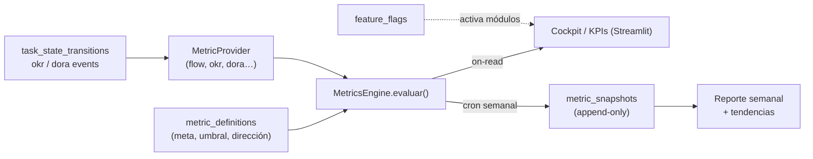

## a) Arquitectura de software unificada — Metrics Engine y módulos por feature flag

La tentación de construir doce metodologías es construir doce veces la misma máquina: cada una calcula números a partir de tareas, los compara contra una meta, les pone un semáforo y los grafica. Analytics, KPIs, DORA, SPACE y los Key Results cuantitativos de OKR son, en el fondo, **la misma operación con distinto catálogo**. El Metrics Engine existe para escribir esa operación una sola vez.

### Principio: una métrica es un dato, no un módulo

Hoy el repo ya tiene la semilla correcta: `domain/services.py::FlowService` y `AnalyticsService` calculan métricas como funciones puras sobre listas de dicts, sin tocar la base de datos. El error a evitar es que mañana `DoraService`, `SpaceService` y `KpiService` sean cada uno una clase nueva con su tabla, su endpoint y su vista. En vez de eso: **una métrica se registra como una definición de datos**, y el motor sabe calcularla, versionarla y evaluarla contra un umbral.

### Modelo de datos del motor

```sql
-- Catálogo: qué métricas existen y cómo se evalúan (extiende, no duplica, lo de sección 13)
CREATE TABLE metric_definitions (
    id            SERIAL PRIMARY KEY,
    clave         VARCHAR(60) UNIQUE NOT NULL,      -- 'lead_time_p85', 'deployment_frequency', 'kr_progress'
    nombre        VARCHAR(120) NOT NULL,
    fuente        VARCHAR(40) NOT NULL,             -- 'flow' | 'dora' | 'okr' | 'manual'
    entidad       VARCHAR(50),                      -- scope opcional (Xertify / Xertiflow / equipo)
    direccion     VARCHAR(10) NOT NULL CHECK (direccion IN ('up','down','band')),
    meta          NUMERIC(12,2),
    umbral_alerta NUMERIC(12,2),
    banda_min     NUMERIC(12,2),
    banda_max     NUMERIC(12,2),
    owner         VARCHAR(80),                      -- username, consistente con tasks.responsable
    activa        BOOLEAN NOT NULL DEFAULT TRUE
);

-- Serie temporal inmutable: el valor de una métrica en un periodo (nunca se sobrescribe)
CREATE TABLE metric_snapshots (
    id             SERIAL PRIMARY KEY,
    metric_id      INTEGER NOT NULL REFERENCES metric_definitions(id) ON DELETE CASCADE,
    periodo_inicio DATE NOT NULL,
    periodo_fin    DATE NOT NULL,
    valor          NUMERIC(12,2) NOT NULL,
    estado         VARCHAR(10) NOT NULL CHECK (estado IN ('verde','ambar','rojo','sin_datos')),
    calculado_en   TIMESTAMPTZ NOT NULL DEFAULT now(),
    UNIQUE (metric_id, periodo_inicio, periodo_fin)
);

-- Activación de módulos por cliente/entidad sin desplegar código
CREATE TABLE feature_flags (
    clave     VARCHAR(60) PRIMARY KEY,              -- 'module.dora', 'module.okr', 'module.lean'
    entidad   VARCHAR(50),                          -- NULL = global
    activa    BOOLEAN NOT NULL DEFAULT FALSE
);
```

La decisión clave: `metric_snapshots` es **append-only**. El semáforo de hoy no debe reescribir el de la semana pasada — la ventaja competitiva de Cenit es la memoria histórica, y una métrica que se sobrescribe pierde la tendencia, que es justo lo que un líder necesita ver.

### Interfaz del dominio (Python puro, testeable sin DB)

```python
from typing import Protocol
from datetime import date

class MetricProvider(Protocol):
    """Cada capacidad (flow, dora, okr) implementa esto y se registra como plugin."""
    clave: str
    def calcular(self, entidad: str, periodo_inicio: date, periodo_fin: date,
                 datos: dict) -> float: ...

class MetricsEngine:
    def __init__(self) -> None:
        self._providers: dict[str, MetricProvider] = {}

    def registrar(self, provider: MetricProvider) -> None:
        self._providers[provider.clave] = provider

    def evaluar(self, definicion: dict, valor: float) -> str:
        """Aplica dirección (up/down/band) + meta/umbral → 'verde'|'ambar'|'rojo'."""
        ...

    def snapshot(self, definicion: dict, entidad: str,
                 periodo_inicio: date, periodo_fin: date, datos: dict) -> dict:
        prov = self._providers[definicion["fuente"]]
        valor = prov.calcular(entidad, periodo_inicio, periodo_fin, datos)
        return {"valor": valor, "estado": self.evaluar(definicion, valor)}
```

`FlowService` (ya existente) se adapta a `MetricProvider` casi sin cambios: sus métodos ya reciben datos y devuelven números. `OkrService.progreso_kr` es otro provider. DORA, SPACE y KPIs futuros son **providers nuevos, no módulos nuevos** — comparten evaluación de semáforo, snapshots, alertas y UI.

### Mapeo a las capas reales del repo

| Capa | Qué vive aquí |
|---|---|
| `domain/metrics.py` | `MetricsEngine`, `MetricProvider`, evaluación de semáforo — puro, testeable |
| `domain/services.py`, `domain/okrs.py` | Providers concretos (`FlowService`, `OkrService`) que implementan el protocolo |
| `api/crud.py` | Persistencia de `metric_definitions` / `metric_snapshots`, lectura de `feature_flags` |
| `api/main.py` | `GET /api/metrics/{clave}`, `GET /api/metrics/overview`, `POST /api/metrics/snapshot` |
| `ui/views/` | Un único componente de "tarjeta de métrica con semáforo + tendencia" reutilizado por cockpit, KPIs, DORA… |

### Estrategia de cálculo: on-read vs snapshot programado

- **On-read** (lo que hoy hace `/api/analytics/flow`): se calcula al pedirlo. Correcto para métricas baratas y en vivo (aging, WIP actual).
- **Snapshot programado** (cron): se congela el valor de fin de periodo en `metric_snapshots`. Obligatorio para la serie temporal y para métricas caras (throughput mensual, DORA). Vercel Cron Jobs puede disparar `POST /api/metrics/snapshot` semanalmente.
- **Regla:** lo que el cockpit muestra "ahora" es on-read; lo que alimenta tendencias y el reporte semanal es snapshot.

### Flujo



### Por qué esto evita la trampa de las 12 metodologías

Sin el motor, agregar DORA = tabla + servicio + endpoints + vista + tests (un sprint). Con el motor, agregar DORA = **un provider + filas en `metric_definitions`** (días). Y ninguna metodología duplica la lógica de semáforo, snapshot, alerta ni el componente de UI. El `feature_flag` permite venderle a un cliente solo "Kanban + KPIs" y a otro "Kanban + OKR + DORA" **sin ramas de código distintas** — el mismo binario, distinto catálogo activo. Es la diferencia entre un producto que escala a nuevas métricas en días y uno que colapsa bajo su propio menú de navegación.
