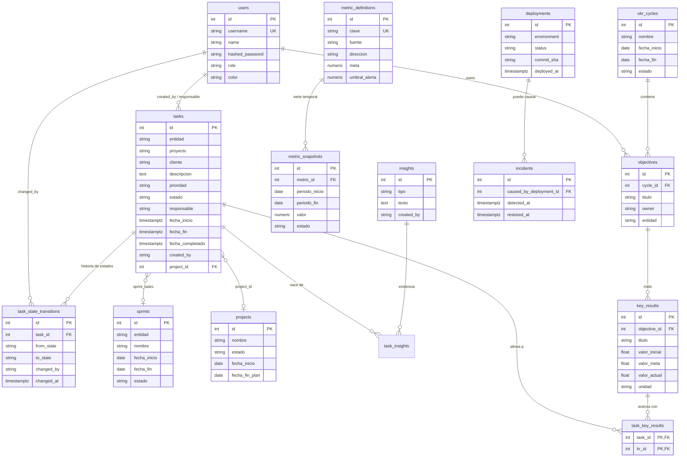

## b) Diagrama ER completo

El diagrama combina lo que **ya existe en el repo** (`users`, `tasks`, `task_state_transitions`, `okr_cycles`, `objectives`, `key_results`, `task_key_results`) con las entidades **propuestas y deduplicadas** de las 12 metodologías. La regla de consolidación aplicada: una entidad base, múltiples lentes — nunca dos tablas para el mismo concepto.

### Decisiones de consolidación

| Riesgo de duplicación | Metodologías implicadas | Resolución |
|---|---|---|
| "Una tabla de métricas por metodología" | KPIs, DORA, SPACE, Analytics, OKR (KRs cuantitativos) | Una sola pareja `metric_definitions` + `metric_snapshots`; cada metodología es un valor de `fuente`, no una tabla |
| "Una tabla de historia por vista" | Kanban (aging), Lean (flow efficiency), SPACE, Riesgos | Todas leen de `task_state_transitions` (ya existe) — es la fuente única de tiempo por estado |
| "Item de trabajo por marco" (story, card, work item, PBI) | Scrum, Kanban, XP, Waterfall, PMBOK | Una sola tabla `tasks`; sprint/proyecto se modelan como relaciones (`sprint_tasks`, `project_id`), no como tipos distintos de tarea |
| "Ciclo temporal por marco" (sprint, iteración, cadencia, ciclo OKR) | Scrum, XP, OKRs | `sprints` para iteraciones de ejecución; `okr_cycles` para dirección trimestral — conceptos distintos, no se fusionan |
| "Objetivo/meta por marco" (KR, KPI target, PI objective) | OKRs, KPIs, SAFe | `key_results` para dirección con KRs; metas operativas viven como `meta` en `metric_definitions`. No hay tabla de "goals" genérica que confunda ambos |
| Alineación tarea→resultado | OKRs, KPIs | `task_key_results` (ya existe) es el único puente; alimenta el *alignment ratio* del cockpit |

### Lo que está vivo hoy vs. propuesto

- **Vivo en el repo** (verificable): `users`, `tasks`, `task_state_transitions`, `okr_cycles`, `objectives`, `key_results`, `task_key_results`.
- **Propuesto tras señal de piloto**: `metric_definitions`/`metric_snapshots` (motor de KPIs, RICE #2), `sprints`/`sprint_tasks` (Scrum, #3), `projects` (Waterfall/PMBOK, #7), `insights`/`task_insights` (Design Thinking, #11), `deployments`/`incidents` (DORA, #6).

Ninguna entidad propuesta rompe el esquema actual: todas cuelgan de `tasks`/`users` vía FK. Esto confirma la tesis de sección 13: **un solo sistema de trabajo, múltiples lentes metodológicos** montados encima sin reescribir el núcleo.
