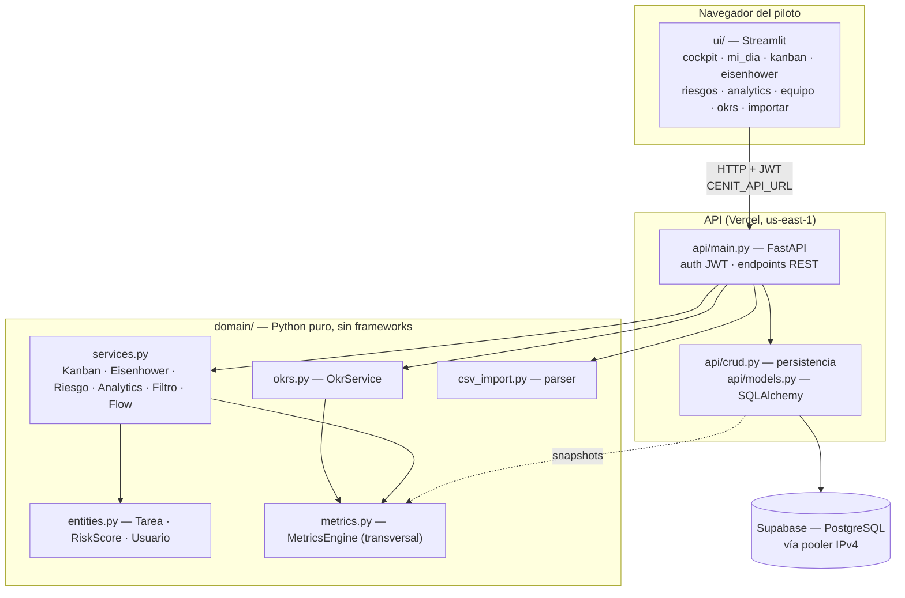

## c) Diagrama de arquitectura de capas

Cenit sigue una arquitectura por capas con una regla de dependencia inviolable: **el dominio no importa frameworks**. `domain/` es Python puro (se testea sin levantar API ni base de datos — los 59 tests lo prueban); `api/` es el adaptador de entrada HTTP; `ui/` es un cliente más que consume la API por HTTP, igual que lo haría un futuro frontend Next.js.

### Responsabilidades y reglas por capa

| Capa | Responsabilidad | Puede importar | NUNCA importa |
|---|---|---|---|
| `ui/` (Streamlit) | Render, interacción, sesión; consume la API por HTTP vía `ui/api_client.py` | `requests`, `streamlit`, `domain` (para tipos/constantes) | `api/`, SQLAlchemy, la DB directamente |
| `api/` (FastAPI) | Rutas, auth JWT, validación Pydantic, orquestación | `domain`, `sqlalchemy`, `fastapi` | `streamlit` |
| `api/crud.py` + `models.py` | Traducir entre HTTP/ORM y dicts del dominio; persistencia | `sqlalchemy`, `domain` | `fastapi` (idealmente), `streamlit` |
| `domain/` | Reglas de negocio puras: flujo, riesgo, Eisenhower, OKR, métricas | stdlib de Python | `fastapi`, `sqlalchemy`, `streamlit`, `requests` |

### Cómo se conecta cada metodología a las capas

El patrón es idéntico para las doce, y es lo que hace que agregar una sea barato:

1. **Dominio**: un servicio/provider puro en `domain/` que recibe `list[dict]` y devuelve números o dataclasses (como ya lo hacen `FlowService` y `OkrService`).
2. **Persistencia**: filas en tablas que cuelgan de `tasks`/`users` (ver diagrama ER) manejadas por `crud.py`.
3. **API**: endpoints en `main.py` que llaman al servicio y devuelven JSON.
4. **UI**: una vista en `ui/views/` que consume esos endpoints y reusa el componente de tarjeta-métrica-con-semáforo.
5. **Activación**: un `feature_flag` decide si la vista aparece en el menú.

Ejemplo vivo: Kanban usa `KanbanService` (dominio) → `/api/tasks` + `/api/analytics/flow` (API) → `ui/views/kanban.py` + `cockpit.py` (UI). DORA seguiría exactamente el mismo camino: `DoraProvider` (dominio) → `/api/metrics/*` (API) → vista reusando el mismo componente.

### Por qué esta separación es la decisión de arquitectura más valiosa

La UI de Streamlit es explícitamente **desechable** — es el punto del roadmap "Next.js solo si la señal lo exige". Como `ui/` solo habla HTTP con la API (nunca toca la DB ni el dominio directamente), migrar a Next.js el día que un piloto lo justifique **no toca `api/` ni `domain/`**: se reemplaza el cliente, no el cerebro. La misma propiedad permite que un dev del piloto integre Cenit vía `/docs` sin pasar por la UI. El backend y el dominio son el activo que se protege; todo lo demás es intercambiable.
